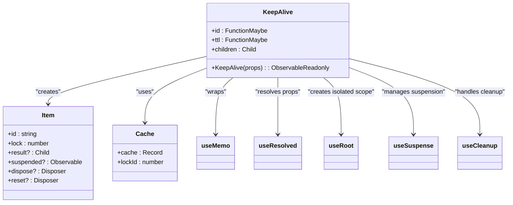
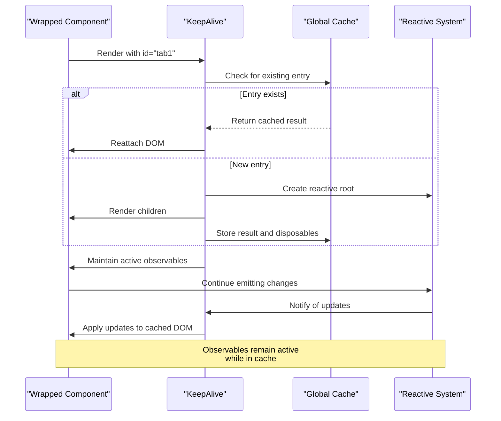
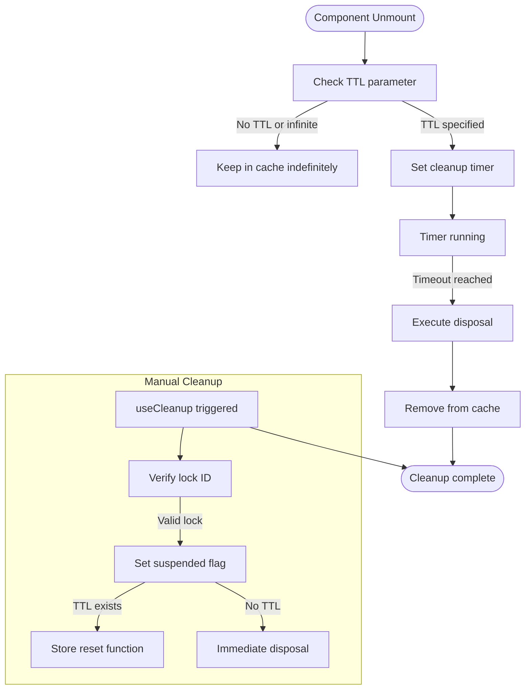
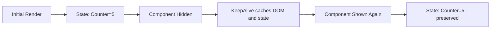
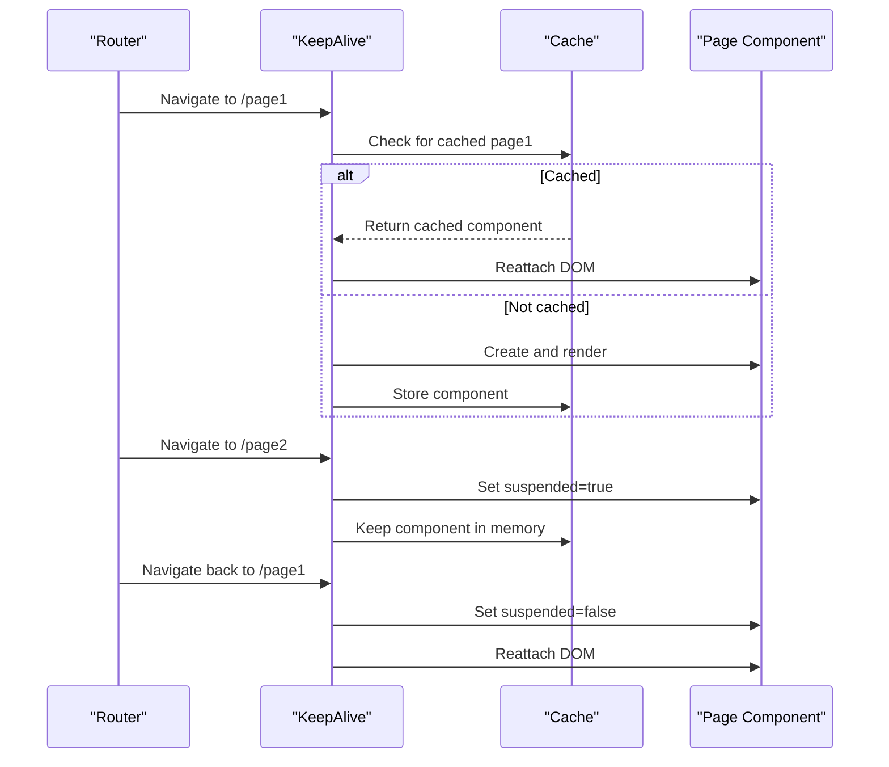

# Keep Alive

<cite>
**Referenced Files in This Document**  
- [keep_alive.ts](file://src/components/keep_alive.ts)
- [soby.ts](file://src/hooks/soby.ts)
- [use_resolved.ts](file://src/hooks/use_resolved.ts)
- [soby.ts](file://src/methods/soby.ts)
</cite>

## Table of Contents
1. [Introduction](#introduction)
2. [Core Functionality](#core-functionality)
3. [Internal Architecture](#internal-architecture)
4. [State Preservation Mechanism](#state-preservation-mechanism)
5. [Reactivity Implications](#reactivity-implications)
6. [Memory Management and TTL](#memory-management-and-ttl)
7. [Usage Examples](#usage-examples)
8. [Integration with Routing](#integration-with-routing)
9. [Server-Side Rendering Limitations](#server-side-rendering-limitations)
10. [Best Practices and Trade-offs](#best-practices-and-trade-offs)

## Introduction

The KeepAlive component in Woby provides a mechanism for preserving component state and DOM structure when components are temporarily unmounted and later remounted. This functionality is particularly valuable in user interface patterns such as tab interfaces, navigation caches, and multi-step wizards where maintaining component state across visibility changes enhances user experience by avoiding unnecessary reinitialization and data reloading.

Unlike standard component unmounting which destroys both the DOM structure and component state, KeepAlive detaches the component's DOM subtree from the document while keeping it alive in memory, along with all associated reactive state and effects. This allows for instant restoration when the component becomes visible again, providing seamless transitions between UI states.

**Section sources**
- [keep_alive.ts](file://src/components/keep_alive.ts#L33-L97)

## Core Functionality

The KeepAlive component serves as a state preservation wrapper that prevents the destruction of components when they are conditionally rendered or navigated away from. When a component wrapped in KeepAlive is no longer rendered in its parent, instead of being unmounted and losing all state, it is cached in memory with its DOM structure intact and its reactive subscriptions still active.

This functionality enables use cases such as:
- Tab interfaces where switching between tabs preserves each tab's scroll position, form state, and loaded data
- Navigation caches that maintain page state when users navigate back and forth
- Multi-step forms where returning to previous steps retains all entered data
- Dashboard layouts with multiple panels that maintain their individual states

The component accepts two primary props: an `id` for cache identification and an optional `ttl` (time-to-live) parameter that determines how long the component remains in cache before being automatically cleaned up.

**Section sources**
- [keep_alive.ts](file://src/components/keep_alive.ts#L33-L97)

## Internal Architecture



**Diagram sources**
- [keep_alive.ts](file://src/components/keep_alive.ts#L15-L31)

**Section sources**
- [keep_alive.ts](file://src/components/keep_alive.ts#L15-L31)

## State Preservation Mechanism

The KeepAlive component implements state preservation through a combination of reactive programming patterns and component lifecycle management. When a component is wrapped with KeepAlive, it creates an entry in a global cache object using the provided `id` as the key. Each cache entry contains the component's rendered result, suspension state, and disposal functions.

The core mechanism works as follows:
1. When first rendered, KeepAlive creates a new cache entry or reuses an existing one
2. It establishes a reactive root using `useRoot` to isolate the component's reactive scope
3. The component's children are resolved and stored in the cache
4. When the component would normally unmount, instead of destroying the DOM and state, it sets a suspension flag to true
5. The DOM subtree is detached from the document but remains in memory
6. When remounted, the cached DOM is reattached and the suspension flag is set to false

This approach leverages Woby's reactive system to maintain all observables, effects, and subscriptions in an active state even when the component is not visible in the DOM.

**Section sources**
- [keep_alive.ts](file://src/components/keep_alive.ts#L33-L97)

## Reactivity Implications



**Diagram sources**
- [keep_alive.ts](file://src/components/keep_alive.ts#L33-L97)
- [soby.ts](file://src/hooks/soby.ts#L1-L11)

**Section sources**
- [keep_alive.ts](file://src/components/keep_alive.ts#L33-L97)
- [soby.ts](file://src/hooks/soby.ts#L1-L11)

A key aspect of KeepAlive's design is that it preserves reactivity while components are in the cache. Unlike traditional component unmounting which disposes of all reactive subscriptions, KeepAlive maintains active observables and continues running effects. This means that:

- Observables within the cached component continue to emit values
- Effects and computations remain active and respond to changes
- Subscriptions to external data sources (APIs, stores, etc.) continue functioning
- Time-based effects (intervals, timeouts) continue executing

This behavior ensures that when a component is restored from cache, it reflects the current state of all reactive dependencies rather than requiring reinitialization. However, this also means developers must be mindful of resource usage, as cached components continue consuming memory and potentially making network requests.

## Memory Management and TTL



**Diagram sources**
- [keep_alive.ts](file://src/components/keep_alive.ts#L33-L97)

**Section sources**
- [keep_alive.ts](file://src/components/keep_alive.ts#L33-L97)

The KeepAlive component includes built-in memory management through the optional `ttl` (time-to-live) parameter. This feature addresses the potential memory leak concerns that arise from indefinitely caching components. When a TTL is specified, KeepAlive automatically removes the component from cache after the specified duration when it's no longer rendered.

The memory management system works as follows:
- Components without a TTL or with infinite TTL remain in cache indefinitely
- Components with a finite TTL have a cleanup timer set when they are unmounted
- The timer can be reset if the component is remounted before expiration
- When the TTL expires, the component is fully disposed, freeing memory
- A manual ejection mechanism allows for programmatic cache invalidation

This approach provides a balance between state preservation and resource management, allowing developers to control how long components remain in memory based on their specific use case requirements.

## Usage Examples

### Basic State Retention



**Diagram sources**
- [keep_alive.ts](file://src/components/keep_alive.ts#L33-L97)

The most common use case for KeepAlive is preserving component state across visibility toggles. For example, in a tab interface:

```jsx
// Tab content maintains its state when switching tabs
<KeepAlive id="settings-tab">
  <SettingsForm />
</KeepAlive>
```

When switching away from the settings tab and back, the form retains all entered data, scroll position, and any local state without requiring reinitialization.

### Integration with Routing



**Diagram sources**
- [keep_alive.ts](file://src/components/keep_alive.ts#L33-L97)

KeepAlive can be integrated with routing systems to create a navigation cache. By wrapping route components with KeepAlive using route paths as IDs:

```jsx
<Route path="/dashboard">
  <KeepAlive id="/dashboard">
    <Dashboard />
  </KeepAlive>
</Route>
```

This pattern preserves the state of pages when navigating away and back, creating a more responsive user experience similar to browser history but with full state preservation.

**Section sources**
- [keep_alive.ts](file://src/components/keep_alive.ts#L33-L97)

## Server-Side Rendering Limitations

KeepAlive has inherent limitations in server-side rendering (SSR) contexts where state cannot be preserved across requests. During SSR:

- The component is rendered to static HTML
- No reactive state exists on the server
- The cache is empty for each request
- Client-side hydration creates a fresh instance

This means that while KeepAlive works seamlessly in client-side applications, its state preservation benefits are only available after the initial page load. Subsequent navigations within a client-side rendered application can leverage the caching mechanism, but the initial server-rendered page will always represent a fresh state.

Developers should design their applications with this limitation in mind, ensuring that critical state is either:
- Stored in persistent storage (localStorage, cookies)
- Retrieved from server APIs on initial load
- Designed to be reconstructable from URL parameters

**Section sources**
- [keep_alive.ts](file://src/components/keep_alive.ts#L33-L97)

## Best Practices and Trade-offs

### When to Use KeepAlive

**Recommended for:**
- Tab interfaces with complex forms or data entry
- Multi-step wizards or onboarding flows
- Dashboard layouts with multiple independent panels
- Applications with frequent navigation between similar contexts
- Components with expensive initialization (data loading, computations)

### When to Avoid KeepAlive

**Avoid for:**
- Components with large memory footprints (memory-intensive visualizations)
- Components making frequent network requests (API polling)
- Security-sensitive interfaces (cached authentication states)
- Components that must always reflect current data (real-time dashboards)
- Applications with strict memory constraints

### Cleanup Strategies

The KeepAlive component provides several mechanisms for managing cached components:

1. **Automatic cleanup**: Using the `ttl` parameter to automatically expire cached components
2. **Manual ejection**: Programmatically removing components from cache by manipulating the global cache object
3. **Context-based invalidation**: Clearing cache when specific application events occur (user logout, data refresh)
4. **Size limiting**: Implementing a LRU (Least Recently Used) strategy for cache entries

Developers should carefully consider the memory implications of using KeepAlive and implement appropriate cleanup strategies based on their application's requirements and user patterns.

**Section sources**
- [keep_alive.ts](file://src/components/keep_alive.ts#L33-L97)
- [soby.ts](file://src/methods/soby.ts#L1-L12)
- [use_resolved.ts](file://src/hooks/use_resolved.ts#L62-L99)