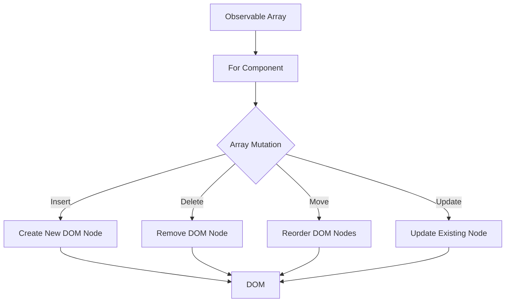
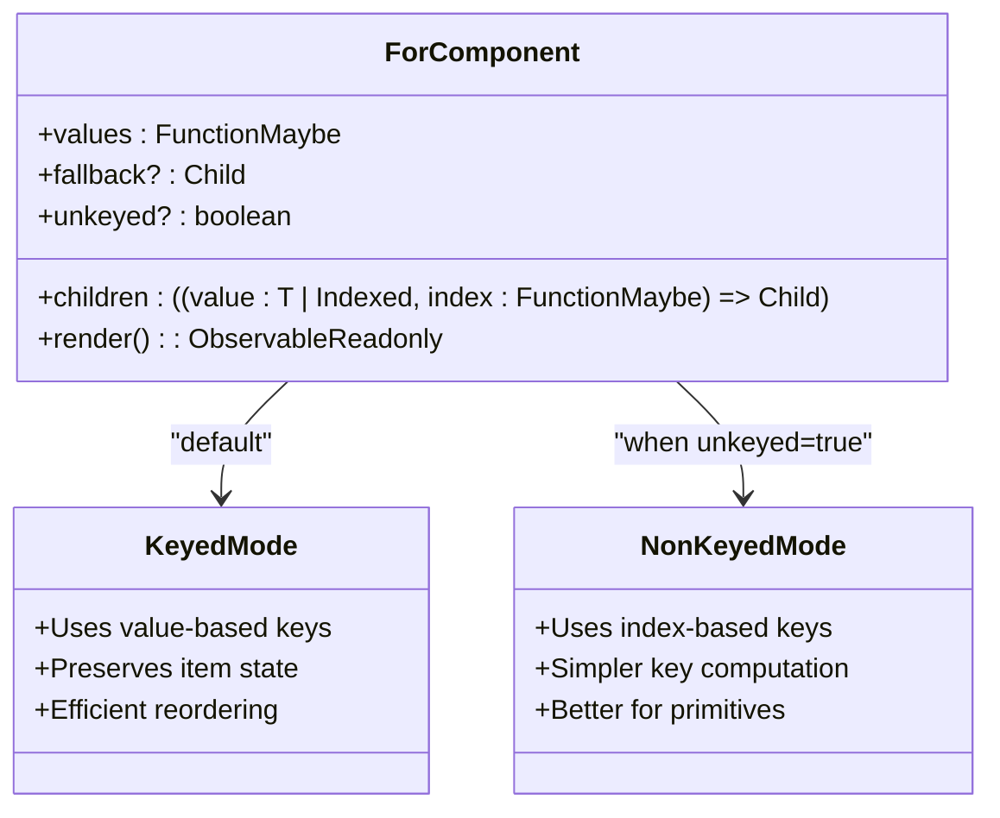
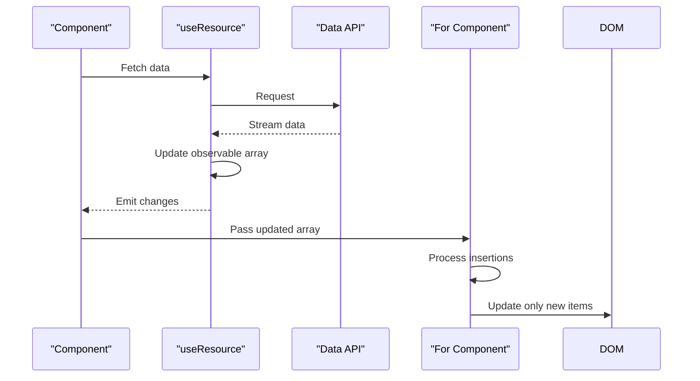

# List Rendering

<cite>
**Referenced Files in This Document**   
- [for.ts](file://src/components/for.ts)
- [types.ts](file://src/types.ts)
- [soby.ts](file://src/soby.ts)
- [resolvers.ts](file://src/utils/resolvers.ts)
- [use_resource.ts](file://src/hooks/use_resource.ts)
</cite>

## Table of Contents
1. [Introduction](#introduction)
2. [Core Functionality](#core-functionality)
3. [Props and Configuration](#props-and-configuration)
4. [Keyed vs Non-Keyed Rendering](#keyed-vs-non-keyed-rendering)
5. [Reactivity and Signals](#reactivity-and-signals)
6. [Performance Optimizations](#performance-optimizations)
7. [Common Issues and Solutions](#common-issues-and-solutions)
8. [Integration with Async Data](#integration-with-async-data)
9. [Best Practices](#best-practices)

## Introduction

The `For` component in Woby provides an efficient mechanism for rendering arrays with automatic tracking of insertions, deletions, and moves. Unlike traditional diffing approaches, Woby's `For` component leverages observable-based reactivity to directly bind to array mutations, eliminating the need for expensive reconciliation processes. This documentation details the component's architecture, usage patterns, and optimization strategies.

## Core Functionality

The `For` component serves as Woby's reactive alternative to native array mapping operations. It efficiently renders arrays by directly binding to observable mutations rather than performing traditional diffing operations. The component automatically tracks array changes including insertions, deletions, and reordering, ensuring optimal DOM updates.

The implementation delegates to the underlying `soby` library's `for` function, which handles the reactive rendering logic. When the source array changes, the component intelligently updates only the affected DOM nodes rather than re-rendering the entire list. This approach significantly improves performance, especially for large datasets or frequently updated arrays.

**Diagram sources**
- [for.ts](file://src/components/for.ts#L8-L12)
- [soby.ts](file://src/soby.ts#L0)

**Section sources**
- [for.ts](file://src/components/for.ts#L8-L12)

## Props and Configuration

The `For` component accepts several props that control its rendering behavior:

- **values**: The primary prop that accepts an observable array or a function returning an array. This is the data source for rendering.
- **children**: A render function that receives each array item and its index, returning the JSX to render for that item.
- **fallback**: An optional fallback element to display when the array is empty or null.
- **unkeyed**: A boolean flag that determines whether to use keyed or non-keyed rendering mode.

The component supports both generic and indexed rendering modes through TypeScript generics, allowing type-safe iteration over arrays of any type. The render function receives both the current value and an observable index, enabling reactive updates when the array structure changes.

**Section sources**
- [for.ts](file://src/components/for.ts#L8-L12)
- [types.ts](file://src/types.ts#L583)

## Keyed vs Non-Keyed Rendering

Woby's `For` component supports both keyed and non-keyed rendering modes, each with specific use cases and performance characteristics.

### Keyed Rendering

In keyed mode (default), each rendered item is associated with a unique key derived from its value. This approach is optimal when:
- Array items have unique, stable identities
- Items are frequently reordered
- Individual items maintain state across renders

Keyed rendering ensures that when items are moved within the array, their corresponding DOM nodes are efficiently reordered rather than recreated, preserving component state and improving performance.

### Non-Keyed Rendering

Non-keyed rendering uses array indices as keys and is activated by setting the `unkeyed` prop to `true`. This mode is suitable when:
- Array items are primitive values that may have duplicates
- The array length remains relatively stable
- Items don't maintain individual state

Non-keyed rendering can be more efficient for simple lists where item identity is less important than position, as it avoids the overhead of key computation and comparison.

**Diagram sources**
- [for.ts](file://src/components/for.ts#L8-L12)
- [types.ts](file://src/types.ts#L583)

**Section sources**
- [for.ts](file://src/components/for.ts#L8-L12)

## Reactivity and Signals

The `For` component leverages Woby's observable-based reactivity system to avoid traditional diffing. Instead of comparing virtual DOM trees, it directly responds to array mutations through signals.

When an observable array changes, the `For` component receives notifications through the underlying `soby` library's reactivity system. This allows it to:
- Detect insertions and create only the necessary DOM nodes
- Identify deletions and remove only the affected nodes
- Track moves and efficiently reorder existing nodes
- Update only changed items without affecting others

This signal-based approach eliminates the need for expensive diffing algorithms, resulting in faster updates and reduced computational overhead. The component maintains a mapping between array items and their corresponding DOM nodes, enabling precise updates when the source data changes.

The reactivity system also handles nested observables within array items, ensuring that changes to individual item properties trigger only the necessary updates to their corresponding DOM representations.

**Section sources**
- [for.ts](file://src/components/for.ts#L8-L12)
- [soby.ts](file://src/soby.ts#L0)
- [resolvers.ts](file://src/utils/resolvers.ts#L0-L200)

## Performance Optimizations

Woby's `For` component implements several performance optimizations to handle large lists efficiently:

### Template Memoization

The component memoizes item templates to avoid recreating identical DOM structures. When an item is removed and later re-added, the component can reuse the previously created DOM nodes rather than creating new ones. This optimization is particularly effective for virtualized lists or frequently changing datasets.

### Batched Updates

Array mutations are batched when possible to minimize DOM operations. Multiple consecutive changes to the source array are processed together, reducing the number of re-renders and layout recalculations.

### Efficient Node Reordering

Instead of removing and recreating nodes when items are reordered, the component uses efficient DOM reordering techniques. This preserves component state and event listeners while maintaining the correct visual order.

### Lazy Evaluation

The component employs lazy evaluation for expensive computations within item render functions. Computations are only performed when necessary, and results are cached for subsequent renders.

For extremely large lists, consider combining the `For` component with windowing or virtualization techniques to render only visible items, further improving performance.

**Section sources**
- [for.ts](file://src/components/for.ts#L8-L12)
- [resolvers.ts](file://src/utils/resolvers.ts#L0-L200)

## Common Issues and Solutions

### Incorrect Key Usage

Using inappropriate keys can lead to performance issues and unexpected behavior. Avoid using array indices as keys when items can be reordered, as this can cause unnecessary re-renders. Instead, use stable, unique identifiers from your data.

### Memory Leaks with Closures

When using closures in render functions, ensure that references to external variables don't create memory leaks. Use Woby's cleanup mechanisms to properly dispose of subscriptions and event listeners when components are unmounted.

### SSR Streaming Considerations

During server-side rendering, ensure that observable arrays are properly serialized and that the initial state is consistent between server and client. Use Woby's SSR utilities to handle streaming scenarios where array data may arrive incrementally.

### Handling Dynamic Arrays

When working with arrays that frequently change size, consider using the `fallback` prop to provide a consistent user experience during loading states. Also, ensure that your observable arrays are properly disposed of to prevent memory leaks.

**Section sources**
- [for.ts](file://src/components/for.ts#L8-L12)
- [resolvers.ts](file://src/utils/resolvers.ts#L0-L200)

## Integration with Async Data

The `For` component integrates seamlessly with asynchronous data fetching through Woby's `useResource` hook. This combination enables efficient rendering of data that arrives asynchronously.

When integrating with `useResource`, the component can handle loading states, errors, and successful data retrieval gracefully. The `fallback` prop can display loading indicators while data is being fetched, and the component automatically updates when the async operation completes.

For streaming data sources, the observable array can be updated incrementally as new data arrives, with the `For` component efficiently rendering each addition without re-rendering the entire list.

**Diagram sources**
- [for.ts](file://src/components/for.ts#L8-L12)
- [use_resource.ts](file://src/hooks/use_resource.ts#L0-L105)

**Section sources**
- [use_resource.ts](file://src/hooks/use_resource.ts#L0-L105)

## Best Practices

1. **Choose the Right Keying Mode**: Use keyed rendering for objects with stable identities and non-keyed rendering for primitive arrays.
2. **Optimize Render Functions**: Keep item render functions simple and avoid expensive computations within them.
3. **Handle Loading States**: Use the `fallback` prop to provide feedback during data loading.
4. **Manage Memory**: Ensure proper cleanup of observables and event listeners to prevent memory leaks.
5. **Combine with Virtualization**: For very large lists, combine `For` with windowing techniques to render only visible items.
6. **Use with Immutable Patterns**: When possible, use immutable updates to observable arrays to ensure predictable reactivity.
7. **Test Performance**: Monitor performance with realistic data sizes and optimize as needed for your specific use case.