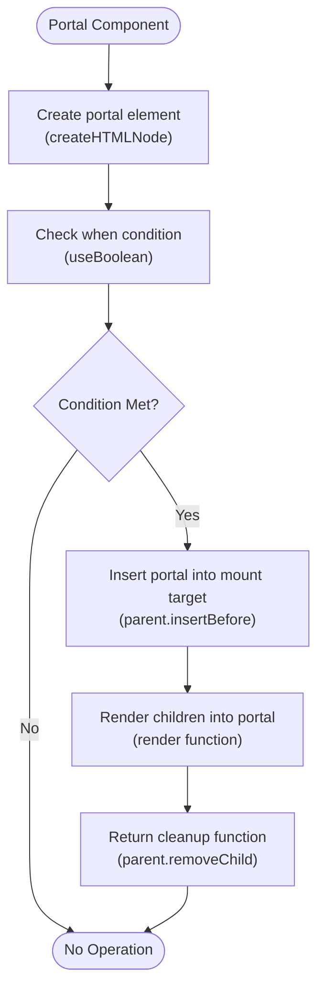
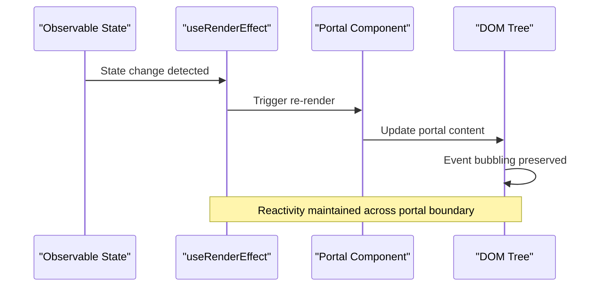
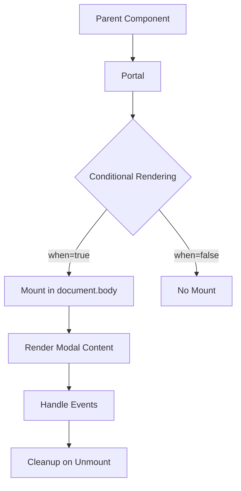
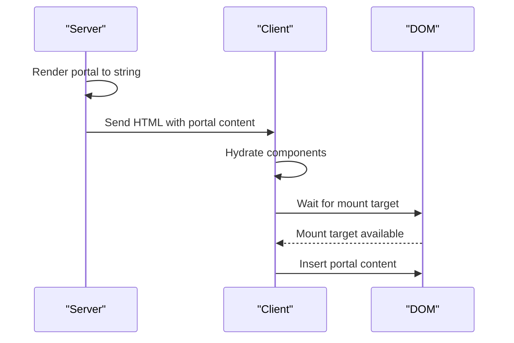
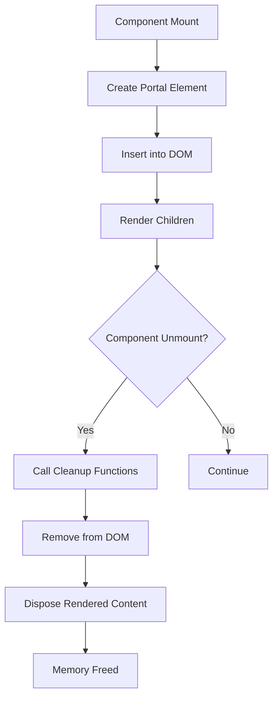

# Portals

<cite>
**Referenced Files in This Document**  
- [portal.ts](file://src/components/portal.ts)
- [portal.ssr.ts](file://src/components/portal.ssr.ts)
- [portal.via.ts](file://src/components/portal.via.ts)
- [use_render_effect.ts](file://src/hooks/use_render_effect.ts)
- [render.ts](file://src/methods/render.ts)
- [render.ssr.ts](file://src/methods/render.ssr.ts)
- [render.via.ts](file://src/methods/render.via.ts)
- [creators.ts](file://src/utils/creators.ts)
- [creators.ssr.ts](file://src/utils/creators.ssr.ts)
- [creators.via.ts](file://src/utils/creators.via.ts)
- [setters.ts](file://src/utils/setters.ts)
- [setters.ssr.ts](file://src/utils/setters.ssr.ts)
- [setters.via.ts](file://src/utils/setters.via.ts)
- [soby.ts](file://src/soby.ts)
- [hooks/soby.ts](file://src/hooks/soby.ts)
</cite>

## Table of Contents
1. [Introduction](#introduction)
2. [Core Implementation](#core-implementation)
3. [Environment-Specific Variants](#environment-specific-variants)
4. [Reactivity and Event Handling](#reactivity-and-event-handling)
5. [Usage Examples](#usage-examples)
6. [SSR and Hydration Challenges](#ssr-and-hydration-challenges)
7. [Cleanup and Memory Management](#cleanup-and-memory-management)
8. [Troubleshooting Common Issues](#troubleshooting-common-issues)
9. [Conclusion](#conclusion)

## Introduction

The Portal component in Woby enables rendering children into a DOM node that exists outside the parent component's hierarchy. This pattern is essential for implementing UI elements like modals, tooltips, and overlays that need to escape the normal document flow while maintaining reactivity and event bubbling. The implementation is designed to work consistently across different environments: client-side rendering, server-side rendering (SSR), and via.js contexts.

**Section sources**
- [portal.ts](file://src/components/portal.ts#L11-L49)
- [portal.ssr.ts](file://src/components/portal.ssr.ts#L9-L47)
- [portal.via.ts](file://src/components/portal.via.ts#L9-L47)

## Core Implementation

The Portal component follows a consistent pattern across environments, accepting props for conditional rendering (`when`), mount target (`mount`), wrapper element (`wrapper`), and children to render. The core implementation creates a portal element, attaches it to the specified mount point (defaulting to `document.body`), and renders children into it while maintaining reactivity through Woby's effect system.

The implementation uses `useRenderEffect` to manage the portal's lifecycle, ensuring the portal element is inserted into the DOM when the condition is met and properly cleaned up when unmounted. The `render` function handles the actual rendering of children into the portal element, with appropriate disposal logic to prevent memory leaks.



**Diagram sources**
- [portal.ts](file://src/components/portal.ts#L11-L49)
- [use_render_effect.ts](file://src/hooks/use_render_effect.ts#L16-L20)
- [render.ts](file://src/methods/render.ts#L8-L29)

**Section sources**
- [portal.ts](file://src/components/portal.ts#L11-L49)
- [use_render_effect.ts](file://src/hooks/use_render_effect.ts#L16-L20)
- [render.ts](file://src/methods/render.ts#L8-L29)

## Environment-Specific Variants

Woby provides specialized Portal implementations for different execution environments, ensuring consistent behavior while accounting for platform-specific constraints.

### Client-Side Implementation (portal.ts)
The client-side variant uses the standard DOM API to create and manipulate elements. It leverages `createHTMLNode` from `creators.ts` to create the portal element and relies on the browser's native `insertBefore` and `removeChild` methods for DOM manipulation.

### Server-Side Implementation (portal.ssr.ts)
The SSR variant uses environment-specific creators (`creators.ssr.ts`) and has a different `render` implementation that returns a string representation of the rendered content rather than manipulating the DOM. This allows portals to be properly serialized during server-side rendering.

### Via.js Implementation (portal.via.ts)
The via.js variant uses `creators.via.ts` and `render.via.ts` to interface with the via.js runtime, ensuring compatibility with this specialized execution environment.

```mermaid
classDiagram
class PortalClient {
+createHTMLNode()
+insertBefore()
+removeChild()
+render()
}
class PortalSSR {
+createHTMLNode()
+renderToString()
}
class PortalVia {
+createHTMLNode()
+renderVia()
}
PortalClient --> PortalSSR : "shares core logic"
PortalClient --> PortalVia : "shares core logic"
PortalSSR --> "creators.ssr.ts" : "uses"
PortalVia --> "creators.via.ts" : "uses"
PortalClient --> "creators.ts" : "uses"
```

**Diagram sources**
- [portal.ts](file://src/components/portal.ts#L11-L49)
- [portal.ssr.ts](file://src/components/portal.ssr.ts#L9-L47)
- [portal.via.ts](file://src/components/portal.via.ts#L9-L47)
- [creators.ts](file://src/utils/creators.ts#L1-L32)
- [creators.ssr.ts](file://src/utils/creators.ssr.ts)
- [creators.via.ts](file://src/utils/creators.via.ts)

**Section sources**
- [portal.ts](file://src/components/portal.ts#L11-L49)
- [portal.ssr.ts](file://src/components/portal.ssr.ts#L9-L47)
- [portal.via.ts](file://src/components/portal.via.ts#L9-L47)
- [creators.ts](file://src/utils/creators.ts#L1-L32)

## Reactivity and Event Handling

The Portal component maintains reactivity through Woby's effect system, specifically using `useRenderEffect` which wraps the core `useEffect` functionality. This ensures that the portal's content is updated in response to changes in the component's state or props.

Event bubbling across the portal boundary is preserved because the portal element becomes a normal part of the DOM tree once inserted. Events fired within the portal will bubble up through the DOM hierarchy as expected, passing through the portal's parent in the React tree and then continuing up the actual DOM tree.

The reactivity chain works as follows: changes in observable state trigger effects, which update the portal content through the `render` function, resulting in DOM updates that maintain the expected event propagation behavior.



**Diagram sources**
- [portal.ts](file://src/components/portal.ts#L11-L49)
- [use_render_effect.ts](file://src/hooks/use_render_effect.ts#L16-L20)
- [soby.ts](file://src/soby.ts)
- [hooks/soby.ts](file://src/hooks/soby.ts)

**Section sources**
- [portal.ts](file://src/components/portal.ts#L11-L49)
- [use_render_effect.ts](file://src/hooks/use_render_effect.ts#L16-L20)
- [soby.ts](file://src/soby.ts)

## Usage Examples

### Basic Modal Implementation
The most common use case for portals is implementing modal dialogs. By mounting the modal in `document.body`, it can escape the constraints of its parent container and be positioned absolutely on the page.

### Focus Management
Portals are often used in conjunction with focus management utilities to ensure accessibility. When a modal is opened, focus can be programmatically moved to the modal content and trapped within it until the modal is closed.

### Tooltip and Overlay Components
Tooltips and other overlay components benefit from portals by avoiding clipping issues caused by `overflow: hidden` containers and ensuring proper z-index stacking.



**Diagram sources**
- [portal.ts](file://src/components/portal.ts#L11-L49)

**Section sources**
- [portal.ts](file://src/components/portal.ts#L11-L49)

## SSR and Hydration Challenges

Server-side rendering presents unique challenges for portals, primarily around the existence of target containers during hydration. Since the server cannot guarantee that specific DOM nodes exist on the client, portal implementations must handle cases where mount targets are not immediately available.

The SSR variant addresses this by serializing the portal content as a string during server rendering, allowing it to be properly included in the initial HTML payload. During client-side hydration, the portal logic waits for the mount target to become available before inserting the content, preventing errors that would occur if attempting to manipulate non-existent DOM nodes.



**Diagram sources**
- [portal.ssr.ts](file://src/components/portal.ssr.ts#L9-L47)
- [render.ssr.ts](file://src/methods/render.ssr.ts#L7-L25)

**Section sources**
- [portal.ssr.ts](file://src/components/portal.ssr.ts#L9-L47)
- [render.ssr.ts](file://src/methods/render.ssr.ts#L7-L25)

## Cleanup and Memory Management

Proper cleanup is critical for portal components to prevent memory leaks and DOM pollution. The implementation uses Woby's effect cleanup mechanism to ensure that portal elements are removed from the DOM when the component is unmounted or the condition becomes false.

Each `useRenderEffect` call returns a cleanup function that removes the portal element from its parent node. This cleanup is automatically invoked by Woby's effect system when the component is disposed or when dependencies change, ensuring that resources are properly released.

The `render` function also returns a disposer function that cleans up any internal state and event listeners associated with the rendered content, providing a complete cleanup mechanism for the entire portal subtree.



**Diagram sources**
- [portal.ts](file://src/components/portal.ts#L11-L49)
- [render.ts](file://src/methods/render.ts#L8-L29)
- [setters.ts](file://src/utils/setters.ts#L386-L389)

**Section sources**
- [portal.ts](file://src/components/portal.ts#L11-L49)
- [render.ts](file://src/methods/render.ts#L8-L29)
- [setters.ts](file://src/utils/setters.ts#L386-L389)

## Troubleshooting Common Issues

### Style Isolation
Portals can break CSS encapsulation since the content is rendered outside the component hierarchy. This can be addressed by using CSS custom properties or by applying specific classes to the portal wrapper.

### Z-Index Conflicts
When multiple portals are used, z-index stacking can become problematic. Implementing a portal manager that coordinates z-index values can help resolve these conflicts.

### Event Propagation
While event bubbling is preserved, event capture phase behavior might differ from expectations. Developers should be aware that events fired within a portal follow the actual DOM hierarchy, not the React component hierarchy.

### Performance Considerations
Excessive use of portals can impact performance due to additional DOM manipulation. It's recommended to use portals judiciously and consider alternatives like CSS transforms for simple overlay effects.

**Section sources**
- [portal.ts](file://src/components/portal.ts#L11-L49)

## Conclusion

The Portal component in Woby provides a robust solution for rendering content outside the normal component hierarchy while maintaining reactivity and proper event handling. With environment-specific implementations for client, server, and via.js contexts, it ensures consistent behavior across different execution environments. The implementation leverages Woby's effect system for proper lifecycle management and cleanup, preventing memory leaks and DOM pollution. By understanding the core implementation, reactivity model, and common use cases, developers can effectively utilize portals for modals, tooltips, and other UI elements that require escaping the normal document flow.