# Suspense

<cite>
**Referenced Files in This Document**   
- [suspense.ts](file://src/components/suspense.ts)
- [suspense.context.ts](file://src/components/suspense.context.ts)
- [suspense.manager.ts](file://src/components/suspense.manager.ts)
- [suspense.collector.ts](file://src/components/suspense.collector.ts)
- [use_resource.ts](file://src/hooks/use_resource.ts)
- [lazy.ts](file://src/methods/lazy.ts)
- [types.ts](file://src/types.ts)
- [constants.ts](file://src/constants.ts)
- [use_resolved.ts](file://src/hooks/use_resolved.ts)
</cite>

## Table of Contents
1. [Introduction](#introduction)
2. [Core Architecture](#core-architecture)
3. [Suspense Component](#suspense-component)
4. [Suspense Context System](#suspense-context-system)
5. [Suspense Manager](#suspense-manager)
6. [Suspense Collector](#suspense-collector)
7. [Resource Management with useResource](#resource-management-with-useresource)
8. [Lazy Loading Integration](#lazy-loading-integration)
9. [Signal-Based Reactivity Integration](#signal-based-reactivity-integration)
10. [Server-Side Rendering Implications](#server-side-rendering-implications)
11. [Usage Patterns and Examples](#usage-patterns-and-examples)
12. [Performance Considerations](#performance-considerations)
13. [Debugging Techniques](#debugging-techniques)
14. [Common Issues and Solutions](#common-issues-and-solutions)

## Introduction

Woby's Suspense component provides a sophisticated mechanism for handling asynchronous operations in component trees. It enables seamless integration of data fetching, code splitting, and resource loading with declarative fallback UIs. The system leverages Woby's signal-based reactivity model to suspend component rendering when asynchronous dependencies are pending and resume when they're resolved. This documentation explores the internal architecture, usage patterns, and integration points of the Suspense system, providing comprehensive guidance for effective implementation.

## Core Architecture

The Suspense system in Woby is built on a coordinated set of components that work together to manage asynchronous operations across the component tree. At its core, the system uses context-based state management to track suspension states and coordinate between parent and child components. The architecture is designed to handle nested suspense boundaries, support server-side rendering, and integrate seamlessly with Woby's reactivity model.

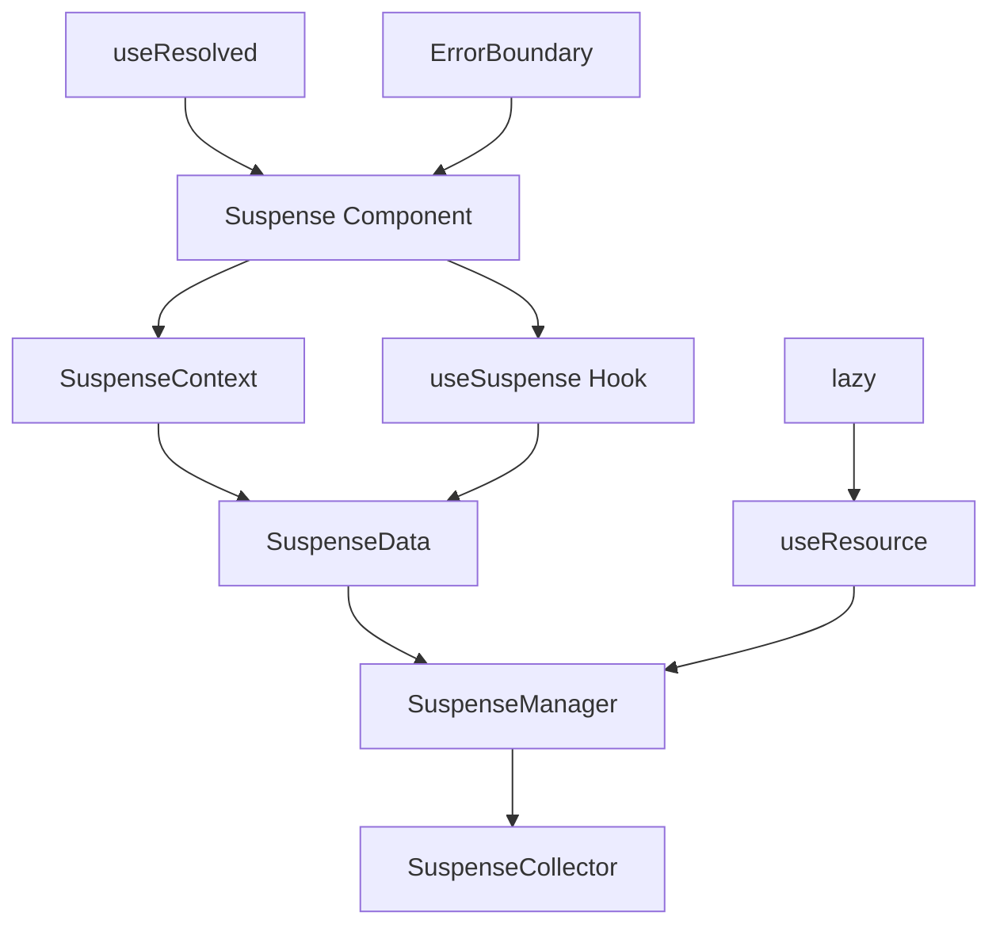

**Diagram sources**
- [suspense.ts](file://src/components/suspense.ts)
- [suspense.context.ts](file://src/components/suspense.context.ts)
- [suspense.manager.ts](file://src/components/suspense.manager.ts)
- [suspense.collector.ts](file://src/components/suspense.collector.ts)
- [use_resource.ts](file://src/hooks/use_resource.ts)
- [lazy.ts](file://src/methods/lazy.ts)

**Section sources**
- [suspense.ts](file://src/components/suspense.ts)
- [suspense.context.ts](file://src/components/suspense.context.ts)
- [suspense.manager.ts](file://src/components/suspense.manager.ts)

## Suspense Component

The Suspense component serves as the primary interface for defining suspense boundaries in the component tree. It accepts three key props: `when`, `fallback`, and `children`. The component uses the `SuspenseContext` to create and manage suspension state, determining whether to display the fallback UI or the children based on the current suspension condition.

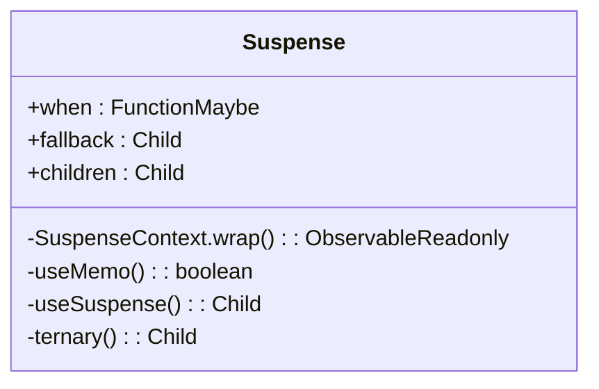

**Diagram sources**
- [suspense.ts](file://src/components/suspense.ts#L11-L25)

**Section sources**
- [suspense.ts](file://src/components/suspense.ts#L11-L25)

## Suspense Context System

The SuspenseContext provides the foundational mechanism for tracking suspension states across component boundaries. It creates and manages `SuspenseData` objects that contain reactive state for tracking active suspensions. The context system uses symbols (`SYMBOL_SUSPENSE` and `SYMBOL_SUSPENSE_COLLECTOR`) to maintain isolation between different suspense boundaries while allowing hierarchical coordination.

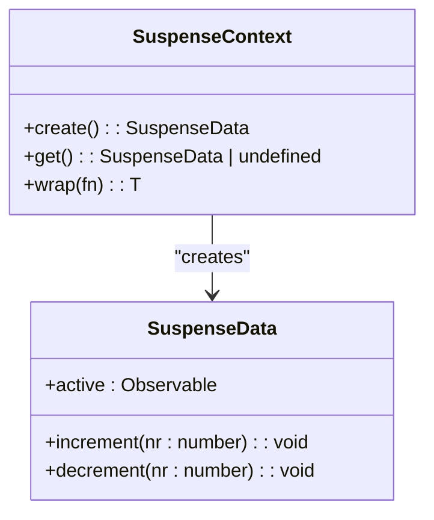

**Diagram sources**
- [suspense.context.ts](file://src/components/suspense.context.ts#L12-L54)
- [constants.ts](file://src/constants.ts#L8-L8)

**Section sources**
- [suspense.context.ts](file://src/components/suspense.context.ts#L12-L54)
- [constants.ts](file://src/constants.ts#L8-L10)

## Suspense Manager

The SuspenseManager class coordinates suspension states across multiple components and asynchronous operations. It maintains a map of active suspenses and provides methods to suspend and unsuspend components. The manager integrates with the SuspenseContext to increment and decrement suspension counters, ensuring proper tracking of pending operations.

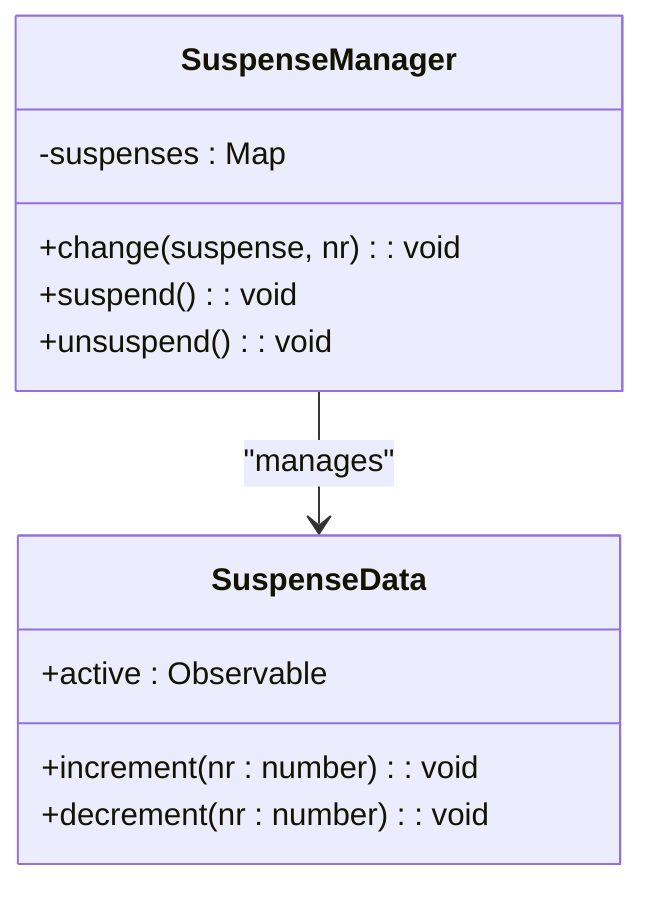

**Diagram sources**
- [suspense.manager.ts](file://src/components/suspense.manager.ts#L4-L67)
- [suspense.context.ts](file://src/components/suspense.context.ts#L12-L54)

**Section sources**
- [suspense.manager.ts](file://src/components/suspense.manager.ts#L4-L67)

## Suspense Collector

The SuspenseCollector tracks all suspense instances within a component subtree, enabling coordination of multiple suspense boundaries. It maintains a list of active suspenses and provides methods to register and unregister suspense instances. This collector pattern allows parent components to determine when all child suspenses have resolved, which is particularly important for server-side rendering and shell rendering scenarios.

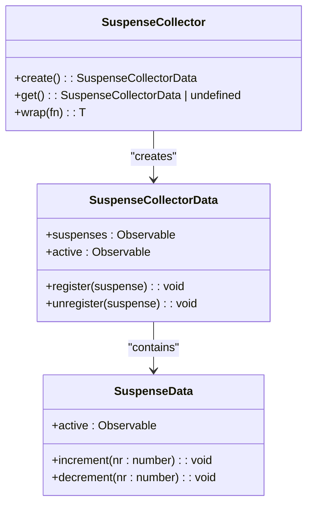

**Diagram sources**
- [suspense.collector.ts](file://src/components/suspense.collector.ts#L9-L42)
- [suspense.context.ts](file://src/components/suspense.context.ts#L12-L54)

**Section sources**
- [suspense.collector.ts](file://src/components/suspense.collector.ts#L9-L42)

## Resource Management with useResource

The useResource hook provides a declarative way to manage asynchronous data fetching within the Suspense system. It returns a resource object that tracks the pending, error, and resolved states of an asynchronous operation. When a promise is returned from the fetcher function, the hook automatically suspends the component and resumes when the promise resolves.

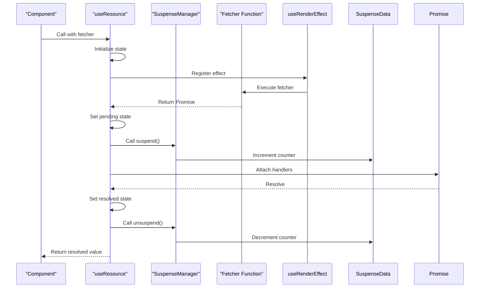

**Diagram sources**
- [use_resource.ts](file://src/hooks/use_resource.ts#L18-L104)
- [suspense.manager.ts](file://src/components/suspense.manager.ts#L4-L67)

**Section sources**
- [use_resource.ts](file://src/hooks/use_resource.ts#L18-L104)

## Lazy Loading Integration

The lazy function enables code splitting and dynamic import of components, integrating seamlessly with the Suspense system. It wraps a dynamic import function and returns a component that can be rendered like any other component. When the lazy component is rendered, it automatically suspends until the imported component is loaded.

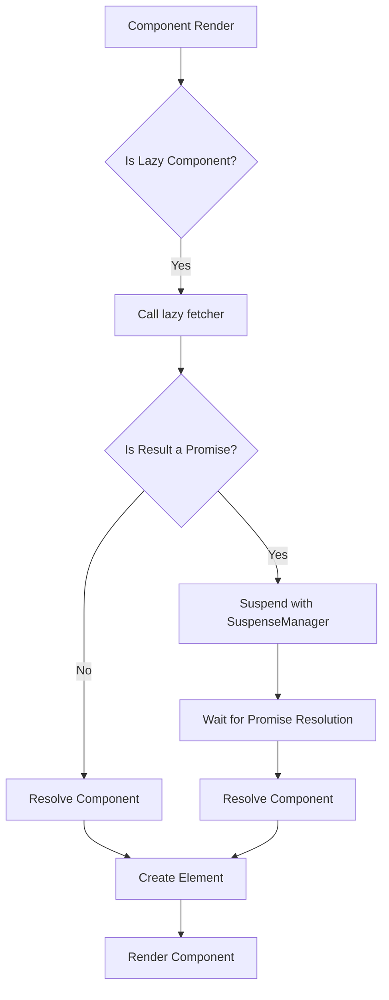

**Diagram sources**
- [lazy.ts](file://src/methods/lazy.ts#L11-L59)
- [use_resource.ts](file://src/hooks/use_resource.ts#L18-L104)
- [use_resolved.ts](file://src/hooks/use_resolved.ts#L64-L99)

**Section sources**
- [lazy.ts](file://src/methods/lazy.ts#L11-L59)

## Signal-Based Reactivity Integration

Woby's Suspense system integrates deeply with the signal-based reactivity model. When a component throws a promise, the system captures this as a suspension signal and coordinates with the SuspenseContext to display the appropriate fallback UI. The reactivity system ensures that components automatically re-render when promises resolve, creating a seamless user experience.

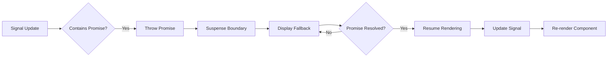

**Section sources**
- [suspense.ts](file://src/components/suspense.ts#L11-L25)
- [use_resource.ts](file://src/hooks/use_resource.ts#L18-L104)

## Server-Side Rendering Implications

The Suspense system supports server-side rendering through the SuspenseCollector and streaming capabilities. During SSR, the system can collect all pending suspenses and generate a shell of the application while streaming additional content as promises resolve. This enables fast initial page loads with progressive enhancement.

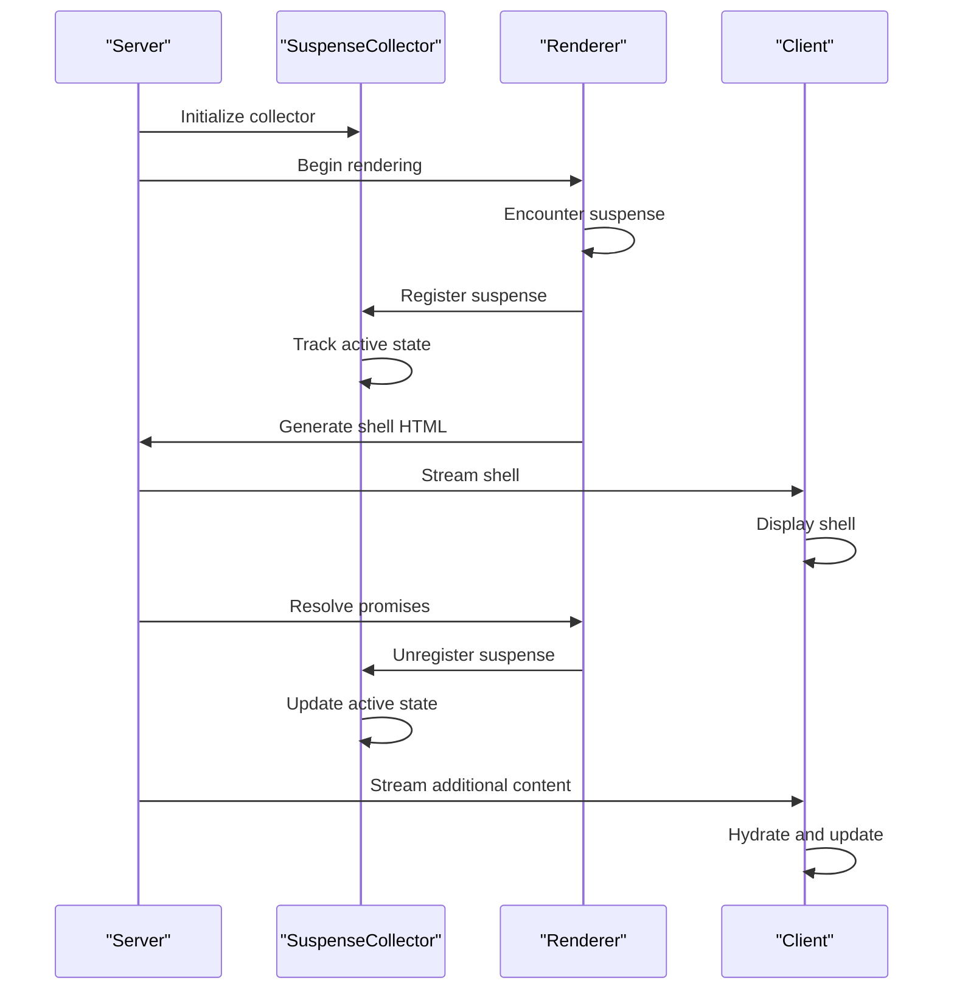

**Section sources**
- [suspense.collector.ts](file://src/components/suspense.collector.ts#L9-L42)
- [render.ssr.ts](file://src/methods/render.ssr.ts#L1-L27)

## Usage Patterns and Examples

### Basic Suspense Usage

The most common usage pattern involves wrapping asynchronous components with the Suspense component and providing a fallback UI:

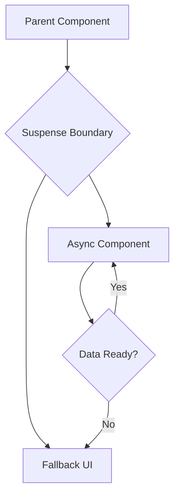

### Nested Suspense Boundaries

Multiple suspense boundaries can be nested to create granular loading states:

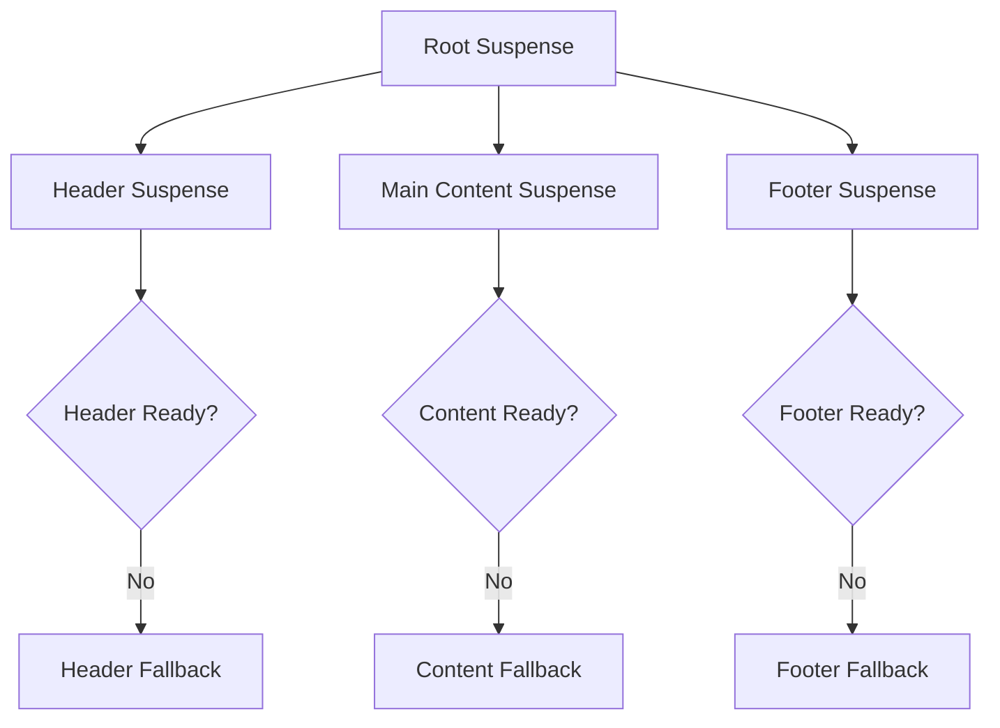

**Section sources**
- [suspense.ts](file://src/components/suspense.ts#L11-L25)
- [use_resource.ts](file://src/hooks/use_resource.ts#L18-L104)

## Performance Considerations

When implementing Suspense in Woby applications, several performance considerations should be addressed:

1. **Avoid excessive fallbacks**: Minimize the number of suspense boundaries to prevent flickering and improve perceived performance.
2. **Optimize resource fetching**: Use caching and memoization to reduce redundant network requests.
3. **Strategic boundary placement**: Place suspense boundaries at meaningful UI transitions rather than at the component level.
4. **Preload critical resources**: Use the preload method on lazy components to load essential code early.

The SuspenseCollector's TODO comment indicates potential performance optimizations, suggesting that the current implementation may have unnecessary overhead in tracking active suspenses.

**Section sources**
- [suspense.collector.ts](file://src/components/suspense.collector.ts#L9-L42)
- [lazy.ts](file://src/methods/lazy.ts#L11-L59)

## Debugging Techniques

Effective debugging of Suspense-related issues involves several techniques:

1. **Error boundaries**: Wrap suspense components with ErrorBoundary to catch and handle errors gracefully.
2. **Stack traces**: The use of Error objects in the codebase (e.g., `const stack = new Error()`) provides valuable debugging information.
3. **State inspection**: Monitor the active state of SuspenseData to understand suspension status.
4. **Resource tracking**: Use the resource functions (pending, error, value, latest) to inspect the state of asynchronous operations.

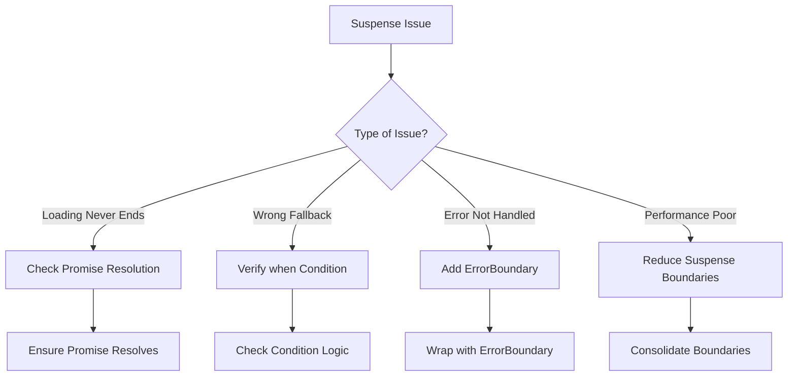

**Section sources**
- [error_boundary.ts](file://src/components/error_boundary.ts#L1-L17)
- [use_resource.ts](file://src/hooks/use_resource.ts#L18-L104)

## Common Issues and Solutions

### Infinite Loading States

Infinite loading occurs when promises never resolve. Solutions include:

- Implement proper error handling in fetchers
- Add timeouts to prevent hanging requests
- Ensure all code paths resolve or reject promises

### Missing Boundary Definitions

When suspense is triggered without a parent Suspense component, the application may throw errors. Always ensure that asynchronous operations are wrapped in Suspense boundaries.

### Fallback Stacking

Multiple nested fallbacks can create poor user experiences. Solutions include:

- Consolidate suspense boundaries
- Use skeleton screens that match final UI dimensions
- Implement loading priorities to sequence content appearance

The architecture's use of symbols for context isolation helps prevent boundary conflicts, while the collector system enables coordinated resolution of multiple suspenses.

**Section sources**
- [suspense.ts](file://src/components/suspense.ts#L11-L25)
- [suspense.collector.ts](file://src/components/suspense.collector.ts#L9-L42)
- [error_boundary.ts](file://src/components/error_boundary.ts#L1-L17)