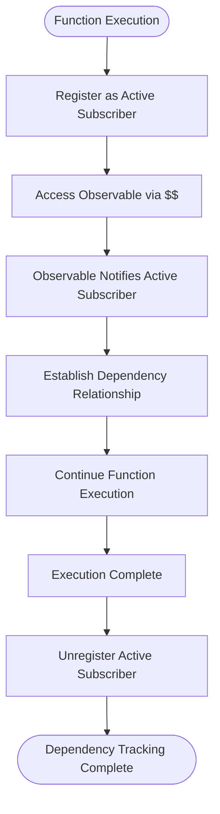
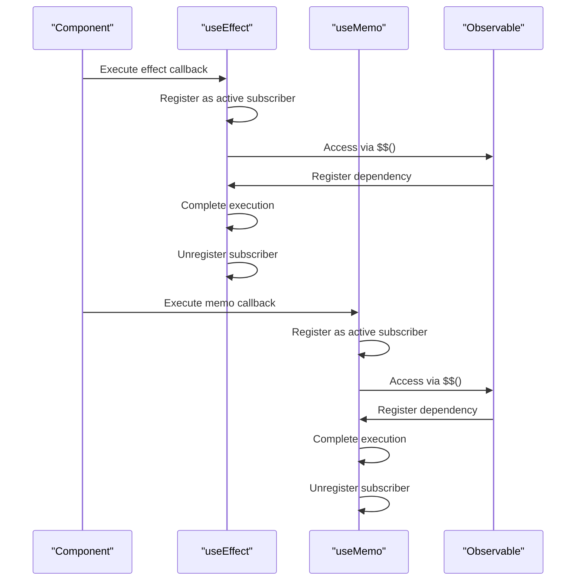
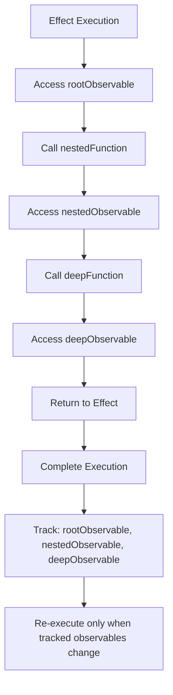
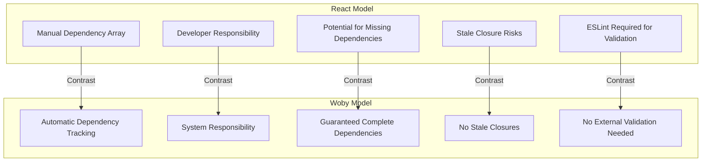

# Automatic Dependency Tracking

<cite>
**Referenced Files in This Document**   
- [soby.ts](file://src/soby.ts)
- [hooks/soby.ts](file://src/hooks/soby.ts)
- [readme.md](file://readme.md)
- [doc/Woby-vs-React.md](file://doc/Woby-vs-React.md)
- [doc/Reactivity-System.md](file://doc/Reactivity-System.md)
</cite>

## Table of Contents
1. [Introduction](#introduction)
2. [The Soby Engine and Automatic Dependency Tracking](#the-soby-engine-and-automatic-dependency-tracking)
3. [useEffect and useMemo Without Dependency Arrays](#useeffect-and-usememo-without-dependency-arrays)
4. [Nested Observable Access and Precise Re-execution](#nested-observable-access-and-precise-re-execution)
5. [Comparison with React's Dependency Model](#comparison-with-reacts-dependency-model)
6. [Common Issues with Manual Dependency Arrays](#common-issues-with-manual-dependency-arrays)
7. [Performance Implications and Optimization](#performance-implications-and-optimization)
8. [Conclusion](#conclusion)

## Introduction

Woby's automatic dependency tracking system represents a fundamental shift from traditional React-like frameworks by eliminating the need for manual dependency arrays in effects and memoization. Built upon the Soby reactive core, Woby automatically detects which observables are accessed within effects and memos during execution, enabling precise re-execution when dependencies change. This document explores the architecture and benefits of this system, demonstrating how it prevents common issues like stale closures while providing performance advantages through fine-grained tracking.

**Section sources**
- [readme.md](file://readme.md#L0-L50)

## The Soby Engine and Automatic Dependency Tracking

The Soby engine serves as the reactive foundation for Woby, implementing a sophisticated dependency tracking mechanism that operates during function execution. When a reactive function executes, the engine automatically detects all observable accesses through the `$$` function, establishing implicit dependencies without requiring explicit declaration. This tracking occurs at runtime as observables are accessed, creating a direct connection between the executing function and its dependencies.

The system works by temporarily registering the current effect or memo as the active subscriber during execution. Each time an observable is accessed via `$$`, it automatically notifies the active subscriber and establishes a dependency relationship. This approach eliminates the possibility of missing dependencies, as every observable access is inherently tracked by the system.

**Diagram sources**
- [soby.ts](file://src/soby.ts#L0-L1)
- [readme.md](file://readme.md#L200-L250)

**Section sources**
- [soby.ts](file://src/soby.ts#L0-L1)
- [readme.md](file://readme.md#L200-L300)

## useEffect and useMemo Without Dependency Arrays

Woby's `useEffect` and `useMemo` hooks operate without dependency arrays, leveraging the underlying Soby engine to automatically track dependencies. When these hooks execute, any observable accessed within their callback functions is automatically detected and tracked as a dependency. This eliminates the need for developers to manually specify dependency lists, reducing boilerplate code and preventing common errors associated with incorrect or incomplete dependency arrays.

For example, when using `useEffect`, the framework automatically identifies all observables accessed within the effect callback and establishes re-execution triggers for those specific dependencies. Similarly, `useMemo` automatically tracks all observable accesses within its computation function, ensuring the memoized value is recomputed only when relevant dependencies change.

**Diagram sources**
- [hooks/soby.ts](file://src/hooks/soby.ts#L4-L5)
- [readme.md](file://readme.md#L300-L350)

**Section sources**
- [hooks/soby.ts](file://src/hooks/soby.ts#L4-L5)
- [readme.md](file://readme.md#L300-L400)

## Nested Observable Access and Precise Re-execution

Woby's dependency tracking system excels at handling nested observable access, automatically detecting dependencies regardless of their depth within the execution context. When an effect or memo accesses observables through multiple levels of function calls or property access, the system maintains accurate dependency relationships for all accessed observables. This enables precise re-execution, where effects and memos respond only to changes in the specific observables they depend on, even when those dependencies are deeply nested.

The framework achieves this through consistent tracking during the entire execution stack, ensuring that every observable access—regardless of call depth—is properly registered with the active subscriber. This capability allows developers to create complex reactive computations without worrying about whether all dependencies will be properly tracked.

**Diagram sources**
- [readme.md](file://readme.md#L400-L450)
- [doc/Reactivity-System.md](file://doc/Reactivity-System.md#L0-L50)

**Section sources**
- [readme.md](file://readme.md#L400-L500)
- [doc/Reactivity-System.md](file://doc/Reactivity-System.md#L0-L100)

## Comparison with React's Dependency Model

Woby's automatic dependency tracking contrasts significantly with React's manual dependency array model. In React, developers must explicitly list all dependencies in an array, creating opportunities for errors when dependencies are omitted or incorrectly specified. This manual approach can lead to stale closures, where effects continue to reference outdated values because their dependency arrays don't properly reflect all used variables.

Woby eliminates this entire class of bugs by automatically detecting dependencies at runtime. While React requires developers to maintain dependency arrays and use tools like ESLint to catch missing dependencies, Woby's system guarantees that all observable accesses are tracked, making the dependency list inherently complete and accurate. This difference represents a fundamental shift from declarative dependency specification to automatic dependency detection.

**Diagram sources**
- [readme.md](file://readme.md#L500-L550)
- [doc/Woby-vs-React.md](file://doc/Woby-vs-React.md#L82-L114)

**Section sources**
- [readme.md](file://readme.md#L500-L600)
- [doc/Woby-vs-React.md](file://doc/Woby-vs-React.md#L82-L155)

## Common Issues with Manual Dependency Arrays

Manual dependency arrays in frameworks like React introduce several common issues that Woby's automatic tracking system prevents. The most prevalent problem is missing dependencies, where developers inadvertently omit observables from the dependency array, leading to stale closures that reference outdated values. This creates subtle bugs that are difficult to detect and debug, as the effect appears to work correctly initially but fails to respond to changes in the missing dependencies.

Another issue is over-specification, where developers include unnecessary dependencies in the array, causing excessive re-execution and performance degradation. Additionally, the cognitive load of maintaining dependency arrays increases with component complexity, making it harder to reason about component behavior. Woby's approach eliminates these problems by making dependency tracking automatic and comprehensive, ensuring that effects and memos respond precisely to the observables they actually use.

**Section sources**
- [readme.md](file://readme.md#L600-L700)
- [doc/Woby-vs-React.md](file://doc/Woby-vs-React.md#L115-L155)

## Performance Implications and Optimization

Woby's fine-grained dependency tracking provides significant performance advantages over traditional approaches. By automatically tracking dependencies at the observable level, the system enables precise re-execution of effects and recomputation of memos, minimizing unnecessary work. This contrasts with coarse-grained approaches that may re-execute entire components or effects due to broad dependency specifications.

The automatic tracking system also enables optimization opportunities by eliminating the overhead of dependency array comparison. Since dependencies are tracked at the point of access rather than compared against a previous array, the system avoids the performance cost of array diffing. Additionally, the elimination of stale closures ensures that effects always work with current values, preventing the need for defensive programming patterns that can impact performance.

Fine-grained tracking allows for more efficient updates, as the system can precisely determine which computations need to be re-executed based on actual dependency relationships rather than potentially broad dependency declarations.

**Section sources**
- [readme.md](file://readme.md#L700-L800)
- [doc/Reactivity-System.md](file://doc/Reactivity-System.md#L0-L100)

## Conclusion

Woby's automatic dependency tracking system, powered by the Soby engine, represents a significant advancement in reactive programming by eliminating the need for manual dependency arrays. This approach prevents common issues like missing dependencies and stale closures while providing performance benefits through fine-grained tracking. By automatically detecting observable accesses during execution, the system ensures that effects and memos respond precisely to relevant changes, reducing developer cognitive load and improving application reliability. The contrast with React's manual dependency model highlights the advantages of automatic tracking in creating more maintainable and performant applications.