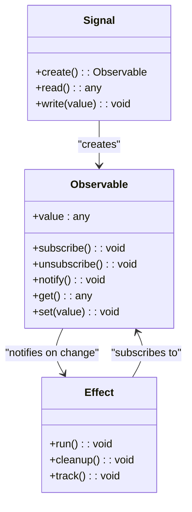
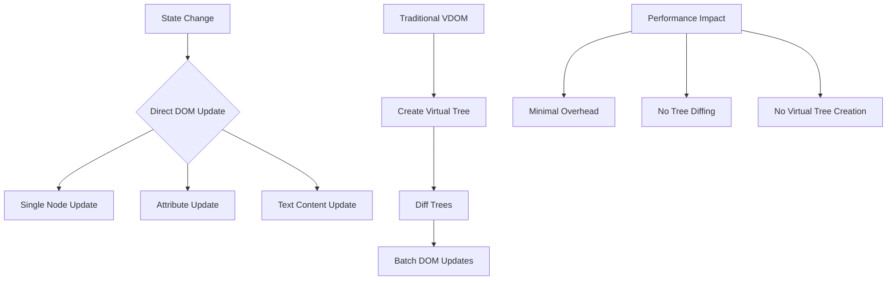
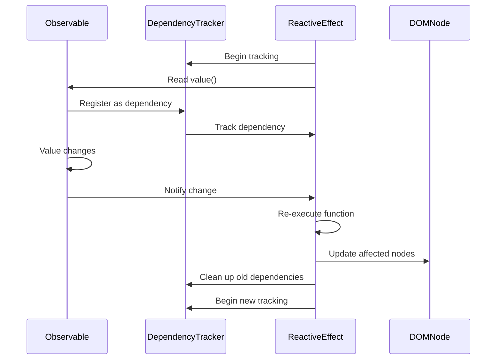
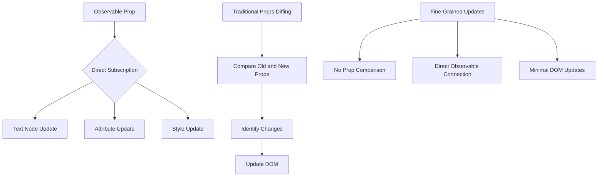
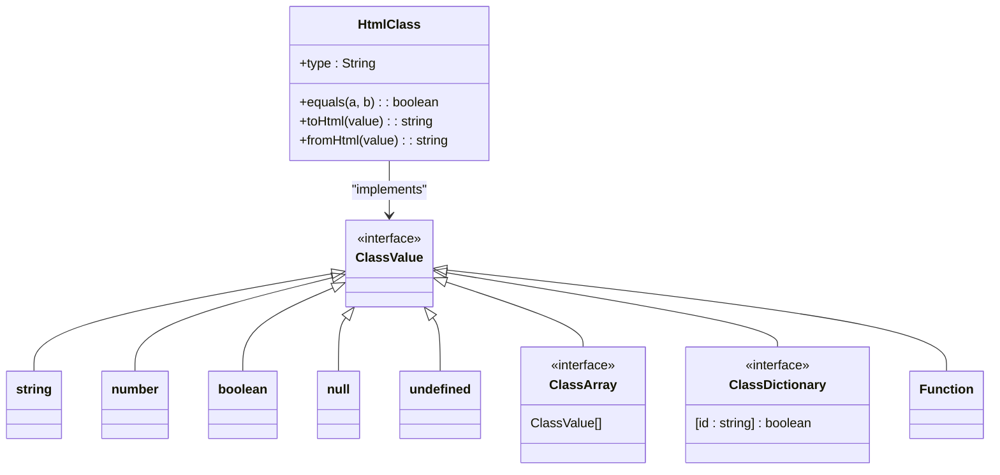
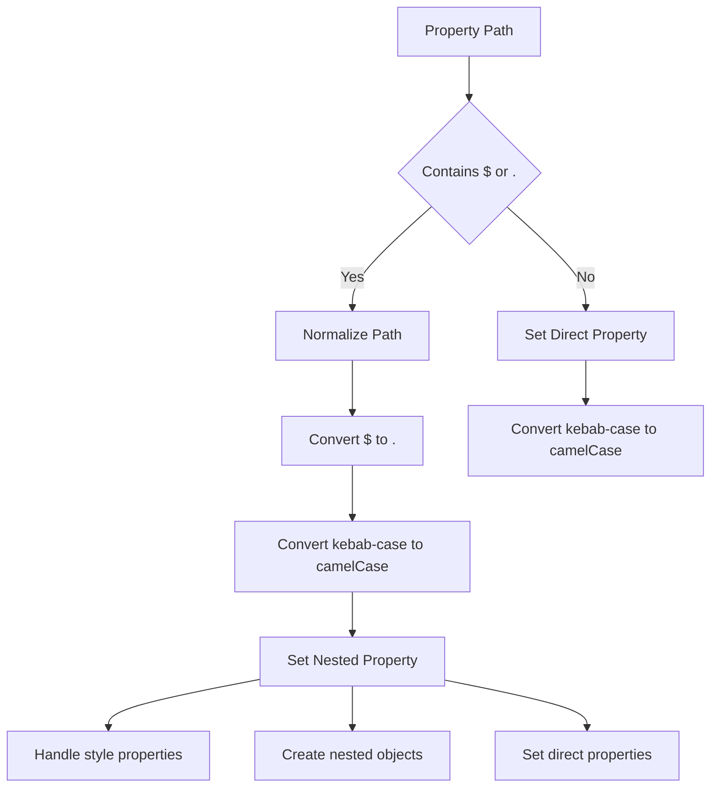
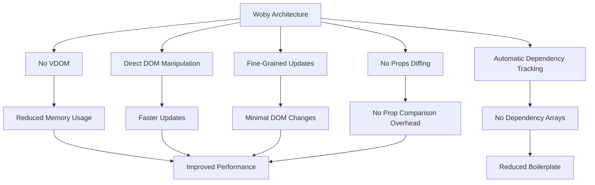

# Core Concepts

<cite>
**Referenced Files in This Document**   
- [soby.ts](file://src/methods/soby.ts)
- [nested.ts](file://src/utils/nested.ts)
- [html-class.ts](file://src/html/html-class.ts)
- [create_element.ts](file://src/methods/create_element.ts)
- [render.ts](file://src/methods/render.ts)
- [setters.ts](file://src/utils/setters.ts)
- [Core-Methods.md](file://docs/Core-Methods.md)
- [Type-Synchronization.md](file://docs/Type-Synchronization.md)
- [readme.md](file://readme.md)
</cite>

## Table of Contents
1. [Observable-Based Reactivity System](#observable-based-reactivity-system)
2. [No VDOM Architecture](#no-vdom-architecture)
3. [Automatic Re-execution and Stale Closure Prevention](#automatic-re-execution-and-stale-closure-prevention)
4. [No Props Diffing and Fine-Grained Updates](#no-props-diffing-and-fine-grained-updates)
5. [Built-in Class Management System](#built-in-class-management-system)
6. [Advanced Nested Property Support](#advanced-nested-property-support)
7. [Performance Benefits and Framework Comparison](#performance-benefits-and-framework-comparison)

## Observable-Based Reactivity System

Woby implements a sophisticated observable-based reactivity system that forms the foundation of its performance and developer experience advantages. The system centers around the `$()` function, which creates signals that automatically track dependencies and trigger updates when their values change.

The reactivity system automatically resolves observables in mathematical operations without requiring explicit unwrapping. When an observable is used in an expression, the system intelligently handles the conversion and maintains reactivity. This allows developers to write natural JavaScript expressions while maintaining full reactivity.

**Diagram sources**
- [soby.ts](file://src/methods/soby.ts)
- [Core-Methods.md](file://docs/Core-Methods.md#L18-L54)

Observables can be created with options to control their behavior, including type information for custom elements and custom equality functions. This allows for fine-tuned control over when updates occur and how values are synchronized between different parts of the application.

The automatic dependency tracking eliminates the need for dependency arrays that are common in other frameworks. Instead of manually specifying which values a computation depends on, Woby automatically tracks which observables are accessed during the execution of a function. This not only reduces boilerplate code but also eliminates entire classes of bugs related to stale or incomplete dependency arrays.

**Section sources**
- [soby.ts](file://src/methods/soby.ts)
- [Core-Methods.md](file://docs/Core-Methods.md#L18-L54)

## No VDOM Architecture

Woby's architecture eliminates the virtual DOM (VDOM) layer entirely, opting for direct DOM manipulation. This design choice provides significant performance benefits by removing the overhead associated with creating and diffing virtual DOM trees.

The framework achieves this through a fine-grained reactivity system that knows exactly which parts of the DOM need to be updated when data changes. Instead of comparing entire virtual trees, Woby updates only the specific DOM nodes that are affected by a state change.

**Diagram sources**
- [render.ts](file://src/methods/render.ts)
- [setters.ts](file://src/utils/setters.ts)

This approach results in faster updates, reduced memory usage, and more predictable performance characteristics. The elimination of the VDOM layer means there is no need to create intermediate representations of the UI, which reduces both CPU and memory overhead.

The direct DOM manipulation is made possible by the fine-grained reactivity system, which establishes direct connections between observables and the DOM nodes that depend on them. When an observable changes, the system can immediately update the relevant DOM nodes without needing to traverse or compare tree structures.

**Section sources**
- [render.ts](file://src/methods/render.ts)
- [setters.ts](file://src/utils/setters.ts)

## Automatic Re-execution and Stale Closure Prevention

Woby's reactivity system automatically re-executes functions when their dependencies change, eliminating the problem of stale closures that can occur in other frameworks. This is achieved through a combination of automatic dependency tracking and a well-defined execution context.

When a function is registered as a reactive effect (such as with `useMemo` or `useEffect`), Woby tracks all observables that are accessed during its execution. These observables become dependencies of the effect. When any of these dependencies change, the effect is automatically re-executed with the current values.

**Diagram sources**
- [soby.ts](file://src/methods/soby.ts)
- [render.ts](file://src/methods/render.ts)

This automatic re-execution ensures that functions always have access to the most current values of their dependencies, preventing the stale closure problem where a function continues to reference outdated values. The system also handles cleanup of previous dependencies when an effect is re-executed, ensuring that memory is properly managed and unnecessary subscriptions are removed.

The re-execution mechanism is optimized to minimize unnecessary work. Effects are only re-executed when their dependencies actually change (as determined by equality checks), and the system batches updates when possible to reduce DOM manipulation overhead.

**Section sources**
- [soby.ts](file://src/methods/soby.ts)
- [render.ts](file://src/methods/render.ts)

## No Props Diffing and Fine-Grained Updates

Woby eliminates the need for props diffing by establishing direct connections between observables and the DOM nodes that depend on them. This enables fine-grained updates that target only the specific parts of the UI that need to change, rather than comparing entire component trees.

When a component receives props, Woby doesn't need to compare the new props with the previous ones to determine what has changed. Instead, each prop that is an observable establishes a direct subscription to that observable. When the observable's value changes, the corresponding DOM node is updated immediately.

**Diagram sources**
- [create_element.ts](file://src/methods/create_element.ts)
- [setters.ts](file://src/utils/setters.ts)

This approach provides several advantages:
- Eliminates the computational overhead of props diffing
- Reduces memory usage by avoiding the need to store previous props
- Enables more precise updates that target only the affected DOM nodes
- Improves performance by reducing the amount of work needed to update the UI

The fine-grained update system works in conjunction with the no VDOM architecture to provide highly efficient UI updates. Since the framework knows exactly which DOM nodes are affected by a state change, it can update them directly without needing to traverse or compare tree structures.

**Section sources**
- [create_element.ts](file://src/methods/create_element.ts)
- [setters.ts](file://src/utils/setters.ts)

## Built-in Class Management System

Woby includes a sophisticated built-in class management system that handles dynamic class binding with high performance and flexibility. The system supports multiple ways of specifying classes, including strings, arrays, objects, and functions, and automatically handles updates when class values change.

The class management system is designed to work seamlessly with the reactivity system, automatically tracking dependencies when functions are used to determine class values. This allows for complex conditional class logic without sacrificing performance.

**Diagram sources**
- [html-class.ts](file://src/html/html-class.ts)
- [setters.ts](file://src/utils/setters.ts)

The system includes an `equals` function that determines when class values have changed, preventing unnecessary DOM updates. It also provides `toHtml` and `fromHtml` functions for serializing and deserializing class values, which is particularly useful for custom elements that need to synchronize class values with HTML attributes.

For object-based class binding, the system evaluates each key's value and includes the class name in the final class list only if the value is truthy. This enables powerful conditional class logic that can respond to multiple state variables.

**Section sources**
- [html-class.ts](file://src/html/html-class.ts)
- [setters.ts](file://src/utils/setters.ts)

## Advanced Nested Property Support

Woby provides advanced support for nested properties using both `$` and `.` notation, enabling developers to work with complex data structures and deeply nested DOM properties. This feature is particularly useful for setting nested style properties or working with complex component props.

The framework includes utility functions for normalizing property paths, converting between different notation styles, and setting nested properties on DOM elements. The `normalizePropertyPath` function converts `$` notation to dot notation and handles kebab-case to camelCase conversion for each path segment.

**Diagram sources**
- [nested.ts](file://src/utils/nested.ts)
- [setters.ts](file://src/utils/setters.ts)

For style properties, the system provides special handling to set individual CSS properties on an element's style object. For other nested properties, it creates the necessary nested structure in the element's props object, ensuring that deeply nested properties can be set and accessed consistently.

This nested property support works seamlessly with the reactivity system, allowing observables to be bound to deeply nested properties. When the observable's value changes, the corresponding nested property is updated automatically, maintaining the framework's characteristic fine-grained updates.

**Section sources**
- [nested.ts](file://src/utils/nested.ts)
- [setters.ts](file://src/utils/setters.ts)

## Performance Benefits and Framework Comparison

Woby's architectural decisions provide significant performance benefits compared to traditional frameworks that rely on VDOM and manual dependency management. The combination of no VDOM, automatic dependency tracking, fine-grained updates, and direct DOM manipulation results in faster rendering, reduced memory usage, and more predictable performance.

The elimination of the VDOM layer removes the overhead of creating and diffing virtual trees, which can be substantial in complex applications. Instead of comparing entire component trees, Woby updates only the specific DOM nodes that are affected by a state change, resulting in minimal DOM manipulation.

**Diagram sources**
- [render.ts](file://src/methods/render.ts)
- [soby.ts](file://src/methods/soby.ts)
- [readme.md](file://readme.md)

Compared to frameworks that require dependency arrays for effects and memoization, Woby's automatic dependency tracking eliminates entire classes of bugs related to stale or incomplete dependency lists. This not only improves performance by ensuring that effects run only when necessary but also improves developer experience by reducing cognitive load.

The framework's design also enables better tree-shaking and smaller bundle sizes, as the fine-grained reactivity system only includes the code needed for the specific features being used. This contrasts with frameworks that include VDOM and diffing algorithms even when they're not needed for a particular use case.

These architectural advantages make Woby particularly well-suited for applications that require high performance, such as data visualization, real-time dashboards, and complex user interfaces with frequent state changes.

**Section sources**
- [readme.md](file://readme.md)
- [Type-Synchronization.md](file://docs/Type-Synchronization.md)
- [Core-Methods.md](file://docs/Core-Methods.md)