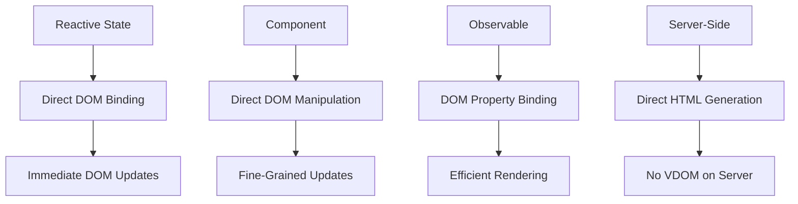
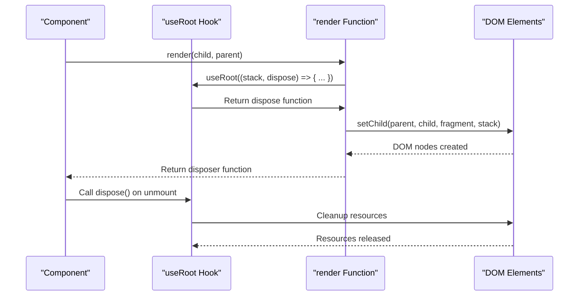
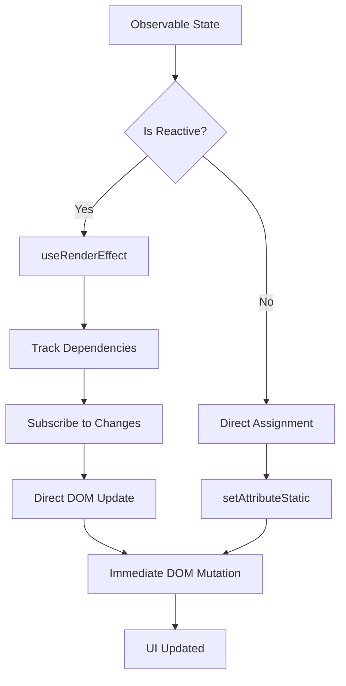

# No VDOM Architecture

<cite>
**Referenced Files in This Document**   
- [render.ts](file://src/methods/render.ts)
- [setters.ts](file://src/utils/setters.ts)
- [diff.ts](file://src/utils/diff.ts)
- [render.ssr.ts](file://src/methods/render.ssr.ts)
- [soby.ts](file://src/hooks/soby.ts)
- [fragment.ts](file://src/utils/fragment.ts)
- [types.ts](file://src/types.ts)
- [resolvers.ts](file://src/utils/resolvers.ts)
</cite>

## Table of Contents
1. [Introduction](#introduction)
2. [Core Architecture Overview](#core-architecture-overview)
3. [Direct DOM Manipulation](#direct-dom-manipulation)
4. [Root Management and Disposal](#root-management-and-disposal)
5. [Efficient DOM Updates with Diffing](#efficient-dom-updates-with-diffing)
6. [Observable Binding and Reactive Updates](#observable-binding-and-reactive-updates)
7. [Server-Side Rendering Implementation](#server-side-rendering-implementation)
8. [Performance Benefits and Considerations](#performance-benefits-and-considerations)
9. [Conclusion](#conclusion)

## Introduction
Woby's no VDOM architecture represents a paradigm shift in reactive UI frameworks by eliminating the virtual DOM layer entirely. Instead of creating an intermediate representation of the UI and performing diffing operations between virtual trees, Woby directly manipulates the actual DOM through fine-grained updates. This approach eliminates the memory overhead and computational cost associated with maintaining and diffing virtual DOM trees. The architecture leverages reactive programming principles to track dependencies and update only the specific DOM nodes that are affected by state changes, resulting in immediate and efficient UI updates. This document explores the implementation details of this architecture, focusing on the core mechanisms that enable direct DOM manipulation, efficient updates, and server-side rendering without the need for a virtual DOM.

## Core Architecture Overview
Woby's architecture is built around the principle of direct DOM manipulation, bypassing the traditional virtual DOM diffing process entirely. The framework operates by establishing direct connections between reactive state and DOM elements, allowing for immediate updates when state changes occur. At the core of this architecture is a system of reactive primitives that track dependencies and automatically trigger updates to specific DOM nodes. When a component is rendered, Woby creates a direct mapping between the component's state and the corresponding DOM elements, eliminating the need for reconciliation. The framework uses a combination of reactive observables, efficient diffing algorithms for list operations, and direct property binding to achieve high-performance updates. This architecture enables Woby to provide immediate DOM updates with minimal overhead, as changes propagate directly from the source state to the DOM without intermediate representations or expensive diffing operations.

**Diagram sources**
- [render.ts](file://src/methods/render.ts)
- [setters.ts](file://src/utils/setters.ts)
- [render.ssr.ts](file://src/methods/render.ssr.ts)

## Direct DOM Manipulation
The foundation of Woby's no VDOM architecture lies in its direct DOM manipulation capabilities, which eliminate the overhead of virtual DOM diffing. Instead of creating virtual representations of UI elements, Woby creates and manipulates actual DOM nodes directly. The `setChild` utility in `setters.ts` serves as the primary mechanism for DOM manipulation, handling the insertion, update, and removal of child nodes. When a component's state changes, Woby doesn't create a new virtual tree for comparison; instead, it directly updates the affected DOM nodes through reactive bindings. This approach enables fine-grained updates where only the specific elements impacted by state changes are modified, rather than re-rendering entire component subtrees. The framework uses a fragment system to track groups of related DOM nodes, allowing for efficient batch operations when necessary. By operating directly on the DOM, Woby reduces memory usage and eliminates the computational cost of diffing virtual trees, resulting in faster updates and improved performance, especially for applications with frequent state changes.

**Section sources**
- [setters.ts](file://src/utils/setters.ts#L386-L389)
- [fragment.ts](file://src/utils/fragment.ts)
- [types.ts](file://src/types.ts)

## Root Management and Disposal
Woby's `useRoot` hook plays a critical role in managing the lifecycle of DOM elements and ensuring proper cleanup. Implemented in the `soby` package and exposed through the hooks system, `useRoot` establishes a root scope for reactive operations and provides a mechanism for cleanup when components are unmounted. In the `render` function, `useRoot` is used to wrap the rendering logic, creating a disposable scope that tracks all reactive operations within the component tree. When a component is removed from the DOM, the dispose function returned by `useRoot` ensures that all event listeners, subscriptions, and other resources are properly cleaned up, preventing memory leaks. This approach allows Woby to maintain a clean separation between the creation and disposal of DOM elements, ensuring that the application remains performant even with complex component hierarchies. The root management system also enables Woby to handle dynamic content efficiently, as it can track which elements are active and which need to be cleaned up when the UI structure changes.

**Diagram sources**
- [render.ts](file://src/methods/render.ts#L1-L30)
- [soby.ts](file://src/hooks/soby.ts)
- [setters.ts](file://src/utils/setters.ts)

## Efficient DOM Updates with Diffing
While Woby eliminates the virtual DOM, it still requires an efficient mechanism for updating lists of DOM nodes when the underlying data changes. The `diff.ts` utility implements an optimized algorithm for this purpose, calculating the minimum number of operations needed to transform one list of nodes into another. Unlike traditional VDOM diffing that compares entire trees, Woby's diffing algorithm operates directly on actual DOM nodes, focusing specifically on list reordering and updates. The algorithm employs several optimization strategies, including fast paths for common operations like appending or prepending items, and a mapping strategy for more complex rearrangements. It uses the longest common subsequence approach to minimize DOM operations, reducing the performance impact of list updates. The diff function accepts before and after node lists, along with a parent node reference, and applies the necessary DOM operations to synchronize the children. This targeted diffing approach ensures that list updates remain efficient without the overhead of maintaining a virtual representation of the entire UI tree.

**Section sources**
- [diff.ts](file://src/utils/diff.ts)
- [setters.ts](file://src/utils/setters.ts)
- [fragment.ts](file://src/utils/fragment.ts)

## Observable Binding and Reactive Updates
Woby's architecture leverages reactive observables to enable immediate DOM updates when state changes occur. The `setters.ts` file contains utilities that directly bind observables to DOM properties, eliminating the need for virtual DOM reconciliation. When an observable value changes, the binding system automatically updates the corresponding DOM attribute, property, or text content without requiring a full component re-render. This fine-grained reactivity is achieved through the use of `useRenderEffect`, which establishes a dependency between the observable and the DOM update function. The framework distinguishes between static and dynamic values, applying different update strategies based on whether a value is reactive. For observable values, Woby creates an effect that listens for changes and applies updates directly to the DOM. This approach ensures that updates are immediate and efficient, as they propagate directly from the source state to the DOM without intermediate representations or diffing operations.

**Diagram sources**
- [setters.ts](file://src/utils/setters.ts)
- [resolvers.ts](file://src/utils/resolvers.ts)
- [soby.ts](file://src/hooks/soby.ts)

## Server-Side Rendering Implementation
Woby's server-side rendering implementation demonstrates the consistency of its no VDOM architecture across environments. The `render.ssr.ts` file provides a server-compatible version of the render function that generates HTML without relying on a virtual DOM. Instead of creating DOM nodes, the SSR implementation builds a string representation of the HTML by traversing the component tree and serializing the output. The `setChild` function in the SSR utilities handles the rendering of components to strings, using the same fragment system as the client-side implementation but targeting string concatenation instead of DOM manipulation. This approach ensures that the same rendering logic can be used on both client and server, with only the final output mechanism differing. The SSR implementation maintains the framework's reactive principles by resolving observable values during rendering, allowing for dynamic content generation on the server. By avoiding a virtual DOM on the server, Woby reduces memory usage and improves rendering performance, making it well-suited for server-side applications with high throughput requirements.

**Section sources**
- [render.ssr.ts](file://src/methods/render.ssr.ts)
- [setters.ssr.ts](file://src/utils/setters.ssr.ts)
- [fragment.ssr.ts](file://src/utils/fragment.ssr.ts)

## Performance Benefits and Considerations
Woby's no VDOM architecture offers significant performance benefits by eliminating the memory and computational overhead associated with virtual DOM diffing. The direct DOM manipulation approach reduces memory usage by avoiding the creation of intermediate virtual node representations and eliminates the CPU cost of tree diffing operations. This results in faster initial rendering and more efficient updates, particularly for applications with frequent state changes. The fine-grained update mechanism ensures that only the specific DOM nodes affected by state changes are updated, minimizing layout thrashing and improving overall performance. However, this architecture requires careful consideration in certain scenarios. Complex UI updates involving significant structural changes may benefit from batched operations to avoid excessive DOM mutations. Additionally, developers should be mindful of creating too many fine-grained reactive bindings, as this can lead to a large number of individual DOM updates. The architecture excels in applications with predictable data flows and components that update independently, making it particularly well-suited for data-driven interfaces and real-time applications.

## Conclusion
Woby's no VDOM architecture represents a compelling alternative to traditional virtual DOM approaches by enabling direct, fine-grained DOM manipulation through reactive programming principles. By eliminating the virtual DOM layer, the framework reduces memory overhead and computational costs while providing immediate updates to the user interface. The combination of the `useRoot` hook for lifecycle management, the `setChild` utility for direct DOM manipulation, and the optimized diffing algorithm for list operations creates a cohesive system that balances performance and developer experience. The consistent architecture across client and server environments, demonstrated by the SSR implementation, further enhances the framework's utility for modern web applications. While this approach requires careful consideration of update patterns and potential performance implications for complex UI changes, it offers significant advantages for applications prioritizing responsiveness and efficiency. Woby's architecture demonstrates that reactive programming can provide an effective foundation for UI rendering without the need for virtual DOM abstractions.