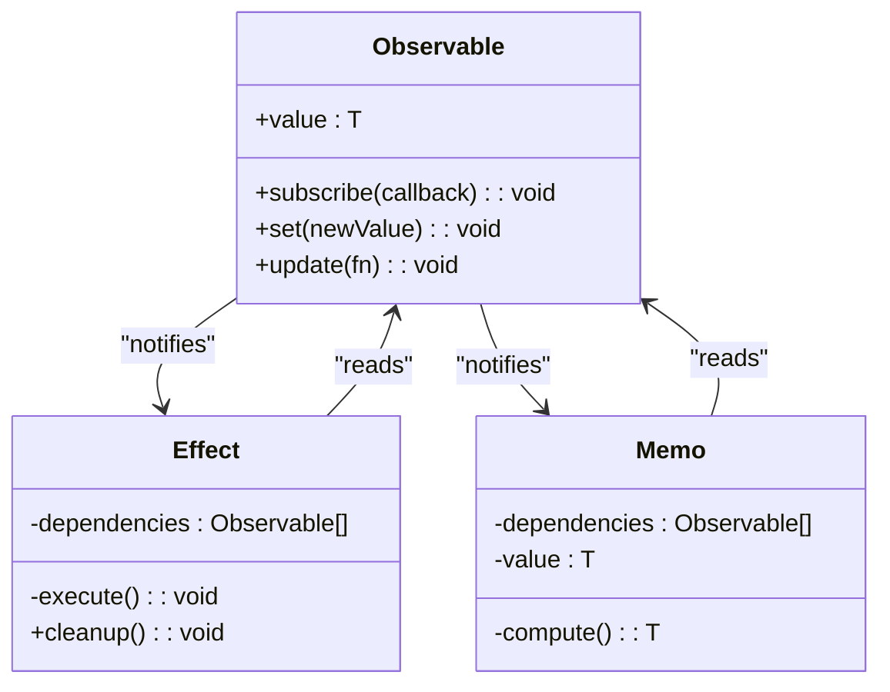
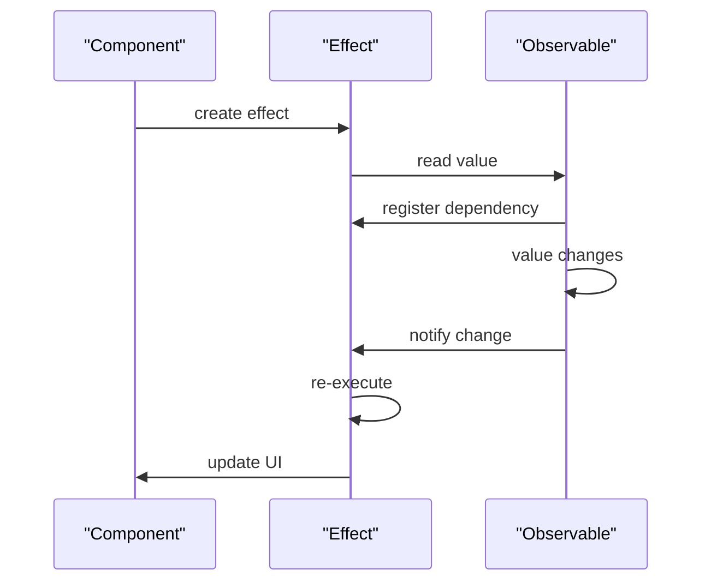

# Observable-Based Reactivity

<cite>
**Referenced Files in This Document**   
- [src/soby.ts](file://src/soby.ts)
- [src/hooks/soby.ts](file://src/hooks/soby.ts)
- [src/methods/soby.ts](file://src/methods/soby.ts)
- [doc/Core-Methods.md](file://doc/Core-Methods.md)
- [doc/Best-Practices.md](file://doc/Best-Practices.md)
- [doc/Reactivity-System.md](file://doc/Reactivity-System.md)
- [readme.md](file://readme.md)
</cite>

## Table of Contents
1. [Introduction](#introduction)
2. [Core Reactivity Mechanism](#core-reactivity-mechanism)
3. [Observable Creation and Type Options](#observable-creation-and-type-options)
4. [Automatic Dependency Tracking](#automatic-dependency-tracking)
5. [Value Unwrapping with $$()](#value-unwrapping-with-)
6. [Mathematical Operations and Observable Resolution](#mathematical-operations-and-observable-resolution)
7. [Custom Equality Functions](#custom-equality-functions)
8. [Integration with Rendering System](#integration-with-rendering-system)
9. [Performance Benefits](#performance-benefits)
10. [Custom Elements Integration](#custom-elements-integration)
11. [Elimination of Stale Closures](#elimination-of-stale-closures)
12. [Conclusion](#conclusion)

## Introduction
Woby's observable-based reactivity system provides a fine-grained, efficient approach to state management that eliminates the need for dependency arrays and manual effect tracking. Built on the soby engine, this system enables automatic dependency resolution and re-execution of effects when observables change. The core principle revolves around the `$()` function for creating observables and the `$$()` function for safely unwrapping values, whether they are observables or plain values.

**Section sources**
- [doc/Core-Methods.md](file://doc/Core-Methods.md#L18-L54)
- [doc/Best-Practices.md](file://doc/Best-Practices.md#L16-L44)

## Core Reactivity Mechanism
The reactivity system in Woby is powered by the soby engine, which provides the foundational observable implementation. The `$()` function serves as the primary mechanism for creating signals that can be tracked and reacted to automatically. When an observable is created using `$()`, it becomes a fine-grained signal that can be subscribed to by any reading context, such as effects, memos, or rendering operations.

This system eliminates the need for dependency arrays by automatically tracking which observables are accessed during the execution of a function. When any of these observables change, the dependent computation is automatically re-executed, ensuring that the UI or effect logic always reflects the current state.



**Diagram sources**
- [src/methods/soby.ts](file://src/methods/soby.ts#L7)
- [src/hooks/soby.ts](file://src/hooks/soby.ts#L5)

**Section sources**
- [src/methods/soby.ts](file://src/methods/soby.ts)
- [src/soby.ts](file://src/soby.ts)

## Observable Creation and Type Options
Observables in Woby can be created with optional configuration parameters that provide additional behavior control. These options include type annotations that enable proper synchronization with HTML attributes in custom elements. The type system ensures that values are correctly formatted when bound to DOM attributes.

```typescript
const count = $(0, { type: 'number' } as const)
const enabled = $(true, { type: 'boolean' } as const)
const data = $({} as any, { type: 'object' } as const)
```

The type options ensure that when these observables are used in HTML attributes, they are properly serialized and deserialized according to their type. This feature is particularly useful when integrating with custom elements that expect specific data types for their properties.

**Section sources**
- [doc/Core-Methods.md](file://doc/Core-Methods.md#L18-L54)

## Automatic Dependency Tracking
Woby's reactivity system automatically tracks dependencies without requiring explicit dependency arrays. When a function reads an observable value, the system records this dependency. If the observable changes in the future, the function is automatically re-executed.

This mechanism works through a combination of the `useEffect`, `useMemo`, and other hook functions that establish tracking contexts. The soby engine maintains a stack of current observers and automatically subscribes to any observables that are accessed within these contexts.



**Diagram sources**
- [src/hooks/soby.ts](file://src/hooks/soby.ts#L5)
- [src/methods/soby.ts](file://src/methods/soby.ts#L7)

**Section sources**
- [src/hooks/soby.ts](file://src/hooks/soby.ts)
- [src/methods/soby.ts](file://src/methods/soby.ts)

## Value Unwrapping with $$()
The `$$()` function provides a safe way to unwrap values that may or may not be observables. This utility function handles both observable and plain values uniformly, preventing runtime errors when dealing with uncertain types.

```typescript
const maybeObservable = getValue()
const value = $$(maybeObservable) // Works for both observables and plain values
```

This pattern is particularly useful in utility functions and higher-order components where the input type might vary. The `$$()` function checks if the value is an observable by testing for callable properties and returns the unwrapped value accordingly.

**Section sources**
- [doc/Best-Practices.md](file://doc/Best-Practices.md#L16-L44)

## Mathematical Operations and Observable Resolution
Observables in Woby automatically resolve their values in mathematical operations, allowing for natural expression of derived state. When observables are used in arithmetic expressions, they are automatically unwrapped and the operation is performed on their current values.

```typescript
const count = $(5)
const result = count + 10 // Results in 15 automatically

const price = $(19.99)
const tax = $(0.08)
const total = price * (1 + tax) // Automatically calculates with current values
```

This behavior enables more intuitive and readable code for derived state calculations, eliminating the need for explicit unwrapping in mathematical contexts.

**Section sources**
- [doc/Core-Methods.md](file://doc/Core-Methods.md#L55-L124)

## Custom Equality Functions
Observables can be configured with custom equality functions to control when changes are considered significant. This feature is particularly useful for object references where structural equality is more appropriate than reference equality.

```typescript
const user = $({ id: 1, name: 'John' }, {
  equals: (a, b) => a.id === b.id
})
```

When a new value is set on such an observable, the custom equality function is used to compare the old and new values. If the function returns true, the change is considered insignificant and no notifications are sent to subscribers, optimizing performance by avoiding unnecessary updates.

**Section sources**
- [doc/Core-Methods.md](file://doc/Core-Methods.md#L18-L54)

## Integration with Rendering System
The observable system is tightly integrated with Woby's rendering engine, enabling automatic re-rendering when observables change. When a component reads an observable during rendering, the rendering context establishes a dependency on that observable. Subsequent changes trigger only the minimal necessary re-renders.

This integration works through the JSX runtime and component system, where observable values are automatically tracked when accessed in template expressions. The rendering system batches updates efficiently and ensures that the DOM is updated in a performant manner.

```mermaid
graph TB
subgraph "Rendering System"
Component[Component Render]
Observer[Observer Context]
Scheduler[Update Scheduler]
end
subgraph "Reactivity System"
Observable[Observable]
Effect[Effect]
end
Observable --> Observer : "change notification"
Observer --> Scheduler : "schedule update"
Scheduler --> Component : "re-render"
Component --> Observable : "read value"
```

**Diagram sources**
- [src/methods/soby.ts](file://src/methods/soby.ts#L7)
- [src/hooks/soby.ts](file://src/hooks/soby.ts#L5)

**Section sources**
- [src/methods/soby.ts](file://src/methods/soby.ts)
- [src/hooks/soby.ts](file://src/hooks/soby.ts)

## Performance Benefits
Woby's observable-based reactivity system offers significant performance advantages over traditional state-based frameworks:

- **Fine-grained updates**: Only components and effects that depend on changed state are re-executed
- **No virtual DOM diffing**: Direct DOM updates based on observable changes
- **Automatic batching**: Multiple observable changes are batched into single updates
- **Minimal re-renders**: Components re-render only when their specific dependencies change
- **Efficient memory usage**: No need to store dependency arrays or perform array comparisons

The elimination of dependency arrays reduces both memory overhead and computational cost, as the system doesn't need to compare arrays on every render cycle.

**Section sources**
- [doc/Reactivity-System.md](file://doc/Reactivity-System.md)
- [readme.md](file://readme.md)

## Custom Elements Integration
The observable system seamlessly integrates with custom elements through type synchronization. When observables with type annotations are bound to custom element properties, the values are automatically converted to the appropriate format.

This integration ensures that custom elements receive properly typed values and that changes are propagated efficiently. The type system handles the conversion between JavaScript types and HTML attribute representations, maintaining consistency across the application.

**Section sources**
- [doc/Core-Methods.md](file://doc/Core-Methods.md#L18-L54)

## Elimination of Stale Closures
One of the key benefits of Woby's reactivity system is the elimination of stale closures. Traditional React-style hooks can suffer from stale closure issues when dependencies are not properly specified in dependency arrays. Woby's automatic dependency tracking ensures that all relevant observables are always tracked, making it impossible to have stale closures due to missing dependencies.

Effects and memos automatically re-execute when any of their dependencies change, with the latest values always available in the execution context. This behavior provides more predictable and reliable reactivity compared to manual dependency management.

**Section sources**
- [doc/Best-Practices.md](file://doc/Best-Practices.md)
- [readme.md](file://readme.md)

## Conclusion
Woby's observable-based reactivity system represents a significant advancement in state management for web applications. By leveraging the soby engine and automatic dependency tracking, it provides a more intuitive, efficient, and reliable approach to reactivity. The system eliminates common pitfalls like stale closures and dependency array maintenance while offering performance benefits through fine-grained updates and efficient change propagation. With seamless integration with both the rendering system and custom elements, this reactivity model provides a robust foundation for building dynamic web applications.