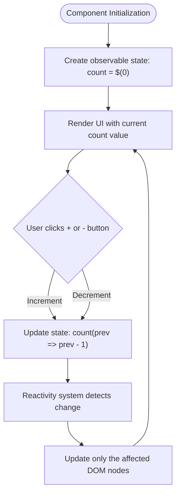
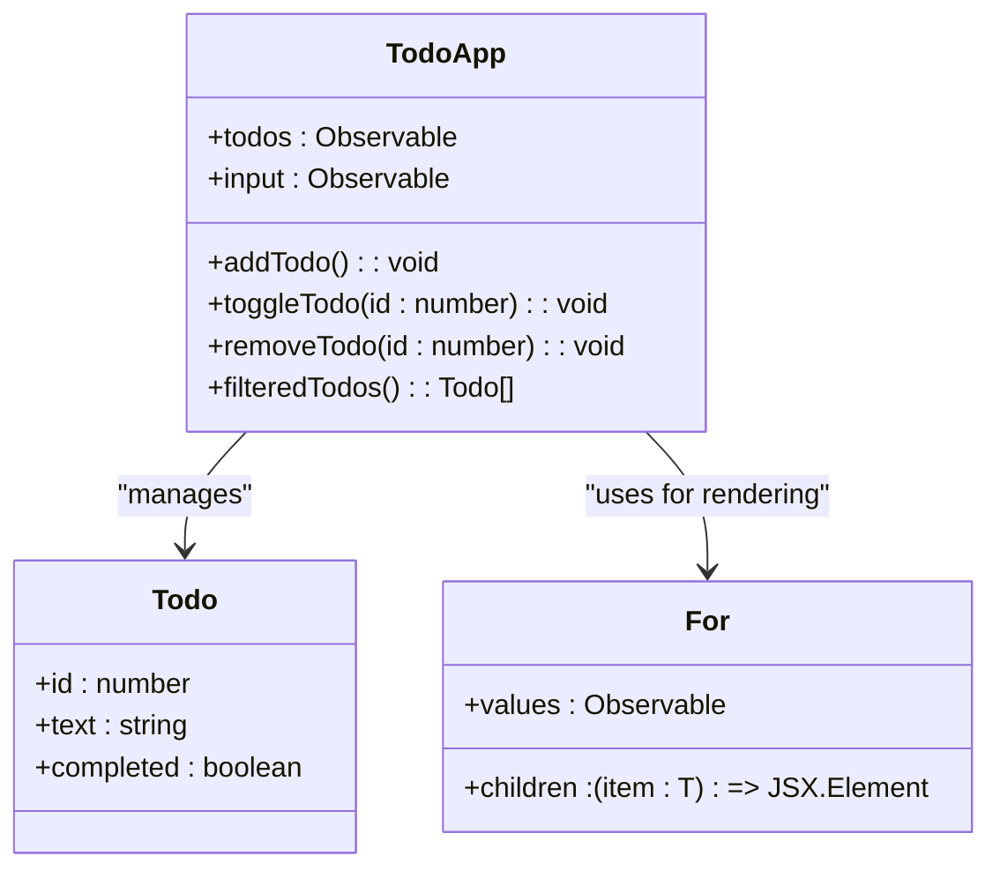
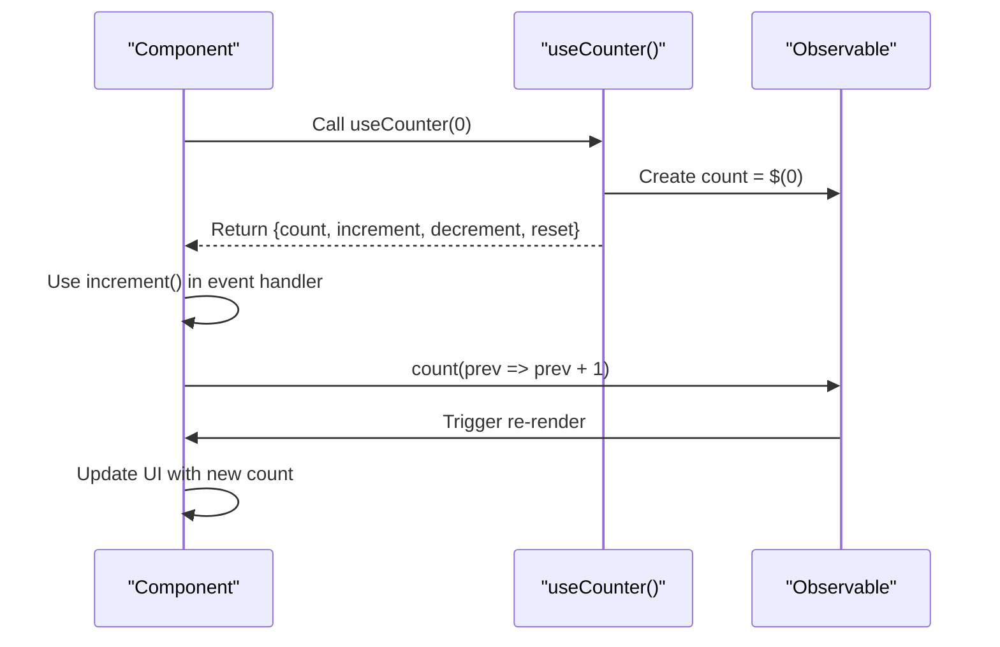
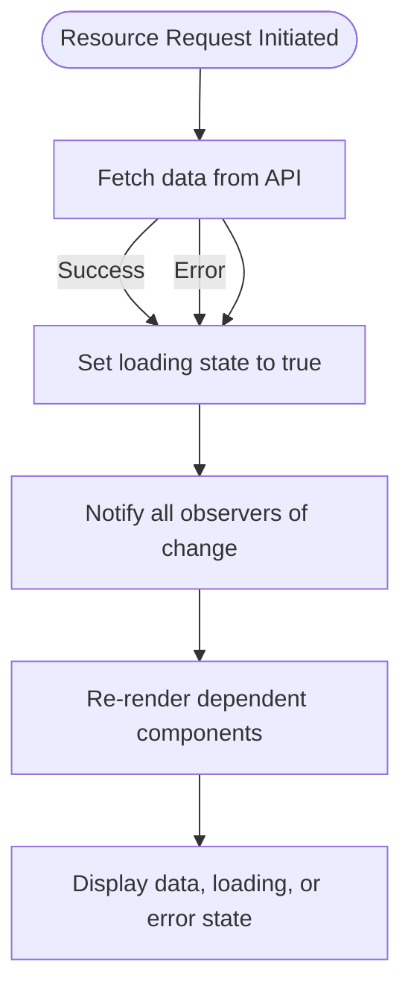
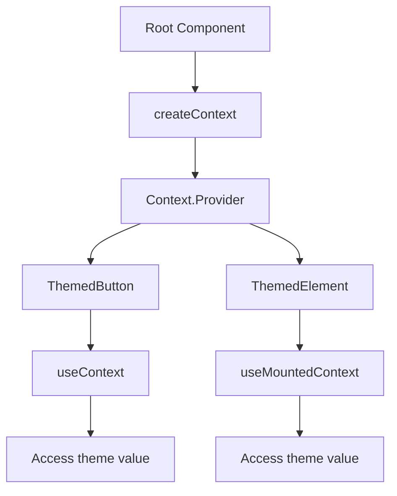
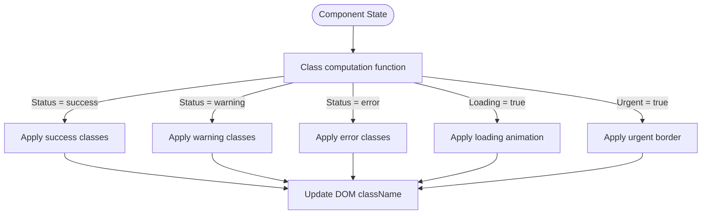

# Examples

<cite>
**Referenced Files in This Document**   
- [readme.md](file://readme.md)
- [docs/Examples.md](file://docs/Examples.md)
- [src/hooks/use_context.ts](file://src/hooks/use_context.ts)
- [src/methods/create_context.tsx](file://src/methods/create_context.tsx)
</cite>

## Table of Contents
1. [Introduction](#introduction)
2. [Basic Examples](#basic-examples)
3. [Component Composition and State Management](#component-composition-and-state-management)
4. [Advanced Examples](#advanced-examples)
5. [Custom Elements and Context Usage](#custom-elements-and-context-usage)
6. [Class Management Patterns](#class-management-patterns)
7. [Educational Value and Feature Demonstration](#educational-value-and-feature-demonstration)

## Introduction
This document provides comprehensive examples of Woby framework implementations, showcasing practical applications of its reactive features. The examples range from simple components to full applications, demonstrating core concepts such as reactivity, component composition, state management, custom elements, context usage, and advanced class management. Each example highlights specific Woby features while maintaining accessibility for beginners and revealing advanced techniques for experienced developers.

**Section sources**
- [readme.md](file://readme.md#L0-L100)

## Basic Examples

### Counter Example
The counter example demonstrates Woby's fundamental reactivity system using observables. It showcases the creation of a reactive state variable with the `$()` function and direct binding to the UI. The example illustrates how event handlers can modify the observable state, triggering automatic UI updates without explicit dependency arrays or effect cleanup.

**Diagram sources**
- [readme.md](file://readme.md#L428-L536)
- [docs/Examples.md](file://docs/Examples.md#L15-L37)

### Digital Clock
The digital clock example demonstrates time-based reactivity using the `useInterval` hook. It shows how to create a reactive timestamp that updates every second, with the framework automatically handling the subscription and cleanup. The example highlights Woby's ability to integrate with browser APIs while maintaining fine-grained reactivity.

**Section sources**
- [docs/Examples.md](file://docs/Examples.md#L39-L55)

### Todo Application
The todo application provides a complete example of state management in Woby. It demonstrates array manipulation with observables, conditional rendering with the `For` component, and form handling. The example shows how to manage a collection of items with CRUD operations while maintaining reactivity throughout the application.

**Diagram sources**
- [docs/Examples.md](file://docs/Examples.md#L57-L134)

## Component Composition and State Management

### Modal Component with Portal
This example demonstrates component composition using the `Portal` component to render content outside the normal DOM hierarchy. It shows how to create reusable components with props for control (isOpen, onClose) and content (title, children). The example illustrates proper event handling to prevent propagation and manage focus.

**Section sources**
- [docs/Examples.md](file://docs/Examples.md#L136-L172)

### Custom Hooks
The custom hooks example demonstrates code reuse and abstraction in Woby. It shows how to create composable logic using Woby's hook system, specifically illustrating the creation of `useCounter` and `useToggle` hooks. These custom hooks encapsulate stateful logic that can be shared across components while maintaining reactivity.

**Diagram sources**
- [docs/Examples.md](file://docs/Examples.md#L174-L195)

### Shopping Cart with Store
The shopping cart example demonstrates advanced state management using Woby's store system. It shows how to manage complex state with nested objects and computed properties using `useMemo`. The example illustrates proper state mutation patterns and demonstrates how to create a context-like state management system that can be accessed from multiple components.

**Section sources**
- [docs/Examples.md](file://docs/Examples.md#L197-L244)

## Advanced Examples

### Data Fetching with useResource
This example demonstrates asynchronous data handling using the `useResource` hook. It shows how to manage loading, error, and success states in a reactive manner. The example uses the `Switch` and `Match` components for conditional rendering based on the resource state, illustrating Woby's approach to handling asynchronous operations.

**Diagram sources**
- [docs/Examples.md](file://docs/Examples.md#L246-L287)

### Form Handling with Validation
The form handling example demonstrates complex user input management with validation. It shows how to manage multiple form fields with observables, implement validation logic, and provide user feedback. The example illustrates conditional styling based on validation state and demonstrates proper form submission handling with loading states.

**Section sources**
- [docs/Examples.md](file://docs/Examples.md#L289-L418)

### Animation with useAnimationLoop
This example demonstrates real-time animation using the `useAnimationLoop` hook. It shows how to create smooth animations synchronized with the browser's refresh rate. The example illustrates how to update multiple reactive properties (rotation, scale) in response to animation time, demonstrating Woby's ability to handle high-frequency state updates efficiently.

## Custom Elements and Context Usage

### Context API Implementation
The Context API example demonstrates how to create and consume context in Woby applications. It shows the creation of a context with `createContext`, the use of `useContext` in functional components, and the integration with custom elements using `useMountedContext`. The example illustrates how context provides a way to pass data through the component tree without manually passing props down at every level.

**Diagram sources**
- [readme.md](file://readme.md#L52-L103)
- [src/methods/create_context.tsx](file://src/methods/create_context.tsx#L36-L72)
- [src/hooks/use_context.ts](file://src/hooks/use_context.ts#L0-L39)

### Custom Elements Registration
The custom elements example demonstrates Woby's first-class support for Web Components. It shows how to define a component with default props using `defaults`, register it as a custom element with `customElement`, and use it in both JSX and HTML. The example highlights Woby's ability to bridge the gap between framework components and standard web platform features.

**Section sources**
- [readme.md](file://readme.md#L104-L145)

## Class Management Patterns

### Array-based Class Expressions
Woby provides powerful built-in class management that supports complex class expressions. The array-based approach allows combining multiple classes, including conditional ones, in a clean and readable manner. This pattern is particularly useful for component libraries and design systems.

**Section sources**
- [docs/Examples.md](file://docs/Examples.md#L558-L575)

### Complex Conditional Classes
The complex conditional classes example demonstrates handling sophisticated UI states with nested expressions and function-based class computations. It shows how to use switch statements and multiple conditions within class expressions, enabling dynamic styling based on application state.

**Diagram sources**
- [docs/Examples.md](file://docs/Examples.md#L577-L610)

### Integration with Tailwind CSS
The Tailwind CSS integration example demonstrates how Woby works seamlessly with utility-first CSS frameworks. It shows how to combine static utility classes with dynamic, reactive classes to create responsive and state-driven UIs. The example highlights the synergy between Woby's reactivity system and Tailwind's design philosophy.

## Educational Value and Feature Demonstration

### Reactivity System Fundamentals
The examples collectively demonstrate Woby's reactivity system fundamentals, including observable creation, automatic dependency tracking, and fine-grained updates. Beginners can learn how Woby eliminates the need for dependency arrays and manual memoization, while experienced developers can appreciate the performance benefits of direct DOM updates.

### Progressive Learning Path
The examples are structured to provide a progressive learning path, starting with basic concepts like state management in the counter example and advancing to complex patterns like async data handling in the resource example. This structure allows developers to build their understanding incrementally.

### Best Practices and Anti-patterns
Throughout the examples, Woby's best practices are demonstrated, such as direct observable passing, proper event handling, and efficient state updates. The documentation also highlights common anti-patterns to avoid, particularly those imported from React development, such as unnecessary memoization of event handlers.

### Real-world Application Patterns
The examples reflect real-world application patterns, showing how to handle forms, manage shopping carts, create modals, and implement animations. These practical examples bridge the gap between theoretical knowledge and actual implementation, helping developers apply Woby effectively in their projects.