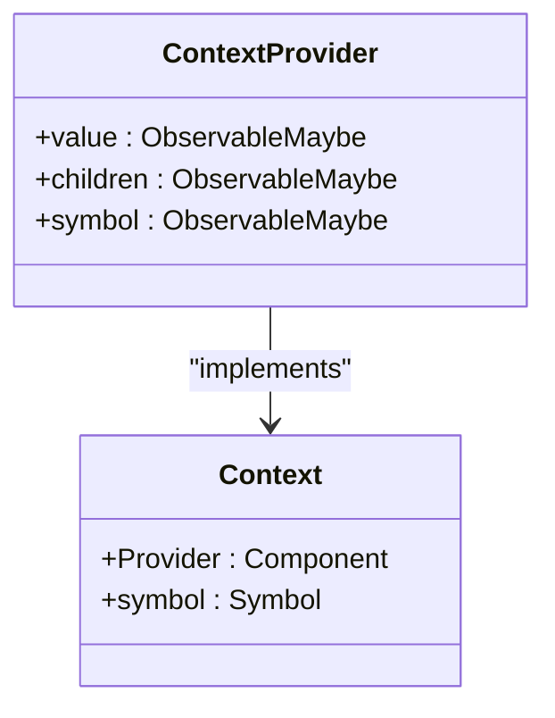
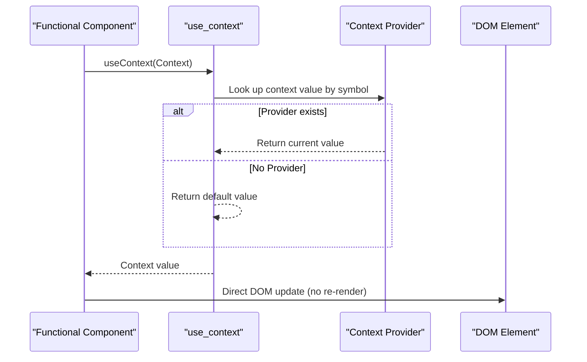
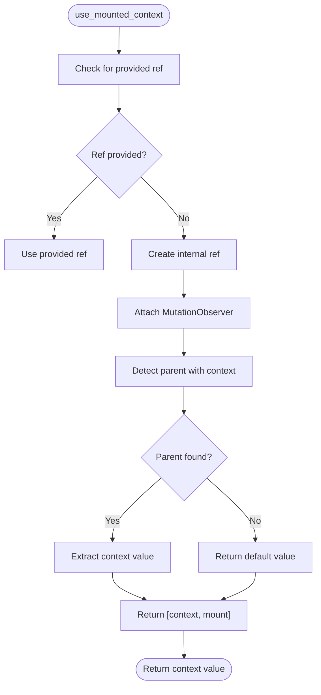

# Context and Lifecycle

<cite>
**Referenced Files in This Document**   
- [create_context.tsx](file://src/methods/create_context.tsx)
- [use_context.ts](file://src/hooks/use_context.ts)
- [use_mounted_context.ts](file://src/hooks/use_mounted_context.ts)
- [use_attached.ts](file://src/hooks/use_attached.ts)
- [suspense.context.ts](file://src/components/suspense.context.ts)
</cite>

## Table of Contents
1. [Introduction](#introduction)
2. [Context API Overview](#context-api-overview)
3. [use_context: Reactive Context Propagation](#use_context-reactive-context-propagation)
4. [use_mounted and use_mounted_context: Lifecycle Detection](#use_mounted-and-use_mounted_context-lifecycle-detection)
5. [Practical Examples](#practical-examples)
6. [Server-Side Rendering Considerations](#server-side-rendering-considerations)
7. [Performance Benefits and Best Practices](#performance-benefits-and-best-practices)
8. [Conclusion](#conclusion)

## Introduction
Woby's Context and Lifecycle system provides a powerful mechanism for state management and component lifecycle detection. Unlike traditional React-style context APIs that trigger re-renders on value changes, Woby implements a reactive context propagation system that enables direct DOM updates without unnecessary re-renders. This documentation explores the core context and lifecycle features of Woby, including the `use_context`, `use_mounted`, and `use_mounted_context` hooks, and demonstrates how they enable efficient state management across component trees.

**Section sources**
- [create_context.tsx](file://src/methods/create_context.tsx#L0-L133)
- [use_context.ts](file://src/hooks/use_context.ts#L0-L77)

## Context API Overview
Woby's Context API is centered around the `createContext` function, which creates a context object with a Provider component and a unique symbol for internal identification. The API supports both default and undefined values, making it flexible for various use cases. When a Provider is rendered, it establishes a context boundary that descendant components can access through the `useContext` hook.

The context system is designed to work seamlessly with both JSX components and custom elements, providing a unified approach to state sharing. The Provider component uses Woby's observable system to propagate values, storing them on a comment node reference that enables direct DOM access without re-renders.



**Diagram sources**
- [create_context.tsx](file://src/methods/create_context.tsx#L0-L133)

**Section sources**
- [create_context.tsx](file://src/methods/create_context.tsx#L0-L133)

## use_context: Reactive Context Propagation
The `use_context` hook provides access to context values within functional components. Unlike React's context API, which triggers re-renders when context values change, Woby's implementation enables reactive context propagation without re-renders by leveraging direct DOM updates. This is achieved through Woby's underlying observable system, which allows components to subscribe to context changes and update only the affected DOM nodes.

When `use_context` is called, it first attempts to retrieve the context value from the nearest Provider in the component tree. If no Provider is found, it returns the default value specified during context creation, or undefined if no default was provided. The hook uses a symbol-based lookup system to ensure type safety and prevent naming collisions.



**Diagram sources**
- [use_context.ts](file://src/hooks/use_context.ts#L0-L77)
- [create_context.tsx](file://src/methods/create_context.tsx#L0-L133)

**Section sources**
- [use_context.ts](file://src/hooks/use_context.ts#L0-L77)

## use_mounted and use_mounted_context: Lifecycle Detection
Woby provides two hooks for detecting component attachment and managing lifecycle-dependent logic: `use_mounted` and `use_mounted_context`. The `use_mounted` hook returns a ref and an observable boolean indicating whether the component is mounted in the DOM. This is particularly useful for avoiding state updates on unmounted components and for managing side effects.

The `use_mounted_context` hook extends this functionality by providing context access with enhanced support for custom elements. It attempts to retrieve context from the parent element's context property by traversing the DOM tree, falling back to the standard context system for JSX components. This dual approach ensures seamless context access across both JSX/TSX components and custom elements defined in HTML.



**Diagram sources**
- [use_mounted_context.ts](file://src/hooks/use_mounted_context.ts#L0-L113)
- [use_attached.ts](file://src/hooks/use_attached.ts#L0-L209)

**Section sources**
- [use_mounted_context.ts](file://src/hooks/use_mounted_context.ts#L0-L113)
- [use_attached.ts](file://src/hooks/use_attached.ts#L0-L209)

## Practical Examples
### Theme Provider
A common use case for context is theme management. In Woby, a theme provider can be implemented to share theme information across the component tree without triggering re-renders when the theme changes.

```tsx
const ThemeContext = createContext('light')

const App = () => (
  <ThemeContext.Provider value="dark">
    <Toolbar />
  </ThemeContext.Provider>
)

const ThemedButton = () => {
  const theme = useContext(ThemeContext)
  return <button className={theme}>Themed Button</button>
}
```

### Authentication Context
For authentication state, a context can be created with an undefined default value, allowing components to detect whether a user is logged in.

```tsx
const UserContext = createContext<User | undefined>(undefined)

const UserProfile = () => {
  const user = useContext(UserContext)
  if (!user) return <div>Please log in</div>
  return <div>Welcome, {user.name}!</div>
}
```

### Nested Context Scenarios
Woby supports nested context providers, allowing for layered state management. Each Provider creates a new context boundary, and consumers access the nearest Provider's value.

```tsx
const OuterContext = createContext('outer')
const InnerContext = createContext('inner')

const App = () => (
  <OuterContext.Provider value="outer-value">
    <InnerContext.Provider value="inner-value">
      <ConsumerComponent />
    </InnerContext.Provider>
  </OuterContext.Provider>
)
```

**Section sources**
- [create_context.tsx](file://src/methods/create_context.tsx#L0-L133)
- [use_context.ts](file://src/hooks/use_context.ts#L0-L77)

## Server-Side Rendering Considerations
When using context in server-side rendering (SSR) scenarios, developers may encounter context unavailability issues. This occurs because the context state is not automatically serialized and transferred from server to client. Woby addresses this by providing SSR-specific modules and ensuring that context values are properly initialized during hydration.

To mitigate SSR context issues, ensure that context providers are properly configured in both server and client environments, and consider using default values that provide a consistent initial state. Additionally, avoid relying on context values that depend on client-specific information during SSR.

**Section sources**
- [ssr.ts](file://src/ssr.ts#L0-L32)
- [suspense.context.ts](file://src/components/suspense.context.ts#L0-L54)

## Performance Benefits and Best Practices
Woby's context system offers significant performance benefits through its direct DOM update mechanism. By avoiding re-renders when context values change, Woby minimizes unnecessary computation and DOM manipulation, resulting in smoother user experiences and better performance, especially in large component trees.

To maximize performance, follow these best practices:
- Use granular contexts for specific state rather than a single global context
- Avoid unnecessary context updates by memoizing complex values
- Provide default values when appropriate to prevent undefined checks
- Use `use_mounted_context` for custom elements to ensure proper context propagation
- Be mindful of context nesting depth to avoid excessive DOM traversal

The direct DOM update approach also reduces the memory footprint by eliminating the need to maintain multiple component instances during re-renders, making Woby particularly well-suited for applications with deep component hierarchies or frequent state updates.

**Section sources**
- [create_context.tsx](file://src/methods/create_context.tsx#L0-L133)
- [use_context.ts](file://src/hooks/use_context.ts#L0-L77)

## Conclusion
Woby's Context and Lifecycle system provides a robust foundation for state management and component lifecycle detection. By leveraging reactive context propagation without re-renders, Woby offers superior performance compared to traditional context APIs. The combination of `use_context`, `use_mounted`, and `use_mounted_context` hooks enables developers to build efficient, maintainable applications with seamless state sharing across component trees. Whether implementing theme providers, authentication systems, or complex nested contexts, Woby's approach ensures optimal performance and developer experience.