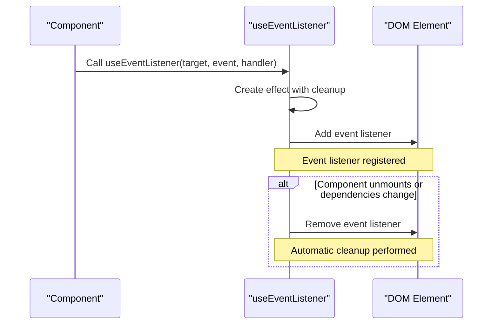
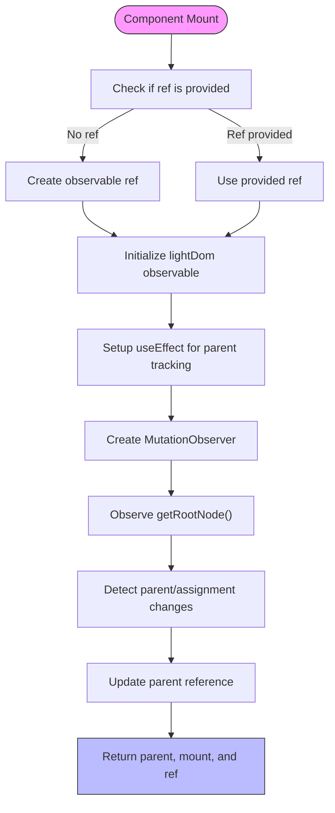
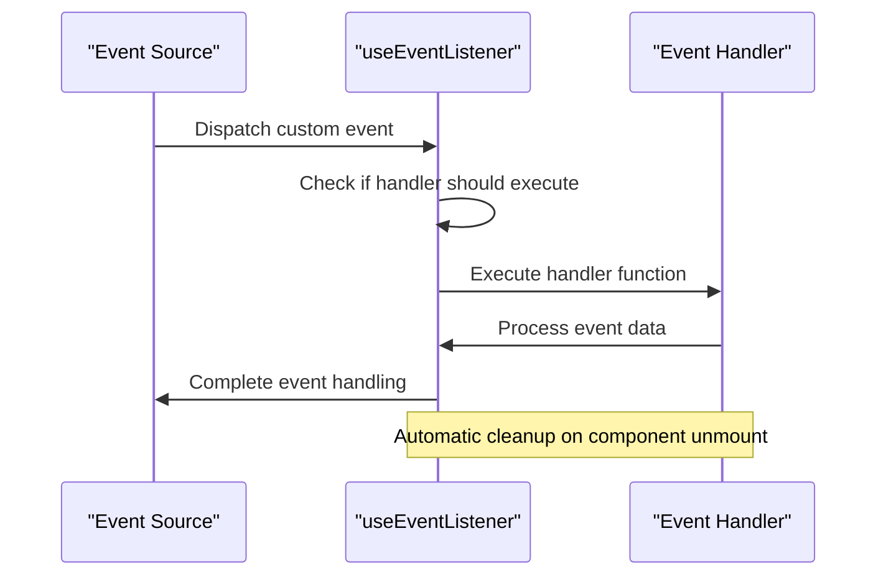
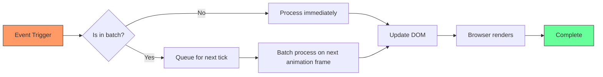
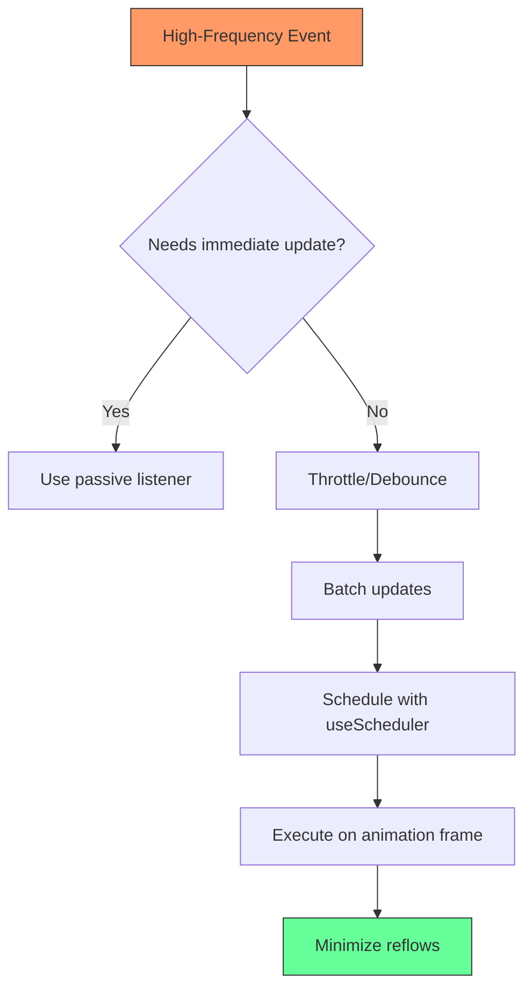

# Event and DOM Hooks

<cite>
**Referenced Files in This Document**   
- [use_event_listener.ts](file://src/hooks/use_event_listener.ts)
- [use_assigned_slot.ts](file://src/hooks/use_assigned_slot.ts)
- [use_scheduler.ts](file://src/hooks/use_scheduler.ts)
- [use_attached.ts](file://src/hooks/use_attached.ts)
- [types.ts](file://src/types.ts)
- [soby.ts](file://src/methods/soby.ts)
- [lang.ts](file://src/utils/lang.ts)
- [use_resolved.ts](file://src/hooks/use_resolved.ts)
</cite>

## Table of Contents
1. [Introduction](#introduction)
2. [Event Listener Management](#event-listener-management)
3. [Shadow DOM and Slot Interaction](#shadow-dom-and-slot-interaction)
4. [DOM Update Scheduling](#dom-update-scheduling)
5. [Usage Patterns](#usage-patterns)
6. [Common Issues and Solutions](#common-issues-and-solutions)
7. [Performance Optimization](#performance-optimization)
8. [Conclusion](#conclusion)

## Introduction
This document provides comprehensive documentation for the Event and DOM Hooks sub-feature in Woby, focusing on DOM interaction capabilities. The framework offers specialized hooks for managing event listeners, working with Shadow DOM and web components, and coordinating DOM updates with the browser's rendering cycle. These hooks are designed to provide safe, efficient, and reactive DOM manipulation while preventing common issues such as memory leaks and timing conflicts.

The documentation covers three primary hooks: `use_event_listener` for safe event subscription management, `use_assigned_slot` for Shadow DOM integration, and `use_scheduler` for coordinating DOM updates. Additionally, it addresses usage patterns for keyboard navigation, drag-and-drop operations, and custom event systems, along with solutions for common DOM interaction challenges.

## Event Listener Management

The `useEventListener` hook provides a safe and automatic way to manage event subscriptions in Woby applications. Unlike traditional event listeners that require manual cleanup, this hook automatically handles the addition and removal of event listeners based on the component's lifecycle, preventing memory leaks from orphaned listeners.

The hook supports a wide range of event targets including Window, Document, HTMLElement, SVGElement, and various specialized browser APIs. It accepts a target element (or array of elements), an event name, an event handler function, and optional event listener options. The implementation leverages Woby's reactivity system to ensure that event listeners are properly cleaned up when components are unmounted or when their dependencies change.



**Diagram sources**
- [use_event_listener.ts](file://src/hooks/use_event_listener.ts#L0-L95)
- [use_resolved.ts](file://src/hooks/use_resolved.ts#L0-L100)

**Section sources**
- [use_event_listener.ts](file://src/hooks/use_event_listener.ts#L0-L95)
- [types.ts](file://src/types.ts#L0-L799)

## Shadow DOM and Slot Interaction

The `use_assigned_slot` hook enables interaction with Shadow DOM and web components by providing access to assigned slots. This functionality is essential for creating reusable web components that can accept content projection through slots, allowing parent components to inject content into specific locations within the shadow tree.

The hook works in conjunction with `use_attached` to track parent elements and detect when nodes are assigned to slots. It uses MutationObserver to monitor changes in the DOM structure, ensuring that the component can react to dynamic content insertion and removal. This approach allows for reactive updates when slot content changes, maintaining the connection between light DOM content and shadow DOM rendering.



**Diagram sources**
- [use_assigned_slot.ts](file://src/hooks/use_assigned_slot.ts#L0-L99)
- [use_attached.ts](file://src/hooks/use_attached.ts#L30-L104)

**Section sources**
- [use_assigned_slot.ts](file://src/hooks/use_assigned_slot.ts#L0-L99)
- [use_attached.ts](file://src/hooks/use_attached.ts#L30-L209)

## DOM Update Scheduling

The `useScheduler` hook coordinates DOM updates with the browser's rendering cycle, ensuring that operations are performed at optimal times for performance and visual consistency. This hook is particularly useful for animations, transitions, and other time-sensitive DOM manipulations that need to align with the browser's refresh rate.

The implementation uses Woby's effect system to manage the scheduling lifecycle, with options to control whether the scheduler runs once or in a loop. It integrates with the framework's suspension system to pause scheduling when components are suspended, preventing unnecessary computations. The hook accepts a scheduling function (such as requestAnimationFrame), a cancellation function, and a callback to execute on each tick, providing a flexible interface for various scheduling needs.

```mermaid
classDiagram
class useScheduler {
+loop : FunctionMaybe<boolean>
+once : boolean
+callback : ObservableMaybe<FN<[U]>>
+cancel : FN<[T]>
+schedule : ((callback : FN<[U]>) => T)
+stack : Stack
-executed : boolean
-suspended : Observable<boolean>
-tickId : T
+work(value : U) : void
+tick() : void
+dispose() : void
}
class useEffect {
+fn : EffectFunction
+options : EffectOptions
}
class useSuspended {
+stack : Stack
+() : boolean
}
useScheduler --> useEffect : "uses for lifecycle management"
useScheduler --> useSuspended : "checks suspension status"
useScheduler ..> "Disposer" : "returns cleanup function"
```

**Diagram sources**
- [use_scheduler.ts](file://src/hooks/use_scheduler.ts#L0-L52)
- [soby.ts](file://src/hooks/soby.ts#L0-L10)

**Section sources**
- [use_scheduler.ts](file://src/hooks/use_scheduler.ts#L0-L52)
- [soby.ts](file://src/hooks/soby.ts#L0-L10)

## Usage Patterns

### Keyboard Navigation
For implementing keyboard navigation, the `useEventListener` hook can be used to capture keyboard events on specific elements or globally. By setting up listeners for keydown events and checking the keyCode or key property, components can respond to keyboard input for accessibility and enhanced user interaction.

### Drag-and-Drop Operations
Drag-and-drop functionality can be implemented using the `useEventListener` hook to manage the various drag events (dragstart, dragover, drop, etc.). The hook ensures that event listeners are properly cleaned up when components unmount, preventing memory leaks that commonly occur with drag-and-drop implementations.

### Custom Event Systems
The framework supports creating custom event systems by combining `useEventListener` with custom event dispatching. Components can listen for custom events and respond appropriately, enabling decoupled communication between different parts of an application.



**Diagram sources**
- [use_event_listener.ts](file://src/hooks/use_event_listener.ts#L0-L95)
- [types.ts](file://src/types.ts#L0-L799)

**Section sources**
- [use_event_listener.ts](file://src/hooks/use_event_listener.ts#L0-L95)
- [types.ts](file://src/types.ts#L0-L799)

## Common Issues and Solutions

### Event Delegation
While Woby's event system handles most event management automatically, complex scenarios may require explicit event delegation. The framework's underlying implementation includes delegation patterns for certain events to optimize performance, but developers should be aware of the implications when working with deeply nested components.

### Memory Leaks from Orphaned Listeners
The primary solution to memory leaks is the automatic cleanup provided by `useEventListener`. By tying event listener lifecycle to the component's effect system, the framework ensures that listeners are removed when components are unmounted or when their dependencies change, eliminating a common source of memory leaks.

### Timing Conflicts with Rendering
Timing conflicts between DOM updates and rendering can be addressed using the `useScheduler` hook, which coordinates updates with the browser's rendering cycle. This ensures that DOM manipulations occur at optimal times, preventing layout thrashing and improving performance.



**Diagram sources**
- [use_scheduler.ts](file://src/hooks/use_scheduler.ts#L0-L52)
- [use_event_listener.ts](file://src/hooks/use_event_listener.ts#L0-L95)

**Section sources**
- [use_scheduler.ts](file://src/hooks/use_scheduler.ts#L0-L52)
- [use_event_listener.ts](file://src/hooks/use_event_listener.ts#L0-L95)

## Performance Optimization

### High-Frequency Events
For high-frequency events like scroll or resize, it's recommended to use passive event listeners when possible and to implement throttling or debouncing patterns. The `useEventListener` hook supports the standard AddEventListenerOptions, allowing developers to specify passive listeners to improve scroll performance.

### Batch DOM Operations
When performing multiple DOM operations, batch them together to minimize layout thrashing. The `useScheduler` hook can be used to coordinate these operations with the browser's rendering cycle, ensuring they occur at optimal times. Additionally, Woby's reactivity system can batch updates automatically when appropriate.



**Diagram sources**
- [use_scheduler.ts](file://src/hooks/use_scheduler.ts#L0-L52)
- [use_event_listener.ts](file://src/hooks/use_event_listener.ts#L0-L95)

**Section sources**
- [use_scheduler.ts](file://src/hooks/use_scheduler.ts#L0-L52)
- [use_event_listener.ts](file://src/hooks/use_event_listener.ts#L0-L95)

## Conclusion
The Event and DOM Hooks in Woby provide a comprehensive solution for managing DOM interactions in reactive applications. The `useEventListener` hook ensures safe event subscription management with automatic cleanup, preventing memory leaks. The `use_assigned_slot` hook enables effective working with Shadow DOM and web components, supporting slot-based layouts and content projection. The `useScheduler` hook coordinates DOM updates with the browser's rendering cycle, optimizing performance for animations and time-sensitive operations.

These hooks address common issues such as event delegation, memory leaks from orphaned listeners, and timing conflicts with rendering, while providing performance optimization capabilities for high-frequency events and batch DOM operations. By leveraging these tools, developers can create responsive, efficient, and maintainable web applications with proper DOM interaction patterns.