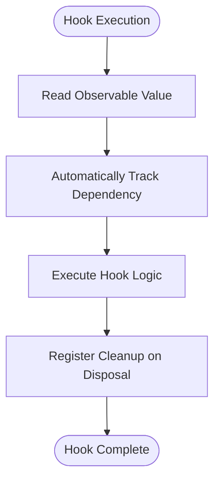
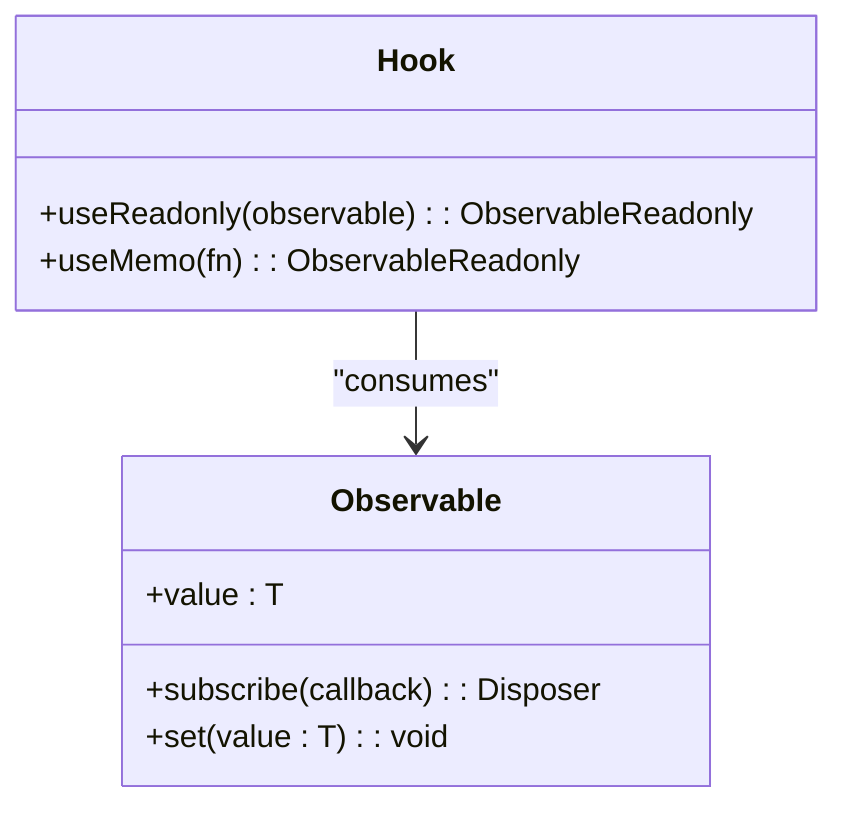
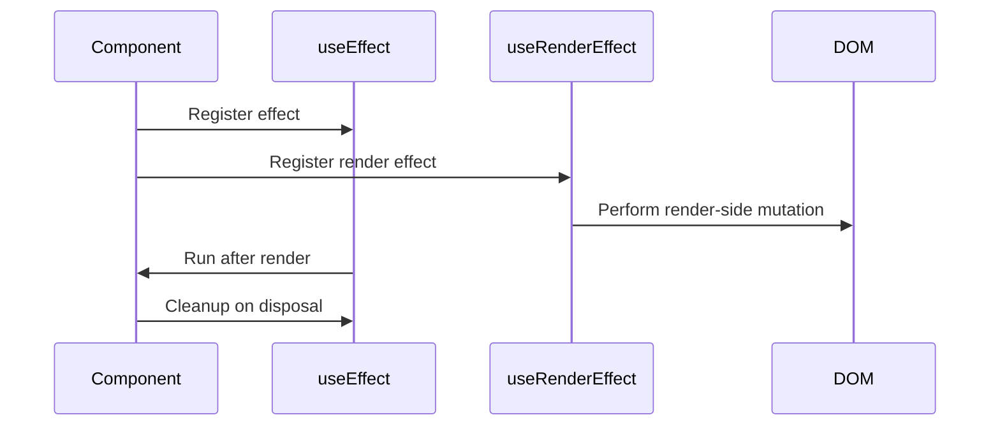
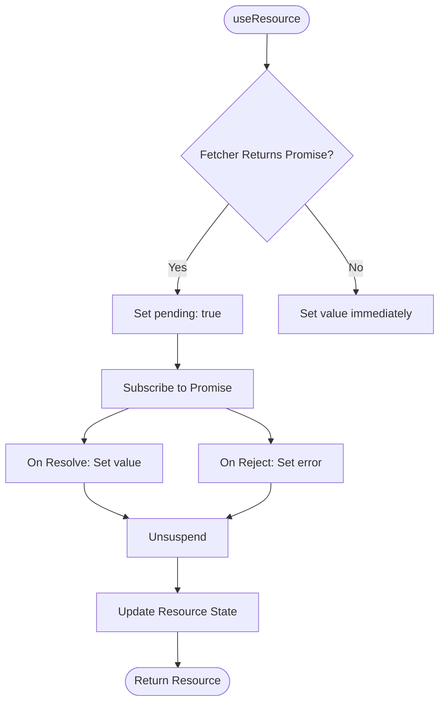
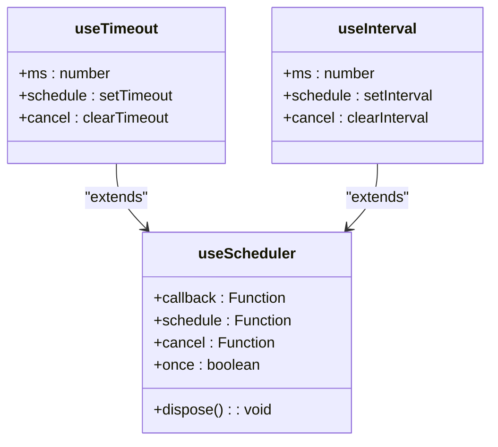

# Hooks API

<cite>
**Referenced Files in This Document**   
- [use_resource.ts](file://src/hooks/use_resource.ts)
- [use_render_effect.ts](file://src/hooks/use_render_effect.ts)
- [use_timeout.ts](file://src/hooks/use_timeout.ts)
- [use_interval.ts](file://src/hooks/use_interval.ts)
- [use_scheduler.ts](file://src/hooks/use_scheduler.ts)
- [soby.ts](file://src/hooks/soby.ts)
- [types.ts](file://src/types.ts)
- [soby.ts](file://src/soby.ts)
- [methods/soby.ts](file://src/methods/soby.ts)
- [suspense.manager.ts](file://src/components/suspense.manager.ts)
- [use_cheap_disposed.ts](file://src/hooks/use_cheap_disposed.ts)
</cite>

## Table of Contents
1. [Introduction](#introduction)
2. [Core Principles of Woby Hooks](#core-principles-of-woby-hooks)
3. [State Management with Observables](#state-management-with-observables)
4. [Side Effects with useEffect and useRenderEffect](#side-effects-with-useeffect-and-userendereffect)
5. [Resource Loading with useResource](#resource-loading-with-useresource)
6. [Timing Functions: useTimeout and useInterval](#timing-functions-usetimeout-and-useinterval)
7. [Hook Composition and Nesting Patterns](#hook-composition-and-nesting-patterns)
8. [Performance Considerations](#performance-considerations)
9. [Debugging Tips for Hook Usage](#debugging-tips-for-hook-usage)
10. [Common Patterns and Anti-Patterns](#common-patterns-and-anti-patterns)

## Introduction
Woby's reactivity hooks system provides a powerful and flexible way to manage state, side effects, and asynchronous operations in functional components. Unlike React, Woby hooks do not require dependency arrays and support conditional calling, enabling more dynamic and expressive component logic. Built on top of the `soby` reactivity engine, Woby hooks leverage observables for fine-grained reactivity, ensuring efficient updates and minimal re-renders. This document explores the core hooks available in Woby, their implementation details, and best practices for effective usage.

## Core Principles of Woby Hooks
Woby hooks diverge from traditional React-style hooks by eliminating the need for dependency arrays and allowing conditional execution. This is made possible through Woby’s underlying observable-based reactivity system, which automatically tracks dependencies during execution. When a hook reads an observable value, it becomes implicitly dependent on that value, eliminating the need for manual dependency declaration. This enables developers to write more natural and readable code without the risk of stale closures or missing dependencies.

Conditional calling of hooks is fully supported, as the reactivity system tracks which hooks are active based on runtime conditions. This allows for dynamic logic within components without violating the rules of hooks. The system ensures proper cleanup and disposal of resources when hooks are no longer used, maintaining consistency and preventing memory leaks.

**Diagram sources**
- [soby.ts](file://src/soby.ts)
- [methods/soby.ts](file://src/methods/soby.ts)

**Section sources**
- [soby.ts](file://src/hooks/soby.ts)
- [types.ts](file://src/types.ts)

## State Management with Observables
In Woby, state management is centered around observables, which are reactive values that automatically notify subscribers when changed. The equivalent of React’s `useState` is achieved using the `$` function from `soby`, which creates a writable observable. This observable can be read and updated, with any component or effect that accesses it automatically re-running when the value changes.

Observables can be composed and transformed using utility functions like `useMemo`, `useReadonly`, and `useSelector`, enabling derived state and optimized computations. The reactivity system ensures that only the minimal necessary updates occur, improving performance compared to full component re-renders.

**Diagram sources**
- [soby.ts](file://src/soby.ts)
- [methods/soby.ts](file://src/methods/soby.ts)

**Section sources**
- [soby.ts](file://src/soby.ts)
- [methods/soby.ts](file://src/methods/soby.ts)
- [types.ts](file://src/types.ts)

## Side Effects with useEffect and useRenderEffect
Woby provides two primary hooks for managing side effects: `useEffect` and `useRenderEffect`. The `useEffect` hook runs after the component has been rendered and is suitable for general side effects like logging, analytics, or DOM manipulation. It accepts a function that may return a cleanup function to run when the effect is disposed.

The `useRenderEffect` hook is a specialized version that ensures execution during the render phase, making it ideal for operations that must complete before the next render. It internally uses `useEffect` with specific options to control timing and is often used in conjunction with suspense and resource loading.

**Diagram sources**
- [use_render_effect.ts](file://src/hooks/use_render_effect.ts)
- [soby.ts](file://src/hooks/soby.ts)

**Section sources**
- [use_render_effect.ts](file://src/hooks/use_render_effect.ts)
- [soby.ts](file://src/hooks/soby.ts)

## Resource Loading with useResource
The `useResource` hook enables declarative loading of asynchronous data, integrating seamlessly with Woby’s suspense system. It accepts a fetcher function that returns a value or a promise and returns a resource object with `pending`, `error`, `value`, and `latest` properties. During loading, the hook suspends rendering by calling `suspend()` from the `SuspenseManager`, allowing parent suspense boundaries to handle loading states.

Once the promise resolves or rejects, the hook updates the internal observables and transitions the resource state accordingly. The implementation uses `useRenderEffect` to ensure the fetcher runs at the correct time and `useCheapDisposed` to prevent state updates after unmounting.

**Diagram sources**
- [use_resource.ts](file://src/hooks/use_resource.ts)
- [suspense.manager.ts](file://src/components/suspense.manager.ts)
- [use_cheap_disposed.ts](file://src/hooks/use_cheap_disposed.ts)

**Section sources**
- [use_resource.ts](file://src/hooks/use_resource.ts)

## Timing Functions: useTimeout and useInterval
Woby provides `useTimeout` and `useInterval` hooks for managing time-based operations. Both hooks are built on top of the `useScheduler` utility, which abstracts the scheduling logic and ensures proper cleanup. These hooks accept a callback and an optional delay, returning a disposer function to cancel the timer.

The `useScheduler` hook handles the lifecycle of scheduled tasks, including suspension awareness and one-time execution for timeouts. It uses `untrack` to prevent the scheduler from being tracked by outer effects, ensuring consistent behavior.

**Diagram sources**
- [use_timeout.ts](file://src/hooks/use_timeout.ts)
- [use_interval.ts](file://src/hooks/use_interval.ts)
- [use_scheduler.ts](file://src/hooks/use_scheduler.ts)

**Section sources**
- [use_timeout.ts](file://src/hooks/use_timeout.ts)
- [use_interval.ts](file://src/hooks/use_interval.ts)
- [use_scheduler.ts](file://src/hooks/use_scheduler.ts)

## Hook Composition and Nesting Patterns
Woby encourages the composition of hooks to build higher-level abstractions. Custom hooks can combine multiple primitive hooks to encapsulate complex logic, such as data fetching with caching, form handling, or animation controllers. Since hooks are functions, they can be nested and reused across components without limitations.

A common pattern is to return observables and disposers from custom hooks, allowing consumers to integrate them seamlessly into their components. Hook composition enhances readability and maintainability by isolating concerns and promoting reusability.

## Performance Considerations
Woby’s observable-based reactivity ensures that only affected components update when state changes, minimizing unnecessary renders. However, developers should still be mindful of expensive computations within effects or renderers. Using `useMemo` and `useReadonly` can help optimize derived state, while `untrack` can prevent unwanted reactivity in specific scenarios.

Avoid creating new observables or functions inside effects unless necessary, as this can lead to memory leaks or excessive re-execution. Always return a cleanup function from `useEffect` when setting up subscriptions or timers.

## Debugging Tips for Hook Usage
When debugging hook behavior, leverage the `stack` parameter passed to effects, which captures the call stack for tracing. Use `useCleanup` to log disposal events and verify that resources are properly released. For asynchronous issues, inspect the `suspended` state using `useSuspended` to understand if a component is blocked by suspense.

Enable development mode warnings if available, and use observables with debug labels when possible to trace reactivity chains.

## Common Patterns and Anti-Patterns
**Patterns:**
- Use `useResource` for declarative data fetching
- Compose hooks to encapsulate logic
- Leverage `useReadonly` to expose immutable state
- Clean up side effects with returned disposers

**Anti-Patterns:**
- Avoid recreating observables on every render
- Do not ignore returned disposers from hooks
- Never mutate observables outside of actions
- Avoid deep nesting of effects without proper cleanup