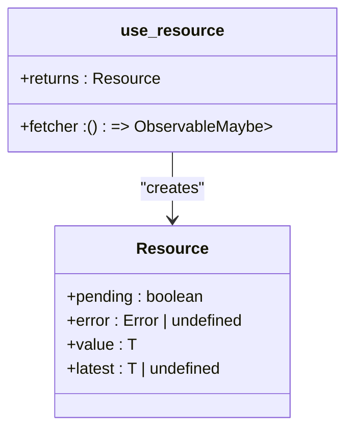
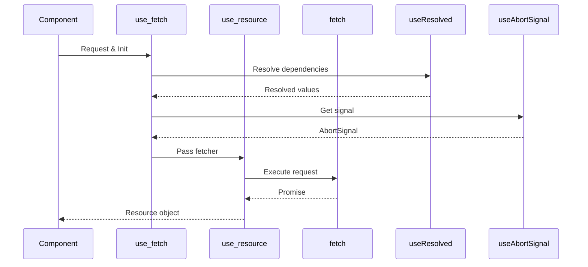
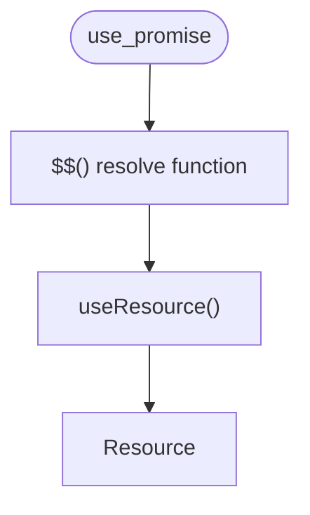
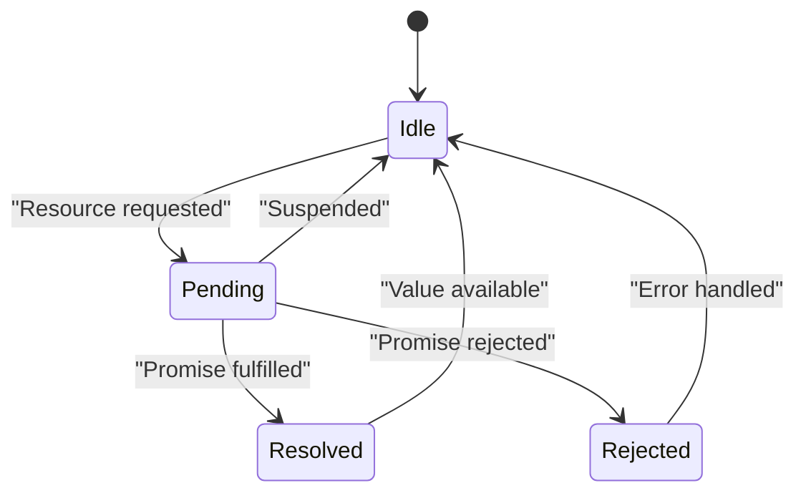
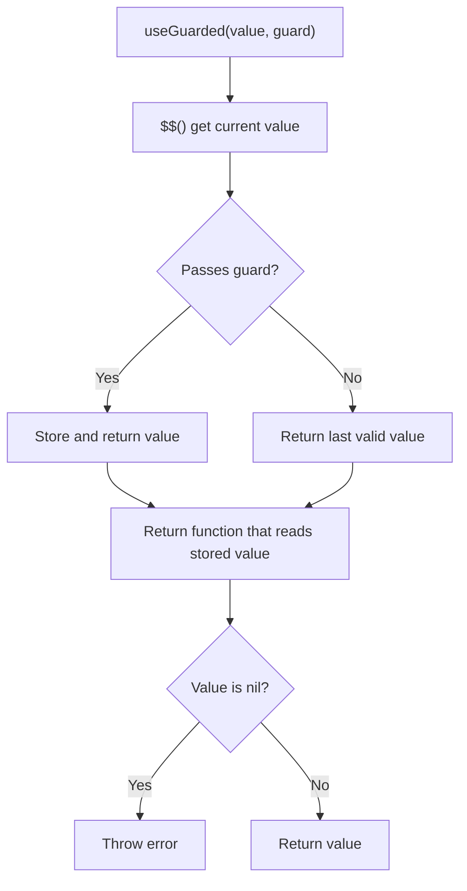
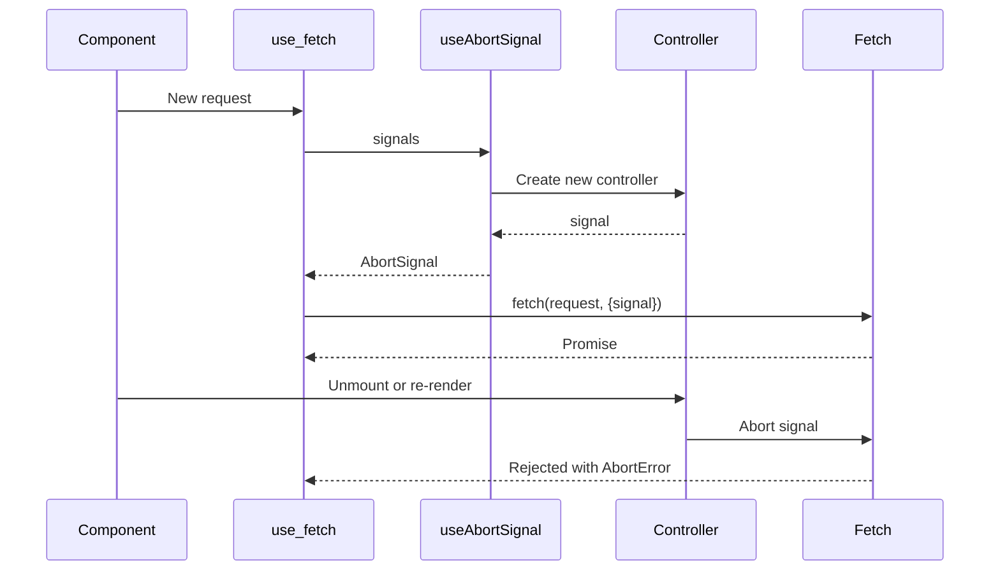

# Resource Loading

<cite>
**Referenced Files in This Document**   
- [use_resource.ts](file://src/hooks/use_resource.ts)
- [use_fetch.ts](file://src/hooks/use_fetch.ts)
- [use_promise.ts](file://src/hooks/use_promise.ts)
- [use_guarded.ts](file://src/hooks/use_guarded.ts)
- [use_abort_signal.ts](file://src/hooks/use_abort_signal.ts)
- [suspense.manager.ts](file://src/components/suspense.manager.ts)
- [use_cheap_disposed.ts](file://src/hooks/use_cheap_disposed.ts)
- [use_render_effect.ts](file://src/hooks/use_render_effect.ts)
- [soby.ts](file://src/methods/soby.ts)
- [lang.ts](file://src/utils/lang.ts)
</cite>

## Table of Contents
1. [Introduction](#introduction)
2. [Core Resource Hooks](#core-resource-hooks)
3. [Declarative Data Loading with Suspense](#declarative-data-loading-with-suspense)
4. [Caching, Refetching, and Error Handling](#caching-refetching-and-error-handling)
5. [Composing Multiple Resources](#composing-multiple-resources)
6. [Safe Access with use_guarded](#safe-access-with-use_guarded)
7. [Managing Race Conditions and Cancellation](#managing-race-conditions-and-cancellation)
8. [Performance Optimization and Caching Strategies](#performance-optimization-and-caching-strategies)
9. [Conclusion](#conclusion)

## Introduction
Woby provides a robust set of hooks for declarative resource loading, enabling seamless integration with Suspense for asynchronous data handling. This document details the implementation and usage patterns of `use_resource`, `use_fetch`, `use_promise`, `use_guarded`, and `use_abort_signal` to manage asynchronous operations efficiently. These hooks abstract complexity around loading states, error handling, cancellation, and memory management, offering a clean API for data fetching and state resolution.

**Section sources**
- [use_resource.ts](file://src/hooks/use_resource.ts#L1-L105)
- [use_fetch.ts](file://src/hooks/use_fetch.ts#L1-L25)

## Core Resource Hooks

### use_resource
The `use_resource` hook is the foundational primitive for managing asynchronous resources in Woby. It wraps a fetcher function that returns either a value or a promise, and provides a reactive resource object with `pending`, `error`, `value`, and `latest` properties. The hook integrates with Woby’s Suspense system by suspending rendering when data is pending and resuming once resolved.

It leverages `useRenderEffect` to ensure side effects run at the appropriate time during rendering, and uses `useCheapDisposed` to prevent state updates on unmounted components, avoiding memory leaks.



**Diagram sources**
- [use_resource.ts](file://src/hooks/use_resource.ts#L15-L105)

**Section sources**
- [use_resource.ts](file://src/hooks/use_resource.ts#L15-L105)

### use_fetch
This hook builds on `use_resource` to provide a declarative interface for making HTTP requests using the Fetch API. It automatically handles request initialization, integrates with `useAbortSignal` for cancellation, and ensures proper signal propagation to prevent race conditions.

The `useResolved` hook is used to reactively resolve both the request and init parameters before invoking `fetch`, ensuring that changes in dependencies trigger refetching.



**Diagram sources**
- [use_fetch.ts](file://src/hooks/use_fetch.ts#L1-L25)
- [use_resource.ts](file://src/hooks/use_resource.ts#L15-L105)

**Section sources**
- [use_fetch.ts](file://src/hooks/use_fetch.ts#L1-L25)

### use_promise
A lightweight wrapper around `use_resource` that accepts a promise directly. It simplifies the handling of already-created promises by wrapping them into the standard resource interface, enabling consistent Suspense integration across different async sources.



**Diagram sources**
- [use_promise.ts](file://src/hooks/use_promise.ts#L1-L10)

**Section sources**
- [use_promise.ts](file://src/hooks/use_promise.ts#L1-L10)

## Declarative Data Loading with Suspense

Woby’s resource hooks are designed to work seamlessly with Suspense. When a resource is pending, the `use_resource` implementation calls `suspend()` via the `SuspenseManager`, which increments the suspense counter in the current `SuspenseContext`. This causes the nearest `<Suspense>` boundary to display its fallback content.

Once the promise resolves or rejects, `unsuspend()` is called to decrement the counter, allowing rendering to continue.



**Diagram sources**
- [use_resource.ts](file://src/hooks/use_resource.ts#L15-L105)
- [suspense.manager.ts](file://src/components/suspense.manager.ts#L1-L67)

**Section sources**
- [use_resource.ts](file://src/hooks/use_resource.ts#L15-L105)
- [suspense.manager.ts](file://src/components/suspense.manager.ts#L1-L67)

## Caching, Refetching, and Error Handling

### Caching Behavior
Woby does not implement automatic caching at the hook level. Instead, caching is left to external mechanisms or memoization techniques. However, the `latest` property in the resource object retains the most recent successfully resolved value even during pending states, providing a stable reference for optimistic UI updates.

### Refetching
Refetching is achieved by changing the dependencies of the fetcher function. Since `use_resource` runs inside `useRenderEffect`, any change in reactive dependencies will re-execute the fetcher, initiating a new request.

### Error Handling
Errors are captured and exposed through the `error` property of the resource. The `castError` utility ensures that non-Error values are wrapped in an Error instance for consistency. In rejected state, accessing `value` throws the error, aligning with Suspense semantics.

```mermaid
flowchart TD
A[Fetcher Called] --> B{Is Promise?}
B --> |Yes| C[Set pending: true]
C --> D[Attach .then/.catch]
D --> E[Resolve: set value]
D --> F[Reject: set error]
B --> |No| G[Set value directly]
E --> H[unsuspend()]
F --> H
G --> H
```

**Diagram sources**
- [use_resource.ts](file://src/hooks/use_resource.ts#L15-L105)
- [lang.ts](file://src/utils/lang.ts#L1-L221)

**Section sources**
- [use_resource.ts](file://src/hooks/use_resource.ts#L15-L105)

## Composing Multiple Resources

Multiple resources can be composed using standard reactive patterns. Since each resource is an observable, they can be combined within a `useMemo` or similar derivation hook to produce computed state based on several async sources.

For parallel loading, each `use_resource` call operates independently. For sequential dependencies, later resources can depend on the resolved value of earlier ones, naturally creating dependency chains.

**Section sources**
- [use_resource.ts](file://src/hooks/use_resource.ts#L15-L105)
- [use_promise.ts](file://src/hooks/use_promise.ts#L1-L10)

## Safe Access with use_guarded

The `use_guarded` hook enables type-safe access to values that may not satisfy a type guard. It returns a function that throws if the value fails the guard, ensuring that downstream code can assume the guarded type.

This is particularly useful when working with unresolved resources where certain properties may only exist after validation.



**Diagram sources**
- [use_guarded.ts](file://src/hooks/use_guarded.ts#L1-L37)

**Section sources**
- [use_guarded.ts](file://src/hooks/use_guarded.ts#L1-L37)

## Managing Race Conditions and Cancellation

### Race Conditions
Without proper cleanup, rapid successive calls to async operations can result in outdated responses overwriting newer ones. Woby mitigates this via `useCheapDisposed`, which tracks component disposal and prevents state updates on unmounted components.

### Cancellation with use_abort_signal
The `useAbortSignal` hook composes multiple `AbortSignal`s and integrates with `useAbortController` to generate a fresh signal per render cycle. This allows ongoing fetch operations to be cancelled when dependencies change or the component unmounts.

When used with `use_fetch`, the generated signal is passed to `fetch`, enabling native request cancellation.



**Diagram sources**
- [use_abort_signal.ts](file://src/hooks/use_abort_signal.ts#L1-L11)
- [use_fetch.ts](file://src/hooks/use_fetch.ts#L1-L25)

**Section sources**
- [use_abort_signal.ts](file://src/hooks/use_abort_signal.ts#L1-L11)
- [use_cheap_disposed.ts](file://src/hooks/use_cheap_disposed.ts#L1-L17)

## Performance Optimization and Caching Strategies

### Avoiding Unnecessary Re-fetches
Ensure fetcher functions are stable or properly memoized using `useMemo` when they depend on external values. This prevents unintended refetching due to function identity changes.

### Leveraging latest for Smoother UX
Use the `latest` property to maintain UI continuity during loading states, showing stale data while fresh data loads—ideal for polling or refresh scenarios.

### Memory Leak Prevention
All resource hooks use `useCleanup` and disposal checks (`useCheapDisposed`) to prevent state updates on unmounted components, eliminating common sources of memory leaks.

### Efficient Signal Management
`useAbortSignal` efficiently manages signal lifecycle by tying it to the component’s render effect, ensuring cancellation on unmount or re-render.

**Section sources**
- [use_resource.ts](file://src/hooks/use_resource.ts#L15-L105)
- [use_abort_signal.ts](file://src/hooks/use_abort_signal.ts#L1-L11)
- [use_cheap_disposed.ts](file://src/hooks/use_cheap_disposed.ts#L1-L17)

## Conclusion
Woby’s resource loading system offers a powerful, declarative approach to handling asynchronous data with built-in Suspense support. By combining `use_resource`, `use_fetch`, `use_promise`, and `use_guarded`, developers can build robust, type-safe, and efficient data loading logic. The integration of `useAbortSignal` and disposal tracking ensures that applications remain responsive and free from race conditions and memory leaks. With proper usage patterns, these hooks enable high-performance, maintainable async workflows.