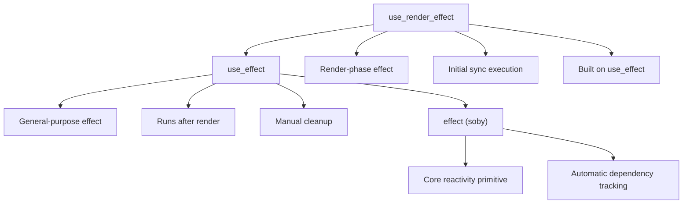
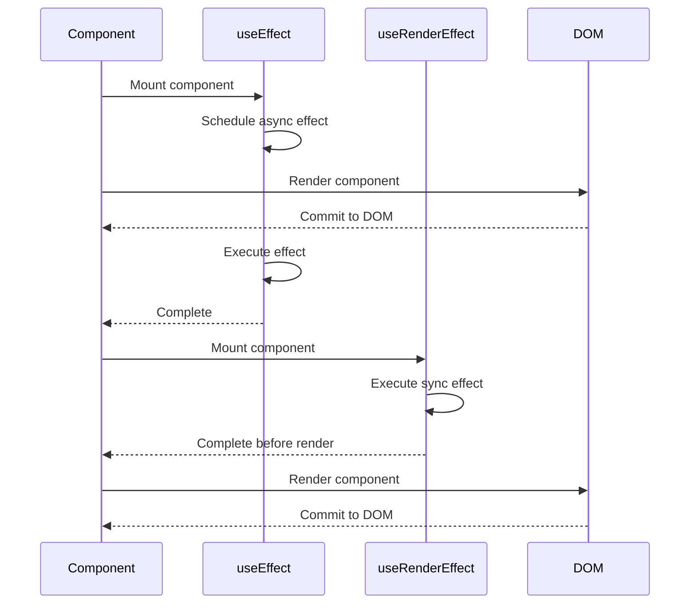
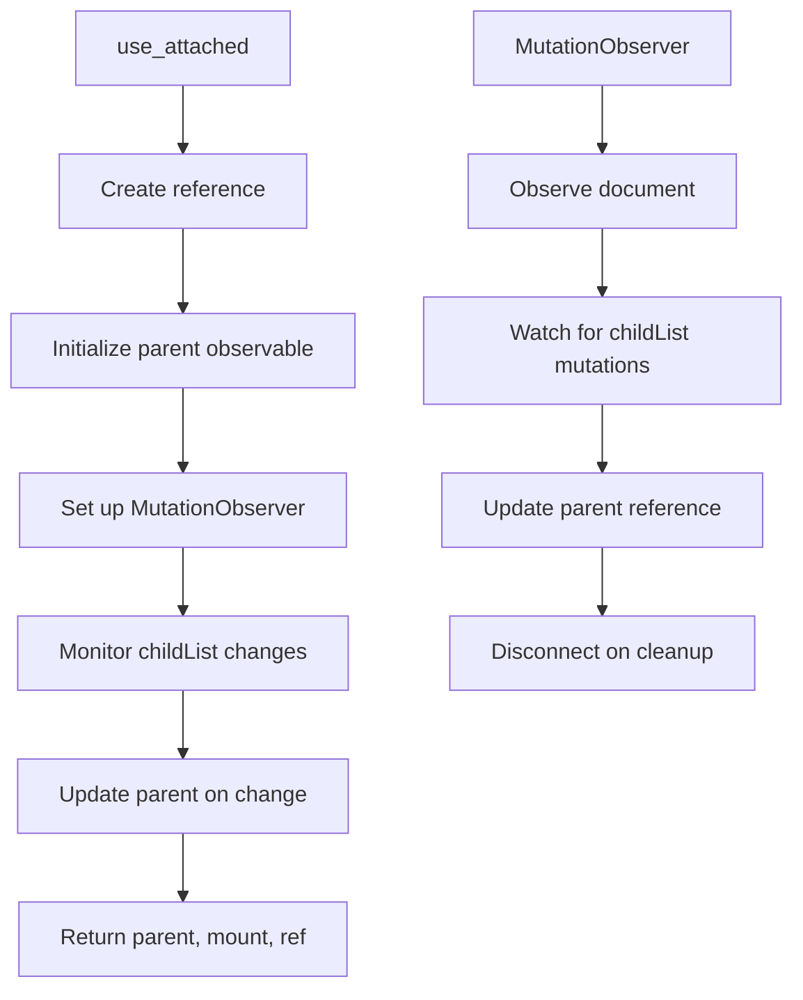
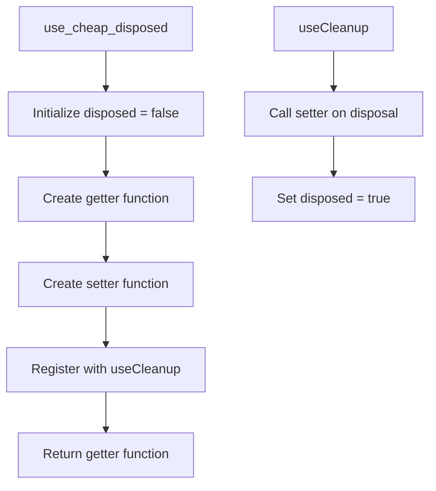
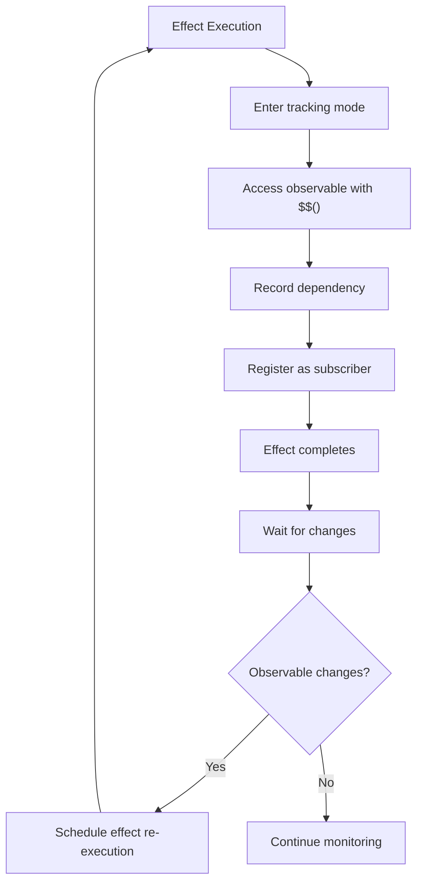
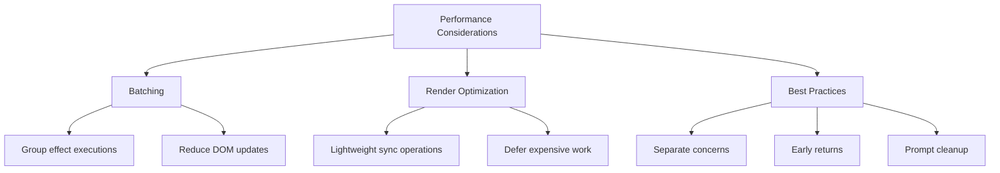

# Side Effects

<cite>
**Referenced Files in This Document**   
- [use_effect.ts](file://src/hooks/use_effect.ts)
- [use_render_effect.ts](file://src/hooks/use_render_effect.ts)
- [use_attached.ts](file://src/hooks/use_attached.ts)
- [use_cheap_disposed.ts](file://src/hooks/use_cheap_disposed.ts)
- [soby.ts](file://src/hooks/soby.ts)
- [types.ts](file://src/types.ts)
- [soby.ts](file://src/soby.ts)
</cite>

## Table of Contents
1. [Introduction](#introduction)
2. [Core Effect Hooks](#core-effect-hooks)
3. [use_effect vs use_render_effect](#use_effect-vs-use_render_effect)
4. [Automatic Effect Tracking and Disposal](#automatic-effect-tracking-and-disposal)
5. [Effect Cleanup and Conditional Execution](#effect-cleanup-and-conditional-execution)
6. [Integration with External Systems](#integration-with-external-systems)
7. [Automatic Dependency Tracking](#automatic-dependency-tracking)
8. [Common Pitfalls and Debugging](#common-pitfalls-and-debugging)
9. [Performance Considerations](#performance-considerations)
10. [Conclusion](#conclusion)

## Introduction
Woby's effect management system provides a robust mechanism for handling side effects in reactive components. Unlike traditional frameworks that rely on dependency arrays, Woby leverages automatic dependency tracking to simplify effect management. This document explores the core effect hooks, their execution timing, and best practices for managing side effects in Woby applications.

**Section sources**
- [use_effect.ts](file://src/hooks/use_effect.ts)
- [use_render_effect.ts](file://src/hooks/use_render_effect.ts)

## Core Effect Hooks

Woby provides two primary effect hooks: `use_effect` and `use_render_effect`. These hooks are built on top of the underlying `effect` function from the `soby` reactivity system, which automatically tracks dependencies and executes effects when those dependencies change.

The `use_effect` hook is the general-purpose effect hook that runs after the component has been rendered and committed to the DOM. It is suitable for most side effects, such as data fetching, subscriptions, and manual DOM mutations.

The `use_render_effect` hook is a specialized version of `use_effect` that is optimized for render-phase operations. It provides a convenient way to run effects with specific timing options, particularly during the initial render phase.



**Diagram sources**
- [use_effect.ts](file://src/hooks/use_effect.ts)
- [use_render_effect.ts](file://src/hooks/use_render_effect.ts)
- [soby.ts](file://src/hooks/soby.ts)

**Section sources**
- [use_effect.ts](file://src/hooks/use_effect.ts)
- [use_render_effect.ts](file://src/hooks/use_render_effect.ts)
- [soby.ts](file://src/hooks/soby.ts)

## use_effect vs use_render_effect

### Execution Timing
The key difference between `use_effect` and `use_render_effect` lies in their execution timing and default options.

`use_effect` runs asynchronously after the component has been rendered and committed to the DOM. This makes it suitable for effects that don't need to block the render process, such as logging, analytics, or non-critical data fetching.

`use_render_effect`, on the other hand, is designed for effects that need to run during the render phase. It uses the `sync: 'init'` option by default, which means the effect will run synchronously during the initial execution. This is particularly useful for effects that need to set up initial state or perform operations that should be completed before the component is fully rendered.

### Use Cases
`use_effect` is appropriate for:
- Data fetching from external APIs
- Setting up subscriptions
- Manually changing the DOM
- Logging and analytics
- Cleanup operations

`use_render_effect` is ideal for:
- Initial setup of component state
- Synchronous operations that must complete before render
- Effects that depend on the initial render being complete
- Operations that need to run immediately during component initialization



**Diagram sources**
- [use_effect.ts](file://src/hooks/use_effect.ts)
- [use_render_effect.ts](file://src/hooks/use_render_effect.ts)

**Section sources**
- [use_effect.ts](file://src/hooks/use_effect.ts)
- [use_render_effect.ts](file://src/hooks/use_render_effect.ts)

## Automatic Effect Tracking and Disposal

### use_attached
The `use_attached` hook provides a mechanism for tracking when a DOM node is attached to the document. It uses a `MutationObserver` to monitor changes in the DOM and update the parent reference when the node is added or removed.

This hook is particularly useful for components that need to respond to their attachment state, such as tooltips, popovers, or other elements that need to position themselves relative to their parent.

The hook returns an object containing:
- `parent`: An observable that tracks the current parent node
- `mount`: A marker function for the attached reference
- `ref`: The reference to the tracked node



**Diagram sources**
- [use_attached.ts](file://src/hooks/use_attached.ts)

**Section sources**
- [use_attached.ts](file://src/hooks/use_attached.ts)

### use_cheap_disposed
The `use_cheap_disposed` hook provides a lightweight mechanism for tracking whether a component has been disposed. It returns a getter function that indicates the disposal state, while internally managing a boolean flag.

This hook is optimized for performance by avoiding the overhead of creating a full observable. Instead, it uses a simple closure variable to track the disposal state, making it "cheap" in terms of memory and performance.

The hook works by:
1. Creating a local `disposed` variable
2. Defining getter and setter functions within a closure
3. Registering the setter as a cleanup function using `useCleanup`
4. Returning the getter function to query the disposal state



**Diagram sources**
- [use_cheap_disposed.ts](file://src/hooks/use_cheap_disposed.ts)
- [soby.ts](file://src/hooks/soby.ts)

**Section sources**
- [use_cheap_disposed.ts](file://src/hooks/use_cheap_disposed.ts)

## Effect Cleanup and Conditional Execution

### Cleanup Mechanisms
Woby's effect system provides automatic cleanup through the return value of effect functions. When an effect function returns a disposal function, that function is automatically called when the effect is re-executed or when the component is unmounted.

This pattern eliminates the need for manual cleanup tracking and ensures that resources are properly released. Common cleanup operations include:
- Clearing timers and intervals
- Canceling subscriptions
- Removing event listeners
- Disconnecting observers

### Conditional Execution
Effects in Woby can be conditionally executed by using early returns within the effect function. This optimization technique allows developers to skip unnecessary work when certain conditions are met.

For example, an effect that processes expensive operations can check if the relevant data has actually changed before proceeding:

```typescript
useEffect(() => {
  if ($$(previousValue) === $$(currentValue)) return
  previousValue($$(currentValue))
  performExpensiveOperation($$(currentValue))
})
```

This approach is more efficient than using dependency arrays to control execution, as it allows for fine-grained control over when effects should run.

**Section sources**
- [use_effect.ts](file://src/hooks/use_effect.ts)
- [use_cheap_disposed.ts](file://src/hooks/use_cheap_disposed.ts)

## Integration with External Systems

Woby's effect hooks can be seamlessly integrated with external systems such as:
- Third-party libraries that require initialization
- Browser APIs (WebSockets, Web Workers, etc.)
- Analytics and monitoring services
- State management systems

When integrating with external systems, it's important to:
1. Set up the connection in the effect
2. Return a cleanup function to properly disconnect
3. Handle errors gracefully
4. Consider the timing requirements of the external system

For example, when integrating with a WebSocket service:

```typescript
useEffect(() => {
  const socket = new WebSocket('ws://example.com')
  
  socket.onmessage = (event) => {
    // Handle message
  }
  
  return () => {
    socket.close()
  }
})
```

**Section sources**
- [use_effect.ts](file://src/hooks/use_effect.ts)
- [use_attached.ts](file://src/hooks/use_attached.ts)

## Automatic Dependency Tracking

### Absence of Dependency Arrays
Unlike React and similar frameworks, Woby does not use dependency arrays to determine when effects should re-run. Instead, it leverages the underlying `soby` reactivity system to automatically track which observables are accessed within an effect.

This approach offers several advantages:
- Eliminates the risk of stale closures due to missing dependencies
- Reduces boilerplate code
- Prevents common bugs related to incorrect dependency arrays
- Simplifies effect management

When an effect accesses an observable using `$$()`, the reactivity system automatically establishes a dependency between the effect and that observable. Any changes to the observable will trigger the effect to re-run.

### Tracking Mechanism
The automatic dependency tracking works through the following process:
1. When an effect is first executed, the reactivity system enters "tracking mode"
2. Any observables accessed via `$$()` during this phase are recorded as dependencies
3. The effect is registered as a subscriber to these observables
4. When any dependency changes, the effect is scheduled for re-execution
5. The process repeats for subsequent executions

This system ensures that effects always have the most up-to-date dependencies without requiring manual specification.



**Diagram sources**
- [use_effect.ts](file://src/hooks/use_effect.ts)
- [soby.ts](file://src/soby.ts)

**Section sources**
- [use_effect.ts](file://src/hooks/use_effect.ts)
- [types.ts](file://src/types.ts)

## Common Pitfalls and Debugging

### Infinite Loops
Infinite loops can occur when an effect both reads and writes to the same observable without proper guards. For example:

```typescript
// ❌ This creates an infinite loop
useEffect(() => {
  const value = $$(counter)
  counter(value + 1) // Modifies the dependency
})
```

To prevent infinite loops:
- Use early returns to skip unnecessary updates
- Store previous values to compare before updating
- Break circular dependencies by restructuring the logic

### Memory Leaks
Memory leaks can occur when cleanup functions are not properly implemented. Common causes include:
- Forgetting to return a cleanup function
- Not disconnecting observers or listeners
- Keeping references to large objects

Best practices to avoid memory leaks:
- Always clean up subscriptions and observers
- Use `use_cheap_disposed` to track component lifecycle
- Regularly audit effect cleanup code

### Debugging Strategies
Effective debugging of effects involves:
- Using console.log statements to trace effect execution
- Checking the dependency graph to understand what triggers effects
- Using browser developer tools to monitor performance
- Writing unit tests for complex effect logic
- Implementing error boundaries to catch effect-related errors

**Section sources**
- [use_effect.ts](file://src/hooks/use_effect.ts)
- [use_cheap_disposed.ts](file://src/hooks/use_cheap_disposed.ts)
- [use_attached.ts](file://src/hooks/use_attached.ts)

## Performance Considerations

### Effect Batching
Woby's reactivity system batches effect executions to optimize performance. When multiple observables change in quick succession, effects are grouped and executed together rather than individually.

This batching behavior:
- Reduces the number of DOM updates
- Minimizes layout thrashing
- Improves overall application performance

Developers should design effects to be idempotent, as they may be batched with other updates.

### Render-Phase Optimization
When using `use_render_effect`, consider the following optimizations:
- Keep initial sync operations lightweight
- Defer expensive computations to async effects
- Use memoization for complex calculations
- Avoid blocking the main thread with long-running operations

For render-critical effects, ensure that the initial sync execution completes quickly to maintain smooth rendering performance.

### Best Practices
General performance best practices for effects include:
- Separating unrelated concerns into individual effects
- Using early returns to skip unnecessary work
- Cleaning up resources promptly
- Minimizing the scope of effect dependencies
- Testing performance with realistic data volumes



**Diagram sources**
- [use_effect.ts](file://src/hooks/use_effect.ts)
- [use_render_effect.ts](file://src/hooks/use_render_effect.ts)

**Section sources**
- [use_effect.ts](file://src/hooks/use_effect.ts)
- [use_render_effect.ts](file://src/hooks/use_render_effect.ts)

## Conclusion
Woby's effect management system offers a powerful and intuitive approach to handling side effects in reactive applications. By eliminating dependency arrays and leveraging automatic dependency tracking, Woby simplifies effect management while reducing common bugs and performance issues.

The distinction between `use_effect` and `use_render_effect` provides flexibility in execution timing, allowing developers to choose the appropriate hook for their specific use case. Combined with robust cleanup mechanisms like `use_attached` and `use_cheap_disposed`, Woby ensures that effects are properly managed throughout the component lifecycle.

By following best practices for effect organization, conditional execution, and performance optimization, developers can create efficient and maintainable Woby applications that respond gracefully to changing data and user interactions.