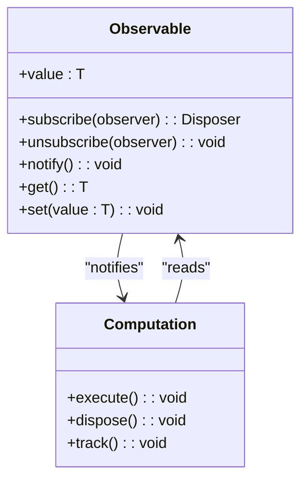
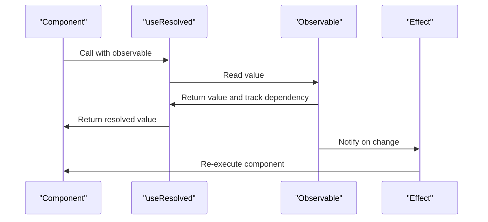

# State Management

<cite>
**Referenced Files in This Document**   
- [soby.ts](file://src/soby.ts)
- [use_resolved.ts](file://src/hooks/use_resolved.ts)
- [types.ts](file://src/types.ts)
- [methods/soby.ts](file://src/methods/soby.ts)
- [hooks/soby.ts](file://src/hooks/soby.ts)
</cite>

## Table of Contents
1. [Introduction](#introduction)
2. [Core State Management Concepts](#core-state-management-concepts)
3. [Observable-Based Reactivity System](#observable-based-reactivity-system)
4. [State Creation and Update Mechanisms](#state-creation-and-update-mechanisms)
5. [Automatic Dependency Tracking](#automatic-dependency-tracking)
6. [Nested State Handling](#nested-state-handling)
7. [Component Integration Patterns](#component-integration-patterns)
8. [Fine-Grained DOM Updates](#fine-grained-dom-updates)
9. [Common Issues and Solutions](#common-issues-and-solutions)
10. [Performance Benefits](#performance-benefits)
11. [Best Practices for Large Applications](#best-practices-for-large-applications)

## Introduction
Woby's state management system is built on an observable-based reactivity model that enables fine-grained updates without the need for dependency arrays. This documentation explores the implementation details of Woby's state system, focusing on how it leverages soby observables to create a highly efficient and responsive application architecture. The system eliminates the need for manual dependency tracking while providing precise control over state changes and their effects on the user interface.

## Core State Management Concepts
Woby's state management is centered around observable values that automatically track dependencies and trigger updates when their values change. Unlike traditional React-style hooks that require dependency arrays to determine when effects should re-run, Woby's system uses a fine-grained reactivity model where computations automatically subscribe to the observables they read.

The core principle is that any function that reads an observable during its execution becomes a subscriber to that observable. When the observable's value changes, all subscribers are automatically notified and re-executed. This eliminates the need for dependency arrays and prevents common issues like stale closures and missed dependencies.

**Section sources**
- [soby.ts](file://src/soby.ts)
- [types.ts](file://src/types.ts)

## Observable-Based Reactivity System
The foundation of Woby's state management is the observable system imported from soby. Observables are created using the `$` function, which serves as the primary mechanism for creating reactive state. When an observable is created, it can be both read and written to, with all reads automatically tracked for dependency management.

The reactivity system works by establishing a connection between producers (observables) and consumers (functions that read those observables). When a consumer function executes and reads one or more observables, it automatically becomes dependent on those observables. Any future changes to the observed values will trigger the consumer function to re-execute, ensuring the UI or computed values stay up to date.

**Diagram sources**
- [soby.ts](file://src/soby.ts)
- [types.ts](file://src/types.ts)

## State Creation and Update Mechanisms
State in Woby is created using the `$` function exported from soby, which creates an observable wrapper around a value. This observable can be read by calling it without arguments or updated by calling it with a new value or an updater function.

When updating state, Woby provides two approaches: direct assignment and functional updates. Direct assignment replaces the current value with a new one, while functional updates receive the current value as a parameter and return the new value, which is useful for updates that depend on the previous state.

The system also supports batched updates through the `batch` function, which groups multiple state changes into a single update cycle. This prevents intermediate states from triggering unnecessary re-renders and improves performance when multiple related state changes occur together.

**Section sources**
- [soby.ts](file://src/soby.ts)
- [methods/soby.ts](file://src/methods/soby.ts)

## Automatic Dependency Tracking
Woby's automatic dependency tracking is implemented through the `useResolved` hook and the underlying observable system. The `useResolved` function analyzes its inputs and automatically resolves observables by subscribing to them during execution. This eliminates the need for manual dependency specification in effects and memos.

The dependency tracking works by maintaining a stack of currently executing computations. When an observable is read, it checks if there is a current computation on the stack and, if so, establishes a dependency relationship. This happens transparently without requiring any special syntax or configuration from the developer.

**Diagram sources**
- [use_resolved.ts](file://src/hooks/use_resolved.ts)
- [soby.ts](file://src/soby.ts)

## Nested State Handling
Handling nested state in Woby follows the same observable principles as flat state, but with additional considerations for structural updates. When working with nested objects or arrays, each level of the structure can be made reactive independently or as a single unit.

For optimal performance, it's recommended to create observables at the appropriate level of granularity. Fine-grained observables for individual properties allow for more precise updates, while coarser observables for entire objects can be more efficient when multiple properties change together.

The system handles nested property access through the same dependency tracking mechanism, automatically establishing dependencies on the specific properties that are accessed within a computation. This ensures that updates only occur when the specific data being used has actually changed.

**Section sources**
- [types.ts](file://src/types.ts)
- [soby.ts](file://src/soby.ts)

## Component Integration Patterns
Integrating observable state with components in Woby follows a straightforward pattern where observables are created in the component scope and used directly in the JSX. The reactive system ensures that any changes to observables used in the component's render function automatically trigger re-renders.

Components can also accept observables as props, allowing for reactive data to be passed down the component tree. When a component reads an observable prop, it automatically establishes a dependency on that observable, ensuring the component updates when the prop value changes.

The system also supports derived state through computed observables created with `useMemo`, which automatically track their dependencies and only re-compute when their dependencies change, providing an efficient way to transform or combine state values.

**Section sources**
- [hooks/soby.ts](file://src/hooks/soby.ts)
- [types.ts](file://src/types.ts)

## Fine-Grained DOM Updates
One of the key advantages of Woby's observable-based system is its ability to perform fine-grained DOM updates without relying on a virtual DOM. Instead of comparing entire component trees, the system updates only the specific DOM nodes that are bound to changed observables.

This is achieved through direct bindings between observables and DOM text nodes or attribute setters. When an observable changes, only the specific DOM elements that depend on that observable are updated, eliminating the need for reconciliation and reducing the performance overhead associated with virtual DOM diffing.

The result is a more efficient update process that scales better with application complexity, as the cost of updates is proportional to the number of changed values rather than the size of the component tree.

**Section sources**
- [methods/soby.ts](file://src/methods/soby.ts)
- [soby.ts](file://src/soby.ts)

## Common Issues and Solutions
Despite its advantages, Woby's observable system can present certain challenges that developers should be aware of. Two common issues are stale closures and over-disposal, both of which have specific solutions within the framework.

Stale closures occur when a function captures an observable value at a specific point in time, preventing it from receiving updates. This can be solved by ensuring functions read observables during execution rather than capturing their values. The `useUntracked` hook can also be used when temporary untracking is needed.

Over-disposal happens when computations are unnecessarily disposed and recreated, leading to performance issues. This can be mitigated by structuring code to maintain stable dependencies and using `useRoot` to control the lifetime of computations when needed.

**Section sources**
- [hooks/soby.ts](file://src/hooks/soby.ts)
- [use_resolved.ts](file://src/hooks/use_resolved.ts)

## Performance Benefits
The granular reactivity model provides significant performance benefits compared to traditional state management approaches. By eliminating the need for dependency arrays and virtual DOM diffing, the system reduces both development complexity and runtime overhead.

Updates are highly efficient since only the minimal necessary work is performed when state changes. Computations are only re-executed when their specific dependencies change, and DOM updates are targeted to only the affected elements. This results in faster rendering and better overall application performance, especially for complex UIs with frequent state updates.

The system also benefits from reduced memory usage, as it doesn't need to maintain virtual DOM trees or dependency arrays for tracking changes.

**Section sources**
- [soby.ts](file://src/soby.ts)
- [methods/soby.ts](file://src/methods/soby.ts)

## Best Practices for Large Applications
When structuring state in large applications, several best practices can help maximize the benefits of Woby's observable system. First, state should be colocated with the components that use it, following the principle of minimal sharing. This reduces unnecessary dependencies and makes the application more modular.

For shared state, context objects created with `createContext` provide a clean way to pass observables down the component tree without prop drilling. The context system integrates seamlessly with the reactivity model, automatically tracking dependencies on context values.

Another best practice is to use fine-grained observables for frequently updated values and coarser observables for related groups of values that typically change together. This balances the overhead of dependency tracking with the precision of updates.

Finally, computations should be structured to have stable dependency sets, avoiding conditional dependencies that can lead to over-disposal and unnecessary re-execution.

**Section sources**
- [hooks/soby.ts](file://src/hooks/soby.ts)
- [types.ts](file://src/types.ts)