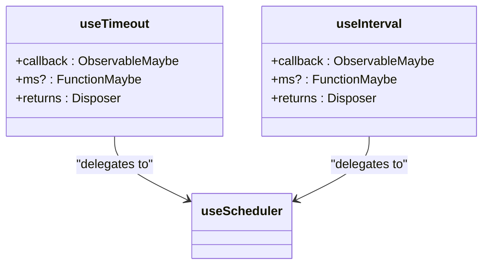
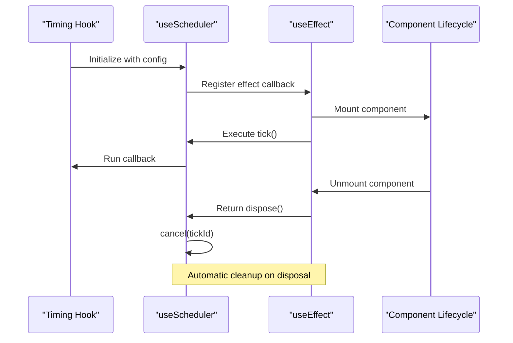
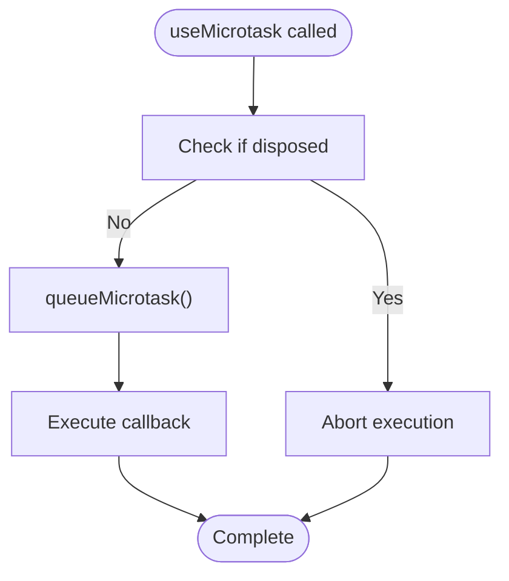
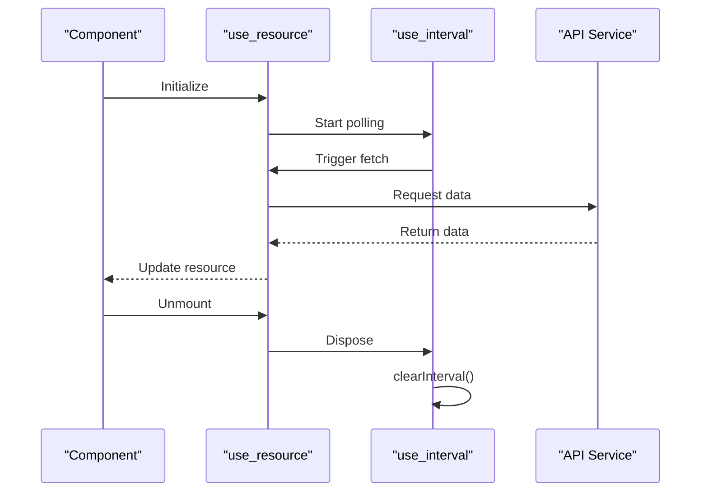

# Timing Functions

<cite>
**Referenced Files in This Document**   
- [use_timeout.ts](file://src/hooks/use_timeout.ts)
- [use_interval.ts](file://src/hooks/use_interval.ts)
- [use_animation_frame.ts](file://src/hooks/use_animation_frame.ts)
- [use_idle_callback.ts](file://src/hooks/use_idle_callback.ts)
- [use_microtask.ts](file://src/hooks/use_microtask.ts)
- [use_scheduler.ts](file://src/hooks/use_scheduler.ts)
- [use_resource.ts](file://src/hooks/use_resource.ts)
</cite>

## Table of Contents
1. [Introduction](#introduction)
2. [Core Timing Hooks](#core-timing-hooks)
3. [Scheduler Architecture](#scheduler-architecture)
4. [Animation and Idle Work](#animation-and-idle-work)
5. [Microtask Scheduling](#microtask-scheduling)
6. [Practical Use Cases](#practical-use-cases)
7. [Integration with Resource Management](#integration-with-resource-management)
8. [Performance Considerations](#performance-considerations)
9. [Memory Leak Prevention](#memory-leak-prevention)
10. [Conclusion](#conclusion)

## Introduction
Woby provides a comprehensive suite of timing functions designed to work seamlessly with its reactivity system. These timing hooks—`use_timeout`, `use_interval`, `use_animation_frame`, `use_idle_callback`, and `use_microtask`—are built on a unified scheduler architecture that ensures automatic cleanup when components are disposed. This document details their implementation, integration patterns, and best practices for building efficient, leak-free applications.

**Section sources**
- [use_timeout.ts](file://src/hooks/use_timeout.ts#L7-L19)
- [use_interval.ts](file://src/hooks/use_interval.ts#L7-L18)

## Core Timing Hooks

### use_timeout and use_interval
The `use_timeout` and `use_interval` hooks provide reactive wrappers around JavaScript's native `setTimeout` and `setInterval` functions. Both hooks return a disposer function that automatically cancels the timer when the component is unmounted, preventing common memory leaks.

`use_timeout` is designed for one-time delayed execution, while `use_interval` supports recurring operations. Both accept observable parameters, allowing dynamic configuration of delay values that respond to state changes.



**Diagram sources**
- [use_timeout.ts](file://src/hooks/use_timeout.ts#L7-L19)
- [use_interval.ts](file://src/hooks/use_interval.ts#L7-L18)
- [use_scheduler.ts](file://src/hooks/use_scheduler.ts#L20-L52)

**Section sources**
- [use_timeout.ts](file://src/hooks/use_timeout.ts#L7-L19)
- [use_interval.ts](file://src/hooks/use_interval.ts#L7-L18)

## Scheduler Architecture

### Unified Scheduling System
All timing hooks in Woby are built on the `useScheduler` primitive, which provides a consistent interface for managing asynchronous operations. This centralization enables uniform lifecycle management, suspension handling, and cleanup behavior across different timing mechanisms.

The scheduler integrates with Woby's reactivity system through `useEffect`, ensuring that scheduled operations are automatically canceled when components are disposed. It also respects component suspension states, pausing operations when components are suspended.



**Diagram sources**
- [use_scheduler.ts](file://src/hooks/use_scheduler.ts#L20-L52)
- [use_timeout.ts](file://src/hooks/use_timeout.ts#L7-L19)

**Section sources**
- [use_scheduler.ts](file://src/hooks/use_scheduler.ts#L20-L52)

## Animation and Idle Work

### Animation Frame Hooks
Woby provides `use_animation_frame` and `use_animation_loop` for animation-related tasks. These hooks wrap `requestAnimationFrame` and are optimized for 60fps rendering. The `use_animation_frame` hook schedules a single frame callback, while `use_animation_loop` creates a continuous animation loop that automatically stops when the component is unmounted.

```mermaid
classDiagram
class useAnimationFrame {
+callback : ObservableMaybe<FrameRequestCallback>
+returns : Disposer
}
class useAnimationLoop {
+callback : ObservableMaybe<FrameRequestCallback>
+returns : Disposer
}
useAnimationFrame --> useScheduler : "uses"
useAnimationLoop --> useScheduler : "uses"
useScheduler --> "window" : "requestAnimationFrame"
useScheduler --> "window" : "cancelAnimationFrame"
```

**Diagram sources**
- [use_animation_frame.ts](file://src/hooks/use_animation_frame.ts#L6-L17)
- [use_animation_loop.ts](file://src/hooks/use_animation_loop.ts#L6-L17)
- [use_scheduler.ts](file://src/hooks/use_scheduler.ts#L20-L52)

### Idle Callbacks
The `use_idle_callback` and `use_idle_loop` hooks leverage `requestIdleCallback` to schedule work during browser idle periods. This is ideal for non-urgent tasks like analytics, logging, or background processing that shouldn't interfere with user interactions or animations.

These hooks accept optional `IdleRequestOptions` to control timeout behavior and task prioritization, with all parameters supporting reactivity for dynamic configuration.

**Section sources**
- [use_animation_frame.ts](file://src/hooks/use_animation_frame.ts#L6-L17)
- [use_idle_callback.ts](file://src/hooks/use_idle_callback.ts#L7-L19)

## Microtask Scheduling

### use_microtask Implementation
The `use_microtask` hook provides access to the microtask queue via `queueMicrotask`. Unlike other timing hooks, it doesn't use the shared scheduler and instead implements its own disposal logic using `useCheapDisposed`.

This hook ensures that microtask callbacks are only executed if the component is still mounted, preventing stale closures from updating unmounted components. It uses Woby's ownership system to maintain proper context during execution.



**Diagram sources**
- [use_microtask.ts](file://src/hooks/use_microtask.ts#L10-L23)

**Section sources**
- [use_microtask.ts](file://src/hooks/use_microtask.ts#L10-L23)

## Practical Use Cases

### Debounced Inputs
Timing hooks enable efficient implementation of debounced input handling, where expensive operations (like API calls) are delayed until the user stops typing.

### Polling Mechanisms
Regular data polling can be implemented using `use_interval`, with dynamic interval control based on application state or user preferences.

### Animation Sequences
The animation frame hooks provide the foundation for smooth animations, with automatic cleanup preventing animation loops from continuing after component unmount.

### Background Processing
Idle callbacks allow non-urgent work to be scheduled without impacting main thread performance, ideal for tasks like data preprocessing or cache updates.

**Section sources**
- [use_timeout.ts](file://src/hooks/use_timeout.ts#L7-L19)
- [use_interval.ts](file://src/hooks/use_interval.ts#L7-L18)
- [use_animation_frame.ts](file://src/hooks/use_animation_frame.ts#L6-L17)

## Integration with Resource Management

### Polling with use_resource
The `use_resource` hook can be combined with timing functions to create sophisticated data loading patterns. For example, polling implementations can use `use_interval` to trigger periodic refetching within a resource's fetcher function.

This integration maintains proper disposal semantics, ensuring that both the polling timer and any pending network requests are cleaned up when the component is unmounted.



**Diagram sources**
- [use_resource.ts](file://src/hooks/use_resource.ts#L20-L105)
- [use_interval.ts](file://src/hooks/use_interval.ts#L7-L18)

**Section sources**
- [use_resource.ts](file://src/hooks/use_resource.ts#L20-L105)

## Performance Considerations

### High-Frequency Updates
For animations and high-frequency updates, use `use_animation_frame` instead of `use_interval` to synchronize with the browser's refresh rate and avoid unnecessary work.

### Idle Work Prioritization
When using `use_idle_callback`, consider the impact of the `timeout` option to ensure critical background work completes within acceptable timeframes.

### Dynamic Scheduling
Leverage observable parameters to dynamically adjust timing intervals based on system load, user interaction, or other runtime conditions.

**Section sources**
- [use_animation_frame.ts](file://src/hooks/use_animation_frame.ts#L6-L17)
- [use_idle_callback.ts](file://src/hooks/use_idle_callback.ts#L7-L19)

## Memory Leak Prevention

### Automatic Cleanup
All timing hooks automatically clean up their scheduled operations when components are disposed, eliminating a common source of memory leaks in reactive applications.

The unified scheduler architecture ensures consistent disposal behavior across different timing mechanisms, with cleanup registered as an effect cleanup function that executes automatically during component unmount.

### Stale Closure Protection
By tying the lifecycle of timing operations to component existence, Woby prevents stale closures from updating unmounted components, a common issue in asynchronous JavaScript applications.

**Section sources**
- [use_scheduler.ts](file://src/hooks/use_scheduler.ts#L20-L52)
- [use_microtask.ts](file://src/hooks/use_microtask.ts#L10-L23)

## Conclusion
Woby's timing functions provide a robust, leak-proof foundation for time-based operations in reactive applications. By centralizing scheduling logic and integrating tightly with the reactivity system, these hooks enable developers to implement complex timing patterns with confidence that resources will be properly managed. The combination of automatic cleanup, reactive parameters, and consistent APIs makes it easier to build performant, maintainable applications without the common pitfalls of asynchronous JavaScript.