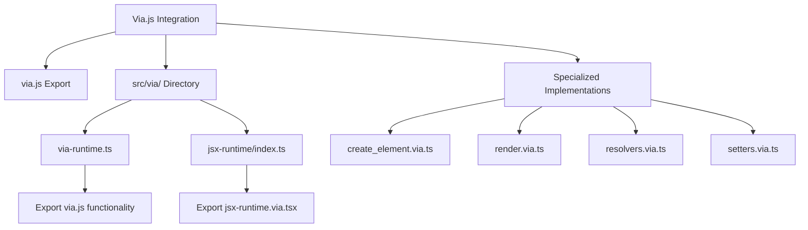
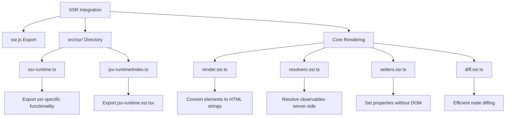
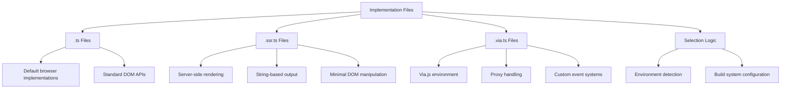

# Integration

<cite>
**Referenced Files in This Document**   
- [jsx-runtime.js](file://jsx-runtime.js)
- [ssr.js](file://ssr.js)
- [via.js](file://via.js)
- [src/jsx/jsx-runtime.ssr.tsx](file://src/jsx/jsx-runtime.ssr.tsx)
- [src/jsx/jsx-runtime.via.tsx](file://src/jsx/jsx-runtime.via.tsx)
- [src/ssr/jsx-runtime/index.ts](file://src/ssr/jsx-runtime/index.ts)
- [src/via/jsx-runtime/index.ts](file://src/via/jsx-runtime/index.ts)
- [src/methods/render.ssr.ts](file://src/methods/render.ssr.ts)
- [src/methods/render.via.ts](file://src/methods/render.via.ts)
- [src/components/dynamic.ssr.ts](file://src/components/dynamic.ssr.ts)
- [src/components/dynamic.via.ts](file://src/components/dynamic.via.ts)
- [src/jsx/runtime.ts](file://src/jsx/runtime.ts)
- [src/ssr/ssr-runtime.ts](file://src/ssr/ssr-runtime.ts)
- [src/via/via-runtime.ts](file://src/via/via-runtime.ts)
- [src/methods/h.ssr.ts](file://src/methods/h.ssr.ts)
- [src/methods/h.via.ts](file://src/methods/h.via.ts)
- [src/utils/resolvers.ssr.ts](file://src/utils/resolvers.ssr.ts)
- [src/utils/resolvers.via.ts](file://src/utils/resolvers.via.ts)
- [src/utils/setters.ssr.ts](file://src/utils/setters.ssr.ts)
- [src/utils/setters.via.ts](file://src/utils/setters.via.ts)
- [src/utils/diff.ssr.ts](file://src/utils/diff.ssr.ts)
- [src/utils/diff.via.ts](file://src/utils/diff.via.ts)
</cite>

## Table of Contents
1. [JSX Integration](#jsx-integration)
2. [Via.js Integration](#viajs-integration)
3. [SSR Integration](#ssr-integration)
4. [Implementation File Differences](#implementation-file-differences)
5. [Practical Examples](#practical-examples)
6. [Configuration Options](#configuration-options)
7. [Performance Considerations](#performance-considerations)

## JSX Integration

The Woby framework provides comprehensive JSX support through the `jsx/` directory and `jsx-runtime.js` file, enabling seamless integration with modern JavaScript frameworks and tools. The JSX runtime implementation follows React 16 and 17 specifications, allowing developers to use familiar syntax while leveraging Woby's reactive programming model.

The core JSX functionality is implemented in `src/jsx/runtime.ts`, which exports the `jsx` function for creating elements. This function handles both React 16 and React 17 syntax variations, supporting the creation of components with props and children. The runtime includes special handling for component properties through the `SYMBOL_JSX` marker, which identifies JSX-processed props and prevents duplicate processing.

For server-side rendering (SSR) contexts, the framework provides a specialized implementation in `src/jsx/jsx-runtime.ssr.tsx`. This version imports SSR-specific utilities and uses `createElement` from the SSR module to ensure proper server-side element creation. Similarly, the `src/jsx/jsx-runtime.via.tsx` file provides Via.js-specific JSX handling, including integration with the Via.js runtime environment.

The `jsx-runtime.js` file at the project root serves as an export entry point, making the JSX runtime available through package.json exports. This allows external applications to import the JSX runtime directly without needing to reference internal paths.

**Section sources**
- [jsx-runtime.js](file://jsx-runtime.js#L1-L2)
- [src/jsx/runtime.ts](file://src/jsx/runtime.ts#L1-L78)
- [src/jsx/jsx-runtime.ssr.tsx](file://src/jsx/jsx-runtime.ssr.tsx#L1-L40)
- [src/jsx/jsx-runtime.via.tsx](file://src/jsx/jsx-runtime.via.tsx#L1-L47)

## Via.js Integration

Via.js integration is implemented through the `via/` directory and `via.js` file, providing an alternative rendering target for Woby applications. This integration enables Woby components to be rendered in environments that support Via.js, expanding the framework's deployment options beyond traditional DOM-based rendering.

The Via.js runtime is defined in `src/via/via-runtime.ts`, which exports all functionality from the main Via.js module. This creates a clean entry point for Via.js-specific functionality while maintaining compatibility with the broader Woby ecosystem. The `via.js` file at the project root serves as an export boundary, making Via.js functionality available through package.json exports.

The integration includes specialized implementations for key operations such as element creation and rendering. The `src/methods/create_element.via.ts` file provides Via.js-specific element creation logic, while `src/methods/render.via.ts` implements the rendering function tailored for Via.js environments. The render function in Via.js contexts accepts both a child element and an optional parent node, throwing an error if the parent is invalid.

Via.js integration also includes specialized resolvers and setters in the `src/utils/` directory. The `resolvers.via.ts` file handles child resolution with Via.js-specific logic, including proxy handling and HTML value tracking through the `HTMLValue` symbol. The `setters.via.ts` file implements property setting functions optimized for Via.js, with direct property assignment and minimal DOM manipulation.

**Diagram sources**
- [via.js](file://via.js#L1-L2)
- [src/via/via-runtime.ts](file://src/via/via-runtime.ts#L1-L2)
- [src/methods/render.via.ts](file://src/methods/render.via.ts#L1-L27)
- [src/utils/resolvers.via.ts](file://src/utils/resolvers.via.ts#L1-L274)
- [src/utils/setters.via.ts](file://src/utils/setters.via.ts#L1-L861)

**Section sources**
- [via.js](file://via.js#L1-L2)
- [src/via/via-runtime.ts](file://src/via/via-runtime.ts#L1-L2)
- [src/methods/render.via.ts](file://src/methods/render.via.ts#L1-L27)
- [src/utils/resolvers.via.ts](file://src/utils/resolvers.via.ts#L1-L274)
- [src/utils/setters.via.ts](file://src/utils/setters.via.ts#L1-L861)

## SSR Integration

Server-side rendering (SSR) integration is implemented through the `src/ssr/` directory and `ssr.js` file, providing comprehensive support for rendering Woby applications on the server. This integration enables faster initial page loads, improved SEO, and better user experience by delivering fully rendered content from the server.

The SSR runtime is defined in `src/ssr/ssr-runtime.ts`, which exports all functionality from the SSR-specific JSX runtime. This creates a dedicated entry point for server-side rendering operations. The `ssr.js` file at the project root serves as an export boundary, making SSR functionality available through package.json exports.

The core SSR rendering functionality is implemented in `src/methods/render.ssr.ts`, which exports a `render` function that converts a child element into a string representation. This function creates a container object and uses a fragment to manage the root element. It then uses `setChild` from `setters.ssr.ts` to populate the container with the rendered content, finally returning the HTML string representation.

SSR integration includes specialized implementations for key operations. The `src/utils/resolvers.ssr.ts` file handles child resolution with server-side specific logic, including observable resolution and array flattening. The `src/utils/setters.ssr.ts` file implements property setting functions optimized for server-side rendering, with minimal DOM manipulation since the actual DOM is not available.

The SSR implementation also includes a diffing algorithm in `src/utils/diff.ssr.ts`, which is a customized version of udomdiff adapted for server-side rendering. This algorithm efficiently handles node updates and replacements during the rendering process, ensuring optimal performance even with complex component trees.

**Diagram sources**
- [ssr.js](file://ssr.js#L1-L2)
- [src/ssr/ssr-runtime.ts](file://src/ssr/ssr-runtime.ts#L1-L2)
- [src/methods/render.ssr.ts](file://src/methods/render.ssr.ts#L1-L27)
- [src/utils/resolvers.ssr.ts](file://src/utils/resolvers.ssr.ts#L1-L182)
- [src/utils/setters.ssr.ts](file://src/utils/setters.ssr.ts#L1-L1051)
- [src/utils/diff.ssr.ts](file://src/utils/diff.ssr.ts#L1-L202)

**Section sources**
- [ssr.js](file://ssr.js#L1-L2)
- [src/ssr/ssr-runtime.ts](file://src/ssr/ssr-runtime.ts#L1-L2)
- [src/methods/render.ssr.ts](file://src/methods/render.ssr.ts#L1-L27)
- [src/utils/resolvers.ssr.ts](file://src/utils/resolvers.ssr.ts#L1-L182)
- [src/utils/setters.ssr.ts](file://src/utils/setters.ssr.ts#L1-L1051)
- [src/utils/diff.ssr.ts](file://src/utils/diff.ssr.ts#L1-L202)

## Implementation File Differences

The Woby framework uses a file naming convention with suffixes like `.ssr.ts`, `.via.ts`, and `.ts` to differentiate implementations for various rendering targets and environments. This approach allows the framework to maintain a consistent API while providing optimized implementations for specific contexts.

Files with the `.ssr.ts` suffix contain implementations specifically designed for server-side rendering. These implementations focus on generating HTML strings and minimizing DOM manipulation, as the actual DOM is not available on the server. For example, `dynamic.ssr.ts` and `render.ssr.ts` include logic optimized for string-based output and server-side performance considerations.

Files with the `.via.ts` suffix contain implementations tailored for the Via.js environment. These implementations leverage Via.js-specific features and APIs, such as proxy handling and custom event systems. The `dynamic.via.ts` and `render.via.ts` files include Via.js-specific logic for element creation and property setting, taking advantage of Via.js's unique rendering model.

Base files with the `.ts` extension (without suffixes) contain the default implementations used in standard browser environments. These implementations assume a full DOM is available and use standard DOM APIs for element manipulation and rendering. The framework selects the appropriate implementation based on the target environment, ensuring optimal performance and compatibility.

This file organization enables the framework to maintain a single codebase while supporting multiple rendering targets. The build system can select the appropriate implementation files based on the target environment, allowing developers to write code that works across different platforms without modification.

**Diagram sources**
- [src/components/dynamic.ssr.ts](file://src/components/dynamic.ssr.ts#L1-L25)
- [src/components/dynamic.via.ts](file://src/components/dynamic.via.ts#L1-L25)
- [src/methods/render.ssr.ts](file://src/methods/render.ssr.ts#L1-L27)
- [src/methods/render.via.ts](file://src/methods/render.via.ts#L1-L27)

**Section sources**
- [src/components/dynamic.ssr.ts](file://src/components/dynamic.ssr.ts#L1-L25)
- [src/components/dynamic.via.ts](file://src/components/dynamic.via.ts#L1-L25)
- [src/methods/render.ssr.ts](file://src/methods/render.ssr.ts#L1-L27)
- [src/methods/render.via.ts](file://src/methods/render.via.ts#L1-L27)

## Practical Examples

The Woby framework provides practical examples of JSX usage and integration with different rendering engines through its implementation files. These examples demonstrate how to use JSX syntax with various rendering targets and how to configure the framework for different environments.

For JSX usage, the framework supports both React 16 and React 17 syntax through the `jsx` function in `src/jsx/runtime.ts`. Developers can create elements using either syntax, with the runtime automatically handling the differences. The function supports component creation with props and children, as well as key handling for list items.

When integrating with different rendering engines, developers can use the appropriate entry points based on their target environment. For server-side rendering, the `ssr.js` entry point provides access to SSR-specific functionality, while `via.js` provides access to Via.js-specific features. The framework's modular design allows developers to import only the functionality they need for their specific use case.

The `h.ssr.ts` and `h.via.ts` files demonstrate how to create elements using the `h` function, which is an alias for `createElement`. These implementations show how to handle different argument patterns, including cases where props are omitted or children are passed as separate arguments. The implementations use type guards to determine the correct handling for each case, ensuring type safety and correct behavior.

These practical examples illustrate how to use the framework's integration points effectively, providing guidance on best practices for JSX usage and rendering engine integration. By following these patterns, developers can create applications that work seamlessly across different environments while maintaining optimal performance.

**Section sources**
- [src/jsx/runtime.ts](file://src/jsx/runtime.ts#L1-L78)
- [src/methods/h.ssr.ts](file://src/methods/h.ssr.ts#L1-L1)
- [src/methods/h.via.ts](file://src/methods/h.via.ts#L1-L36)

## Configuration Options

The Woby framework provides several configuration options for its integration points, allowing developers to customize the behavior of JSX, Via.js, and SSR implementations. These options are exposed through the framework's API and can be configured at runtime.

For JSX configuration, the framework uses symbols like `SYMBOL_JSX` to track processed props and prevent duplicate processing. The `isJsx` function in `src/jsx/runtime.ts` allows developers to check if props have already been processed by the JSX runtime. This enables conditional processing based on whether props have been previously handled.

Via.js integration includes configuration options through the `IgnoreSymbols` object, which allows developers to specify symbols that should be ignored during rendering. This provides fine-grained control over which properties are exposed to the rendering engine and which are kept internal to the framework.

SSR configuration is handled through the framework's modular design, allowing developers to import only the functionality they need. The `render.ssr.ts` file provides configuration options for the rendering process, including error handling and stack tracking. Developers can customize the rendering behavior by modifying these parameters or by creating custom render functions that wrap the default implementation.

The framework also provides configuration options through its build system, allowing developers to select specific implementations based on their target environment. This enables optimization for different deployment scenarios, such as server-side rendering, client-side rendering, or hybrid approaches.

**Section sources**
- [src/jsx/runtime.ts](file://src/jsx/runtime.ts#L1-L78)
- [src/utils/setters.via.ts](file://src/utils/setters.via.ts#L1-L861)
- [src/methods/render.ssr.ts](file://src/methods/render.ssr.ts#L1-L27)

## Performance Considerations

The Woby framework incorporates several performance optimizations in its integration points, particularly for JSX, Via.js, and SSR implementations. These optimizations ensure efficient rendering and minimal overhead across different environments.

For JSX processing, the framework uses symbol-based tracking to avoid duplicate processing of props. The `SYMBOL_JSX` marker allows the runtime to quickly determine whether props have already been processed, eliminating unnecessary work. This optimization is particularly important in high-frequency rendering scenarios where performance is critical.

Via.js integration includes performance optimizations through direct property assignment and minimal DOM manipulation. The `setters.via.ts` file implements property setting functions that avoid unnecessary DOM operations, instead relying on Via.js's proxy system for efficient updates. This approach reduces the overhead of property changes and improves rendering performance.

SSR performance is optimized through efficient string generation and minimal object creation. The `render.ssr.ts` file uses a container object to collect rendered content, avoiding the creation of intermediate DOM structures. The diffing algorithm in `diff.ssr.ts` is optimized for server-side rendering, with fast paths for common operations like appending or removing nodes.

The framework also includes performance considerations for observable resolution. The `resolvers.ssr.ts` and `resolvers.via.ts` files implement efficient algorithms for resolving observables and arrays, minimizing unnecessary computations. These implementations use caching and early termination to reduce the overhead of reactive programming patterns.

These performance considerations ensure that the framework maintains high performance across different rendering targets, providing a smooth user experience regardless of the deployment environment.

**Section sources**
- [src/jsx/runtime.ts](file://src/jsx/runtime.ts#L1-L78)
- [src/utils/setters.via.ts](file://src/utils/setters.via.ts#L1-L861)
- [src/methods/render.ssr.ts](file://src/methods/render.ssr.ts#L1-L27)
- [src/utils/resolvers.ssr.ts](file://src/utils/resolvers.ssr.ts#L1-L182)
- [src/utils/resolvers.via.ts](file://src/utils/resolvers.via.ts#L1-L274)
- [src/utils/diff.ssr.ts](file://src/utils/diff.ssr.ts#L1-L202)