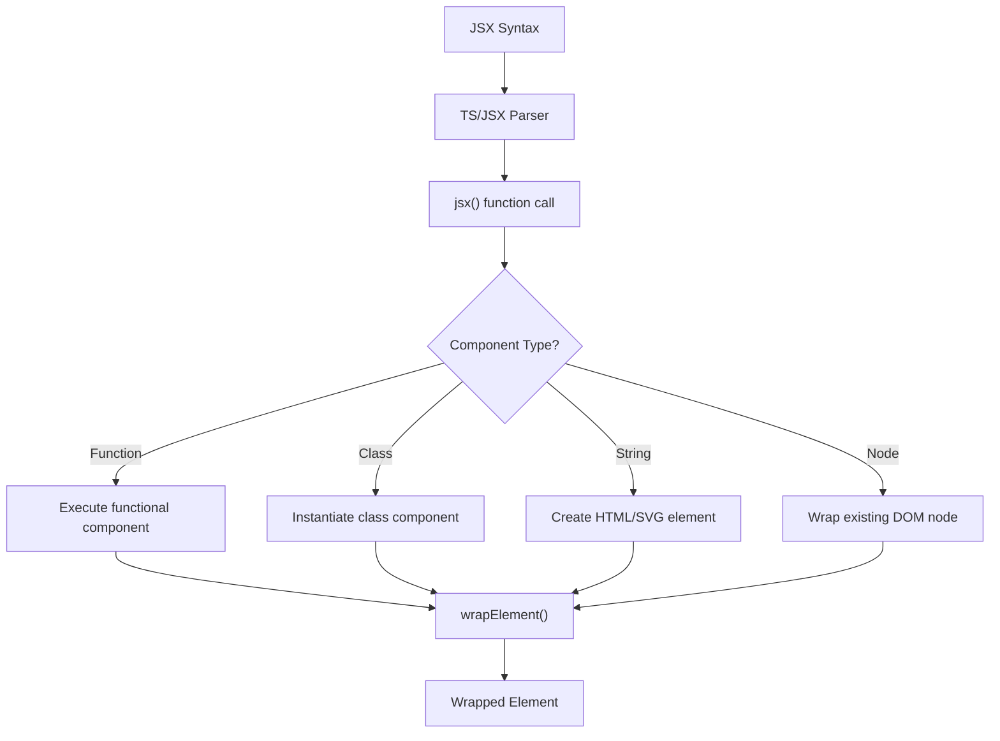
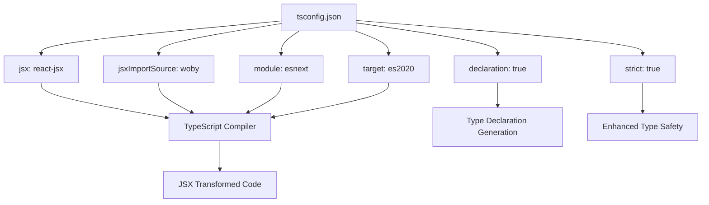
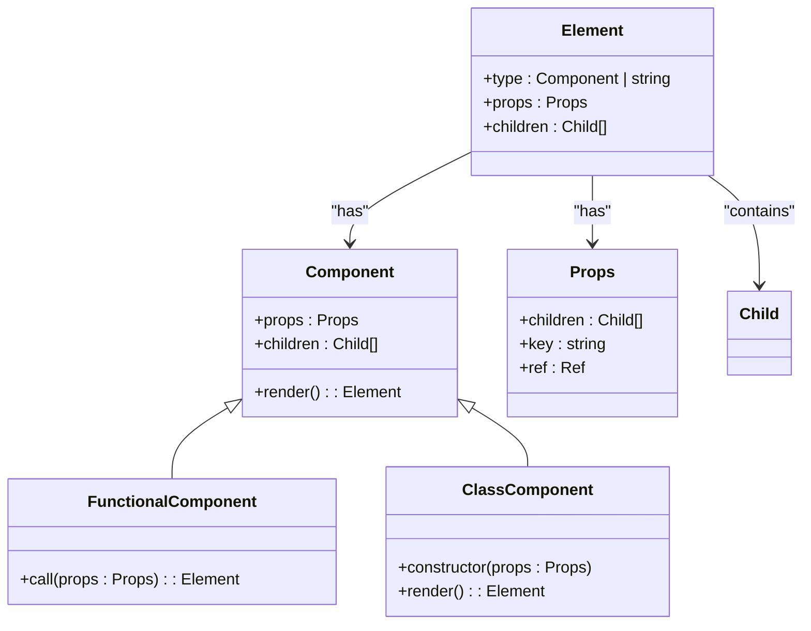
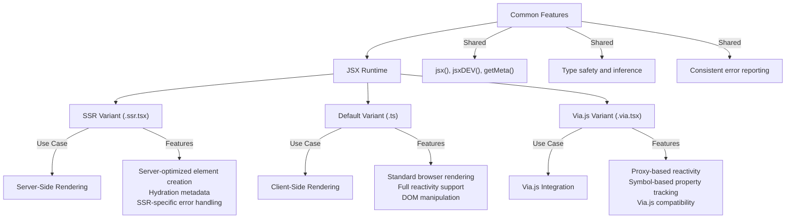

# JSX Support

<cite>
**Referenced Files in This Document**   
- [jsx-runtime.js](file://jsx-runtime.js)
- [tsconfig.json](file://tsconfig.json)
- [src/jsx/jsx-runtime.ssr.tsx](file://src/jsx/jsx-runtime.ssr.tsx)
- [src/jsx/jsx-runtime.via.tsx](file://src/jsx/jsx-runtime.via.tsx)
- [src/jsx/types.ts](file://src/jsx/types.ts)
- [src/methods/h.ssr.ts](file://src/methods/h.ssr.ts)
- [src/methods/h.ts](file://src/methods/h.ts)
- [src/methods/h.via.ts](file://src/methods/h.via.ts)
- [src/methods/create_element.ssr.ts](file://src/methods/create_element.ssr.ts)
- [src/methods/create_element.ts](file://src/methods/create_element.ts)
- [src/methods/create_element.via.ts](file://src/methods/create_element.via.ts)
- [src/jsx/runtime.ts](file://src/jsx/runtime.ts)
- [src/components/index.ssr.ts](file://src/components/index.ssr.ts)
- [src/components/index.ts](file://src/components/index.ts)
</cite>

## Table of Contents
1. [Introduction](#introduction)
2. [JSX Runtime Implementation](#jsx-runtime-implementation)
3. [TypeScript Configuration](#typescript-configuration)
4. [JSX Usage in Components](#jsx-usage-in-components)
5. [Runtime Variants and Use Cases](#runtime-variants-and-use-cases)
6. [Configuration Options](#configuration-options)
7. [Common Issues](#common-issues)
8. [Performance Considerations](#performance-considerations)
9. [Conclusion](#conclusion)

## Introduction
Woby provides comprehensive support for JSX syntax, enabling developers to write declarative UI code that compiles into efficient JavaScript. This document explains the implementation of JSX in Woby through the jsx/ directory and jsx-runtime.js, detailing the runtime configuration, compiler directives, and TypeScript setup required for proper JSX support. The framework supports multiple JSX runtime variants for different environments and use cases.

**Section sources**
- [jsx-runtime.js](file://jsx-runtime.js#L1-L3)
- [tsconfig.json](file://tsconfig.json#L1-L73)

## JSX Runtime Implementation
Woby implements JSX through a modular runtime system located in the `src/jsx/` directory. The core runtime functionality is defined in `runtime.ts`, which exports the `jsx` and `jsxDEV` functions that transform JSX syntax into Woby's virtual DOM elements. The runtime supports both React 16 and React 17 JSX calling conventions, allowing compatibility with different JSX compilation strategies.

The implementation uses `createElement` to instantiate components, handling functional components, class components, HTML elements, SVG elements, and custom elements. The `wrapCloneElement` function ensures proper component wrapping for reactivity and lifecycle management. The runtime also includes metadata tracking via `SYMBOL_CLONE` to support component cloning and reconciliation.

**Diagram sources**
- [src/jsx/runtime.ts](file://src/jsx/runtime.ts#L1-L79)
- [src/methods/wrap_element.ts](file://src/methods/wrap_element.ts)

**Section sources**
- [src/jsx/runtime.ts](file://src/jsx/runtime.ts#L1-L79)
- [src/methods/create_element.ts](file://src/methods/create_element.ts#L1-L130)

## TypeScript Configuration
Proper TypeScript configuration is essential for JSX support in Woby. The `tsconfig.json` file must include specific compiler options to enable JSX processing. The key configuration options are:

- `jsx`: Set to `"react-jsx"` to enable JSX transformation
- `jsxImportSource`: Set to `"woby"` to specify the JSX runtime import source
- `module`: Set to `"esnext"` to support modern JavaScript modules
- `target`: Set to `"es2020"` or higher for modern JavaScript features

The configuration also includes strict type checking options to ensure type safety while allowing necessary flexibility for JSX attributes and props. The `declaration` option enables type declaration file generation, which is important for library distribution.

**Diagram sources**
- [tsconfig.json](file://tsconfig.json#L1-L73)

**Section sources**
- [tsconfig.json](file://tsconfig.json#L1-L73)

## JSX Usage in Components
JSX in Woby components follows standard React-like syntax with framework-specific extensions. Components can be defined as functions or classes and used with JSX syntax. The framework supports all standard JSX features including element creation, props passing, children composition, and conditional rendering.

The `types.ts` file in the jsx directory defines comprehensive TypeScript types for JSX elements, attributes, and events, providing excellent IDE support and type checking. This includes type definitions for intrinsic elements, event handlers, CSS properties, and custom directives.

When using JSX, developers can create elements with attributes, pass children, and use Woby's reactivity system seamlessly. The framework handles the transformation of JSX into `createElement` calls with proper type inference and error checking.

**Diagram sources**
- [src/jsx/types.ts](file://src/jsx/types.ts#L1-L221)
- [src/types.ts](file://src/types.ts)

**Section sources**
- [src/jsx/types.ts](file://src/jsx/types.ts#L1-L221)
- [src/components/index.ts](file://src/components/index.ts#L1-L11)

## Runtime Variants and Use Cases
Woby provides multiple JSX runtime variants to support different environments and use cases. These variants are implemented as separate files in the jsx directory with specific suffixes indicating their target environment.

The `.ssr.tsx` variant is optimized for server-side rendering, with implementations in `jsx-runtime.ssr.tsx` and corresponding `create_element.ssr.ts`. This variant includes special handling for SSR-specific concerns like proper element creation on the server and metadata tracking for hydration.

The `.via.tsx` variant is designed for use with the Via.js framework, with implementations in `jsx-runtime.via.tsx` and `create_element.via.ts`. This variant includes integration with Via.js's proxy system and special symbols for property tracking.

Each variant exports the same core functions (`jsx`, `jsxDEV`, `getMeta`) but with environment-specific implementations. The framework uses conditional exports in package.json to ensure the correct runtime is used based on the environment.

**Diagram sources**
- [src/jsx/jsx-runtime.ssr.tsx](file://src/jsx/jsx-runtime.ssr.tsx#L1-L41)
- [src/jsx/jsx-runtime.via.tsx](file://src/jsx/jsx-runtime.via.tsx#L1-L48)
- [src/methods/create_element.ssr.ts](file://src/methods/create_element.ssr.ts#L1-L81)
- [src/methods/create_element.via.ts](file://src/methods/create_element.via.ts#L1-L81)

**Section sources**
- [src/jsx/jsx-runtime.ssr.tsx](file://src/jsx/jsx-runtime.ssr.tsx#L1-L41)
- [src/jsx/jsx-runtime.via.tsx](file://src/jsx/jsx-runtime.via.tsx#L1-L48)
- [src/components/index.ssr.ts](file://src/components/index.ssr.ts#L1-L13)

## Configuration Options
Woby's JSX support can be configured through several mechanisms. The primary configuration is through TypeScript's compiler options in `tsconfig.json`, particularly the `jsx` and `jsxImportSource` settings.

Additional configuration options include:
- `allowSyntheticDefaultImports`: Should be set to `true` for proper module resolution
- `esModuleInterop`: Recommended to be set to `false` to maintain module consistency
- `moduleResolution`: Should be set to `"node"` for standard Node.js module resolution
- `declaration`: Should be `true` when distributing the library to generate type definitions

The framework also supports conditional exports in `package.json` to provide different entry points for different environments, ensuring the correct JSX runtime is used based on the import context.

**Section sources**
- [tsconfig.json](file://tsconfig.json#L1-L73)
- [package.json](file://package.json)

## Common Issues
When using JSX with Woby, developers may encounter several common issues:

1. **ESM Requirements**: Woby requires ES modules, so projects must use `"module": "esnext"` in tsconfig.json and ensure proper module loading.

2. **TypeScript Configuration**: Incorrect JSX configuration in tsconfig.json can lead to compilation errors. The `jsx` option must be set to `"react-jsx"` and `jsxImportSource` to `"woby"`.

3. **Circular Dependencies**: The modular nature of the JSX runtime can lead to circular dependencies if not properly managed.

4. **Runtime Variant Confusion**: Using the wrong runtime variant (ssr vs via vs default) for the target environment can cause unexpected behavior.

5. **Type Definition Issues**: Missing or incorrect type definitions can lead to IDE errors and type checking problems.

These issues can typically be resolved by ensuring proper configuration, using the correct import statements, and following the framework's documentation for the target environment.

**Section sources**
- [tsconfig.json](file://tsconfig.json#L1-L73)
- [jsx-runtime.js](file://jsx-runtime.js#L1-L3)

## Performance Considerations
Using JSX in Woby has several performance implications that developers should consider:

1. **Compilation Overhead**: JSX syntax requires compilation to `createElement` calls, adding a small overhead during build time.

2. **Runtime Performance**: The `createElement` function performs type checking and wrapping, which has a minimal runtime cost that is typically negligible in production.

3. **Tree Shaking**: The modular runtime design allows for effective tree shaking, ensuring only used components and utilities are included in the final bundle.

4. **Memory Usage**: The wrapper functions and metadata tracking add minimal memory overhead per element.

5. **SSR Optimization**: The SSR variant is optimized for server performance, with efficient element creation and serialization.

For optimal performance, developers should:
- Use production builds with minification
- Avoid unnecessary re-renders through proper state management
- Leverage Woby's reactivity system to minimize DOM updates
- Use the appropriate runtime variant for the target environment

**Section sources**
- [src/jsx/runtime.ts](file://src/jsx/runtime.ts#L1-L79)
- [src/methods/create_element.ts](file://src/methods/create_element.ts#L1-L130)

## Conclusion
Woby provides a robust and flexible JSX implementation that supports modern web development practices. The framework's modular runtime system, comprehensive TypeScript support, and multiple environment variants make it suitable for a wide range of applications from simple client-side apps to complex server-rendered applications. By following the configuration guidelines and understanding the different runtime variants, developers can effectively leverage JSX to build maintainable and performant user interfaces.