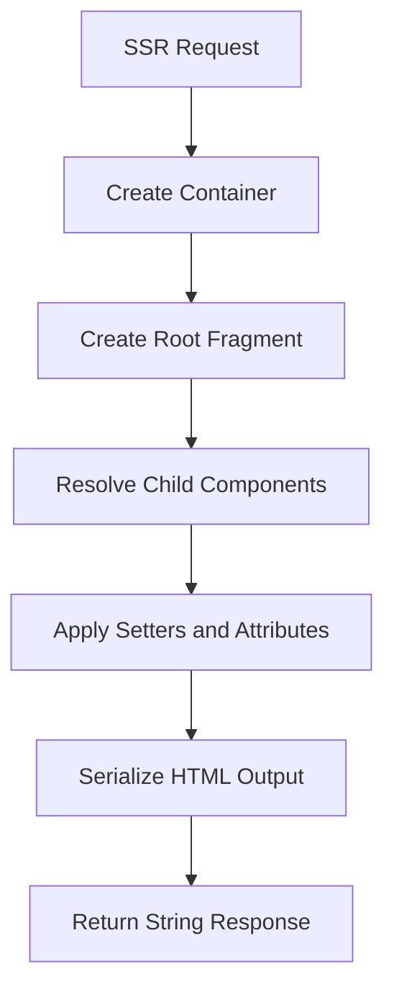
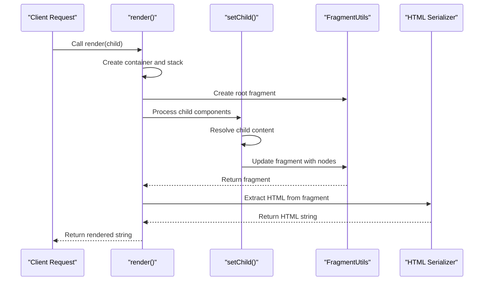
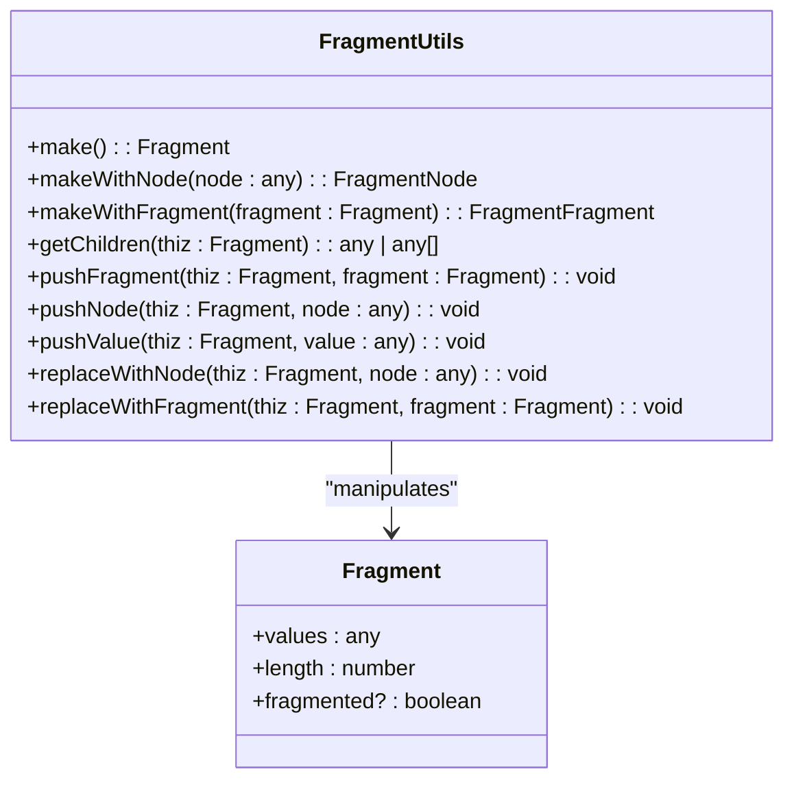
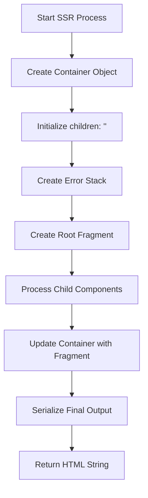
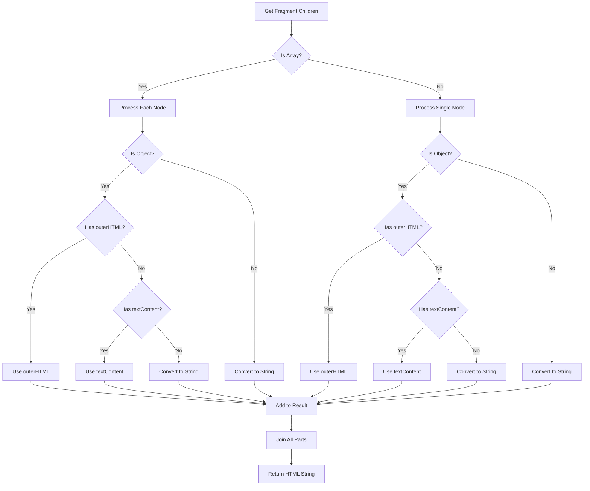
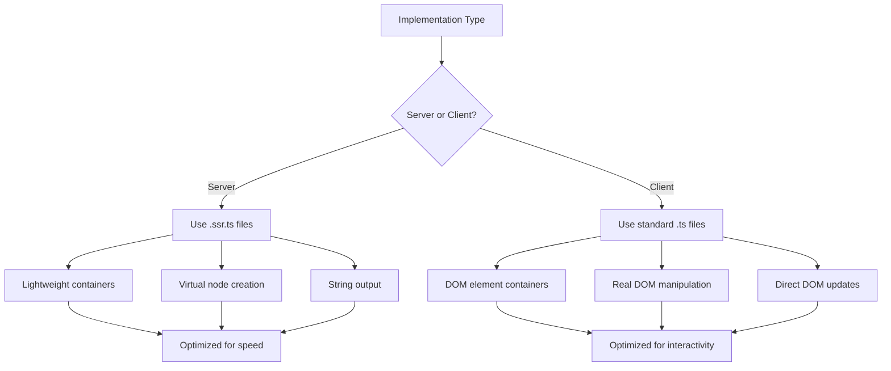
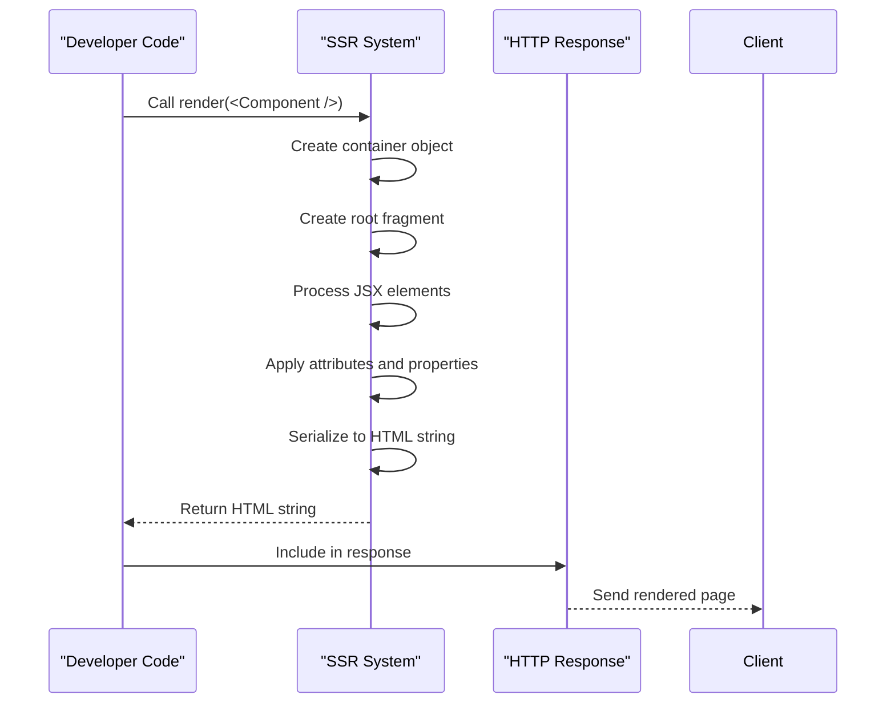
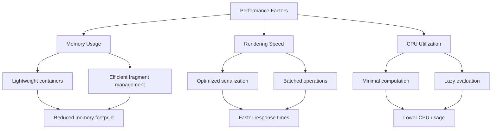

# Server-Side Rendering

<cite>
**Referenced Files in This Document**   
- [render.ssr.ts](file://src/methods/render.ssr.ts)
- [render_to_string.ssr.ts](file://src/methods/render_to_string.ssr.ts)
- [fragment.ssr.ts](file://src/utils/fragment.ssr.ts)
- [setters.ssr.ts](file://src/utils/setters.ssr.ts)
- [creators.ssr.ts](file://src/utils/creators.ssr.ts)
- [resolvers.ssr.ts](file://src/utils/resolvers.ssr.ts)
- [ssr.js](file://ssr.js)
- [ssr-runtime.ts](file://src/ssr/ssr-runtime.ts)
- [jsx-runtime.ssr.tsx](file://src/jsx/jsx-runtime.ssr.tsx)
</cite>

## Table of Contents
1. [Introduction](#introduction)
2. [SSR Implementation Overview](#ssr-implementation-overview)
3. [Core SSR Functions](#core-ssr-functions)
4. [Fragment Management](#fragment-management)
5. [Container Creation and Management](#container-creation-and-management)
6. [HTML Serialization Process](#html-serialization-process)
7. [Client vs Server Implementation Differences](#client-vs-server-implementation-differences)
8. [Practical SSR Usage Examples](#practical-ssr-usage-examples)
9. [Performance Considerations](#performance-considerations)
10. [Configuration Options](#configuration-options)
11. [Conclusion](#conclusion)

## Introduction

Server-Side Rendering (SSR) in Woby provides a mechanism for rendering components on the server and generating static HTML output. This approach enhances performance by delivering fully rendered content to clients, improving initial load times and search engine optimization. The SSR implementation in Woby is designed to be efficient and flexible, leveraging specialized utilities and patterns to handle server-side rendering requirements.

The framework distinguishes between client and server implementations through dedicated files with the `.ssr.ts` suffix, ensuring optimal performance and appropriate feature availability for each environment. This documentation explores the SSR architecture, implementation details, and practical usage patterns within the Woby framework.

## SSR Implementation Overview

The SSR implementation in Woby centers around the `src/ssr/` directory and associated `.ssr.ts` files throughout the codebase. The system is designed to create server-rendered HTML output without relying on a full DOM environment, instead using lightweight node creation and manipulation utilities.

The core SSR process involves several key components working together:
- **Container creation** for holding rendered content
- **Fragment management** for organizing component trees
- **HTML serialization** for converting virtual nodes to string output
- **Setter utilities** for handling attribute and property assignments
- **Resolver functions** for processing dynamic content

The SSR system uses a specialized runtime that differs from the client-side implementation, optimized for server environments where DOM manipulation is not required. This allows for faster rendering and reduced memory usage during server-side operations.



**Diagram sources**
- [render.ssr.ts](file://src/methods/render.ssr.ts)
- [setters.ssr.ts](file://src/utils/setters.ssr.ts)
- [creators.ssr.ts](file://src/utils/creators.ssr.ts)

**Section sources**
- [render.ssr.ts](file://src/methods/render.ssr.ts)
- [ssr-runtime.ts](file://src/ssr/ssr-runtime.ts)

## Core SSR Functions

The Woby SSR system provides two primary functions for server-side rendering: `render` and `renderToString`. These functions are implemented in dedicated `.ssr.ts` files and are specifically optimized for server environments.

The `render` function in `render.ssr.ts` generates a string representation of the rendered component tree. It creates a container object and uses a fragment to manage the component hierarchy. The function processes the child components through the `setChild` utility, then extracts the final HTML content from the fragment.

Similarly, the `renderToString` function follows a nearly identical pattern but includes additional type checking and handling for object nodes. Both functions use the same underlying mechanisms for fragment management and HTML serialization, ensuring consistency across the SSR implementation.



**Diagram sources**
- [render.ssr.ts](file://src/methods/render.ssr.ts#L7-L25)
- [render_to_string.ssr.ts](file://src/methods/render_to_string.ssr.ts#L6-L40)
- [setters.ssr.ts](file://src/utils/setters.ssr.ts)

**Section sources**
- [render.ssr.ts](file://src/methods/render.ssr.ts)
- [render_to_string.ssr.ts](file://src/methods/render_to_string.ssr.ts)

## Fragment Management

Fragment management is a critical aspect of Woby's SSR implementation, handled by the `FragmentUtils` object in `fragment.ssr.ts`. Fragments serve as containers for component trees, allowing the framework to efficiently manage and manipulate groups of nodes during the rendering process.

The `FragmentUtils` provides several key methods:
- `make()` - Creates a new empty fragment
- `makeWithNode()` - Creates a fragment containing a single node
- `makeWithFragment()` - Creates a fragment containing another fragment
- `getChildren()` - Retrieves the child nodes from a fragment
- `pushNode()` - Adds a node to a fragment
- `pushFragment()` - Adds a fragment to another fragment
- `replaceWithNode()` - Replaces a fragment's content with a single node

Fragments are designed to be lightweight and efficient, using a simple object structure with `values` and `length` properties. The implementation includes optimizations for common cases, such as single-node fragments, to minimize memory usage and improve performance.



**Diagram sources**
- [fragment.ssr.ts](file://src/utils/fragment.ssr.ts)
- [types.ts](file://src/types.ts)

**Section sources**
- [fragment.ssr.ts](file://src/utils/fragment.ssr.ts)

## Container Creation and Management

Container creation is a fundamental part of the SSR process in Woby, providing the initial structure for rendered content. The framework creates lightweight container objects that serve as the root for component trees during server-side rendering.

In the SSR implementation, containers are created as simple JavaScript objects with a `children` property initialized to an empty string. This approach avoids the overhead of creating full DOM elements on the server, instead using plain objects that can be efficiently processed and serialized.

The container creation process is integrated with the fragment system, where the container serves as the parent for the root fragment. This design allows the framework to maintain a clear separation between the container (which holds the overall structure) and the fragment (which manages the component hierarchy).

The `setChild` function in `setters.ssr.ts` plays a crucial role in container management, handling the assignment of child components to containers. This function processes various types of children, including strings, numbers, objects, and functions, ensuring proper handling of dynamic content during SSR.



**Diagram sources**
- [render.ssr.ts](file://src/methods/render.ssr.ts)
- [setters.ssr.ts](file://src/utils/setters.ssr.ts)
- [creators.ssr.ts](file://src/utils/creators.ssr.ts)

**Section sources**
- [render.ssr.ts](file://src/methods/render.ssr.ts)
- [setters.ssr.ts](file://src/utils/setters.ssr.ts)

## HTML Serialization Process

The HTML serialization process in Woby's SSR implementation converts the virtual component tree into a string representation of HTML. This process is handled by the final steps of the `render` and `renderToString` functions, which extract content from fragments and convert it to HTML strings.

The serialization process examines the children of the root fragment, handling both single nodes and arrays of nodes. For each node, the system checks for `outerHTML` or `textContent` properties, using them to extract the HTML representation. If these properties are not available, the node is converted to a string using the standard `toString()` method.

The implementation includes special handling for different types of nodes:
- DOM elements with `outerHTML` property
- Text nodes with `textContent` property
- Primitive values (strings, numbers, booleans)
- Arrays of nodes

This approach ensures that all possible node types are properly serialized, producing valid HTML output regardless of the component structure.



**Diagram sources**
- [render.ssr.ts](file://src/methods/render.ssr.ts)
- [render_to_string.ssr.ts](file://src/methods/render_to_string.ssr.ts)

**Section sources**
- [render.ssr.ts](file://src/methods/render.ssr.ts)
- [render_to_string.ssr.ts](file://src/methods/render_to_string.ssr.ts)

## Client vs Server Implementation Differences

Woby distinguishes between client and server implementations through dedicated files with specific naming conventions. The framework uses `.ssr.ts` suffixes for server-side implementations and maintains separate files for client-side functionality.

Key differences between client and server implementations include:

1. **Container Types**: Server implementations use lightweight JavaScript objects as containers, while client implementations work with actual DOM elements.

2. **Node Creation**: The SSR system uses `happy-dom` to create nodes in a server environment, avoiding dependencies on browser-specific APIs.

3. **Rendering Approach**: Server-side rendering produces string output, while client-side rendering directly manipulates the DOM.

4. **Lifecycle Management**: Client implementations include additional logic for handling DOM events and cleanup, which is unnecessary in server environments.

5. **Performance Optimizations**: Server implementations are optimized for throughput and memory efficiency, while client implementations prioritize interactivity and responsiveness.

The `setters.ssr.ts` file contains server-specific implementations of setter functions that handle attribute assignment, class management, and event handling without requiring a full DOM environment. These setters are designed to work with the virtual nodes created during SSR, producing the appropriate HTML attributes and properties in the serialized output.



**Diagram sources**
- [render.ssr.ts](file://src/methods/render.ssr.ts)
- [render.ts](file://src/methods/render.ts)
- [setters.ssr.ts](file://src/utils/setters.ssr.ts)
- [setters.ts](file://src/utils/setters.ts)

**Section sources**
- [render.ssr.ts](file://src/methods/render.ssr.ts)
- [render.ts](file://src/methods/render.ts)

## Practical SSR Usage Examples

The SSR implementation in Woby can be used through the `render.ssr.ts` and `render_to_string.ssr.ts` files, which provide practical examples of server-side rendering in action. These implementations demonstrate how to render components to HTML strings for server responses.

To use SSR in Woby, developers can import the appropriate functions and call them with their component trees:

```typescript
import { render } from 'woby/ssr'

const html = render(<MyComponent />)
```

The framework handles the entire rendering process, from creating the initial container to serializing the final HTML output. The resulting string can be included directly in server responses, providing fully rendered content to clients.

For more complex scenarios, developers can use the `renderToString` function, which provides additional type checking and handling for edge cases. Both functions follow the same basic pattern of creating a container, processing the component tree, and serializing the result.

The SSR system also integrates with Woby's JSX runtime, allowing developers to use familiar JSX syntax in server environments. The `jsx-runtime.ssr.tsx` file provides the necessary runtime support for JSX compilation in server contexts.



**Diagram sources**
- [render.ssr.ts](file://src/methods/render.ssr.ts)
- [render_to_string.ssr.ts](file://src/methods/render_to_string.ssr.ts)
- [jsx-runtime.ssr.tsx](file://src/jsx/jsx-runtime.ssr.tsx)

**Section sources**
- [render.ssr.ts](file://src/methods/render.ssr.ts)
- [render_to_string.ssr.ts](file://src/methods/render_to_string.ssr.ts)

## Performance Considerations

The SSR implementation in Woby includes several performance optimizations to ensure efficient server-side rendering:

1. **Lightweight Containers**: Using plain JavaScript objects instead of DOM elements reduces memory overhead and improves instantiation speed.

2. **Fragment Optimization**: The fragment system is designed to minimize object creation and property access, with special handling for common cases like single-node fragments.

3. **Batched Operations**: The framework batches DOM-like operations to reduce the number of function calls and property accesses.

4. **Efficient String Handling**: The serialization process uses optimized string concatenation methods to minimize memory allocations.

5. **Lazy Evaluation**: Dynamic content is only resolved when necessary, avoiding unnecessary computation for static components.

6. **Minimal Dependencies**: The SSR system has minimal external dependencies, reducing startup time and memory usage.

These optimizations make the Woby SSR implementation suitable for high-throughput server environments, where rendering performance directly impacts overall application responsiveness.



**Diagram sources**
- [render.ssr.ts](file://src/methods/render.ssr.ts)
- [fragment.ssr.ts](file://src/utils/fragment.ssr.ts)
- [setters.ssr.ts](file://src/utils/setters.ssr.ts)

**Section sources**
- [render.ssr.ts](file://src/methods/render.ssr.ts)
- [fragment.ssr.ts](file://src/utils/fragment.ssr.ts)

## Configuration Options

The SSR system in Woby provides several configuration options through the framework's architecture and implementation patterns. While there are no explicit configuration files, developers can influence SSR behavior through various mechanisms:

1. **Custom Setters**: The `setters.ssr.ts` file provides extensible setter functions that can be customized for specific attribute handling requirements.

2. **Fragment Behavior**: The `FragmentUtils` implementation can be extended or modified to change how component trees are managed during rendering.

3. **Node Creation**: The `creators.ssr.ts` file defines how nodes are created in the server environment, allowing for customization of the virtual DOM implementation.

4. **Serialization Rules**: The HTML serialization process can be modified to handle special cases or custom element types.

5. **Error Handling**: The use of `new Error()` for stack tracking can be configured to include additional debugging information.

These configuration options are primarily available through the framework's modular architecture, allowing developers to customize SSR behavior to meet specific application requirements.

**Section sources**
- [setters.ssr.ts](file://src/utils/setters.ssr.ts)
- [fragment.ssr.ts](file://src/utils/fragment.ssr.ts)
- [creators.ssr.ts](file://src/utils/creators.ssr.ts)

## Conclusion

Woby's Server-Side Rendering implementation provides a robust and efficient solution for generating HTML on the server. The system leverages specialized utilities and patterns to create high-performance server rendering capabilities, with a clear separation between client and server implementations.

Key aspects of the SSR system include:
- Lightweight container and fragment management
- Efficient HTML serialization
- Optimized performance characteristics
- Clear distinction between client and server code paths
- Integration with JSX and component architecture

The implementation demonstrates a thoughtful approach to server-side rendering, balancing performance, maintainability, and developer experience. By using dedicated `.ssr.ts` files and specialized utilities, Woby provides a cohesive SSR solution that integrates seamlessly with the rest of the framework.