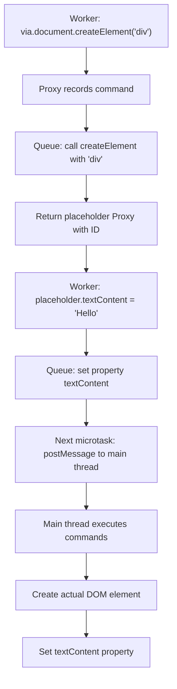
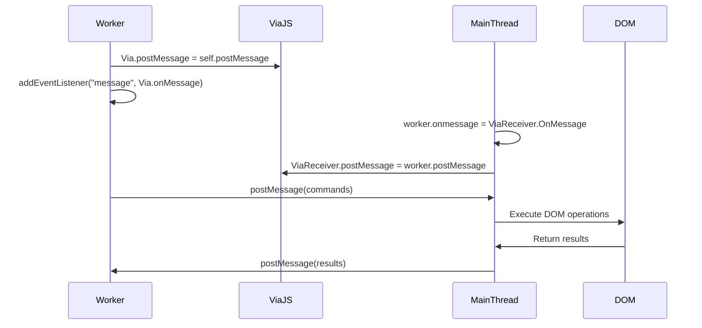
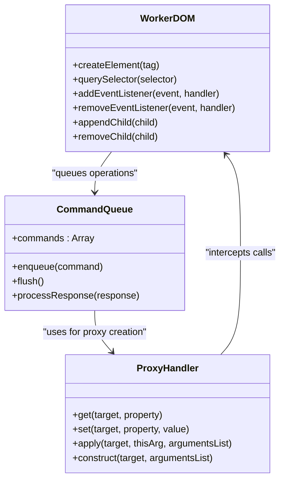
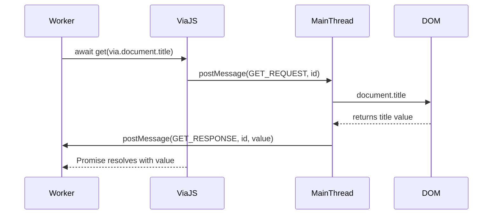
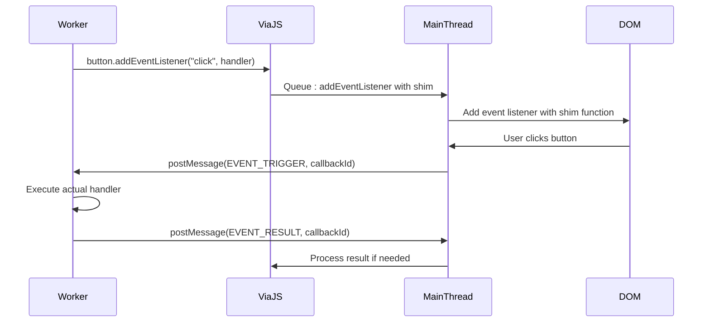
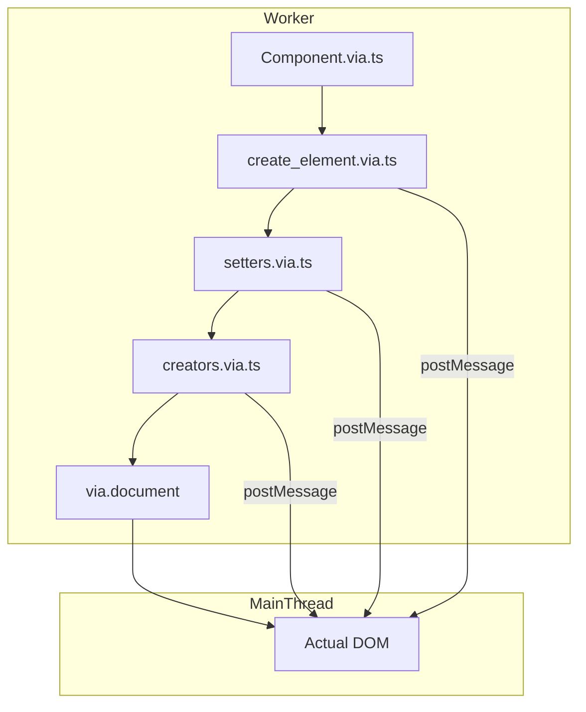
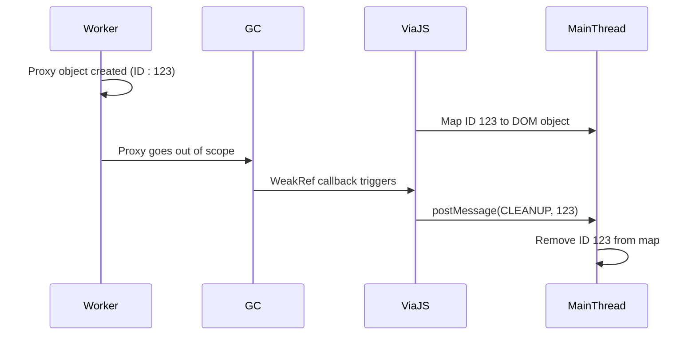

# Via.js Integration

<cite>
**Referenced Files in This Document**   
- [via.ts](file://src/via.ts)
- [create_element.via.ts](file://src/methods/create_element.via.ts)
- [setters.via.ts](file://src/utils/setters.via.ts)
- [render.via.ts](file://src/methods/render.via.ts)
- [creators.via.ts](file://src/utils/creators.via.ts)
- [diff.via.ts](file://src/utils/diff.via.ts)
- [resolvers.via.ts](file://src/utils/resolvers.via.ts)
- [index.via.ts](file://src/components/index.via.ts)
- [portal.via.ts](file://src/components/portal.via.ts)
- [dynamic.via.ts](file://src/components/dynamic.via.ts)
- [h.via.ts](file://src/methods/h.via.ts)
- [html.via.ts](file://src/methods/html.via.ts)
- [template.via.ts](file://src/methods/template.via.ts)
- [clone_element.via.ts](file://src/methods/clone_element.via.ts)
- [via/README.md](file://src/via/README.md)
</cite>

## Table of Contents
1. [Introduction](#introduction)
2. [Core Mechanism](#core-mechanism)
3. [Messaging Bridge Setup](#messaging-bridge-setup)
4. [DOM Manipulation in Workers](#dom-manipulation-in-workers)
5. [Asynchronous Value Retrieval](#asynchronous-value-retrieval)
6. [Callback Shim Implementation](#callback-shim-implementation)
7. [Integration with Woby Rendering](#integration-with-woby-rendering)
8. [Performance Considerations](#performance-considerations)
9. [Memory Management](#memory-management)
10. [Limitations](#limitations)

## Introduction
Via.js enables seamless DOM access from Web Workers within the Woby framework by leveraging Proxy objects to record operations and build command queues. This integration allows developers to write code that appears synchronous while executing DOM operations on the main thread, maintaining application responsiveness. The system uses a messaging bridge via postMessage to coordinate between worker and main threads, enabling full DOM API access from worker contexts.

**Section sources**
- [via/README.md](file://src/via/README.md#L0-L155)

## Core Mechanism
Via.js utilizes JavaScript Proxy objects to intercept property accesses, method calls, and assignments. When a developer accesses `via.document` or other DOM properties, Proxy objects record these operations into command queues instead of executing them immediately. These commands are batched and processed during the next microtask, minimizing postMessage overhead. Each Proxy represents a remote object with a unique ID, allowing the main thread to execute commands on the actual DOM elements.

**Diagram sources**
- [via/README.md](file://src/via/README.md#L52-L69)
- [via.ts](file://src/via.ts#L0-L14)

## Messaging Bridge Setup
The messaging bridge between worker and main thread is established by configuring Via.js with postMessage handlers. On the worker (controller) side, Via.postMessage is assigned to self.postMessage, and a message listener is set up to handle incoming messages. On the main thread (receiver) side, the worker's onmessage handler is configured to process Via.js messages, and ViaReceiver.postMessage is set to worker.postMessage.

**Diagram sources**
- [via/README.md](file://src/via/README.md#L81-L118)

## DOM Manipulation in Workers
Developers can perform DOM manipulations directly in Web Workers using familiar DOM APIs through the via object. The system supports creating elements, setting properties, styling, and event handling. Operations are recorded and executed on the main thread, with results synchronized back to the worker context. This enables complex UI operations to be offloaded to workers while maintaining access to the full DOM API.

**Section sources**
- [via/README.md](file://src/via/README.md#L28-L49)
- [create_element.via.ts](file://src/methods/create_element.via.ts#L0-L80)
- [setters.via.ts](file://src/utils/setters.via.ts#L0-L799)

## Asynchronous Value Retrieval
Since DOM operations execute on a different thread, direct synchronous value retrieval is impossible. Via.js provides a global `get()` function that returns a Promise resolving to the actual value from the main thread. This function works with Proxy-wrapped objects, automatically handling the postMessage round-trip to retrieve property values, method return values, or attribute values from DOM elements.

**Section sources**
- [via/README.md](file://src/via/README.md#L119-L140)

## Callback Shim Implementation
Via.js handles callbacks by creating shim functions that forward execution back to the worker thread. When a callback is passed to a DOM method (such as addEventListener), Via.js creates a placeholder function on the main thread that posts a message to the worker when invoked. The worker then executes the actual callback and can send results back if needed. This allows event handlers and other callbacks to run in the worker context while responding to DOM events.

**Section sources**
- [via/README.md](file://src/via/README.md#L52-L69)
- [setters.via.ts](file://src/utils/setters.via.ts#L400-L450)

## Integration with Woby Rendering
Via.js integrates with Woby's rendering system through specialized .via.ts files that adapt core rendering functions for worker usage. These files import from their standard counterparts while ensuring DOM operations are routed through the Via.js proxy system. The integration maintains the same API surface while redirecting operations to the messaging system, allowing components to be rendered in workers with minimal code changes.

**Section sources**
- [via.ts](file://src/via.ts#L0-L14)
- [create_element.via.ts](file://src/methods/create_element.via.ts#L0-L80)
- [setters.via.ts](file://src/utils/setters.via.ts#L0-L799)
- [render.via.ts](file://src/methods/render.via.ts#L0-L27)

## Performance Considerations
The Via.js integration offers significant performance benefits by offloading DOM operations to workers, preventing main thread jank. Batched command processing reduces postMessage overhead, with multiple operations sent in a single message. However, the system introduces latency for operations requiring immediate feedback. The architecture allows layout calculations on the main thread to occur in parallel with JavaScript execution in the worker, effectively doubling available processing time for complex UI updates.

**Section sources**
- [via/README.md](file://src/via/README.md#L141-L155)

## Memory Management
Via.js employs WeakRefs for automatic memory management, preventing memory leaks when Proxy objects are garbage collected. Each Proxy is assigned a unique ID, with the main thread maintaining a map of IDs to DOM objects. When a Proxy is collected, the WeakRef callback triggers a cleanup message to remove the corresponding entry from the ID map. This approach ensures unused DOM references are properly cleaned up without requiring manual disposal.

**Section sources**
- [via/README.md](file://src/via/README.md#L70-L79)

## Limitations
The Via.js integration has several limitations due to the asynchronous nature of cross-thread communication. Synchronous event methods like preventDefault() cannot be supported because the event handler completes before the worker can respond. Operations requiring immediate return values introduce latency due to postMessage round-trips. The system depends on WeakRef support for proper memory management, though it degrades gracefully in environments without this feature. Additionally, certain DOM APIs with complex object graphs may not serialize properly across thread boundaries.

**Section sources**
- [via/README.md](file://src/via/README.md#L150-L155)