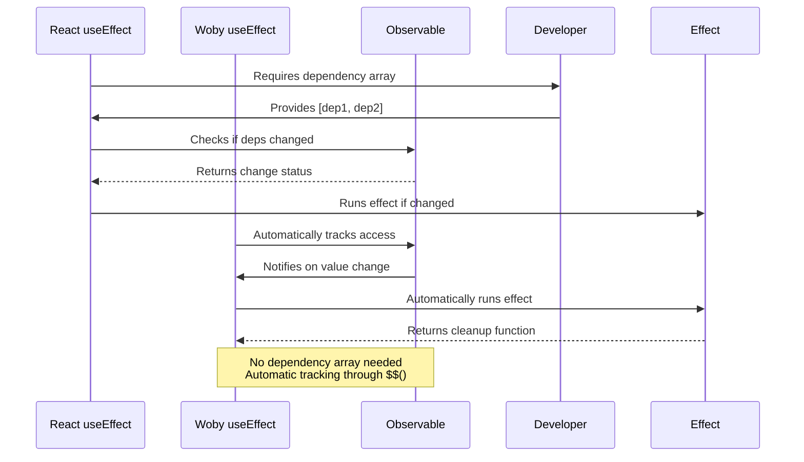

# Migration Guide

<cite>
**Referenced Files in This Document**   
- [readme.md](file://readme.md)
- [docs/React-to-Woby-Type-Conversion.md](file://docs/React-to-Woby-Type-Conversion.md)
- [src/components/if.ts](file://src/components/if.ts)
- [src/components/for.ts](file://src/components/for.ts)
- [src/hooks/soby.ts](file://src/hooks/soby.ts)
- [src/methods/soby.ts](file://src/methods/soby.ts)
- [src/types.ts](file://src/types.ts)
</cite>

## Table of Contents
1. [Introduction](#introduction)
2. [Reactivity Model Comparison](#reactivity-model-comparison)
3. [State Management Migration](#state-management-migration)
4. [Effect Handling Migration](#effect-handling-migration)
5. [Rendering Patterns Migration](#rendering-patterns-migration)
6. [Type Conversion Strategies](#type-conversion-strategies)
7. [Mindset Shifts](#mindset-shifts)
8. [Troubleshooting Common Issues](#troubleshooting-common-issues)

## Introduction
This migration guide provides comprehensive guidance for transitioning from React to Woby, a high-performance framework with fine-grained observable-based reactivity. Woby eliminates the virtual DOM (VDOM) and instead works directly with raw DOM nodes, offering significant performance benefits. The framework is built upon the Soby reactive core and provides an enhanced API for component-based development.

Woby's architecture differs significantly from React in several key areas: it uses observable-based reactivity instead of useState and useEffect, automatically tracks dependencies without requiring dependency arrays, and provides fine-grained updates without props diffing. This guide will walk through the key differences, provide direct comparisons between React patterns and their Woby equivalents, and offer practical examples for code transformation.

The migration process requires understanding fundamental shifts in reactivity models, state management approaches, and rendering patterns. Developers must adapt to Woby's automatic dependency tracking system and embrace its observable-based paradigm to fully leverage the framework's performance benefits.

**Section sources**
- [readme.md](file://readme.md#L1-L50)

## Reactivity Model Comparison
Woby's reactivity model is fundamentally different from React's approach, centering around fine-grained observables rather than component re-renders. While React relies on a virtual DOM and scheduled updates, Woby operates directly on the real DOM with immediate, precise updates through its observable system.

The core difference lies in how changes are tracked and propagated. React uses a reconciliation process that compares virtual DOM trees to determine what needs updating, while Woby establishes direct connections between observables and DOM nodes. When an observable value changes, Woby immediately updates only the specific DOM nodes that depend on that value, eliminating the need for diffing operations.

Woby's reactivity system automatically tracks dependencies without requiring explicit dependency arrays. When a reactive function accesses an observable value using the `$$` function, Woby's runtime automatically establishes a dependency relationship. This eliminates common React pitfalls related to stale closures and missing dependencies in useEffect hooks.

Another key distinction is Woby's approach to component execution. Unlike React components that may suffer from stale closures due to captured variables, Woby functions are always executed afresh, ensuring that the most current values are always used. This removes the cognitive overhead of managing closure issues that developers often encounter in React applications.

**Section sources**
- [readme.md](file://readme.md#L14-L28)
- [src/methods/soby.ts](file://src/methods/soby.ts#L0-L11)

## State Management Migration
Migrating state management from React to Woby involves replacing React's useState hook with Woby's observable system. In React, state is managed through the useState hook which returns a state value and a setter function, while Woby uses observables created with the `$` function that serve as both the state container and updater.

To convert React's useState pattern to Woby, replace the array destructuring syntax with a simple observable declaration. For example, where React uses `const [count, setCount] = useState(0)`, Woby uses `const count = $(0)`. The observable `count` can be both read and updated through function calls: reading with `$(count)` and updating with `count(newValue)` or `count(prev => prev + 1)` for functional updates.

Woby's observables provide several advantages over React's state system. They enable direct passing of observables to components without the need for wrapper functions, support automatic unwrapping in many contexts, and allow for fine-grained updates to specific DOM nodes rather than entire component re-renders. This results in more efficient updates and better performance, especially in complex applications with frequent state changes.

When migrating complex state objects, Woby provides additional utilities like the `make` function to convert all properties of an object to observables, and the `store` function for deeply reactive objects. These tools simplify the management of nested state structures that would typically require complex reducer patterns or multiple useState hooks in React.

```mermaid
flowchart TD
A[React State Management] --> B[useState Hook]
B --> C[State Value & Setter]
C --> D[Component Re-renders]
D --> E[Virtual DOM Diffing]
E --> F[DOM Updates]
G[Woby State Management] --> H[Observable $()]
H --> I[Single Function for Read/Write]
I --> J[Automatic Dependency Tracking]
J --> K[Fine-grained DOM Updates]
style A fill:#f9f,stroke:#333
style G fill:#bbf,stroke:#333
```

**Diagram sources**
- [readme.md](file://readme.md#L327-L335)
- [src/methods/soby.ts](file://src/methods/soby.ts#L6-L7)

**Section sources**
- [readme.md](file://readme.md#L327-L335)
- [src/methods/soby.ts](file://src/methods/soby.ts#L6-L7)

## Effect Handling Migration
Migrating effect handling from React to Woby requires understanding the fundamental differences in how side effects are managed. While React's useEffect hook relies on dependency arrays to determine when effects should run, Woby's useEffect hook automatically tracks dependencies through observable access, eliminating the need for explicit dependency arrays.

To convert React's useEffect pattern to Woby, maintain the same basic structure but remove the dependency array. Where React uses `useEffect(() => { /* effect */ }, [dep1, dep2])`, Woby uses `useEffect(() => { /* effect */ })` without the array. Dependencies are automatically detected when observables are accessed within the effect using the `$$` function.

This automatic dependency tracking provides several benefits over React's approach. It eliminates common bugs related to missing dependencies in the dependency array, prevents stale closure issues, and reduces boilerplate code. Developers no longer need to carefully consider which variables should be included in the dependency array, as Woby's runtime automatically establishes the correct dependencies based on observable access patterns.

Woby also provides additional effect hooks that offer more granular control over when effects run. The `useRenderEffect` hook runs immediately before the browser's paint phase, similar to React's useLayoutEffect, while `useMicrotask` schedules effects to run after the current task completes. These hooks provide fine-grained control over effect timing without the complexity of managing multiple useEffect variants.

When migrating complex effect patterns, such as those involving cleanup functions or conditional execution, the approach remains largely the same but with improved reliability due to automatic dependency tracking. Effects that depend on multiple observables will automatically re-run whenever any of those observables change, ensuring consistent and predictable behavior.



**Diagram sources**
- [readme.md](file://readme.md#L336-L344)
- [src/hooks/soby.ts](file://src/hooks/soby.ts#L4-L5)

**Section sources**
- [readme.md](file://readme.md#L336-L344)
- [src/hooks/soby.ts](file://src/hooks/soby.ts#L4-L5)

## Rendering Patterns Migration
Migrating rendering patterns from React to Woby involves replacing React's JavaScript-based control flow with Woby's specialized components designed for reactive rendering. Since Woby's reactivity system cannot track dependencies in regular JavaScript control flow statements, the framework provides dedicated components for conditional rendering, list mapping, and other common patterns.

For conditional rendering, replace React's logical operators and ternary expressions with Woby's `If` component. Where React uses `{condition && <Component />}` or `{condition ? <Component /> : <Other />}`, Woby uses `<If when={condition}><Component /></If>`. This component automatically tracks the condition's observable value and efficiently updates the DOM when the condition changes.

For list rendering, replace React's array map method with Woby's `For` component. Instead of `{items.map(item => <Item key={item.id} />)}`, use `<For values={items}>{(item) => <Item />}</For>`. The `For` component provides several advantages over React's approach: it eliminates the need for key props, enables fine-grained updates to individual list items, and offers specialized variants like `ForIndex` for arrays with duplicate values and `ForValue` for virtualized rendering scenarios.

Woby also provides additional rendering components for other common patterns. The `Switch` component offers a reactive alternative to JavaScript switch statements, while the `Ternary` component provides a reactive version of the ternary operator. These components ensure that rendering logic remains reactive and efficiently updates when dependencies change.

When migrating complex rendering logic, developers should consider Woby's `template` function for performance-critical components. This function enables constructing elements with Solid-level performance by pre-compiling the component structure, significantly improving instantiation speed for frequently rendered components.

```mermaid
flowchart TD
A[React Rendering Patterns] --> B[JavaScript Control Flow]
B --> C{Conditional Rendering}
C --> D[Logical && Operator]
C --> E[Ternary ?: Operator]
B --> F{List Rendering}
F --> G[Array.map()]
G --> H[Requires key prop]
I[Woby Rendering Patterns] --> J[Specialized Components]
J --> K{Conditional Rendering}
K --> L[If Component]
K --> M[Switch Component]
K --> N[Ternary Component]
J --> O{List Rendering}
O --> P[For Component]
P --> Q[No key prop needed]
P --> R[ForIndex Variant]
P --> S[ForValue Variant]
style A fill:#f9f,stroke:#333
style I fill:#bbf,stroke:#333
```

**Diagram sources**
- [readme.md](file://readme.md#L345-L356)
- [src/components/if.ts](file://src/components/if.ts#L0-L27)
- [src/components/for.ts](file://src/components/for.ts#L0-L12)

**Section sources**
- [readme.md](file://readme.md#L345-L356)
- [src/components/if.ts](file://src/components/if.ts#L0-L27)
- [src/components/for.ts](file://src/components/for.ts#L0-L12)

## Type Conversion Strategies
Migrating type definitions from React to Woby requires understanding the framework's type system and the corresponding equivalents for common React types. Woby provides a comprehensive type mapping that facilitates the transition from React's type ecosystem to its own reactive type system.

The most fundamental conversion is from `React.ReactNode` to `JSX.Child`, which represents any renderable content in Woby. Function components should be typed with `JSX.ComponentFunction<Props>` instead of React's `React.FC<Props>`, and component unions should use `JSX.Component<Props>` rather than `React.ComponentType<Props>`.

For props definitions, replace `React.PropsWithChildren<Props>` with the intersection type `Props & { children?: JSX.Child }`. This pattern explicitly defines the children prop while maintaining type safety. Ref types should be converted from `React.Ref<T>` to `JSX.Ref<T>`, with the understanding that Woby refs are function-based rather than object references with a current property.

Context types require specific conversion: `React.Context<T>` becomes `Woby.Context<T>`, with the context value accessed through Woby's `useContext` hook. Event handlers should use Woby's targeted event types like `JSX.TargetedMouseEvent<T>` instead of React's generic event types, providing better type safety for event targets.

Woby also provides specialized HTML utility types for handling common attribute patterns. These include `HtmlBoolean` for boolean attributes, `HtmlNumber` for numeric values, `HtmlDate` for date objects, and various CSS-related utilities like `HtmlLength` and `HtmlColor`. These utilities ensure proper type conversion between JavaScript values and HTML attributes while maintaining reactivity.

For advanced type scenarios, Woby's type system supports reactive properties through the `FunctionMaybe<T>` type, which represents values that can be either a static value of type T or a function that returns T. This enables seamless integration of observables and static values in component props and attributes.

**Section sources**
- [docs/React-to-Woby-Type-Conversion.md](file://docs/React-to-Woby-Type-Conversion.md#L0-L415)
- [src/types.ts](file://src/types.ts#L0-L799)

## Mindset Shifts
Transitioning from React to Woby requires several important mindset shifts that go beyond syntax changes and affect how developers approach application architecture and component design. The most significant shift is moving from a component-based re-rendering model to a fine-grained observable system that updates individual DOM nodes directly.

Developers must embrace the concept of automatic dependency tracking, where the framework automatically detects what observables a function depends on rather than requiring explicit dependency arrays. This eliminates the cognitive load of managing dependencies but requires trust in the framework's tracking mechanism. The mindset shifts from "I need to tell React when this should run" to "I just write the logic and Woby will run it when needed."

Another crucial mindset change involves understanding that there are no rules of hooks in Woby. Hooks are regular functions that can be nested indefinitely, called conditionally, and used outside components. This provides maximum flexibility but requires discipline to maintain code organization and avoid unnecessary complexity. Developers can freely compose hooks and create custom hook patterns without worrying about the rules that constrain React hooks.

The absence of a virtual DOM requires a different approach to performance optimization. Instead of focusing on preventing unnecessary re-renders through memoization and shouldComponentUpdate, developers should focus on structuring their observables and effects to ensure fine-grained updates. The performance mindset shifts from "preventing re-renders" to "ensuring precise updates."

Developers must also adapt to Woby's approach to props diffing. Since there is no props diffing, updates are applied immediately and directly to the DOM. This means that expensive computations in render functions should be memoized using `useMemo`, but simple expressions can be written directly without performance concerns due to the efficiency of observable updates.

Finally, the mindset should shift from thinking in terms of component lifecycle to thinking in terms of reactive computations. Effects, memos, and other reactive constructs are not tied to component lifecycle but exist as independent reactive units that respond to changes in their dependencies. This enables more flexible and composable code organization.

**Section sources**
- [readme.md](file://readme.md#L14-L28)
- [src/hooks/soby.ts](file://src/hooks/soby.ts#L0-L10)

## Troubleshooting Common Issues
When migrating from React to Woby, developers may encounter several common issues related to the differences in reactivity models and rendering patterns. Understanding these issues and their solutions is crucial for a smooth transition.

One frequent issue is forgetting to use the `$$` function when accessing observable values in non-reactive contexts. In Woby, observables are functions, so accessing their value requires calling them with `$$` or directly as a function. The anti-pattern `$(observable)` should be replaced with `$$observable` or `observable()` depending on the context.

Another common issue involves conditional rendering with the `If` component. Developers may incorrectly pass boolean values directly to the `when` prop instead of observables. The `when` prop accepts any "function maybe" value, meaning it can be a static value or a function that returns a value, but reactive conditions should be passed as observables to ensure proper tracking.

Performance issues may arise from improper use of the `For` component. Using `For` with arrays containing duplicate primitive values can lead to incorrect behavior, as `For` relies on unique values for caching. In such cases, developers should use `ForIndex` which uses array indices as keys instead of values.

Type errors are common when migrating React types to Woby equivalents. Developers should ensure they're using the correct Woby type mappings, such as `JSX.Child` instead of `React.ReactNode` and `JSX.ComponentFunction<Props>` instead of `React.FC<Props>`. The React-to-Woby-Type-Conversion.md document provides a comprehensive reference for these mappings.

Memory leaks can occur if effects return cleanup functions that aren't properly implemented. In Woby, cleanup functions should dispose of any subscriptions or event listeners created by the effect. Using Woby's built-in cleanup mechanisms like `useInterval` and `useTimeout` can help prevent these issues, as they automatically handle cleanup when the parent computation is disposed.

Finally, developers may struggle with the concept of no props diffing. Since Woby updates attributes immediately and directly, expensive computations in prop values should be memoized using `useMemo` to prevent unnecessary work on every update. Simple values and observables can be passed directly without concern for performance impact.

**Section sources**
- [readme.md](file://readme.md#L147-L190)
- [docs/React-to-Woby-Type-Conversion.md](file://docs/React-to-Woby-Type-Conversion.md#L0-L415)