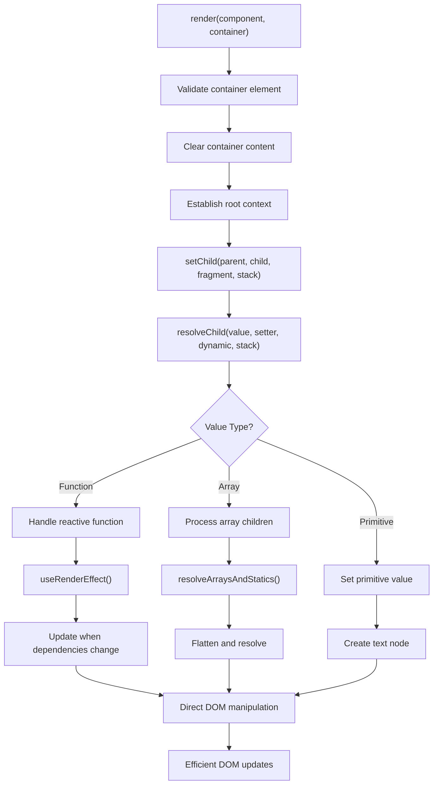
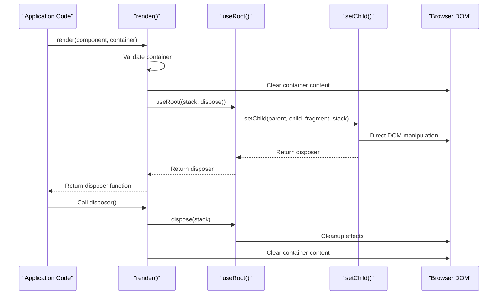
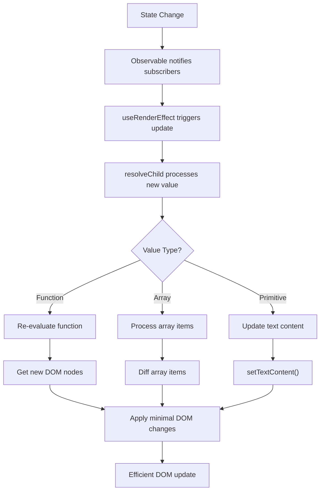

# Browser Rendering

<cite>
**Referenced Files in This Document**   
- [render.ts](file://src/methods/render.ts)
- [setters.ts](file://src/utils/setters.ts)
- [fragment.ts](file://src/utils/fragment.ts)
- [create_element.ts](file://src/methods/create_element.ts)
- [runtime.ts](file://src/jsx/runtime.ts)
- [h.ts](file://src/methods/h.ts)
- [soby.ts](file://src/hooks/soby.ts)
- [types.ts](file://src/types.ts)
</cite>

## Table of Contents
1. [Introduction](#introduction)
2. [Rendering Pipeline Overview](#rendering-pipeline-overview)
3. [The render() Function](#the-render-function)
4. [Component Lifecycle Management](#component-lifecycle-management)
5. [Reactive Update Mechanism](#reactive-update-mechanism)
6. [JSX Integration and h() Function](#jsx-integration-and-h-function)
7. [Direct DOM Manipulation](#direct-dom-manipulation)
8. [Performance Considerations](#performance-considerations)
9. [Common Issues and Solutions](#common-issues-and-solutions)
10. [Code Examples](#code-examples)

## Introduction
Woby's browser rendering implementation provides a lightweight, efficient approach to DOM manipulation without relying on a virtual DOM. The framework leverages fine-grained observables to create a reactive system that directly updates the DOM when state changes occur. This document details the rendering pipeline, reactive mechanisms, and integration points that enable Woby to achieve high performance while maintaining a simple API for developers.

**Section sources**
- [render.ts](file://src/methods/render.ts#L8-L29)
- [setters.ts](file://src/utils/setters.ts#L386-L389)

## Rendering Pipeline Overview
The rendering pipeline in Woby follows a direct approach to DOM manipulation, bypassing the virtual DOM diffing process used by many other frameworks. When a component is rendered, Woby creates a direct connection between observable state and DOM elements, ensuring that updates are propagated efficiently without unnecessary re-renders.

The pipeline begins with the `render()` function, which takes a component and a container element as parameters. It first validates the container, clears its content, and then establishes a root context for tracking reactive dependencies. The actual DOM manipulation is handled by the `setChild()` function, which recursively processes the component tree and applies changes directly to the DOM.



**Diagram sources**
- [render.ts](file://src/methods/render.ts#L8-L29)
- [setters.ts](file://src/utils/setters.ts#L386-L389)
- [resolvers.ts](file://src/utils/resolvers.ts#L27-L68)

## The render() Function
The `render()` function serves as the entry point for Woby's rendering system, responsible for mounting components to the DOM. It accepts two parameters: a child component (which can be a function, element, or primitive value) and an optional parent container element.

When called, `render()` performs several critical operations:
1. Validates that the parent container is a valid HTMLElement or ShadowRoot
2. Clears the container's existing content
3. Establishes a root context using `useRoot()` to manage the component's lifecycle
4. Calls `setChild()` to begin the DOM manipulation process
5. Returns a disposer function that can be used to unmount the component

The function's implementation ensures that components are properly mounted and that their lifecycle is managed correctly. The returned disposer function handles cleanup operations, including disposing of reactive effects and clearing the container content.



**Diagram sources**
- [render.ts](file://src/methods/render.ts#L8-L29)
- [setters.ts](file://src/utils/setters.ts#L386-L389)
- [soby.ts](file://src/hooks/soby.ts#L7)

## Component Lifecycle Management
Woby manages component lifecycles through a combination of the `useRoot()` hook and the disposer pattern. When a component is rendered, `useRoot()` establishes a context for tracking reactive dependencies and cleanup operations.

The lifecycle begins with component mounting, where the `render()` function sets up the initial DOM structure. During this phase, all reactive dependencies are established, and initial values are applied to the DOM. The `useRoot()` hook ensures that these dependencies are properly tracked and can be cleaned up when the component is unmounted.

Component unmounting is handled by the disposer function returned by `render()`. When called, this function:
1. Disposes of all reactive effects associated with the component
2. Clears the container's content
3. Removes any event listeners or other resources

This approach ensures that components are properly cleaned up, preventing memory leaks and maintaining application performance.

**Section sources**
- [render.ts](file://src/methods/render.ts#L8-L29)
- [soby.ts](file://src/hooks/soby.ts#L7)

## Reactive Update Mechanism
Woby's reactive update mechanism is built on fine-grained observables that enable efficient propagation of changes to the DOM. When a component's state changes, only the affected parts of the DOM are updated, minimizing unnecessary re-renders.

The mechanism works through several key functions:
- `resolveChild()`: Determines how to handle different types of child values (functions, arrays, primitives)
- `useRenderEffect()`: Establishes reactive dependencies and schedules updates
- `setChildStatic()`: Performs the actual DOM manipulation

When a reactive function is encountered, `resolveChild()` wraps it in a `useRenderEffect()` call, which ensures that the function is re-evaluated whenever its dependencies change. The resulting value is then passed to `setChildStatic()`, which applies the changes directly to the DOM.

This approach eliminates the need for virtual DOM diffing, as changes are propagated directly from the source of truth (the observable state) to the DOM target.



**Diagram sources**
- [resolvers.ts](file://src/utils/resolvers.ts#L27-L68)
- [setters.ts](file://src/utils/setters.ts#L386-L389)
- [soby.ts](file://src/hooks/soby.ts#L6)

## JSX Integration and h() Function
Woby integrates with JSX through the `jsx()` function and the `h()` function, which serve as the bridge between JSX syntax and the framework's rendering system. The `h()` function is responsible for creating elements from JSX expressions.

The `h()` function accepts three parameters:
1. A component (function, string tag name, or DOM node)
2. Props (an object containing component properties)
3. Children (one or more child elements)

When called, `h()` delegates to `createElement()`, which handles the actual element creation. For functional components, it calls the function with the provided props. For HTML elements, it creates the appropriate DOM node and applies the props.

The `jsx()` function from the runtime module wraps the element creation process, adding metadata and handling special cases like default props for custom elements. This integration allows developers to use familiar JSX syntax while leveraging Woby's efficient rendering system.

**Section sources**
- [h.ts](file://src/methods/h.ts#L8-L24)
- [runtime.ts](file://src/jsx/runtime.ts#L45-L77)
- [create_element.ts](file://src/methods/create_element.ts#L8-L129)

## Direct DOM Manipulation
Woby's direct DOM manipulation approach eliminates the overhead of virtual DOM diffing by updating the DOM directly in response to state changes. This is achieved through a combination of fine-grained observables and targeted DOM operations.

The framework uses several specialized functions for different types of DOM updates:
- `setAttributeStatic()`: Sets HTML attributes directly
- `setClassStatic()`: Manages CSS classes
- `setChildReplacementText()`: Updates text content efficiently
- `diff()`: Performs minimal DOM diffing when necessary

When a component is updated, Woby identifies the specific DOM nodes that need to change and applies the minimal set of operations required. For text content, it uses `nodeValue` updates rather than recreating elements. For attribute changes, it uses direct property access or `setAttribute()` calls.

This approach results in faster updates and reduced memory usage compared to virtual DOM-based frameworks.

**Section sources**
- [setters.ts](file://src/utils/setters.ts#L386-L389)
- [fragment.ts](file://src/utils/fragment.ts#L11-L147)

## Performance Considerations
Woby's rendering implementation prioritizes performance through several key strategies:

### Minimal Re-renders
By using fine-grained observables, Woby ensures that only the components and DOM nodes affected by a state change are updated. This eliminates the need for whole-component re-renders and virtual DOM diffing.

### Direct DOM Manipulation Benefits
Direct DOM manipulation provides several performance advantages:
- Eliminates virtual DOM creation and diffing overhead
- Reduces memory allocation and garbage collection
- Enables immediate DOM updates without batching
- Allows for more predictable performance characteristics

### Memory Management
Woby's disposer pattern ensures that all resources are properly cleaned up when components are unmounted. This includes:
- Disposing of reactive effects
- Removing event listeners
- Clearing references to DOM nodes
- Preventing memory leaks in long-running applications

These strategies combine to create a highly performant rendering system that scales well with application complexity.

**Section sources**
- [render.ts](file://src/methods/render.ts#L8-L29)
- [setters.ts](file://src/utils/setters.ts#L386-L389)
- [soby.ts](file://src/hooks/soby.ts#L7)

## Common Issues and Solutions
### Stale References
Stale references can occur when components maintain references to DOM nodes that have been removed. Woby addresses this through:
- The disposer pattern, which ensures cleanup on unmount
- Reactive tracking, which automatically updates references when needed
- The `SYMBOL_UNCACHED` marker, which indicates when values should not be cached

### Timing Issues with Microtasks
Timing issues can arise when updates are scheduled using microtasks. Woby mitigates these issues by:
- Using `useMicrotask()` for non-urgent updates
- Prioritizing immediate updates for critical operations
- Ensuring consistent update ordering through the stack system

### Solutions
Developers can avoid common issues by:
- Always using the returned disposer function to clean up components
- Avoiding direct DOM manipulation outside of Woby's reactive system
- Using the provided hooks for side effects and cleanup operations

**Section sources**
- [render.ts](file://src/methods/render.ts#L8-L29)
- [setters.ts](file://src/utils/setters.ts#L386-L389)
- [soby.ts](file://src/hooks/soby.ts#L7)

## Code Examples
### Basic Rendering
```typescript
// Mount a simple component to the DOM
const App = () => <div>Hello World</div>;
const dispose = render(<App />, document.getElementById('app'));

// Clean up when needed
// dispose();
```

### Advanced Rendering with State
```typescript
// Component with reactive state
const Counter = () => {
  const count = observable(0);
  
  return (
    <div>
      <p>Count: {count}</p>
      <button onClick={() => count(count() + 1)}>
        Increment
      </button>
    </div>
  );
};

render(<Counter />, document.getElementById('app'));
```

**Section sources**
- [render.ts](file://src/methods/render.ts#L8-L29)
- [h.ts](file://src/methods/h.ts#L8-L24)
- [create_element.ts](file://src/methods/create_element.ts#L8-L129)