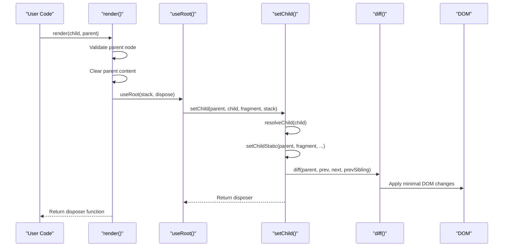
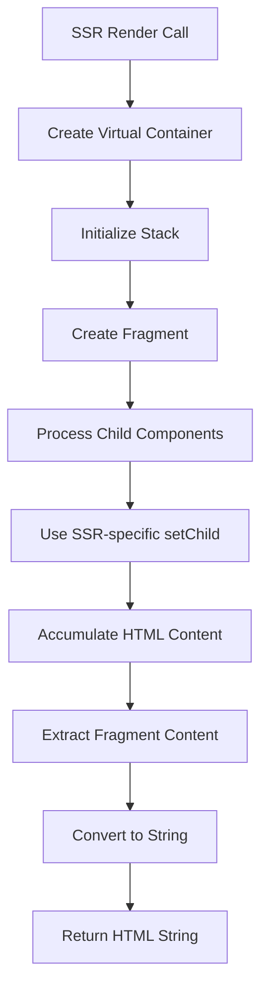
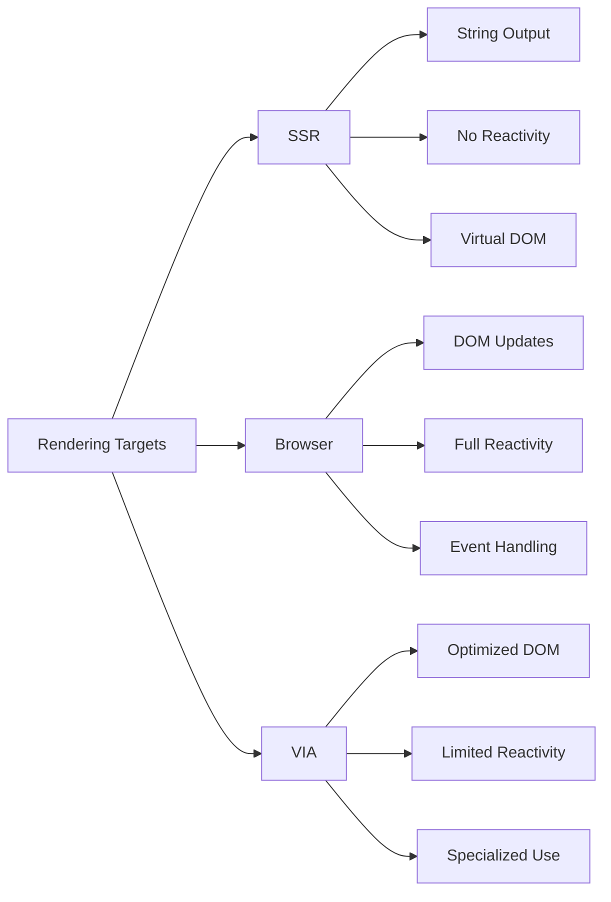
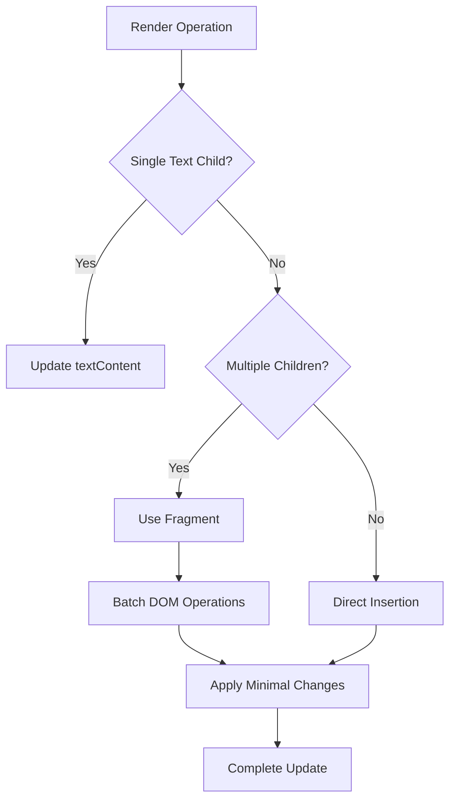

# Rendering

<cite>
**Referenced Files in This Document**   
- [render.ts](file://src/methods/render.ts)
- [render.ssr.ts](file://src/methods/render.ssr.ts)
- [render.testing.ts](file://src/methods/render.testing.ts)
- [render.via.ts](file://src/methods/render.via.ts)
- [setters.ts](file://src/utils/setters.ts)
- [setters.ssr.ts](file://src/utils/setters.ssr.ts)
- [fragment.ts](file://src/utils/fragment.ts)
- [fragment.ssr.ts](file://src/utils/fragment.ssr.ts)
- [ssr-runtime.ts](file://src/ssr/ssr-runtime.ts)
- [jsx-runtime.ts](file://src/ssr/jsx-runtime.ts)
- [index.ts](file://src/ssr/jsx-runtime/index.ts)
</cite>

## Table of Contents
1. [Introduction](#introduction)
2. [Browser Rendering Implementation](#browser-rendering-implementation)
3. [Server-Side Rendering Capabilities](#server-side-rendering-capabilities)
4. [Testing Rendering](#testing-rendering)
5. [Rendering Targets Comparison](#rendering-targets-comparison)
6. [Practical Usage Examples](#practical-usage-examples)
7. [Performance Optimization Techniques](#performance-optimization-techniques)
8. [Common Rendering Issues](#common-rendering-issues)
9. [Choosing the Appropriate Rendering Method](#choosing-the-appropriate-rendering-method)
10. [Conclusion](#conclusion)

## Introduction
Woby's rendering system provides a comprehensive solution for rendering components across different environments including browser, server-side, and testing contexts. The system is designed with performance, flexibility, and developer experience in mind, offering multiple rendering targets to suit various use cases. This document explores the architecture and implementation details of Woby's rendering system, focusing on the core rendering functions, server-side rendering capabilities, testing utilities, and performance considerations.

## Browser Rendering Implementation

Woby's browser rendering implementation in `render.ts` follows a structured pipeline that efficiently updates the DOM while maintaining reactivity. The rendering process begins with the `render` function, which serves as the entry point for mounting components to the DOM.

The rendering pipeline consists of several key stages:
1. **Parent validation**: Ensures the parent node is a valid HTMLElement or ShadowRoot
2. **Content clearing**: Clears existing content from the parent node
3. **Root creation**: Uses `useRoot` to establish a reactive context
4. **Child setting**: Utilizes `setChild` to process and insert the component tree
5. **Disposal mechanism**: Provides a cleanup function for unmounting

DOM updates are handled through a sophisticated diffing algorithm that minimizes direct DOM manipulations. The system uses fragment-based updates to batch changes and optimize performance. When updates occur, Woby compares the previous and next states of the component tree and applies the minimal set of DOM operations needed to achieve the desired state.

The implementation leverages reactive programming patterns through the `useRoot` hook, which manages the lifecycle of reactive computations. This ensures that updates are automatically triggered when underlying data changes, while maintaining efficient update batching.



**Diagram sources**
- [render.ts](file://src/methods/render.ts#L8-L29)
- [setters.ts](file://src/utils/setters.ts#L386-L389)
- [fragment.ts](file://src/utils/fragment.ts#L11-L147)

**Section sources**
- [render.ts](file://src/methods/render.ts#L8-L29)
- [setters.ts](file://src/utils/setters.ts#L192-L384)

## Server-Side Rendering Capabilities

Woby's server-side rendering (SSR) capabilities are implemented in `render.ssr.ts` and the `ssr/` directory, providing efficient HTML generation for server environments. The SSR system is designed to produce static HTML markup that can be hydrated on the client side, enabling faster initial page loads and improved SEO.

The SSR rendering process differs significantly from browser rendering in several key aspects:

1. **String-based output**: Instead of manipulating DOM nodes, SSR returns a string representation of the rendered content
2. **No direct DOM access**: The implementation uses virtual containers and fragment utilities to build the output
3. **Simplified lifecycle**: Without the need for reactivity or event handling, the SSR process is more straightforward

The `render` function in `render.ssr.ts` creates a virtual container object with a `children` property to accumulate the rendered content. It uses the SSR-specific `FragmentUtils` to manage the component tree structure and `setChild` to process each component. The final output is generated by extracting the rendered content from the fragment and converting it to a string.

Hydration considerations are addressed through consistent fragment structures between server and client rendering. The system ensures that the server-generated HTML structure matches what would be created by the client, enabling seamless hydration. This is achieved by using the same diffing logic and fragment management patterns in both environments.

Streaming considerations are also important in SSR implementations. While the current implementation generates the complete HTML string before sending it to the client, the architecture supports potential streaming enhancements through incremental fragment processing and chunked responses.



**Diagram sources**
- [render.ssr.ts](file://src/methods/render.ssr.ts#L7-L25)
- [setters.ssr.ts](file://src/utils/setters.ssr.ts#L356-L360)
- [fragment.ssr.ts](file://src/utils/fragment.ssr.ts#L8-L144)

**Section sources**
- [render.ssr.ts](file://src/methods/render.ssr.ts#L7-L25)
- [ssr-runtime.ts](file://src/ssr/ssr-runtime.ts#L0-L1)
- [jsx-runtime.ts](file://src/ssr/jsx-runtime.ts#L0-L0)

## Testing Rendering

The testing rendering implementation in `render.testing.ts` provides utilities for testing components in isolated environments. This implementation creates a controlled DOM context for testing purposes, allowing developers to verify component behavior without relying on a full browser environment.

Key features of the testing rendering system include:

1. **Isolated DOM creation**: Creates a dedicated `div` element for rendering components
2. **Test utilities**: Provides helper functions like `getByRole`, `getByTestId`, and `getByText` for querying rendered content
3. **Lifecycle management**: Returns an unmount function to clean up after tests
4. **Debugging support**: Includes console logging for debugging test failures

The implementation follows a similar pattern to browser rendering but with additional testing-specific features. It creates a fragment element and uses the standard `setChild` function to render components. The key difference is that it also provides query utilities that make it easier to assert on the rendered output.

Integration with testing frameworks is seamless, as the returned object contains all necessary methods for testing. The `getBy*` functions follow common testing library patterns, making it familiar to developers who have used other testing utilities.

```mermaid
classDiagram
class RenderTesting {
+fragment : HTMLDivElement
+unmount : Function
+getByRole(tag) : Element
+getByTestId(id) : Element
+getByText(text) : Element
}
class RenderImplementation {
-useRoot()
-setChild()
-FragmentUtils
}
RenderTesting --> RenderImplementation : "uses"
RenderTesting --> "DOM" : "creates"
```

**Diagram sources**
- [render.testing.ts](file://src/methods/render.testing.ts#L8-L80)
- [setters.ts](file://src/utils/setters.ts#L386-L389)

**Section sources**
- [render.testing.ts](file://src/methods/render.testing.ts#L8-L80)

## Rendering Targets Comparison

Woby supports multiple rendering targets, each optimized for specific use cases. The main rendering targets are SSR (Server-Side Rendering), VIA (a specialized rendering mode), and browser rendering.

### SSR vs Browser vs VIA

| Feature | SSR | Browser | VIA |
|-------|-----|---------|-----|
| Output Type | String | DOM Manipulation | DOM Manipulation |
| Reactivity | None | Full | Limited |
| DOM Access | Virtual | Direct | Direct |
| Use Case | Initial Page Load | Interactive Apps | Specialized Scenarios |
| Performance | Fast Generation | Dynamic Updates | Optimized for Specific Cases |

The implementation differences between these targets are significant:

1. **SSR (`render.ssr.ts`)**: Focuses on generating static HTML strings without reactivity. Uses virtual containers and returns string output.

2. **Browser (`render.ts`)**: Full-featured rendering with reactivity, event handling, and DOM updates. Uses `useRoot` for reactive context management.

3. **VIA (`render.via.ts`)**: A specialized rendering mode with simplified DOM handling. Has fewer validation checks and uses VIA-specific setters.

The core differences in implementation can be seen in the parameter signatures and internal processing:

- SSR render takes only a child parameter and returns a string
- Browser render takes child and parent parameters and returns a disposer function
- VIA render has a similar signature to browser render but uses different internal utilities

These differences reflect the varying requirements of each rendering target, with SSR prioritizing output generation, browser rendering focusing on interactivity, and VIA optimizing for specific performance characteristics.



**Diagram sources**
- [render.ts](file://src/methods/render.ts#L8-L29)
- [render.ssr.ts](file://src/methods/render.ssr.ts#L7-L25)
- [render.via.ts](file://src/methods/render.via.ts#L4-L24)

**Section sources**
- [render.ts](file://src/methods/render.ts#L8-L29)
- [render.ssr.ts](file://src/methods/render.ssr.ts#L7-L25)
- [render.via.ts](file://src/methods/render.via.ts#L4-L24)

## Practical Usage Examples

### Basic Browser Rendering
```typescript
import { render } from 'woby/methods/render';

const App = () => <div>Hello World</div>;
render(<App />, document.getElementById('root'));
```

### Server-Side Rendering
```typescript
import { render } from 'woby/methods/render.ssr';

const App = () => <div>Hello World</div>;
const html = render(<App />);
console.log(html); // <div>Hello World</div>
```

### Testing Components
```typescript
import { render } from 'woby/methods/render.testing';

test('renders hello world', () => {
  const { getByText, unmount } = render(<div>Hello World</div>);
  expect(getByText('Hello World')).toBeInTheDocument();
  unmount();
});
```

### Conditional Rendering
```typescript
const ConditionalComponent = ({ show }) => {
  const visible = useSignal(show);
  return (
    <div>
      {visible() ? <span>Visible</span> : <span>Hidden</span>}
    </div>
  );
};

// In browser
render(<ConditionalComponent show={true} />, container);

// In SSR
const html = render(<ConditionalComponent show={true} />);
```

### List Rendering
```typescript
const ListComponent = () => {
  const items = useSignal(['Item 1', 'Item 2', 'Item 3']);
  return (
    <ul>
      {items().map(item => <li>{item}</li>)}
    </ul>
  );
};
```

These examples demonstrate the consistent API across different rendering targets while highlighting the specific usage patterns for each environment.

**Section sources**
- [render.ts](file://src/methods/render.ts#L8-L29)
- [render.ssr.ts](file://src/methods/render.ssr.ts#L7-L25)
- [render.testing.ts](file://src/methods/render.testing.ts#L8-L80)

## Performance Optimization Techniques

Woby's rendering system incorporates several performance optimization techniques:

1. **Fragment-based updates**: Uses fragment objects to batch DOM operations and minimize reflows
2. **Efficient diffing algorithm**: Implements a smart diffing strategy that minimizes unnecessary DOM manipulations
3. **Reactivity batching**: Groups reactive updates to reduce the number of render cycles
4. **Fast paths for common cases**: Optimizes for frequent scenarios like text node updates
5. **Lazy evaluation**: Defers computation until absolutely necessary

The system employs several specific optimizations:

- **Text node replacement**: When updating a single text child, directly modifies the text content rather than replacing the entire node
- **Placeholder management**: Uses comment nodes as placeholders to maintain position in the DOM tree
- **Array handling**: Optimizes array operations by tracking length and using appropriate insertion strategies
- **Event delegation**: Implements event delegation for common events to reduce memory usage

These optimizations work together to ensure that rendering operations are as efficient as possible, minimizing the performance impact of DOM updates.



**Diagram sources**
- [setters.ts](file://src/utils/setters.ts#L192-L384)
- [setters.ssr.ts](file://src/utils/setters.ssr.ts#L163-L354)

**Section sources**
- [setters.ts](file://src/utils/setters.ts#L192-L384)
- [setters.ssr.ts](file://src/utils/setters.ssr.ts#L163-L354)

## Common Rendering Issues

Developers may encounter several common issues when working with Woby's rendering system:

1. **Invalid parent node**: Passing a non-HTMLElement or null parent to the render function
2. **Memory leaks**: Failing to call the disposer function when unmounting components
3. **SSR-client mismatch**: Differences between server-rendered and client-rendered content
4. **Reactivity issues**: Signals not triggering updates as expected
5. **Performance bottlenecks**: Excessive re-renders or inefficient component structures

Solutions to these issues include:

- Always validate parent nodes before rendering
- Ensure disposer functions are called during cleanup
- Use consistent component structures between SSR and client rendering
- Verify signal dependencies and update triggers
- Optimize component hierarchies and minimize unnecessary re-renders

The system provides debugging utilities and clear error messages to help identify and resolve these issues.

**Section sources**
- [render.ts](file://src/methods/render.ts#L8-L29)
- [render.ssr.ts](file://src/methods/render.ssr.ts#L7-L25)
- [render.testing.ts](file://src/methods/render.testing.ts#L8-L80)

## Choosing the Appropriate Rendering Method

Selecting the right rendering method depends on several factors:

### Server-Side Rendering (SSR)
Use SSR when:
- SEO is a priority
- Initial load performance is critical
- Content is mostly static
- You need to pre-render pages

### Browser Rendering
Use browser rendering when:
- High interactivity is required
- Content is highly dynamic
- Real-time updates are needed
- Client-side state management is essential

### VIA Rendering
Use VIA rendering when:
- You have specialized performance requirements
- Working with specific integration scenarios
- Need optimized rendering for particular use cases

The choice should be guided by the specific requirements of your application, considering factors like performance, SEO, interactivity, and deployment constraints.

**Section sources**
- [render.ts](file://src/methods/render.ts#L8-L29)
- [render.ssr.ts](file://src/methods/render.ssr.ts#L7-L25)
- [render.via.ts](file://src/methods/render.via.ts#L4-L24)

## Conclusion
Woby's rendering system provides a robust and flexible foundation for building applications across different environments. By offering specialized rendering targets for server, browser, and testing contexts, Woby enables developers to optimize their applications for specific use cases while maintaining a consistent API. The system's focus on performance, reactivity, and developer experience makes it well-suited for modern web applications with diverse rendering requirements.