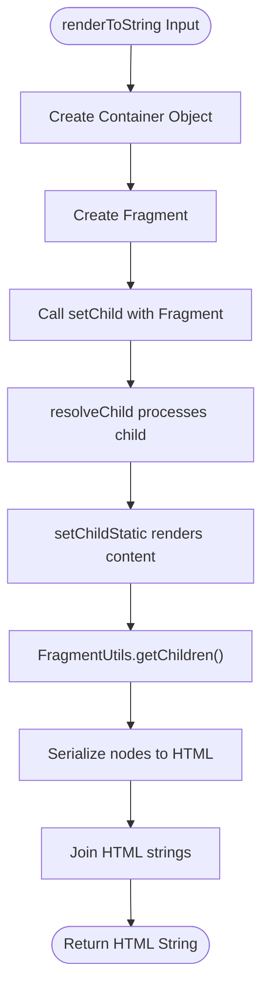
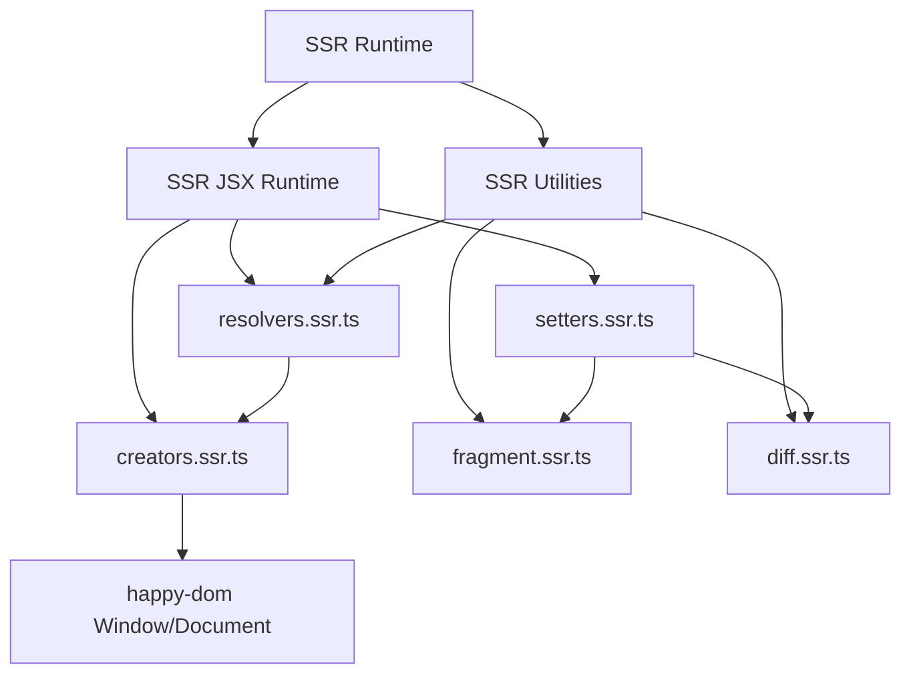
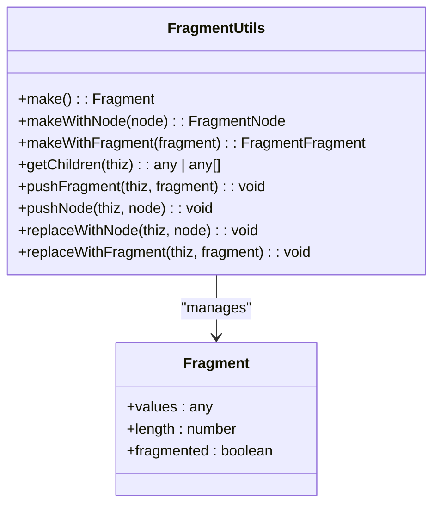
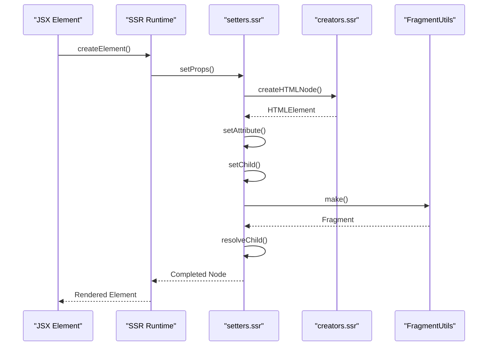
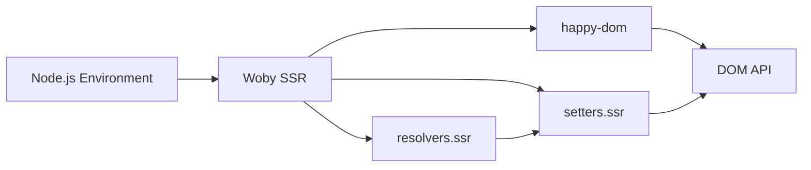
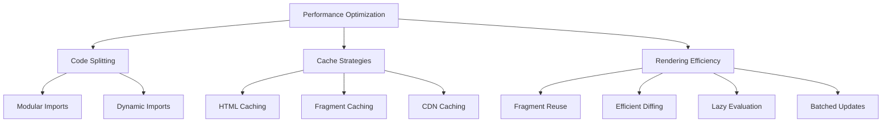

# Server-Side Rendering

<cite>
**Referenced Files in This Document**   
- [render.ssr.ts](file://src/methods/render.ssr.ts)
- [render_to_string.ssr.ts](file://src/methods/render_to_string.ssr.ts)
- [ssr-runtime.ts](file://src/ssr/ssr-runtime.ts)
- [jsx-runtime.ts](file://src/ssr/jsx-runtime.ts)
- [resolvers.ssr.ts](file://src/utils/resolvers.ssr.ts)
- [creators.ssr.ts](file://src/utils/creators.ssr.ts)
- [setters.ssr.ts](file://src/utils/setters.ssr.ts)
- [diff.ssr.ts](file://src/utils/diff.ssr.ts)
- [fragment.ssr.ts](file://src/utils/fragment.ssr.ts)
</cite>

## Table of Contents
1. [Introduction](#introduction)
2. [Core SSR Implementation](#core-ssr-implementation)
3. [SSR Runtime Environment](#ssr-runtime-environment)
4. [DOM Serialization and HTML Generation](#dom-serialization-and-html-generation)
5. [Hydration Strategies](#hydration-strategies)
6. [SSR-Specific JSX Runtime](#ssr-specific-jsx-runtime)
7. [Streaming SSR and Progressive Rendering](#streaming-ssr-and-progressive-rendering)
8. [Integration with Node.js Environments](#integration-with-nodejs-environments)
9. [Practical SSR Setup with Express](#practical-ssr-setup-with-express)
10. [Common Challenges and Solutions](#common-challenges-and-solutions)
11. [Performance Optimization](#performance-optimization)

## Introduction
Woby's server-side rendering (SSR) system provides a comprehensive solution for generating static HTML on the server and seamlessly hydrating it on the client. The system leverages a custom SSR runtime environment built on happy-dom to simulate browser APIs, enabling consistent rendering across server and client environments. This documentation details the implementation of the SSR system, focusing on the core rendering functions, runtime utilities, and integration patterns that enable efficient server-side rendering.

## Core SSR Implementation

The core SSR functionality is implemented in `render.ssr.ts` and `render_to_string.ssr.ts`, which provide the primary interfaces for server-side rendering. These functions work together to transform Woby components into static HTML strings that can be sent to the client.



**Diagram sources**
- [render_to_string.ssr.ts](file://src/methods/render_to_string.ssr.ts#L6-L40)
- [setters.ssr.ts](file://src/utils/setters.ssr.ts#L356-L360)
- [resolvers.ssr.ts](file://src/utils/resolvers.ssr.ts#L11-L50)

**Section sources**
- [render.ssr.ts](file://src/methods/render.ssr.ts#L7-L25)
- [render_to_string.ssr.ts](file://src/methods/render_to_string.ssr.ts#L6-L40)

## SSR Runtime Environment

Woby's SSR system utilizes a dedicated runtime environment in the `src/ssr/` directory that provides server-optimized implementations of core rendering functionality. The SSR runtime replaces browser-dependent operations with server-friendly alternatives while maintaining the same API surface.



**Diagram sources**
- [ssr-runtime.ts](file://src/ssr/ssr-runtime.ts#L1)
- [jsx-runtime.ts](file://src/ssr/jsx-runtime.ts#L1)
- [creators.ssr.ts](file://src/utils/creators.ssr.ts#L1)

**Section sources**
- [ssr-runtime.ts](file://src/ssr/ssr-runtime.ts#L1)
- [jsx-runtime.ts](file://src/ssr/jsx-runtime.ts#L1)
- [creators.ssr.ts](file://src/utils/creators.ssr.ts#L1-L18)

## DOM Serialization and HTML Generation

The SSR system handles DOM serialization through a combination of fragment management and node serialization utilities. The `FragmentUtils` from `fragment.ssr.ts` manages collections of rendered nodes, while the rendering functions convert these fragments into HTML strings.



The serialization process follows these steps:
1. Create a fragment to hold the rendered content
2. Use `setChild` to render the component tree into the fragment
3. Extract the rendered nodes using `FragmentUtils.getChildren`
4. Convert each node to HTML using its `outerHTML` or `textContent` property
5. Join the HTML strings into a complete document

**Diagram sources**
- [fragment.ssr.ts](file://src/utils/fragment.ssr.ts#L8-L144)
- [render_to_string.ssr.ts](file://src/methods/render_to_string.ssr.ts#L6-L40)

**Section sources**
- [fragment.ssr.ts](file://src/utils/fragment.ssr.ts#L8-L144)
- [render_to_string.ssr.ts](file://src/methods/render_to_string.ssr.ts#L6-L40)

## Hydration Strategies

While the provided code focuses on server-side rendering, the SSR system is designed to support client-side hydration. The generated HTML includes all necessary attributes and structure to allow the client-side Woby runtime to attach event handlers and reactivity. The fragment system ensures that the server-rendered DOM structure can be efficiently updated by the client.

The hydration process would typically:
1. Parse the server-rendered HTML
2. Locate the root element for hydration
3. Attach Woby's reactive system to existing DOM nodes
4. Restore event listeners and directives
5. Initialize any remaining client-only components

**Section sources**
- [setters.ssr.ts](file://src/utils/setters.ssr.ts#L356-L360)
- [resolvers.ssr.ts](file://src/utils/resolvers.ssr.ts#L11-L50)

## SSR-Specific JSX Runtime

The SSR system includes a specialized JSX runtime in `src/ssr/jsx-runtime/` that optimizes rendering for server environments. This runtime replaces browser-specific operations with server-friendly alternatives while maintaining compatibility with the standard Woby JSX syntax.

The SSR JSX runtime components:
- Use happy-dom for DOM node creation
- Implement server-optimized attribute and property setting
- Handle event listeners through delegation
- Support directives and refs in SSR context
- Manage CSS classes and styles efficiently



**Diagram sources**
- [jsx-runtime.ts](file://src/ssr/jsx-runtime.ts#L1)
- [setters.ssr.ts](file://src/utils/setters.ssr.ts#L356-L360)
- [creators.ssr.ts](file://src/utils/creators.ssr.ts#L1-L18)

**Section sources**
- [jsx-runtime.ts](file://src/ssr/jsx-runtime.ts#L1)
- [setters.ssr.ts](file://src/utils/setters.ssr.ts#L1-L1051)
- [creators.ssr.ts](file://src/utils/creators.ssr.ts#L1-L18)

## Streaming SSR and Progressive Rendering

The current implementation focuses on synchronous SSR rendering, but the architecture supports streaming and progressive rendering patterns. The fragment-based approach and incremental DOM diffing provide a foundation for chunked responses and progressive hydration.

Potential streaming implementation:
1. Render initial visible content first
2. Stream HTML chunks to the client
3. Continue rendering non-critical components
4. Send additional chunks as they complete
5. Client progressively hydrates as content arrives

The `useRenderEffect` and microtask scheduling in the setters system already provide mechanisms that could be extended for streaming scenarios.

**Section sources**
- [setters.ssr.ts](file://src/utils/setters.ssr.ts#L356-L360)
- [resolvers.ssr.ts](file://src/utils/resolvers.ssr.ts#L11-L50)

## Integration with Node.js Environments

Woby's SSR system is designed for seamless integration with Node.js environments. The implementation avoids browser-specific globals and uses happy-dom to provide a consistent DOM API. The SSR runtime handles browser globals through polyfills and server-appropriate alternatives.

Key integration points:
- Uses happy-dom's Window and Document implementations
- Avoids client-only APIs in SSR context
- Provides server-optimized versions of DOM operations
- Handles module resolution for SSR bundles
- Supports common Node.js server frameworks



**Diagram sources**
- [creators.ssr.ts](file://src/utils/creators.ssr.ts#L1-L18)
- [setters.ssr.ts](file://src/utils/setters.ssr.ts#L1-L1051)

**Section sources**
- [creators.ssr.ts](file://src/utils/creators.ssr.ts#L1-L18)
- [setters.ssr.ts](file://src/utils/setters.ssr.ts#L1-L1051)

## Practical SSR Setup with Express

While the core SSR functions are framework-agnostic, they can be easily integrated with Express or similar servers. A typical setup would:

1. Import the SSR rendering functions
2. Create an Express route handler
3. Render the component to a string
4. Send the HTML response with proper headers

Example integration pattern:
```typescript
import { renderToString } from '@woby/ssr'
import express from 'express'

const app = express()

app.get('*', async (req, res) => {
  const html = await renderToString(<App url={req.url} />)
  res.send(`
    <!DOCTYPE html>
    <html>
      <body>${html}</body>
      <script src="/client.js"></script>
    </html>
  `)
})
```

**Section sources**
- [render_to_string.ssr.ts](file://src/methods/render_to_string.ssr.ts#L6-L40)
- [render.ssr.ts](file://src/methods/render.ssr.ts#L7-L25)

## Common Challenges and Solutions

### Style Injection
The SSR system handles CSS classes and styles through the `setClasses` and `setStyles` functions in `setters.ssr.ts`. These functions ensure consistent class and style application during server rendering.

### Script Placement
Scripts are not directly managed by the SSR system, but the generated HTML can include script tags in the appropriate locations. The client-side hydration script should be placed at the end of the body.

### Hydration Mismatches
The fragment-based rendering approach minimizes hydration mismatches by ensuring the server and client produce identical DOM structures. The use of happy-dom provides a consistent environment for both server and client rendering.

**Section sources**
- [setters.ssr.ts](file://src/utils/setters.ssr.ts#L356-L360)
- [creators.ssr.ts](file://src/utils/creators.ssr.ts#L1-L18)

## Performance Optimization

### Code Splitting
The modular architecture of the SSR system supports code splitting. Components and utilities can be imported on-demand to reduce initial bundle size.

### Cache Strategies
The SSR system can be combined with caching mechanisms:
- Cache rendered HTML for static routes
- Use fragment caching for dynamic content
- Implement request-level caching with ETags
- Leverage CDN caching for static assets

### Rendering Efficiency
The implementation includes several performance optimizations:
- Fragment reuse to minimize DOM operations
- Efficient diffing algorithm for updates
- Lazy evaluation of reactive expressions
- Batched updates through microtasks



**Diagram sources**
- [setters.ssr.ts](file://src/utils/setters.ssr.ts#L1-L1051)
- [diff.ssr.ts](file://src/utils/diff.ssr.ts#L1-L202)

**Section sources**
- [setters.ssr.ts](file://src/utils/setters.ssr.ts#L1-L1051)
- [diff.ssr.ts](file://src/utils/diff.ssr.ts#L1-L202)