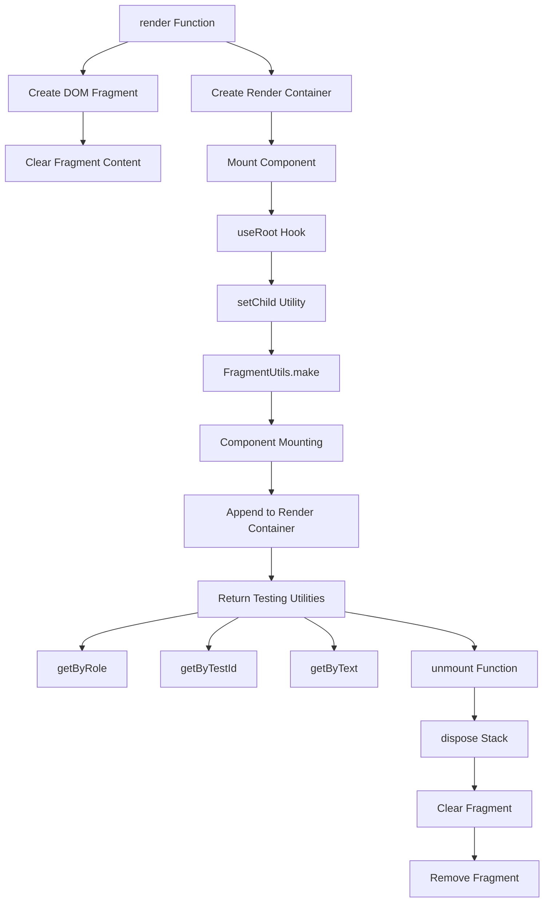

# Testing Rendering

<cite>
**Referenced Files in This Document**   
- [render.testing.ts](file://src/methods/render.testing.ts)
- [testing.ts](file://src/testing.ts)
</cite>

## Table of Contents
1. [Introduction](#introduction)
2. [Core Components](#core-components)
3. [Testing Renderer Architecture](#testing-renderer-architecture)
4. [Component Testing Patterns](#component-testing-patterns)
5. [Integration with Testing Frameworks](#integration-with-testing-frameworks)
6. [Advanced Testing Features](#advanced-testing-features)
7. [Limitations and Workarounds](#limitations-and-workarounds)
8. [Best Practices](#best-practices)

## Introduction
The Woby testing renderer provides a lightweight solution for testing components in a controlled environment without requiring a real DOM. It enables developers to mount components, trigger updates, and assert output in unit and integration tests. The renderer creates a virtual DOM environment that simulates component rendering while maintaining the core reactivity system of Woby. This approach allows for fast, reliable testing of components that use hooks, suspense, and other advanced features without the overhead of browser-based testing environments.

## Core Components

The testing renderer is implemented in the `render.testing.ts` file and exported through the testing module. It provides a `render` function that creates a controlled environment for component testing by leveraging Woby's reactivity system and DOM manipulation utilities. The renderer creates isolated DOM fragments for each test, allowing components to be mounted and unmounted without affecting other tests. It also provides query utilities for finding elements by role, test ID, or text content, enabling comprehensive assertion capabilities.

**Section sources**
- [render.testing.ts](file://src/methods/render.testing.ts#L1-L83)
- [testing.ts](file://src/testing.ts#L1-L17)

## Testing Renderer Architecture

**Diagram sources**
- [render.testing.ts](file://src/methods/render.testing.ts#L1-L83)

**Section sources**
- [render.testing.ts](file://src/methods/render.testing.ts#L1-L83)

## Component Testing Patterns

The testing renderer supports various patterns for testing different types of components. For components using hooks, the renderer maintains the reactivity chain by properly handling observables and their dependencies. When testing suspense components, the renderer captures the suspended state and allows tests to resolve promises to continue rendering. For components with dynamic imports, the renderer isolates the import resolution process, enabling tests to mock or control the loading behavior.

The `getByRole`, `getByTestId`, and `getByText` utilities provide flexible ways to query the rendered output. `getByRole` finds elements by their HTML tag name, `getByTestId` locates elements with specific `data-testid` attributes, and `getByText` searches for elements containing specific text content (either as a string or regular expression). These utilities throw descriptive errors when elements are not found, aiding in test debugging.

**Section sources**
- [render.testing.ts](file://src/methods/render.testing.ts#L43-L83)

## Integration with Testing Frameworks

The testing renderer integrates seamlessly with popular testing frameworks like Jest and Vitest. It can be used as a drop-in replacement for framework-specific rendering utilities, providing consistent behavior across different test runners. The renderer's lightweight nature makes it ideal for unit tests, where speed and isolation are critical. For integration tests, the renderer can be combined with framework-specific mocking utilities to simulate complex scenarios involving network requests, timers, or browser APIs.

When used with Jest, the renderer works well with Jest's mocking system, allowing developers to mock observables, hooks, or async resources. With Vitest, the renderer benefits from Vitest's native ESM support and fast test execution. The renderer's API is designed to be framework-agnostic, making it easy to write tests that can run in different environments without modification.

**Section sources**
- [render.testing.ts](file://src/methods/render.testing.ts#L1-L83)

## Advanced Testing Features

The testing renderer includes several advanced features for testing complex component behaviors. The `unmount` function returned by the renderer properly cleans up all subscriptions and disposables, preventing memory leaks between tests. This is particularly important for components that use `useEffect`, `useInterval`, or other hooks that create side effects.

For suspense testing, the renderer captures the suspended state and allows tests to resolve promises to continue rendering. This enables testing of loading states, error boundaries, and asynchronous data fetching. The renderer also supports testing error boundaries by allowing components to throw errors during rendering, which can then be caught and asserted.

The renderer's use of `useRoot` ensures that all reactive computations are properly tracked and disposed of, even in complex scenarios involving nested components or conditional rendering. This provides a reliable foundation for testing components with sophisticated reactivity patterns.

**Section sources**
- [render.testing.ts](file://src/methods/render.testing.ts#L15-L35)

## Limitations and Workarounds

The testing renderer has some limitations compared to full browser behavior. It does not support all DOM APIs, particularly those related to layout, styling, or user interaction. For example, methods like `getBoundingClientRect` or `scrollIntoView` are not fully implemented. Additionally, the renderer does not simulate browser events in the same way as a real DOM, which can affect tests that rely on event propagation or timing.

To work around these limitations, developers can mock the missing APIs or use alternative testing strategies. For layout-related tests, snapshot testing can verify the structure of rendered output. For event testing, the renderer's query utilities can be combined with direct function calls to simulate user interactions. For complex scenarios requiring full browser behavior, the renderer can be used alongside browser-based testing tools, with the renderer handling unit tests and browser tools handling integration tests.

**Section sources**
- [render.testing.ts](file://src/methods/render.testing.ts#L1-L83)

## Best Practices

When writing tests with the Woby testing renderer, several best practices can improve reliability, speed, and maintainability. First, always use `data-testid` attributes for querying elements, as they provide a stable interface that is less likely to break when implementation details change. Second, clean up tests properly by calling the `unmount` function to prevent memory leaks and ensure test isolation.

Third, prefer testing behavior over implementation details. Instead of asserting specific DOM structures, test the observable outcomes of component behavior. Fourth, use descriptive test names that clearly communicate the expected behavior. Fifth, group related tests together and use setup/teardown functions to reduce duplication.

Finally, leverage Woby's reactivity system in tests by creating observables for test data and using them to trigger updates. This allows tests to verify that components respond correctly to state changes without relying on implementation-specific update mechanisms.

**Section sources**
- [render.testing.ts](file://src/methods/render.testing.ts#L1-L83)