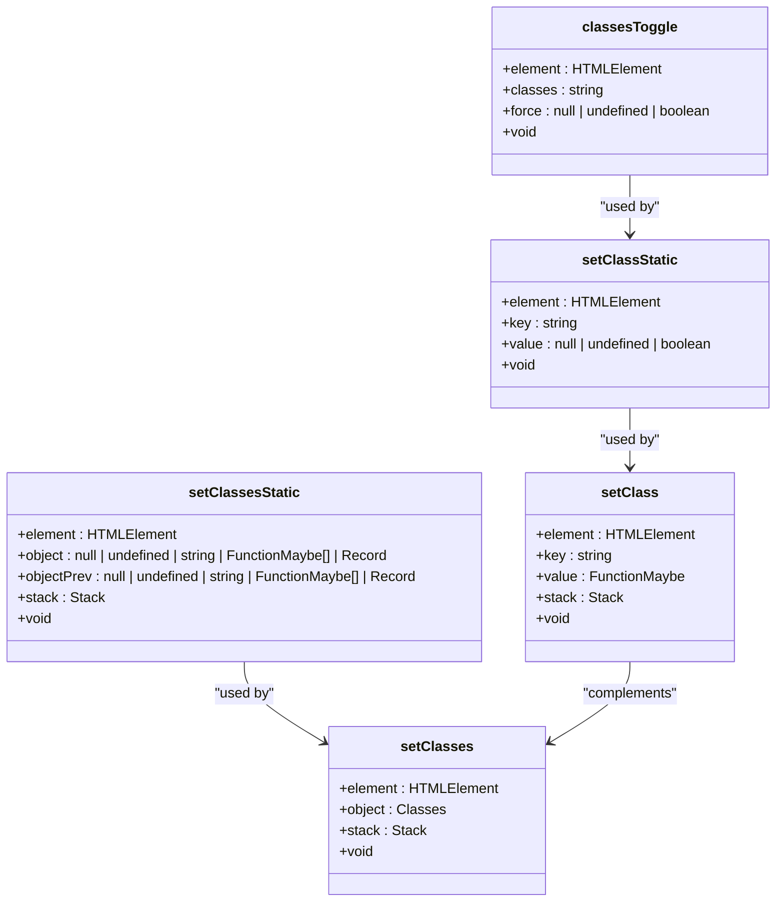
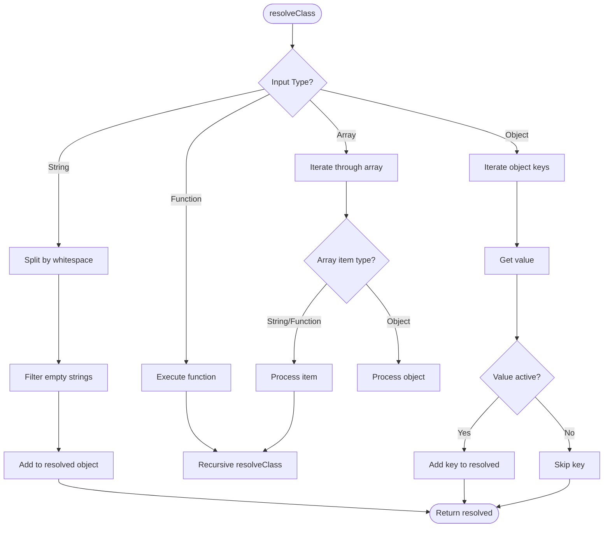
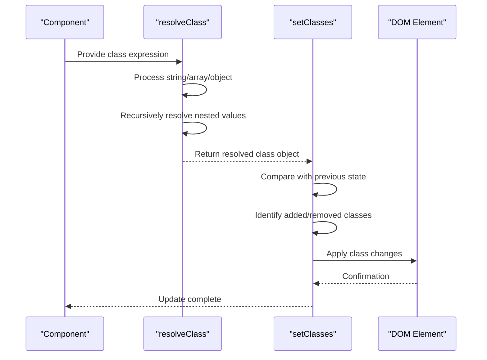

# Class Management

<cite>
**Referenced Files in This Document**   
- [classlist.ts](file://src/utils/classlist.ts)
- [html-class.ts](file://src/html/html-class.ts)
- [setters.ts](file://src/utils/setters.ts)
- [resolvers.ts](file://src/utils/resolvers.ts)
- [types.ts](file://src/types.ts)
</cite>

## Table of Contents
1. [Introduction](#introduction)
2. [Core Implementation](#core-implementation)
3. [Class Resolution Logic](#class-resolution-logic)
4. [Reactive Class Binding](#reactive-class-binding)
5. [DOM Update Mechanism](#dom-update-mechanism)
6. [Integration with JSX](#integration-with-jsx)
7. [Performance Optimization](#performance-optimization)
8. [Common Issues and Solutions](#common-issues-and-solutions)

## Introduction
Woby's class management utility provides a robust system for dynamic class binding in web applications. The framework supports multiple input types including strings, arrays, and objects for class expressions, with full reactivity through observables. This documentation details the internal implementation, focusing on the efficient merging and diffing of class lists during updates. The system is designed to minimize DOM operations while maintaining idempotent updates and supporting complex conditional class applications.

## Core Implementation

The class management system in Woby is implemented through a layered architecture that handles class binding at different levels of complexity. At its foundation is the `classesToggle` function in `classlist.ts`, which provides optimized DOM manipulation for class operations.

**Diagram sources**
- [classlist.ts](file://src/utils/classlist.ts#L5-L55)
- [setters.ts](file://src/utils/setters.ts#L393-L409)
- [setters.ts](file://src/utils/setters.ts#L451-L563)

**Section sources**
- [classlist.ts](file://src/utils/classlist.ts#L5-L55)
- [setters.ts](file://src/utils/setters.ts#L393-L587)

## Class Resolution Logic

The class resolution system in Woby handles various input types through the `resolveClass` function, which recursively processes class values and builds a normalized representation. This function supports strings, arrays, objects, and functions, enabling complex class expressions.

**Diagram sources**
- [resolvers.ts](file://src/utils/resolvers.ts#L70-L109)

**Section sources**
- [resolvers.ts](file://src/utils/resolvers.ts#L70-L109)
- [html-class.ts](file://src/html/html-class.ts#L6-L68)

## Reactive Class Binding

Woby's class binding system supports reactive updates through observables, automatically updating the DOM when observable values change. The system handles three primary binding patterns: string-based, array-based, and object-driven class expressions.

### String-Based Binding
String-based binding allows direct assignment of class names as strings. The system optimizes this path by directly setting the `className` property when possible, avoiding the overhead of the classList API.

### Array-Based Binding
Array-based binding enables composition of multiple class sources. Each array element is processed recursively, allowing nested arrays and mixed content types. This pattern is useful for combining base classes with conditional classes.

### Object-Driven Binding
Object-driven binding provides a declarative way to toggle classes based on boolean conditions. Each key in the object represents a class name, and its value determines whether the class should be applied.

**Diagram sources**
- [setters.ts](file://src/utils/setters.ts#L565-L587)
- [resolvers.ts](file://src/utils/resolvers.ts#L70-L109)

**Section sources**
- [setters.ts](file://src/utils/setters.ts#L565-L587)
- [types.ts](file://src/types.ts#L502)

## DOM Update Mechanism

The DOM update mechanism in Woby's class management system is designed for efficiency, minimizing reflows and repaints. The system uses a two-phase approach: resolution and application.

### Optimization Paths
The implementation includes several optimization paths to handle common scenarios efficiently:
- Empty className optimization for addition/deletion
- Direct className assignment for single classes
- Batch processing for multiple classes
- SVG-specific handling

### Update Strategy
The update strategy prioritizes performance by:
1. Checking for optimized paths first
2. Using className property for simple cases
3. Falling back to classList API for complex cases
4. Handling whitespace-separated classes appropriately

**Section sources**
- [classlist.ts](file://src/utils/classlist.ts#L5-L55)
- [setters.ts](file://src/utils/setters.ts#L451-L563)

## Integration with JSX

Woby's class management integrates seamlessly with JSX through the `class` and `className` attributes. The system supports both static and dynamic class expressions, with full reactivity.

### JSX Usage Patterns
The framework supports multiple JSX usage patterns:
- Static class strings
- Dynamic class expressions with observables
- Conditional class application
- Composed class arrays

### Attribute Handling
The system normalizes class attributes from JSX, handling both `class` and `className` properties interchangeably. This ensures compatibility with various coding styles and third-party components.

**Section sources**
- [types.ts](file://src/types.ts#L502)
- [setters.ts](file://src/utils/setters.ts#L393-L409)

## Performance Optimization

Woby's class management system includes several performance optimizations to ensure efficient updates and minimal DOM operations.

### Memory Efficiency
The system optimizes memory usage by:
- Avoiding unnecessary classList API calls
- Using direct property assignment when possible
- Minimizing object creation during updates

### Update Efficiency
Update efficiency is achieved through:
- Early termination for no-op updates
- Batch processing of multiple classes
- Intelligent diffing between old and new class states

### Best Practices
To maximize performance:
- Use observables directly rather than wrapping in functions
- Group related class expressions
- Avoid unnecessary recomputation of class values
- Leverage the optimized paths for common scenarios

**Section sources**
- [classlist.ts](file://src/utils/classlist.ts#L5-L55)
- [setters.ts](file://src/utils/setters.ts#L451-L563)

## Common Issues and Solutions

### Class Duplication
Class duplication is prevented through the resolution process, which normalizes class names and ensures each class is only applied once.

### Performance Bottlenecks
For large class sets, performance can be optimized by:
- Using object-based binding instead of arrays
- Minimizing reactive dependencies
- Caching complex class expressions

### Idempotent Updates
The system ensures idempotent updates by:
- Tracking previous class states
- Only applying necessary changes
- Using consistent resolution algorithms

**Section sources**
- [classlist.ts](file://src/utils/classlist.ts#L5-L55)
- [resolvers.ts](file://src/utils/resolvers.ts#L70-L109)
- [setters.ts](file://src/utils/setters.ts#L451-L563)