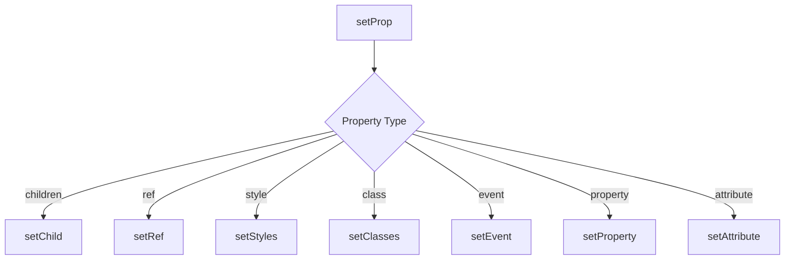
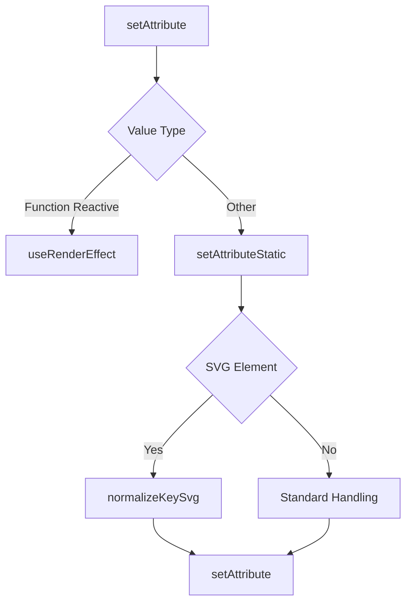
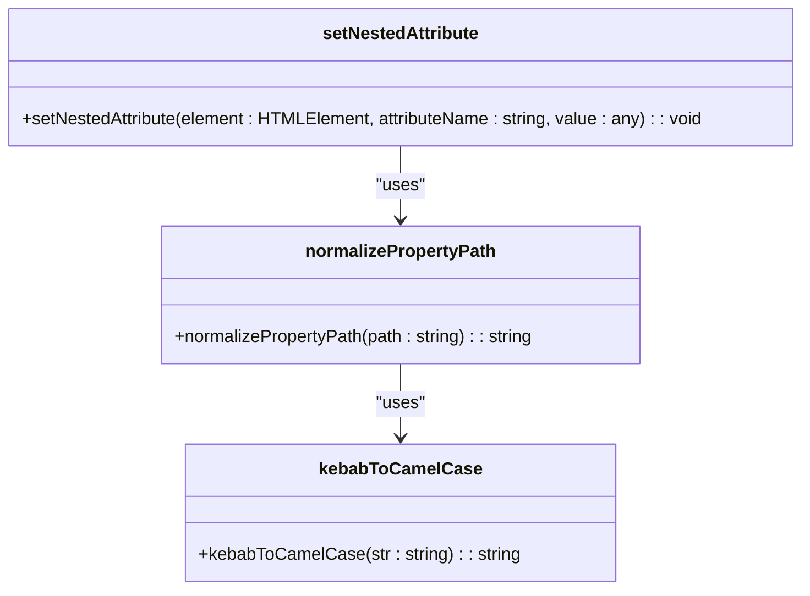
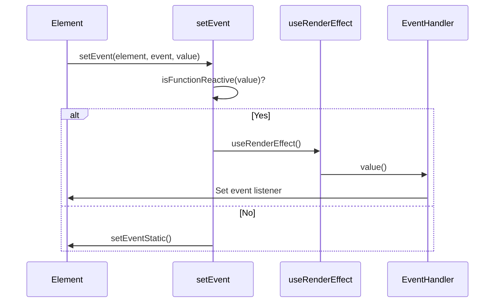
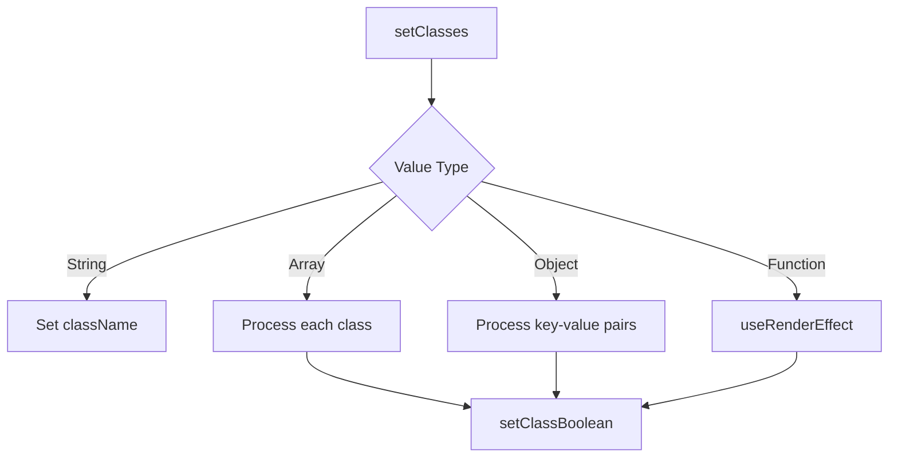
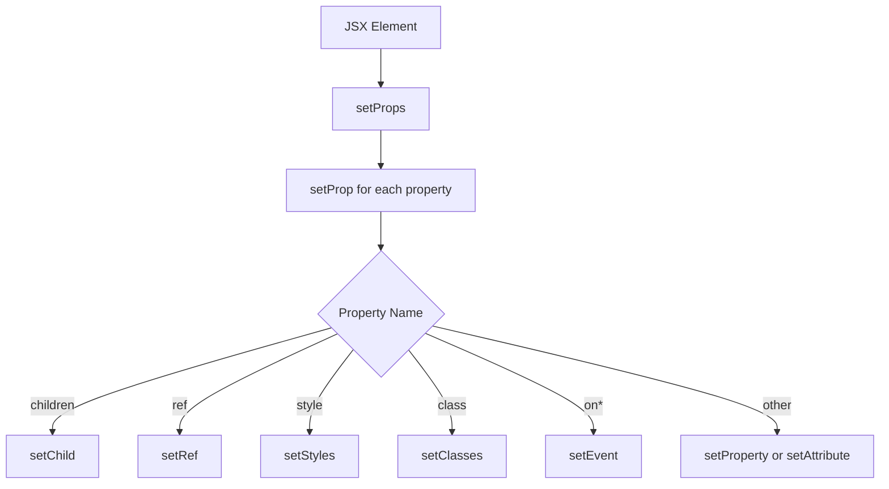

# DOM Manipulation

<cite>
**Referenced Files in This Document**   
- [setters.ts](file://src/utils/setters.ts)
- [nested.ts](file://src/utils/nested.ts)
- [types.ts](file://src/types.ts)
</cite>

## Table of Contents
1. [Introduction](#introduction)
2. [Direct DOM Manipulation](#direct-dom-manipulation)
3. [Attribute and Property Handling](#attribute-and-property-handling)
4. [Nested Property Support](#nested-property-support)
5. [Event Handling](#event-handling)
6. [Advanced Setters](#advanced-setters)
7. [Integration with JSX](#integration-with-jsx)
8. [Performance Considerations](#performance-considerations)
9. [Common Issues and Best Practices](#common-issues-and-best-practices)

## Introduction
Woby's DOM manipulation utilities provide a high-performance, direct approach to updating the DOM without the overhead of a virtual DOM. The core functionality is implemented in `setters.ts` and `nested.ts`, which handle attribute, property, and event listener assignments directly on DOM nodes. This document explains how these utilities work, their handling of various input types, and their integration with JSX and component rendering.

**Section sources**
- [setters.ts](file://src/utils/setters.ts#L0-L1089)
- [nested.ts](file://src/utils/nested.ts#L0-L103)

## Direct DOM Manipulation
Woby's DOM manipulation utilities directly apply changes to DOM nodes without creating a virtual representation. This approach minimizes overhead and maximizes performance by eliminating the diffing process typically required in virtual DOM implementations. The `setProp` function serves as the main entry point for setting properties on DOM elements, routing different types of properties to specialized setter functions.

The direct manipulation approach ensures that DOM updates are immediate and efficient, with minimal intermediate processing. This is particularly beneficial for applications requiring high-frequency updates or complex animations, where the overhead of virtual DOM diffing could impact performance.

**Diagram sources**
- [setters.ts](file://src/utils/setters.ts#L1022-L1079)

**Section sources**
- [setters.ts](file://src/utils/setters.ts#L1022-L1079)

## Attribute and Property Handling
The `setAttribute` and `setProperty` functions handle the assignment of attributes and properties to DOM elements. The `setAttribute` function supports various input types including strings, numbers, booleans, and functions, with special handling for reactive values. When a reactive value is detected, the function uses `useRenderEffect` to ensure updates are applied when the value changes.

For boolean attributes, Woby maintains a set of known boolean attributes that should be removed when their value is false or null. This ensures proper DOM behavior for attributes like `disabled`, `checked`, and `readonly`. The function also handles SVG elements differently, normalizing attribute names to camelCase when necessary.

**Diagram sources**
- [setters.ts](file://src/utils/setters.ts#L100-L147)

**Section sources**
- [setters.ts](file://src/utils/setters.ts#L100-L147)

## Nested Property Support
The `nested.ts` file provides utilities for handling nested properties in HTML attributes using dot-notation or $-notation. The `normalizePropertyPath` function converts these notations to standard JavaScript property access patterns, while `setNestedAttribute` applies the normalized paths to DOM elements.

This feature enables setting deeply nested object properties directly from HTML attributes, such as `style.color` or `dataset.value`. For style properties, the utility handles the conversion from kebab-case to camelCase and sets the value on the element's style object. For other nested properties, it creates the necessary object structure in the element's props object.

**Diagram sources**
- [nested.ts](file://src/utils/nested.ts#L30-L103)
- [string.ts](file://src/utils/string.ts)

**Section sources**
- [nested.ts](file://src/utils/nested.ts#L30-L103)

## Event Handling
Woby's event handling system supports direct assignment of event listeners to DOM elements through the `setEvent` function. The system includes event delegation for common events like click, input, and key events, improving performance by reducing the number of event listeners attached to the DOM.

The `setEventStatic` function handles special cases such as passive and capture events, as well as synthetic events like `onmiddleclick`. For reactive event handlers, the system uses `useRenderEffect` to ensure the handler is updated when the underlying value changes. This approach maintains the reactivity of event handlers while minimizing the overhead of event listener management.

**Diagram sources**
- [setters.ts](file://src/utils/setters.ts#L600-L690)

**Section sources**
- [setters.ts](file://src/utils/setters.ts#L600-L690)

## Advanced Setters
The utilities include specialized setters for handling complex data types and patterns. The `setClasses` function manages class attributes, supporting strings, arrays, and objects with conditional class application. It handles reactive values by wrapping them in `useRenderEffect` to ensure updates when the class state changes.

Similarly, `setStyles` handles inline styles, supporting both string values and object notation. The function includes optimization for non-dimensional CSS properties, automatically appending 'px' to numeric values unless the property is known to be non-dimensional. This ensures consistent styling behavior across different CSS properties.

**Diagram sources**
- [setters.ts](file://src/utils/setters.ts#L400-L500)

**Section sources**
- [setters.ts](file://src/utils/setters.ts#L400-L500)

## Integration with JSX
The DOM manipulation utilities integrate seamlessly with JSX through the `setProp` function, which serves as the bridge between JSX attributes and DOM manipulation. When JSX elements are rendered, their props are passed to `setProp`, which routes them to the appropriate setter based on the property name.

This integration enables the use of Woby's advanced features directly in JSX, such as nested property binding (`style.color="red"`) and reactive event handlers. The system also handles special JSX attributes like `dangerouslySetInnerHTML` and `ref`, ensuring compatibility with standard JSX patterns while maintaining Woby's performance characteristics.

**Diagram sources**
- [setters.ts](file://src/utils/setters.ts#L1022-L1079)

**Section sources**
- [setters.ts](file://src/utils/setters.ts#L1022-L1079)

## Performance Considerations
Woby's direct DOM manipulation approach provides several performance advantages over virtual DOM implementations. By eliminating the diffing process, the system reduces both memory usage and CPU overhead, resulting in faster updates and lower latency.

The utilities include several optimizations to further enhance performance:
- Reactive values are handled efficiently using `useRenderEffect`
- Event delegation reduces the number of event listeners
- Specialized setters minimize unnecessary DOM operations
- String and array utilities optimize common operations

These optimizations make Woby particularly well-suited for applications with high update frequencies or complex UIs, where performance is critical.

**Section sources**
- [setters.ts](file://src/utils/setters.ts#L0-L1089)

## Common Issues and Best Practices
When working with Woby's DOM manipulation utilities, several common issues may arise. Memory leaks from unremoved event listeners can occur if components are not properly cleaned up. To prevent this, ensure that reactive effects are properly disposed of when components are unmounted.

Special attributes like `ref` and `dangerouslySetInnerHTML` require careful handling to avoid security vulnerabilities or unexpected behavior. Always validate input for `dangerouslySetInnerHTML` and ensure `ref` callbacks are properly managed.

Best practices include:
- Use reactive values judiciously to avoid unnecessary updates
- Prefer direct property assignment over attribute setting when possible
- Use the nested property syntax for complex object updates
- Leverage event delegation for frequently used events
- Minimize DOM operations in performance-critical code paths

**Section sources**
- [setters.ts](file://src/utils/setters.ts#L0-L1089)
- [nested.ts](file://src/utils/nested.ts#L0-L103)