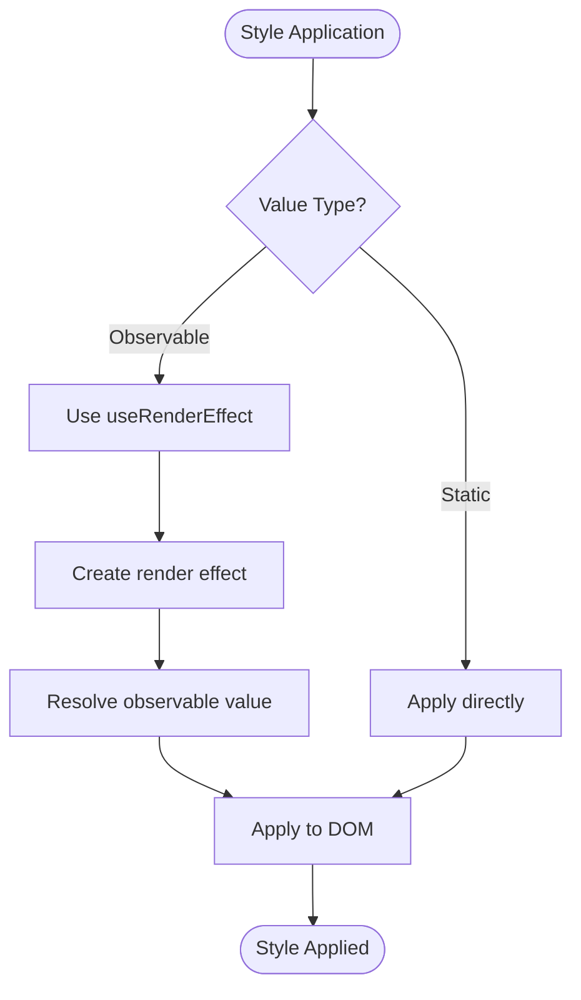
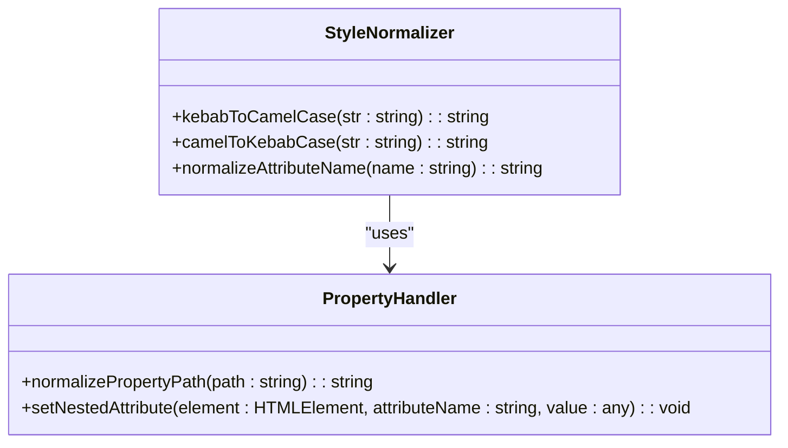
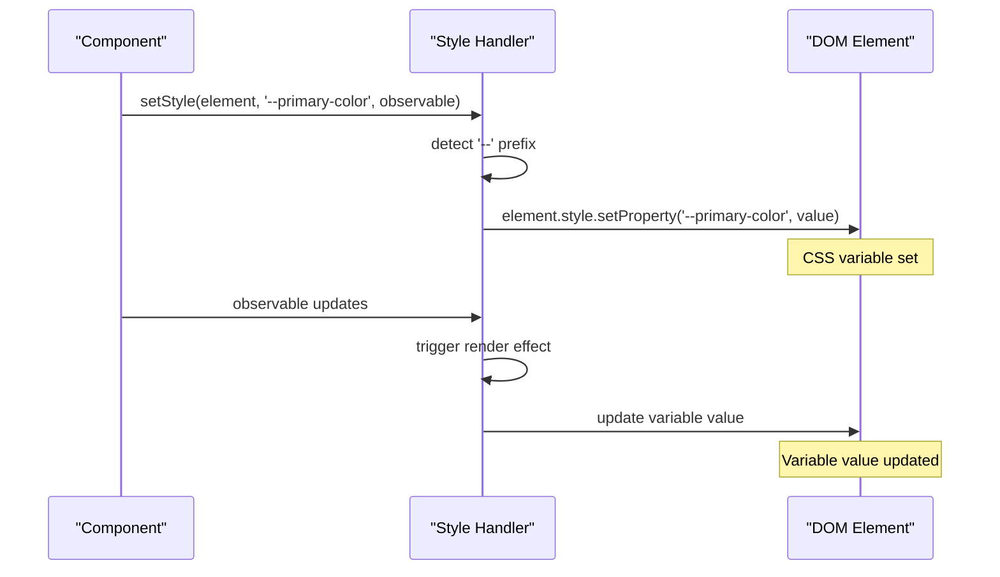
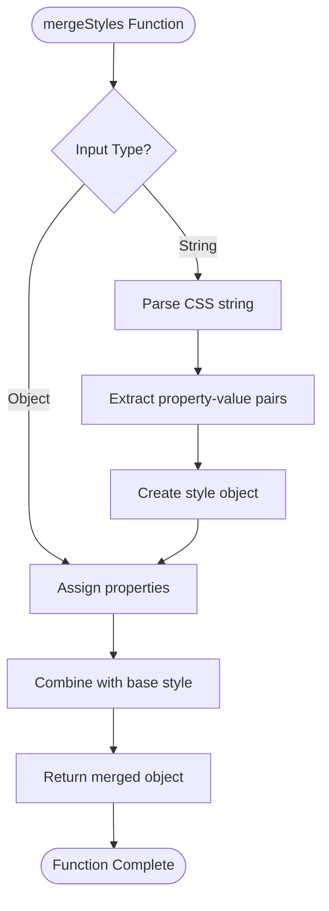
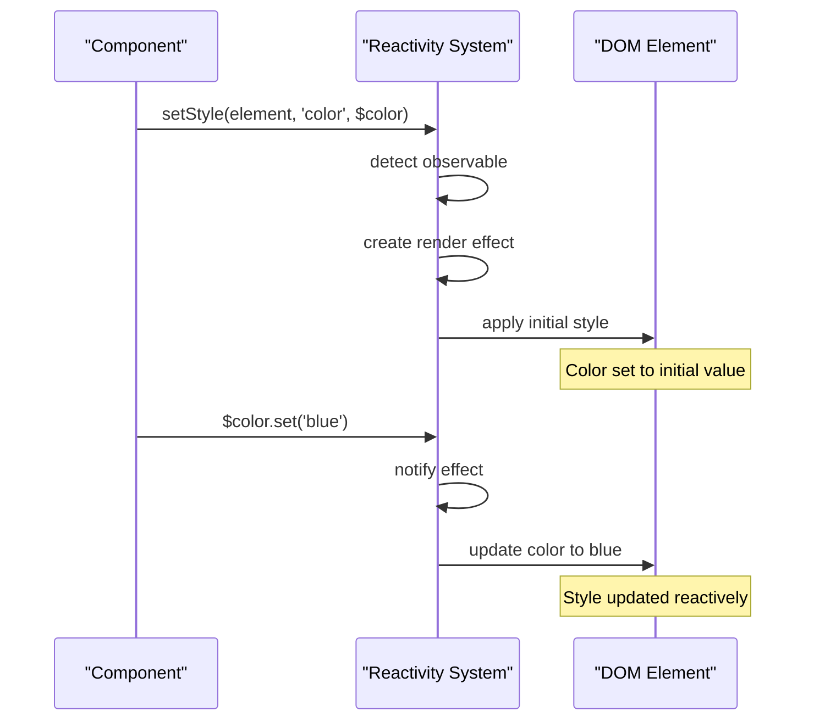
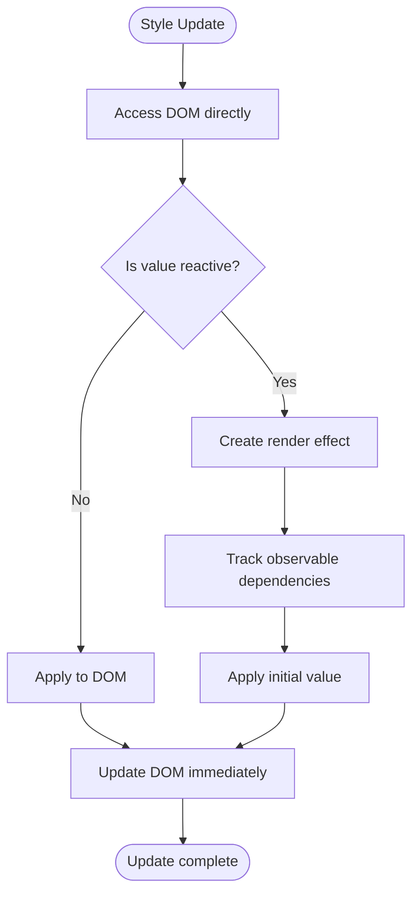
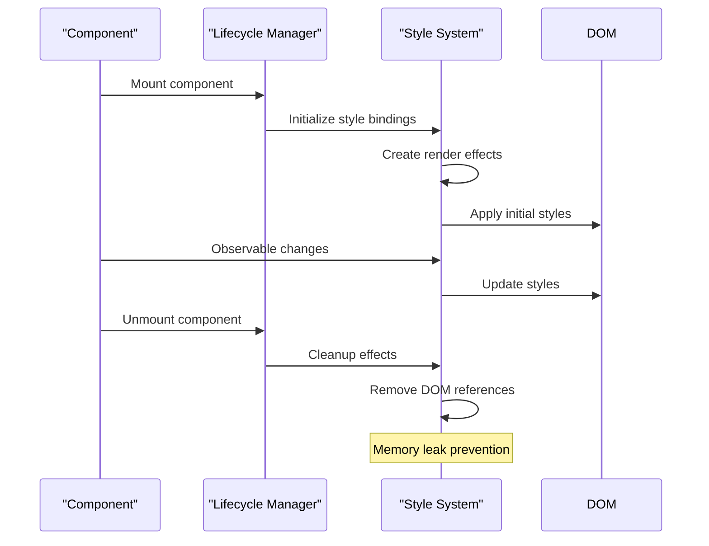

# Style Handling

<cite>
**Referenced Files in This Document**   
- [stylesheets.ts](file://src/utils/stylesheets.ts)
- [setters.ts](file://src/utils/setters.ts)
- [merge_style.ts](file://src/methods/merge_style.ts)
- [string.ts](file://src/utils/string.ts)
- [nested.ts](file://src/utils/nested.ts)
- [resolvers.ts](file://src/utils/resolvers.ts)
- [types.ts](file://src/types.ts)
</cite>

## Table of Contents
1. [Introduction](#introduction)
2. [Style Application Mechanism](#style-application-mechanism)
3. [Property Name Handling](#property-name-handling)
4. [CSS Custom Properties Support](#css-custom-properties-support)
5. [Style Merging with mergeStyles](#style-merging-with-mergestyles)
6. [Reactive Style Bindings](#reactive-style-bindings)
7. [Direct DOM Updates](#direct-dom-updates)
8. [Practical Examples](#practical-examples)
9. [Component Lifecycle Integration](#component-lifecycle-integration)
10. [Common Issues and Solutions](#common-issues-and-solutions)
11. [Best Practices](#best-practices)

## Introduction
Woby's style handling system provides a comprehensive solution for dynamically setting and updating CSS properties on DOM elements. The framework implements a fine-grained reactivity model that applies styles directly to the DOM without virtual diffing, ensuring efficient updates and optimal performance. This document details the architecture and functionality of Woby's style utilities, focusing on the core files `stylesheets.ts` and `setters.ts` that enable dynamic style management, property name conversion, and reactive bindings.

**Section sources**
- [stylesheets.ts](file://src/utils/stylesheets.ts#L1-L115)
- [setters.ts](file://src/utils/setters.ts#L1-L1090)

## Style Application Mechanism
Woby's style application mechanism is built around direct DOM manipulation through the `setStyle` and `setStyles` functions in the `setters.ts` file. These functions provide the foundation for setting individual CSS properties or entire style objects on elements. The system distinguishes between static and reactive style values, applying appropriate update strategies for each.

For individual properties, the `setStyle` function handles the assignment of values to specific CSS properties. When dealing with style objects, the `setStyles` function processes the entire object, iterating through its properties and applying them to the element's style attribute. Both functions support various value types including strings, numbers, and observables, with automatic type conversion as needed.

The style application process includes special handling for CSS custom properties (variables) that begin with a hyphen. These properties are set using the `setProperty` method of the CSSStyleDeclaration interface, while standard properties are assigned directly to the style object. Numeric values for non-dimensional CSS properties are automatically suffixed with 'px' to ensure proper rendering.



**Diagram sources**
- [setters.ts](file://src/utils/setters.ts#L863-L879)
- [setters.ts](file://src/utils/setters.ts#L939-L961)

**Section sources**
- [setters.ts](file://src/utils/setters.ts#L813-L961)

## Property Name Handling
Woby's style system supports both camelCase and kebab-case property names through a comprehensive normalization process. The framework automatically converts between these naming conventions to ensure compatibility with both JavaScript property access and CSS syntax. This conversion is handled by the `kebabToCamelCase` function in `string.ts` and the `normalizePropertyPath` function in `nested.ts`.

When a style property is specified in kebab-case (e.g., 'font-size'), it is automatically converted to camelCase ('fontSize') for JavaScript property access. This conversion is applied recursively to nested property paths, allowing for complex style object structures. The system also supports direct access to CSS custom properties (variables) by preserving their original format when they begin with '--'.

For nested properties accessed through dot notation or '$' syntax (e.g., 'style.fontSize'), the system parses the path and creates the necessary intermediate objects in the element's property structure. This enables deep property access while maintaining the familiar CSS property naming conventions.



**Diagram sources**
- [string.ts](file://src/utils/string.ts#L15-L78)
- [nested.ts](file://src/utils/nested.ts#L15-L103)

**Section sources**
- [string.ts](file://src/utils/string.ts#L15-L78)
- [nested.ts](file://src/utils/nested.ts#L15-L103)

## CSS Custom Properties Support
Woby provides robust support for CSS custom properties (variables) through special handling in the style application functions. Properties that begin with a double hyphen ('--') are treated as CSS variables and are set using the `setProperty` method of the CSSStyleDeclaration interface. This ensures proper scoping and inheritance of custom properties according to CSS specifications.

The `setStyleStatic` function in `setters.ts` contains specific logic for handling CSS variables. When a property name starts with a hyphen, the function uses `element.style.setProperty()` instead of direct property assignment. This approach maintains the integrity of the CSS variable system and allows for dynamic updates to variable values.

CSS custom properties can be used in conjunction with Woby's reactivity system, enabling dynamic theming and style variations. Observable values can be bound to CSS variables, allowing for real-time updates to the visual appearance of components without requiring direct manipulation of multiple style properties.



**Diagram sources**
- [setters.ts](file://src/utils/setters.ts#L813-L862)

**Section sources**
- [setters.ts](file://src/utils/setters.ts#L813-L862)

## Style Merging with mergeStyles
The `mergeStyles` function in `merge_style.ts` provides a powerful mechanism for combining multiple style objects with proper precedence and overwriting rules. This utility function accepts two parameters: a base style object and an override style object, returning a new object that combines both with the override taking precedence.

The merging process supports various input types including CSS property objects, style strings, and mixed formats. When a string is provided, the function uses a regular expression to parse CSS property-value pairs and convert them into a JavaScript object. This allows for seamless integration of inline style strings with object-based styles.

The merge operation follows standard object assignment rules, where properties in the override object replace corresponding properties in the base object. This enables flexible style composition, allowing developers to define base styles and selectively override specific properties. The function handles both camelCase and kebab-case property names, normalizing them appropriately during the merge process.



**Diagram sources**
- [merge_style.ts](file://src/methods/merge_style.ts#L5-L35)

**Section sources**
- [merge_style.ts](file://src/methods/merge_style.ts#L5-L35)

## Reactive Style Bindings
Woby's reactive style bindings leverage the framework's fine-grained reactivity system to automatically update styles when underlying data changes. The `setStyle` and `setStyles` functions detect observable values and create render effects that update the DOM whenever the observable's value changes.

When a style value is an observable function, the system uses `useRenderEffect` to establish a dependency relationship. This ensures that the style is automatically updated whenever the observable's value changes, without requiring manual DOM manipulation. The effect is cleaned up automatically when the element is removed from the DOM, preventing memory leaks.

The reactivity system supports complex style expressions, allowing developers to create dynamic styles based on component state, props, or external data sources. Multiple observables can be combined within a single style expression, with the system automatically tracking all dependencies and updating the style when any of them change.



**Diagram sources**
- [setters.ts](file://src/utils/setters.ts#L863-L879)
- [setters.ts](file://src/utils/setters.ts#L939-L961)

**Section sources**
- [setters.ts](file://src/utils/setters.ts#L863-L961)

## Direct DOM Updates
Woby's style system applies changes directly to the DOM without virtual diffing, leveraging fine-grained reactivity for efficient updates. This approach eliminates the overhead of virtual DOM reconciliation and ensures immediate visual feedback when styles change.

The direct update mechanism is implemented through the `setProp` function in `setters.ts`, which serves as the central dispatcher for all property assignments, including styles. When a style property is set, the function routes the operation to the appropriate handler based on the property name, ensuring that styles are processed by the dedicated style handling functions.

This direct approach provides several performance benefits:
- Eliminates virtual DOM creation and diffing overhead
- Reduces memory allocation by avoiding intermediate representations
- Enables immediate DOM updates without batching delays
- Simplifies the update pipeline by removing reconciliation steps

The system maintains reactivity through fine-grained dependencies, updating only the specific style properties that have changed rather than reprocessing the entire style object.



**Diagram sources**
- [setters.ts](file://src/utils/setters.ts#L1022-L1079)

**Section sources**
- [setters.ts](file://src/utils/setters.ts#L1022-L1079)

## Practical Examples
The following examples demonstrate practical applications of Woby's style handling utilities in real-world scenarios:

### Inline Style Binding
```typescript
// Direct style object binding
const element = document.createElement('div');
setStyles(element, { color: 'red', fontSize: '16px' });

// Reactive style binding
const color = $( 'red' );
setStyle(element, 'color', color);

// Update the observable to change the style
color('blue'); // Element color updates automatically
```

### Conditional Styling
```typescript
// Conditional styles based on state
const isActive = $( false );
const button = document.createElement('button');

setStyles(button, {
  backgroundColor: () => isActive() ? 'blue' : 'gray',
  color: () => isActive() ? 'white' : 'black',
  cursor: 'pointer'
});

// Toggle state to update styles
isActive(true); // Button appearance updates automatically
```

### Integration with Observable Values
```typescript
// Complex reactive styles
const theme = {
  primary: $( '#007bff' ),
  secondary: $( '#6c757d' )
};

const card = document.createElement('div');
setStyles(card, {
  border: `1px solid ${() => theme.primary()}`,
  borderRadius: '8px',
  padding: '16px',
  backgroundColor: () => theme.secondary()
});

// Changing theme updates all dependent styles
theme.primary('#28a745'); // Card border color updates automatically
```

**Section sources**
- [setters.ts](file://src/utils/setters.ts#L813-L961)
- [types.ts](file://src/types.ts#L150-L200)

## Component Lifecycle Integration
Woby's style handling utilities integrate seamlessly with the component lifecycle through the use of render effects and proper cleanup mechanisms. The `useRenderEffect` hook establishes the connection between observable values and DOM updates, ensuring that styles are updated at the appropriate time during the rendering process.

When a component is mounted, style bindings are established and initial values are applied to the DOM. The system creates render effects that track dependencies on observable values, automatically updating styles when those values change. These effects are automatically cleaned up when the component is unmounted, preventing memory leaks and ensuring proper resource management.

The integration also handles edge cases such as asynchronous updates and batched operations. The system ensures that style updates are synchronized with the overall rendering process, preventing visual inconsistencies and layout thrashing.



**Diagram sources**
- [setters.ts](file://src/utils/setters.ts#L863-L879)
- [setters.ts](file://src/utils/setters.ts#L939-L961)

**Section sources**
- [setters.ts](file://src/utils/setters.ts#L863-L961)

## Common Issues and Solutions
### Style Conflicts
Style conflicts can occur when multiple style sources attempt to modify the same CSS property. Woby's `mergeStyles` function helps resolve these conflicts by providing a deterministic merging strategy where later styles take precedence over earlier ones.

```typescript
// Solution: Use mergeStyles for predictable overrides
const baseStyles = { color: 'black', fontSize: '14px' };
const overrideStyles = { color: 'red' };
const finalStyles = mergeStyles(baseStyles, overrideStyles);
// Result: { color: 'red', fontSize: '14px' }
```

### Memory Leaks from Detached Elements
Memory leaks can occur when render effects maintain references to elements that have been removed from the DOM. Woby prevents this by automatically cleaning up effects when components are unmounted and by using weak references where appropriate.

### Incorrect Property Application
Incorrect property application can happen when using the wrong case format or when properties are not properly normalized. The solution is to use consistent naming conventions and rely on Woby's automatic conversion utilities.

```typescript
// Correct: Use consistent naming
setStyle(element, 'fontSize', '16px'); // camelCase
setStyle(element, 'font-size', '16px'); // kebab-case (automatically converted)
```

**Section sources**
- [setters.ts](file://src/utils/setters.ts#L813-L961)
- [merge_style.ts](file://src/methods/merge_style.ts#L5-L35)

## Best Practices
### Organizing Styles
- Use style objects for complex styling rather than inline strings
- Group related styles into reusable style objects
- Leverage CSS custom properties for theming and variables
- Use `mergeStyles` to compose styles from multiple sources

### Avoiding Performance Pitfalls
- Minimize the number of individual style updates by batching related properties
- Use observable values judiciously to avoid excessive re-renders
- Prefer CSS classes over inline styles for static styling
- Use `useMemo` to cache complex style computations

### Ensuring Cross-Browser Compatibility
- Use standard CSS property names and values
- Test styles across different browsers and devices
- Use feature detection for browser-specific properties
- Provide fallback values for experimental CSS features

### General Recommendations
- Use descriptive property names and consistent naming conventions
- Document complex style logic and dependencies
- Test style changes thoroughly in different contexts
- Monitor performance impact of style updates

**Section sources**
- [setters.ts](file://src/utils/setters.ts#L813-L961)
- [merge_style.ts](file://src/methods/merge_style.ts#L5-L35)
- [string.ts](file://src/utils/string.ts#L15-L78)