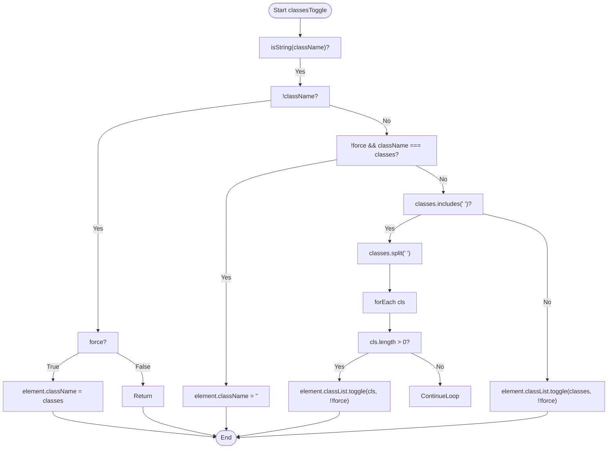
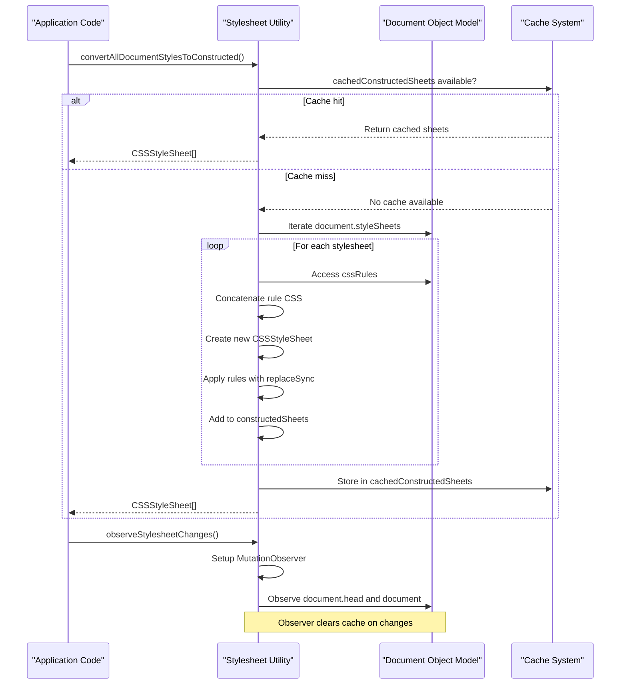
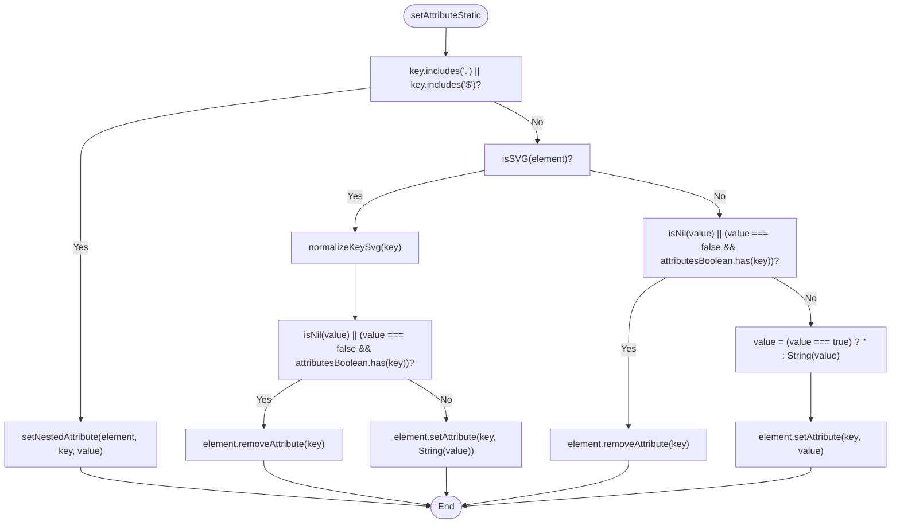
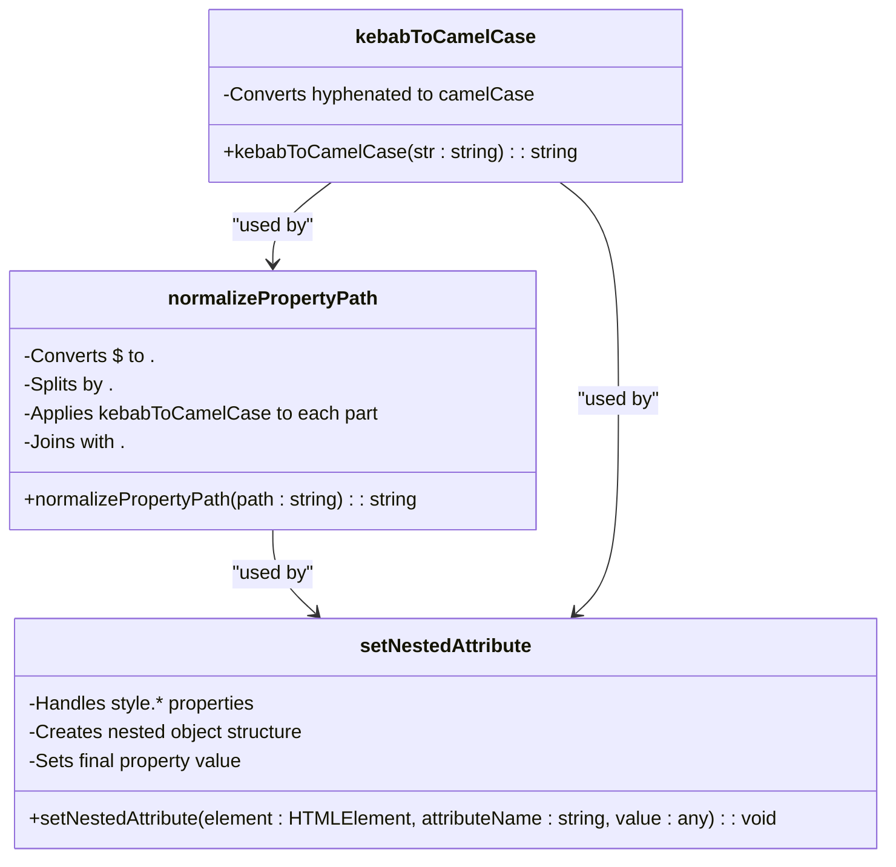
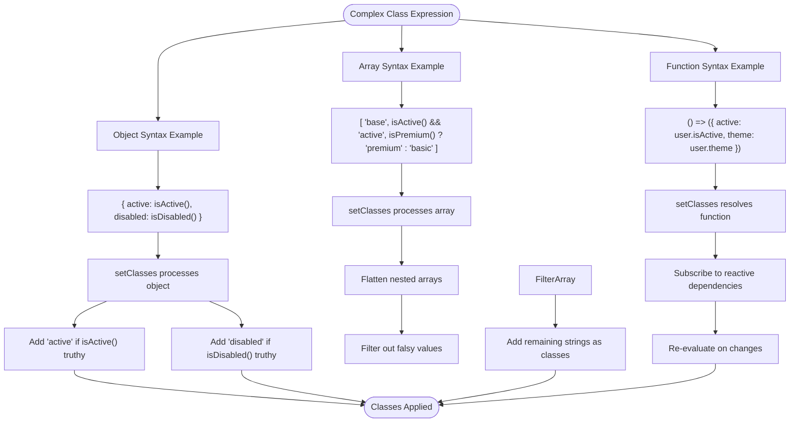
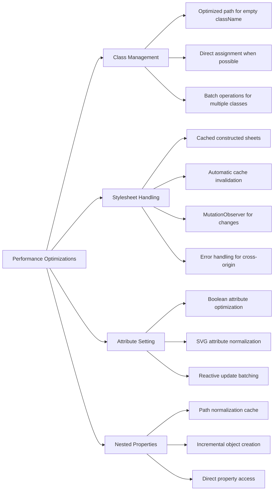
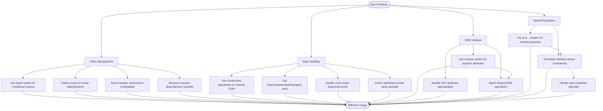

# Utilities

<cite>
**Referenced Files in This Document**   
- [classlist.ts](file://src/utils/classlist.ts)
- [stylesheets.ts](file://src/utils/stylesheets.ts)
- [setters.ts](file://src/utils/setters.ts)
- [nested.ts](file://src/utils/nested.ts)
- [lang.ts](file://src/utils/lang.ts)
- [string.ts](file://src/utils/string.ts)
</cite>

## Table of Contents
1. [Introduction](#introduction)
2. [Class Management](#class-management)
3. [Style Handling](#style-handling)
4. [DOM Manipulation Utilities](#dom-manipulation-utilities)
5. [Nested Property Support](#nested-property-support)
6. [Practical Examples](#practical-examples)
7. [Performance Considerations](#performance-considerations)
8. [Best Practices](#best-practices)

## Introduction
The Woby framework provides a comprehensive set of utility functions designed to simplify common web development tasks. These utilities focus on efficient class management, style manipulation, DOM updates, and handling of nested properties through HTML attributes. The helper functions are optimized for performance while maintaining a clean and intuitive API for developers. This document explores the key utility modules and their implementation details, providing guidance on effective usage patterns.

## Class Management

The class management system in Woby is implemented in `classlist.ts` and provides optimized functions for manipulating CSS classes on DOM elements. The core function `classesToggle` implements both optimized and regular paths for class manipulation, ensuring maximum performance in various scenarios.

The utility supports multiple input types including strings, arrays, and reactive expressions. When working with simple cases (empty className or exact matches), the implementation uses direct assignment to className for optimal performance. For more complex cases involving multiple classes, it falls back to using the classList API with proper splitting and iteration.

**Diagram sources**
- [classlist.ts](file://src/utils/classlist.ts#L5-L55)

**Section sources**
- [classlist.ts](file://src/utils/classlist.ts#L5-L55)
- [setters.ts](file://src/utils/setters.ts#L565-L587)

## Style Handling

The style handling utilities in Woby provide comprehensive support for CSS property manipulation and style merging. The framework includes both direct style property setting through the `setNestedAttribute` function and stylesheet management utilities for constructed stylesheets.

The `convertAllDocumentStylesToConstructed` function enables shadow DOM integration by converting existing document stylesheets into ConstructedStyleSheet objects that can be adopted by shadow roots. This function implements caching to avoid redundant processing and includes automatic cache invalidation when stylesheet changes are detected.

**Diagram sources**
- [stylesheets.ts](file://src/utils/stylesheets.ts#L29-L59)
- [nested.ts](file://src/utils/nested.ts#L61-L103)

**Section sources**
- [stylesheets.ts](file://src/utils/stylesheets.ts#L29-L59)
- [nested.ts](file://src/utils/nested.ts#L61-L103)
- [string.ts](file://src/utils/string.ts#L10-L25)

## DOM Manipulation Utilities

The DOM manipulation utilities in Woby provide efficient methods for direct DOM updates, including attribute setting, event handling, and child node management. The `setAttributeStatic` and `setAttribute` functions handle both static and reactive attribute updates, with special handling for boolean attributes and SVG elements.

The implementation includes optimizations for common cases and proper normalization of attribute names. For SVG elements, attribute names are normalized to handle camel-cased attributes correctly. Boolean attributes are handled according to HTML specifications, where the presence of the attribute (regardless of value) indicates truthiness.

**Diagram sources**
- [setters.ts](file://src/utils/setters.ts#L5-L799)
- [nested.ts](file://src/utils/nested.ts#L61-L103)

**Section sources**
- [setters.ts](file://src/utils/setters.ts#L5-L799)
- [lang.ts](file://src/utils/lang.ts#L150-L170)

## Nested Property Support

The nested property utilities enable setting deeply nested properties through HTML attributes using either dot notation or dollar sign notation. The `normalizePropertyPath` function converts attribute names like "style$font-size" or "nested.prop.value" into normalized paths with camelCase conversion for each segment.

The `setNestedAttribute` function handles the actual setting of nested properties, with special handling for style properties and creation of intermediate objects as needed. This allows developers to bind directly to nested data structures without requiring flattening or additional processing.

**Diagram sources**
- [nested.ts](file://src/utils/nested.ts#L30-L42)
- [nested.ts](file://src/utils/nested.ts#L61-L103)
- [string.ts](file://src/utils/string.ts#L10-L15)

**Section sources**
- [nested.ts](file://src/utils/nested.ts#L30-L103)
- [string.ts](file://src/utils/string.ts#L10-L35)

## Practical Examples

The Woby utilities support complex class expressions and style bindings through reactive values and conditional logic. Developers can use arrays, objects, and functions to define dynamic class lists and style properties. The framework automatically handles updates when reactive values change, ensuring the DOM stays in sync with application state.

For class management, objects can be used where keys are class names and values are boolean conditions. Arrays can contain mixed content including strings, reactive values, and nested arrays. Functions can return any of these types, enabling complex conditional logic.

**Diagram sources**
- [setters.ts](file://src/utils/setters.ts#L565-L587)
- [classlist.ts](file://src/utils/classlist.ts#L5-L55)

**Section sources**
- [setters.ts](file://src/utils/setters.ts#L451-L563)
- [resolvers.ts](file://src/utils/resolvers.ts#L10-L50)

## Performance Considerations

The Woby utilities are designed with performance as a primary concern, implementing multiple optimization strategies to minimize unnecessary DOM operations and memory usage. The class management system includes fast paths for common scenarios like empty className or exact matches, avoiding the overhead of classList operations when direct assignment suffices.

The stylesheet utilities implement aggressive caching with automatic invalidation, preventing redundant processing of CSS rules. The constructed stylesheet cache is automatically cleared when DOM mutations are detected in the document head, ensuring styles remain up-to-date without requiring manual cache management.

**Diagram sources**
- [classlist.ts](file://src/utils/classlist.ts#L5-L55)
- [stylesheets.ts](file://src/utils/stylesheets.ts#L29-L59)
- [setters.ts](file://src/utils/setters.ts#L5-L799)

**Section sources**
- [classlist.ts](file://src/utils/classlist.ts#L5-L55)
- [stylesheets.ts](file://src/utils/stylesheets.ts#L1-L115)
- [setters.ts](file://src/utils/setters.ts#L1-L799)

## Best Practices

When using Woby's utility functions, several best practices can help maximize performance and maintainability. For class management, prefer object syntax for conditional classes and avoid unnecessary re-renders by structuring reactive dependencies appropriately. Use the array syntax when combining static and dynamic classes.

For style handling, leverage the nested property syntax to bind directly to component state without intermediate processing. When working with constructed stylesheets, call `observeStylesheetChanges()` early in the application lifecycle to ensure automatic cache invalidation.

**Diagram sources**
- [setters.ts](file://src/utils/setters.ts#L565-L587)
- [stylesheets.ts](file://src/utils/stylesheets.ts#L70-L85)
- [nested.ts](file://src/utils/nested.ts#L61-L103)

**Section sources**
- [setters.ts](file://src/utils/setters.ts#L1-L799)
- [stylesheets.ts](file://src/utils/stylesheets.ts#L70-L115)
- [nested.ts](file://src/utils/nested.ts#L1-L103)