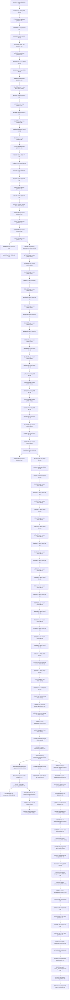

# Git Branch Tree

```mermaid
graph TD
    root_2023_03["4b4957a rebase (2023-03-28)"]
    root_2023_03 --> main_2023_05["e623629 apr 2023 (2023-05-01)"]
    main_2023_05 --> main_2023_05b["07831b8 some updates (2023-05-24)"]
    main_2023_05b --> main_2023_06["e398886 fix bugs (2023-06-02)"]
    main_2023_06 --> main_2023_06b["fe0e2c0 fix jsxDEV (2023-06-12)"]
    main_2023_06b --> main_2023_07["19b22d3 fix React JSX (2023-07-26)"]
    main_2023_07 --> main_2023_08["bd38612 some update (2023-08-02)"]
    main_2023_08 --> main_2023_08b["6b6a47e sync 8 Aug (2023-08-08)"]
    main_2023_08b --> main_2023_08c["52d417c sync 8 Aug (2023-08-09)"]
    main_2023_08c --> main_2023_08d["5e9688c cloneElement (2023-08-09)"]
    main_2023_08d --> main_2023_10["91bd332 update to Sep 2023 (2023-10-06)"]
    main_2023_10 --> main_2023_11["8d26dd7 update (2023-11-02)"]
    main_2023_11 --> main_2023_12["c31e86f update via.js (2023-12-07)"]
    main_2023_12 --> main_2023_12b["a418b4e rebuild (2023-12-08)"]
    main_2023_12b --> main_2024_02["2db2225 bump version (2024-02-06)"]
    main_2024_02 --> main_2024_04["d180479 Apr 4 2024 (2024-04-08)"]
    main_2024_04 --> main_2024_04b["f24ad91 sync to Apr 4 (2024-04-08)"]
    main_2024_04b --> main_2024_04c["9721037 Bump version (2024-04-15)"]
    main_2024_04c --> main_2024_04d["731df01 0.58.1 (2024-04-15)"]
    main_2024_04d --> main_2024_04e["f7baf0b 0.58.2 (2024-04-15)"]
    main_2024_04e --> main_2024_04f["125c995 0.58.3 (2024-04-15)"]
    main_2024_04f --> main_2024_04g["bc1744a 0.58.4 (2024-04-15)"]
    main_2024_04g --> main_2024_04h["31aff4e Bump version (2024-04-15)"]
    main_2024_04h --> main_2024_04i["c93e1d5 0.58.5 (2024-04-15)"]
    main_2024_04i --> main_2024_05["4d912e1 remove .vscode, dist1 (2024-05-14)"]
    main_2024_05 --> main_2024_05b["2466087 Bump version (2024-05-15)"]
    main_2024_05b --> main_2024_06["1336f67 Bump version (2024-06-12)"]
    main_2024_06 --> main_2024_08["01913eb Bump version (2024-08-06)"]
    main_2024_08 --> main_2024_11["7468287 Bump version (2024-11-15)"]

    main_2024_11 --> ver_0_58_6["0680f09 v0.58.6 (2024-11-15)"]
    ver_0_58_6 --> ver_0_58_7["fe36262 v0.58.7 (2024-11-15)"]

    main_2024_11 --> merge_err_boundary["289536b merge error-boundary enh (2025-05-26)"]
    merge_err_boundary --> bump_2025_06_10["a271965 Bump version (2025-06-10)"]
    bump_2025_06_10 --> bump_2025_06_11["82ea869 Bump version (2025-06-11)"]
    bump_2025_06_11 --> bump_2025_06_21a["e8cc9de Bump version (2025-06-21)"]
    bump_2025_06_21a --> ver_0_58_7b["9868317 0.58.7 (2025-06-21)"]
    ver_0_58_7b --> bump_2025_06_21b["2b20432 Bump version (2025-06-21)"]
    bump_2025_06_21b --> ver_0_58_10["362fa05 v0.58.10 (2025-06-21)"]
    ver_0_58_10 --> bump_2025_06_21c["f891ec3 Bump version (2025-06-21)"]
    bump_2025_06_21c --> ver_0_58_11["bbf7fe0 v0.58.11 (2025-06-21)"]
    ver_0_58_11 --> bump_2025_07_14["cbb4d33 Bump version (2025-07-14)"]
    bump_2025_07_14 --> ver_0_58_12["d0ddfd3 v0.58.12 (2025-07-14)"]
    ver_0_58_12 --> bump_2025_07_15["47f23b6 Bump version (2025-07-15)"]
    bump_2025_07_15 --> ver_0_58_14["aabcd8a v0.58.14 (2025-07-15)"]
    ver_0_58_14 --> bump_2025_08_04a["22a13e1 Bump version (2025-08-04)"]
    bump_2025_08_04a --> ver_0_58_15["b66a392 v0.58.15 (2025-08-04)"]
    ver_0_58_15 --> ver_0_58_16["ea70ba4 v0.58.16 (2025-08-04)"]
    ver_0_58_16 --> bump_2025_08_14["07d85ce Bump version (2025-08-14)"]
    bump_2025_08_14 --> ver_0_58_17["135022b v0.58.17 (2025-08-14)"]
    ver_0_58_17 --> bump_2025_08_15["143e3c4 Bump version (2025-08-15)"]
    bump_2025_08_15 --> ver_0_58_18["bd918ce v0.58.18 (2025-08-15)"]

    ver_0_58_18 --> ver_0_58_19["cbe2d6c v0.58.19 (2025-08-27)"]
    ver_0_58_19 --> bump_2025_08_28["9ac142c Bump version (2025-08-27)"]
    bump_2025_08_28 --> ver_0_58_20["c2886d7 v0.58.20 (2025-08-28)"]
    ver_0_58_20 --> bump_2025_08_28b["0db23c2 Bump version (2025-08-28)"]
    bump_2025_08_28b --> ver_1_58_21["7f0c053 v1.58.21 (2025-08-28)"]
    ver_1_58_21 --> bump_2025_08_28c["54d90c3 Bump version (2025-08-28)"]

    ver_1_58_21 --> upd_md_2025_08_29a["cf51e90 updte md (2025-08-29)"]
    upd_md_2025_08_29a --> upd_md_2025_08_29b["fc954e5 update doc (2025-08-29)"]
    upd_md_2025_08_29b --> upd_md_2025_08_30["2d23fd2 update md (2025-08-30)"]
    upd_md_2025_08_30 --> bump_2025_09_03a["551f3d2 Bump version (2025-09-03)"]
    bump_2025_09_03a --> ver_1_58_22["46a312f v1.58.22 (2025-09-03)"]
    ver_1_58_22 --> bump_2025_09_03b["c7d9047 Bump version (2025-09-03)"]
    bump_2025_09_03b --> ver_1_58_23["e795630 v1.58.23 (2025-09-03)"]
    ver_1_58_23 --> bump_2025_09_04["6fbfc67 Bump version (2025-09-04)"]
    bump_2025_09_04 --> ver_1_58_24["0260ca2 v1.58.24 (2025-09-04)"]
    ver_1_58_24 --> bump_2025_09_11a["b28ac6d Bump version (2025-09-11)"]
    bump_2025_09_11a --> ver_1_58_25["a6fbb79 v1.58.25 (2025-09-11)"]
    ver_1_58_25 --> bump_2025_09_11b["0c6f0b0 Bump version (2025-09-11)"]
    bump_2025_09_11b --> ver_1_58_26["51a396f v1.58.26 (2025-09-11)"]
    ver_1_58_26 --> bump_2025_09_11c["cdb67b8 Bump version (2025-09-11)"]
    bump_2025_09_11c --> ver_1_58_27["e24a434 v1.58.27 (2025-09-11)"]
    ver_1_58_27 --> bump_2025_09_11d["5c9a4ae Bump version (2025-09-11)"]
    bump_2025_09_11d --> ver_1_58_28["26e0f1d v1.58.28 (2025-09-11)"]
    ver_1_58_28 --> bump_2025_09_12a["828702f Bump version (2025-09-12)"]
    bump_2025_09_12a --> ver_1_58_29["bed83be v1.58.29 (2025-09-12)"]
    ver_1_58_29 --> bump_2025_09_12b["8daa6dd Bump version (2025-09-12)"]
    bump_2025_09_12b --> ver_1_58_30["c2f3eec v1.58.30 (2025-09-12)"]
    ver_1_58_30 --> bump_2025_09_13a["6773371 Bump version (2025-09-13)"]
    bump_2025_09_13a --> ver_1_58_31["b1d8a3d v1.58.31 (2025-09-13)"]
    ver_1_58_31 --> ver_1_58_32["b1db184 v1.58.32 (2025-09-13)"]
    ver_1_58_32 --> feat_conventional["9471b28 feat conventional commits (2025-09-22)"]
    feat_conventional --> ver_1_58_33["25d9d06 v1.58.33 (2025-09-22)"]

    ver_1_58_33 --> env_refactor["7376c35 refactor env (2025-12-04)"]
    env_refactor --> ssr_fix_half["28d3465 ssr fix half (2026-01-13)"]
    ssr_fix_half --> ssr_fixed_log["9f9be91 ssr fixed with log (2026-01-25)"]
    ssr_fixed_log --> ssr_removed_log["4888402 ssr removed debug log (2026-01-26)"]
    ssr_removed_log --> ssr_remove_log["b52f05a ssr remove debug log (2026-01-26)"]

    ssr_remove_log --> main_playground_update["d28b9ca update playground (2026-02-01)"]
    main_playground_update --> main_playground_test["de56974 playground test (2026-02-01)"]
    main_playground_test --> main_tested_pw["363e267 tested playwright (2026-02-01)"]
    main_tested_pw --> main_fix_export["b01f5f8 fix export setSetters (2026-02-02)"]
    main_fix_export --> main_remove_mouse["4092aa0 remove mouse/pointer/touch (2026-02-03)"]

    main_remove_mouse --> partial_pw_branch["dab43a4 partial playground -> playwright (2026-02-13)"]
    partial_pw_branch --> playground_fix["4b64a7e playground src fix (2026-02-17)"]
    playground_fix --> pw_progressing["f5ecd87 playwright progressing (2026-02-19)"]

    pw_progressing --> jules_quest["02b7dee jules test conversion (2026-02-19)"]
    pw_progressing --> partial_spec["eb6c236 partial spec on customElement (2026-02-19)"]
    partial_spec --> add_quest["048a51e add quest.md (2026-02-19)"]
    add_quest --> ctx_not_working["2565dfb found context not working (2026-02-20)"]

    main_remove_mouse --> stash_index["6f1fa08 stash index (2026-02-21)"]
    stash_index --> stash_wip["fb8f471 WIP stash without-ssr (2026-02-21)"]

    main_remove_mouse --> main_extensive_pw["f405826 extensive playwright update (2026-02-21)"]
    main_extensive_pw --> main_fix_dynamic_pw["2bb33d5 fix dynamic & playground (2026-02-21)"]
    main_fix_dynamic_pw --> main_fix_dynamic_hmr["1b4121c fix dynamic, hmr, npm (2026-02-22)"]
    main_fix_dynamic_hmr --> main_initial_full_test["97e234a initial full test (2026-02-22)"]
    main_initial_full_test --> main_fix_setter["15b4ba7 fix setter event (2026-02-22)"]
    main_fix_setter --> main_fix_hang["ce89ae3 fix playground hang (2026-02-22)"]
    main_fix_hang --> main_fully_fix_pg["ae8c90b fully fix playground index (2026-02-22)"]
    main_fully_fix_pg --> main_fix_dynamic_ssr["a74f3b8 fix dynamic via & ssr (2026-02-22)"]
    main_fix_dynamic_ssr --> main_fix_setters_reactive["bb52538 fix setters reactive event (2026-02-23)"]
    main_fix_setters_reactive --> main_fix_util["3e5d7b5 fix playground util.ts (2026-02-23)"]
    main_fix_util --> main_resume_ssr["0491625 resume add ssr test (2026-02-23)"]
    main_resume_ssr --> main_fix_timing["2a1b110 fix timing (2026-02-23)"]
    main_fix_timing --> main_completed_pg["9d0290a completed playground src (2026-02-24)"]
    main_completed_pg --> pkg_update_a["f6be254 update package.json (2026-02-24)"]
    pkg_update_a --> pkg_update_b["f394fa7 update package.json (2026-02-24)"]
    pkg_update_b --> ver_1_58_36["732e311 1.58.36 (2026-02-24)"]
    ver_1_58_36 --> ver_1_58_37["607508e 1.58.37 (2026-02-24)"]
    ver_1_58_37 --> feat_html_types_a["bf08651 feat HTML types (2026-02-24)"]
    feat_html_types_a --> ver_1_58_38["74d9bdf 1.58.38 (2026-02-24)"]
    ver_1_58_38 --> feat_html_utils["e8af9d4 feat HTML utils (2026-02-24)"]
    feat_html_utils --> feat_html_conv["b2e52c9 feat HTML conversion (2026-02-24)"]
    feat_html_conv --> ver_1_58_39["a17a0d3 1.58.39 (2026-02-24)"]
    ver_1_58_39 --> custom_element_test["5023f83 custom element test (2026-02-24)"]
    custom_element_test --> partial_fix_custom["420929f partial fix custom_element (2026-02-25)"]
    partial_fix_custom --> kiv_custom["67b4531 kiv custom element (2026-02-25)"]
    kiv_custom --> full_pg_fix["9d7e3c3 full-playground-test-fix (2026-02-25)"]
```
