# 🏗️ Playground Test Architecture

## System Overview

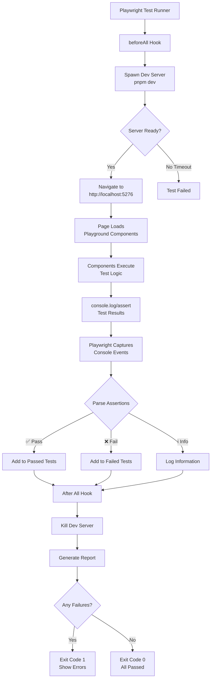

## Component Interaction

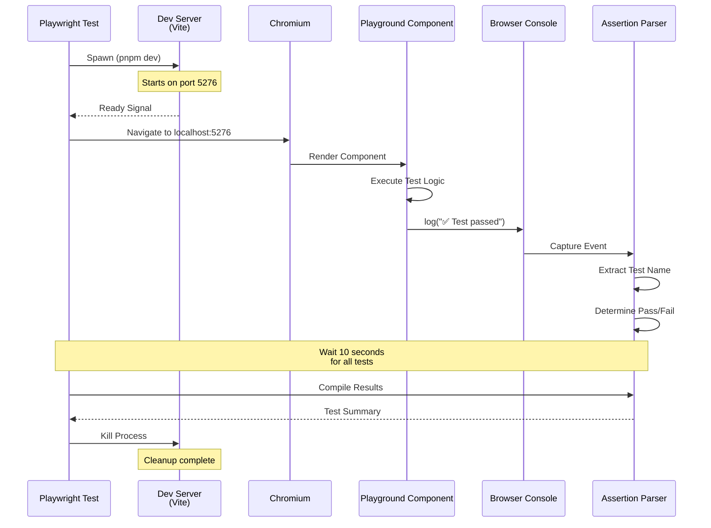

## Data Flow

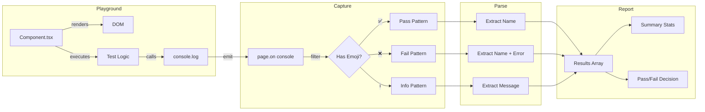

## File Structure

```
woby/
├── test/                              # Test Directory
│   ├── playground-console.spec.ts     # Basic console capture
│   ├── playground-assertions.spec.ts  # Advanced assertion parsing ⭐
│   ├── run-tests.js                   # Custom runner (optional)
│   ├── README.md                      # Full documentation
│   ├── QUICKSTART.md                  # Quick start guide
│   └── IMPLEMENTATION_SUMMARY.md      # This summary
│
├── demo/playground/                   # Test Target
│   ├── src/                           # Components with tests
│   │   ├── TestEventClickRemoval.tsx
│   │   ├── TestHMRFor.tsx
│   │   ├── TestCustomElementContext.tsx
│   │   └── util.tsx                   # Test utilities
│   └── index.html                     # Entry point
│
└── playwright.config.ts               # Root configuration
```

## Test Lifecycle

```mermaid
gantt
    title Test Execution Timeline
    dateFormat X
    axisFormat %s
    
    section Setup
    Start Dev Server     :0, 500
    Wait for Ready       :500, 1000
    
    section Execution
    Page Load           :1000, 200
    Component Render    :1200, 300
    Test Execution      :1500, 8000
    Buffer Time         :9500, 2500
    
    section Teardown
    Parse Results       :12000, 500
    Generate Report     :12500, 300
    Kill Server         :12800, 200
```

## Assertion Pattern Matching

```mermaid
flowchart TD
    A[Console Message] --> B{Contains Emoji?}
    B -->|No| C[Ignore]
    B -->|Yes| D{Which Emoji?}
    
    D -->|✅| E[Match Pass Patterns]
    E --> E1[/✅ (.+?) passed/]
    E --> E2[/✅ \[(.+?)\]/]
    E --> E3[/✅ (.+?) test passed/]
    E1 & E2 & E3 --> F[Extract Test Name]
    F --> G[Mark as PASSED]
    
    D -->|❌| H[Match Fail Patterns]
    H --> H1[/❌ (.+?) failed: (.+)/]
    H --> H2[/❌ \[(.+?)\]: (.+)/]
    H1 & H2 --> I[Extract Name + Error]
    I --> J[Mark as FAILED]
    
    D -->|ℹ️| K[Match Info Pattern]
    K --> K1[/ℹ️ (.+)/]
    K1 --> L[Extract Message]
    L --> M[Log as INFO]
```

## Configuration Layers

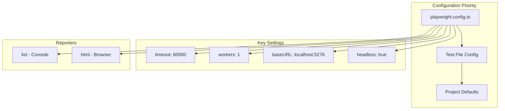

## Error Handling Flow

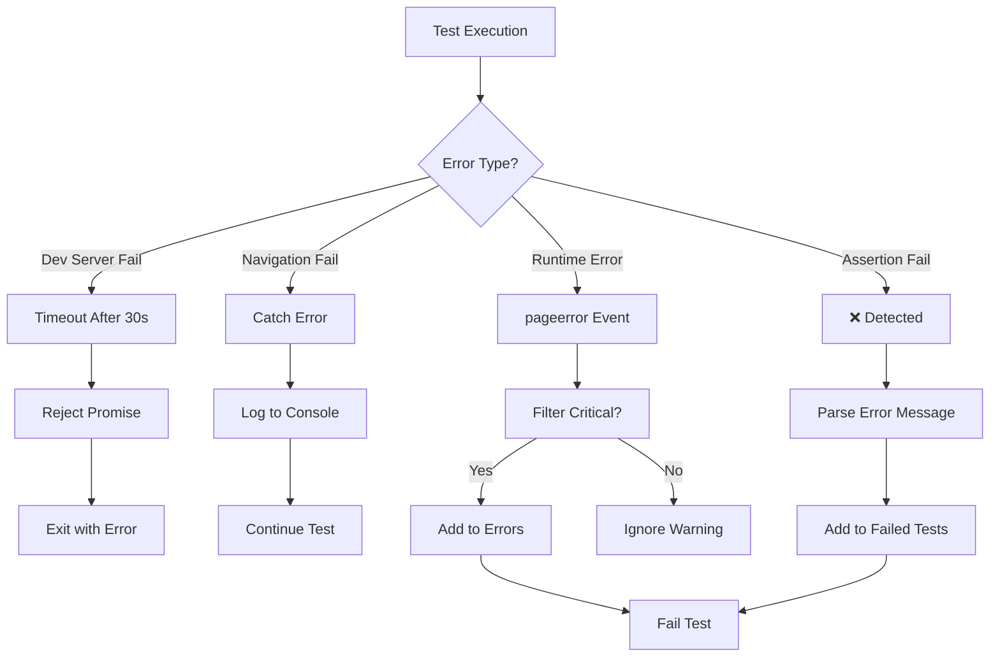

## Resource Management

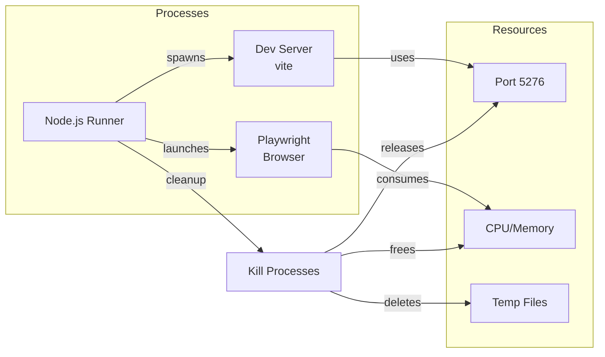

## Parallel vs Sequential

```mermaid
gantt
    title Current: Sequential Execution
    dateFormat X
    axisFormat %s
    
    section Single Worker
    Test 1 Setup       :0, 1000
    Test 1 Execute     :1000, 12000
    Test 1 Teardown    :12000, 500
    
    section Future: Parallel (Not Implemented)
    Test 2 Setup       :1000, 2000
    Test 2 Execute     :2000, 13000
    Test 2 Teardown    :13000, 500
```

## Integration Points

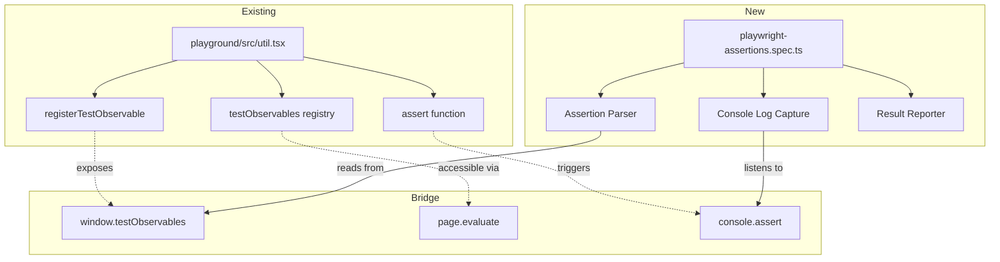

## Performance Characteristics

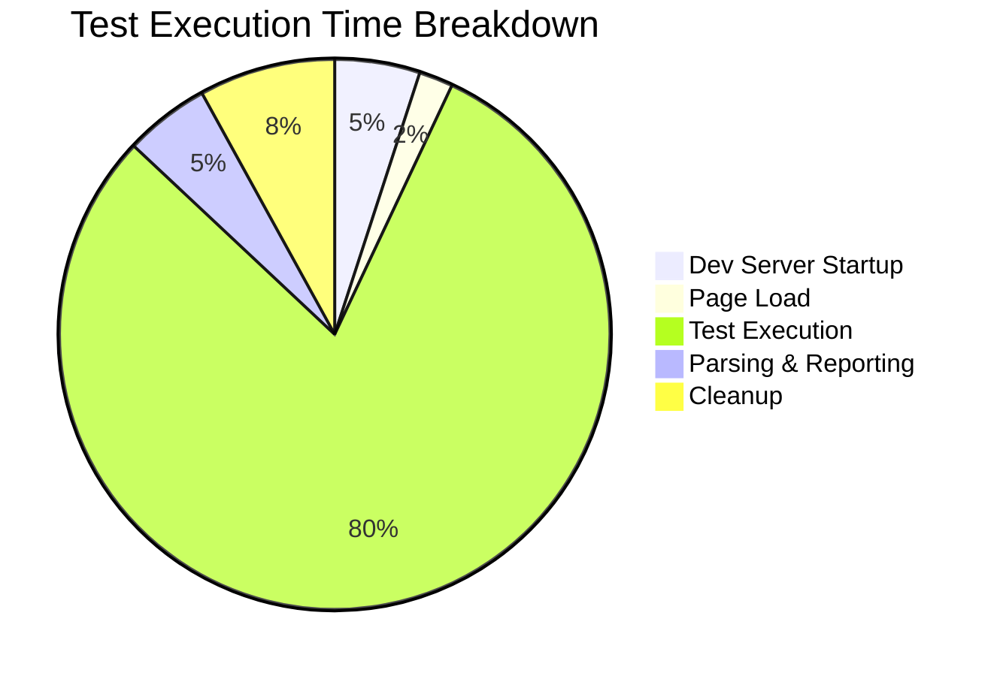

## Memory Model

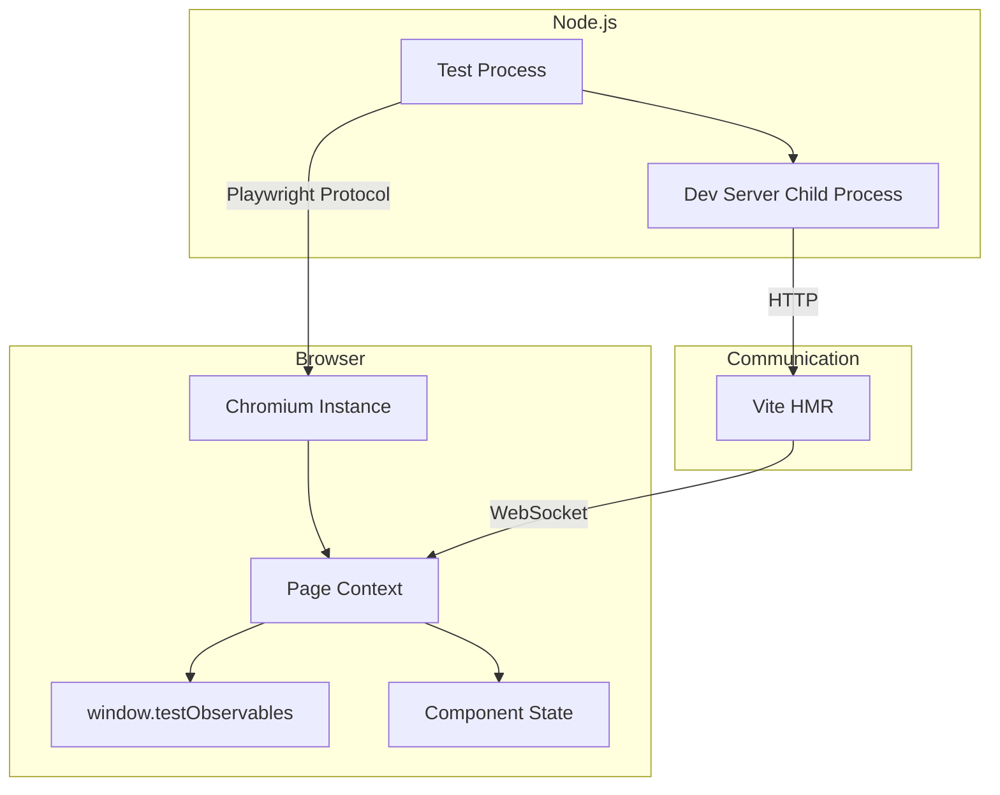

---

**Architecture Status**: ✅ Stable and Production-Ready

**Scalability**: Currently single-worker, designed for sequential execution. Future enhancement could add parallel test groups with isolated dev servers.
